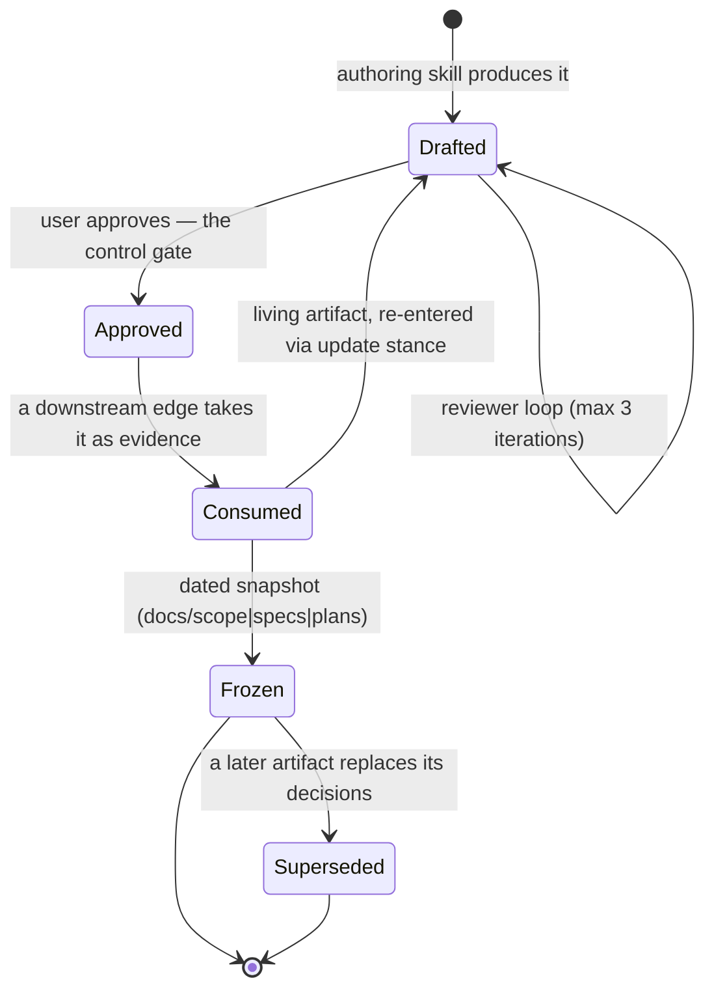
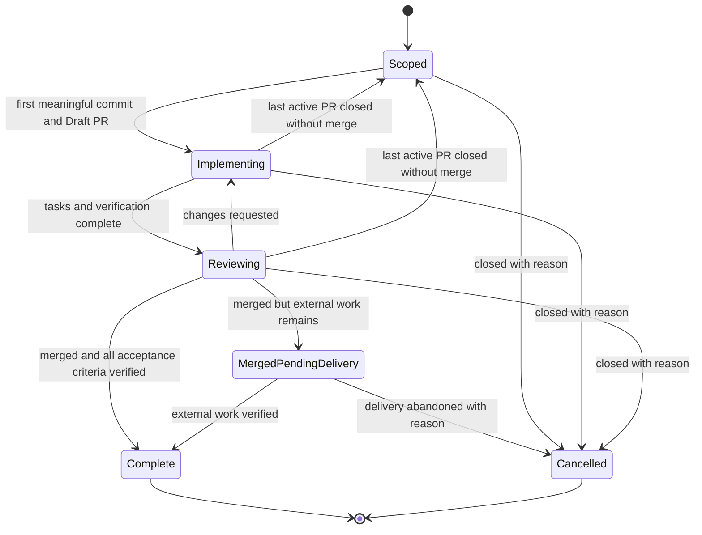

# DevMuse Domain Model

> The concept structure behind DevMuse, settled before any skill edit. Check here before naming anything in skills, rules, principles, or docs.
>
> **Dependency direction (one-way):** this file may cite `docs/specs/`, `docs/plans/` only as *history*, never as authority; skills, rules, and templates cite this file. Stale content here is a bug.
> **Acceptance:** every concept must survive §1 and appear somewhere in §2's walkthrough.

## 1. Principles

- **Guidance over control** — detection, routing, and gates produce recommendations the user overrides in one word. Every path is non-blocking **except HARD-GATEs and safety gates**. A concept that forces the agent's hand without a user-side override, and is neither of those two, does not belong in this system.
- **Skills are code** — a skill edit follows the same discipline as a code change: a failing test first, then the minimal change, then loophole closure. A mechanism that cannot be tested against agent behavior is not ready to ship.
- **One fact, one place** — the same fact stated in two files drifts on the first correction that lands in only one of them. Every concept here names its single home; downstream artifacts cite, never restate.

## 2. Worked Example

> Jeff asks for a regulated batch-export API that crosses two services and adds a public response contract, with no scope file on disk.

1. **Project context** resolves the repository's stable identity, its GitHub-first collaboration preference, and no matching open Issue. Jeff approves Issue creation.
2. Routing rejects the **Direct lane** because public-contract and cross-system risk are present → **opening move** = Scope.
3. mu-scope runs **Quick Probe** and selects the architectural **scope path**. It enumerates cases with Jeff and writes a **Use Case Set** — UC-1…UC-9 plus UC-R1…R3 — into the Issue.
4. Jeff approves it. That approval is the **control gate**; the Issue is now an approved **artifact**, and its **Delivery lifecycle** is Scoped.
5. The **Pipeline Graph** names the successor: mu-arch. It consumes the scope as **evidence** and produces a design spec, which goes through its own reviewer loop and Jeff's approval.
6. The first meaningful commit opens a Draft PR and moves delivery to Implementing. mu-plan turns the spec into TDD tasks there, each carrying `Covers: UC-x` **anchors**.
7. mu-code implements task by task; TDD and verification-before-completion are **safety gates** — Jeff cannot waive those the way he can waive a recommendation.
8. mu-review audits coverage against the UC anchors, then merges. If external delivery remains, the Issue stays open in MergedPendingDelivery.
9. Only verified code, documentation, and external acceptance move delivery to Complete and close the Issue.

Had the request been an exact README correction, Direct would have changed and
verified it without a skill. Had it been a clear change to an existing private
export flow, the bounded scope path would have handed 1–3 inline UCs to mu-code.
Every concept below is validated against these three branches.

## 3. Concept Table

Archetypes: **Role** · **Thing** · **Moment** (has a lifecycle) · **Description** (type-level, no lifecycle of its own) · **Derived**.

| Concept | Archetype | One line | Who produces | Who maintains |
|---|---|---|---|---|
| **Artifact** | **Moment ⭐ spine** | A durable work product a skill authors, a user approves, and a downstream skill consumes | the authoring skill | the skill that owns its stance |
| **Evidence** | Description | The role an artifact plays for a downstream edge — what the edge actually consumes, as opposed to a file path | — | — |
| **Control gate** | Description | User approval of an artifact before anything depending on it proceeds | — | user |
| **Safety gate** | Description | A non-substitutable discipline (TDD, verification-before-completion, git safety) that no override reaches | — | — |
| **HARD-GATE** | Description | A structural precondition embedded in a skill body, evaluated before stance detection | — | — |
| **Sign-off gate** | Description | The non-blocking stakeholder-approval protocol at a creative skill's exit | — | — |
| **Stance** | Description | The entry mode a creative skill picks from the artifact's current state | detection algorithm | user override |
| **Direct lane** | Description | The no-skill route for exact, low-risk, mechanical/reversible/execution-only work | routing rules | — |
| **Opening move** | Description | The first skill routing selects when work is not Direct | routing rules | — |
| **Scope path** | Description | The bounded or architectural ceremony selected by mu-scope from Quick Probe evidence | mu-scope | — |
| **Pipeline Graph** | Description | The single declaration of cross-skill handoffs | `plugin/rules/bootstrap.md` | — |
| **Core pipeline** | Description | The proportional routes: Direct; bounded mu-scope → mu-code; architectural mu-scope → mu-arch → mu-plan → mu-code → mu-review | — | — |
| **Orthogonal skill** | Description | An auto-routed skill running outside the pipeline's order | — | — |
| **On-demand skill** | Description | A skill never auto-routed; slash invocation only | — | — |
| **Creative skill** | Description | A skill authoring a judgment-bearing artifact: stance at entry, sign-off at exit | — | — |
| **Living artifact** | Description | An artifact with stable identity, updated in place while its revision history remains available | — | — |
| **Project context** | Derived | The resolved view of repository identity, collaboration preference, canonical artifact paths, and recoverable coordination hints | project context resolver | canonical manifest plus live Git and provider facts |
| **Delivery lifecycle** | Moment | The coordinated work from approved scope through implementation, review, merge, external verification, and closure | mu-scope | the skills and humans owning its Issue and PRs |
| **Use Case Set** | Thing | The inline or artifact-backed list of use cases mu-scope produces; its UC-IDs propagate downstream | mu-scope | mu-scope |
| **Quick Probe** | Description | mu-scope's focused impact scan that selects fix, bounded, architectural, or spike | — | — |
| **Anchor** | Description | A verbatim identifier a reviewer must cite in every finding | — | — |
| **Cross-review** | Description | The optional second opinion from a different model family | — | — |
| **Task transition** | Moment | A user message whose intent shifts skill category mid-conversation | user | — |
| **Team-touching** | Derived | The stakeholder-scope value that triggers the sign-off gate | detection | — |
| **Skill CSO** | Description | Writing a skill's `description` purely as triggering conditions | — | — |

**Open ambiguities** — none.

## 4. Spine: the life of an artifact

**How it was derived:**

```
1. Tag every concept with an archetype (§3)
2. Moments: Artifact · Delivery lifecycle · Task transition
3. Dependency count: Artifact is referenced by stance, control gate,
   HARD-GATE, evidence, Pipeline Graph, living-artifact, Use Case Set,
   sign-off gate — 8. Delivery lifecycle is referenced by project context,
   the Core pipeline's collaboration surfaces, and completion semantics — 3.
   Task transition: 1.
4. Candidate = Artifact
5. Verify: can DevMuse be told as "the life of an artifact"? → yes (below)
∴ spine = Artifact
```

> This derivation found a hole: **`Artifact` had no entry at all** before 2026-07-31 — the model carried eight concepts *about* artifacts (stance, gates, evidence, living-artifact) without the object they are about. So did `Evidence`, `Control gate`, and `Safety gate`, all three load-bearing in `plugin/rules/bootstrap.md`.

**The shape.** Everything DevMuse does is one loop: *a skill authors an artifact, a user approves it, the graph hands it to the next skill as evidence.* Skills are the verbs; the artifact is the noun that persists.



**Stance is the entry map** — where detection finds the artifact decides how the skill enters:

| Artifact state found | Stance |
|---|---|
| absent | `create` |
| living, sections stubbed | `update(expand)` |
| living, behind current code | `update(sync)` |
| living, new area to append | `update(gap-fill)` |
| absent, but the code already implies it | `extract` |
| approved and untouched by this task | `skip` |

**Domain guarantees:**

- **A control gate never yields to an override.** Guidance-over-control governs recommendations, not approvals — the user *is* the approver, so waiving it has no meaning.
- **Safety gates outlive every stance.** A `skip` stance passes through artifact work and the sign-off gate, never a HARD-GATE or a safety gate.
- **Edges consume evidence, not paths.** An equivalent that answers the same questions satisfies the edge; the substitution is recorded in the consuming artifact's header.
- **Frozen is terminal.** Dated snapshots are never retro-edited; a superseding decision opens a new artifact and the old one stays as history.

### Time axis

| # | Trigger | State change |
|---|---|---|
| 1 | User states an unprefixed task | Routing selects **Direct lane** or a skill **opening move** from request + git/fs facts |
| 2 | Skill entered | Phase 0 detects the artifact's state → **stance** |
| 3 | Skill authors | artifact → `Drafted` |
| 4 | Reviewer loop (creative skills) | stays `Drafted` until approved or 3 iterations elapse |
| 5 | User approves — **control gate** | → `Approved` |
| 6 | Pipeline Graph names the successor | — |
| 7 | Downstream skill reads it as **evidence** | → `Consumed` |
| 8a | Dated snapshot | → `Frozen`, never retro-edited |
| 8b | Living artifact | → back to `Drafted` via an update stance, History row appended |
| — | **Task transition** fires at any point | re-route from step 1 |

## 5. Structure Overview

```
user intent
    │  PROJECT CONTEXT: identity + collaboration + artifact locations
    │  routing rules (bootstrap): request + git/fs facts
    ▼
Direct lane ──▶ proportional verification ──▶ end
    │ otherwise
    ▼
opening move ──▶ skill
                  │  mu-scope: Quick Probe ──▶ bounded / architectural
                  │  Phase 0: stance detection ── artifact state → entry mode
                  ▼
             ARTIFACT  drafted → reviewed → approved
                  │  control gate: user approval
                  ▼
             Pipeline Graph names the successor
                  │  the edge consumes EVIDENCE (equivalents substitute)
                  ▼
             downstream skill  ⟲
                  │
       DELIVERY LIFECYCLE: Scoped → Implementing → Reviewing
                            → MergedPendingDelivery → Complete
                  │
     safety gates (TDD · verification · git) apply throughout,
     reachable by no override
```

**Walked through §2's example:** project context identifies the repository and
GitHub collaboration surface; public-contract and cross-system signals reject
Direct and select Scope. Quick Probe selects the architectural path; the Issue
scope reaches `Drafted`, then `Approved` when Jeff signs off. The graph names
mu-arch, which consumes that Issue as evidence. The Draft PR then carries the
implementation evidence while the delivery lifecycle remains open through any
external work. The bounded contrast stops after an inline contract; the Direct
contrast creates no artifact. TDD inside mu-code remains a safety gate.

## 6. Concepts in Detail

### Artifact

A durable work product a skill authors, a user approves, and a downstream skill consumes. Three forms: **dated snapshots** (`docs/scope|specs|plans/YYYY-MM-DD-*.md`) freeze on approval and are never retro-edited; **living artifacts** (`CONTEXT.md`, `docs/wiki/`, GitHub Issues and Draft PRs, spike READMEs) keep a stable identity, update in place, and retain revision history. A spike README is the thinnest living artifact: no reviewer loop, since it records an observation rather than a decision — but still approved, because its verdict is what a scope will be built on.

The third form is the **decision record** (`docs/adr/NNNN-*.md`): one global sequence, only ever appended to. Its states map onto this machine exactly — `Proposed` is Drafted, `Accepted` is Approved, and superseding produces a *new* record rather than an edit. What makes it a separate form is that it is **not rebuildable**: the wiki can be regenerated from source, but a rejected alternative leaves no trace in source. See `plugin/knowledge/principles/adr.md`.

**Succession** — dated snapshots relate to each other explicitly, since a feature worked twice leaves two of them. An **unconsumed** artifact is revised in place, filename and date unchanged. A **consumed** one is either *superseded* (its decisions replaced) or *extended* (added to without invalidating), with the link written in **both** directions. Which applies is checkable, not a judgment call: a scope is consumed once a spec's Requirements Reference cites it, a plan once any checkbox reads `[x]`. See `plugin/knowledge/principles/artifact-succession.md`.

_Avoid_: document, deliverable, output file

### Evidence

The role an artifact plays for a downstream edge — what the edge consumes, as opposed to which file supplies it. The Pipeline Graph's edges are declared over evidence precisely so an equivalent can substitute: a detailed PRD feature section plus its `CONTEXT.md` §6 machine stands in for a scope artifact, and an inline plan stands in for a dated plan at mu-code. Missing evidence obliges a recommendation, not a refusal — the recommendation is the agent's duty, declining it is the user's right, and a declined recommendation is flagged in the consuming artifact.

_Avoid_: input file, prerequisite doc

### Control gate

User approval of an artifact before anything that depends on it proceeds. Distinct from every other gate by who holds it: the user does. Guidance-over-control makes recommendations overridable — it does not make approvals waivable, because the user is the approver.

_Avoid_: approval step, review gate

### Safety gate

A discipline no override reaches: TDD's red-green cycle, verification-before-completion, git safety. Named separately from HARD-GATEs because they are not embedded in one skill's body — they hold across every skill, stance, and override.

_Avoid_: hard rule, non-negotiable (as a standalone label)

### HARD-GATE

A structural, non-negotiable precondition embedded in a skill body (e.g., no design without an approved scope artifact); evaluated before stance detection and never bypassed by a `skip` stance or a sign-off.

_Avoid_: blocker, hard requirement, checkpoint

### Sign-off gate

The non-blocking stakeholder-approval protocol a creative skill runs at exit when work is team-touching; always skippable with "skip sign-off" — explicitly not a HARD-GATE.

_Avoid_: approval gate, RFC gate

### Stance

The entry mode a creative skill picks at Phase 0 — `create`, `update` (sub-types expand > gap-fill > sync), `extract`, or `skip` — produced by the deterministic detection algorithm in `plugin/knowledge/principles/stance-detection.md` and overridable in one word. It is a **function of the artifact's state**, not of the task's phrasing (see §4).

_Avoid_: mode, entry state

### Opening move

The first skill routing selects after work fails Direct eligibility —
Scope/Reproduce (mu-scope), Review (mu-review), Plan (mu-plan), or Implement
(mu-code). Read-only understanding stays in Direct; durable current-state
architecture documentation is an explicit `/mu-wiki` request. Selection uses
request and filesystem facts, never inference about what the user "really"
wants.

_Avoid_: entry skill, first step, initial route

### Direct lane

The no-skill routing result for either read-only inspection with no durable
artifact, or a sufficiently specified task whose remaining work is mechanical,
reversible, or execution-only and carries no material contract, safety, data,
dependency, or non-local behavior risk. It ends after a source-verified answer
or proportional verification and upgrades to Scope when a requested change
exposes a disqualifying signal.

_Avoid_: fast mode, skip-process

### Scope path

The ceremony class mu-scope selects from Quick Probe evidence. **Bounded** means
a clear change to an existing flow inside one subsystem and produces an inline
acceptance contract consumed by mu-code. **Architectural** means material risk,
system-boundary impact, or an unresolved decision and produces an approved scope
artifact consumed by mu-arch.

_Avoid_: depth level, task size

### Pipeline Graph

The single declaration of cross-skill handoffs, in `plugin/rules/bootstrap.md`: skills announce completion, the graph names the successor; edges consume evidence, not file paths.

_Avoid_: terminal chain, hardwired terminal

### Core pipeline

The proportional routing family: Direct → verification → end; bounded
mu-scope → mu-code → end; architectural
mu-scope → mu-arch → mu-plan → mu-code → mu-review. Edges consume evidence;
the architectural path requires approved scope, design, and plan evidence, not
a particular local file form.

_Avoid_: main flow, workflow chain

### Orthogonal skill

An auto-routed skill that runs at any point outside the core pipeline's order (currently mu-debug).

_Avoid_: side skill, utility skill

### On-demand skill

A skill that is never auto-routed and runs only via explicit slash invocation (mu-mrd, mu-model, mu-prd, mu-wiki, mu-grill); the routing rules answer matching intents with a pointer, not an invocation.

_Avoid_: slash-only skill, manual skill

### Creative skill

One of mu-mrd, mu-prd, mu-arch — the skills that author a judgment-bearing artifact, run stance detection at Phase 0, and face the sign-off gate at exit.

_Avoid_: authoring skill, artifact skill

### Living artifact

The artifact form with a stable identity, updated in place while its revision
history remains available. Repository forms have no date in their filename and
append a History row (`docs/wiki/`, spike READMEs, this file); GitHub Issues and
Draft PRs use their provider timeline. This contrasts with frozen dated
snapshots under `docs/scope|specs|plans`.

_Avoid_: evergreen doc

### Project context

The resolved, authority-aware view of a project: stable repository identity,
approved collaboration preference, canonical artifact locations, live provider
capability, and recoverable coordination hints. Stable facts come from the
tracked project manifest; live permission and repository facts come from Git
and the provider; Git-common state is a disposable hint. A checkout directory
never supplies identity, and cached capability never authorizes a write.

_Avoid_: session memory, directory identity, workspace profile

### Delivery lifecycle

The lifecycle of one coordinated change across its canonical Issue and related
Draft PRs. It measures delivery, not merely code integration: merged code with
unverified documentation or human/platform work is not complete.



The Issue remains open through Scoped, Implementing, Reviewing, and
MergedPendingDelivery. An unmerged closed PR returns to Scoped unless another
related PR remains active. `blocked` is a reason attached to work, not a
lifecycle state.

_Avoid_: PR status, merge status, task state

### Use Case Set

The list of use cases (UC-1, UC-2, …) produced by mu-scope. On the bounded path
it is an inline contract approved by a faithful original request; on the
architectural path it is an explicitly approved artifact. UC-IDs propagate to
the downstream evidence each path actually creates.

_Avoid_: requirements list, feature list

### Quick Probe

mu-scope's focused codebase impact scan, run before use-case enumeration to
select fix, bounded, architectural, or spike from blast radius, interface risk,
test coverage, and system boundaries.

_Avoid_: impact scan, pre-scan

### Anchor

A verbatim identifier (UC-ID, task number, file path, component name) that mu-reviewer must extract from the reviewed artifact and cite in every finding; findings without anchors are treated as hallucinations and deleted.

_Avoid_: citation, reference, evidence

### Cross-review

The optional mu-review step that obtains a second opinion from another model
only when the user requests it or accepts the extra cost after a high-risk
signal; absent tooling stays invisible.

_Avoid_: second review, external review

### Task transition

A user message whose intent shifts skill category mid-conversation (debug→fix, inspect→implement), requiring re-classification by the routing rules — versus a continuation, which stays inside the active skill.

_Avoid_: context switch

### Team-touching

The stakeholder-scope value meaning the artifact affects code others own — detected via CODEOWNERS, ≥3 recent authors on watched dirs, or explicit user declaration — and the sole trigger of the sign-off gate.

_Avoid_: shared-code, multi-owner (as scope labels)

### Skill CSO

Claude Search Optimization — writing a skill's `description` frontmatter purely as triggering conditions ("Use when…"), never as a workflow summary, so future Claude finds the skill and reads its body instead of shortcutting from the description.

_Avoid_: skill SEO, discoverability tuning

## 7. History

| Date | Commit | Change |
|---|---|---|
| 2026-08-22 | `31f7a79`–`945c68a` | Implemented the approved **Project context** and **Delivery lifecycle**: tracked identity, cross-worktree recovery, authority-safe GitHub coordination, workflow bindings, portable adapters, and default-branch manifest recovery. |
| 2026-08-22 | 2a19598 | Added **Project context** and **Delivery lifecycle** for ADR-0002, generalized living artifacts to include GitHub Issues and Draft PRs, and separated delivery completion from merge completion. |
| 2026-08-22 | — (uncommitted) | Completed lifecycle exits for unmerged PR closure and abandoned post-merge delivery. |
| 2026-08-24 | (this revision) | Hardened the **Project context** runtime after implementation review: fail-closed authorization binding, injection defenses in the manifest and default-branch-ref paths, a managed-publisher secret gate, delivery-vocabulary validation, and deterministic CLI commands for the hash/splice/sanitize/cache-write operations a model cannot perform reliably. |
| 2026-08-04 | — (uncommitted) | Retired **mu-explore** as a persistent workflow. Read-only understanding moved to Direct inspection, unfamiliar changes to mu-scope Quick Probe, bug-adjacent investigation to mu-debug, and durable current architecture to explicit `/mu-wiki`. Per-task independent review was also removed from mu-code in favor of one final mu-review. |
| 2026-08-03 | — (uncommitted) | Added **Direct lane** and **Scope path** so ceremony scales with execution risk: exact mechanical work bypasses skills, bounded behavior stays inline, architectural work retains the artifact pipeline. |
| 2026-07-13 | — | "UC" ruled exclusive to mu-scope; mu-explore's five exploration types renamed **variant**. Bare "gate" retired — always qualified (HARD-GATE / sign-off gate / size-area gate). |
| 2026-04-14 | `108f3f6` | mu-design renamed **mu-arch** (hook straggler fixed in `304043d`). Dated plan snapshots keep the old name as history. |
| 2026-08-01 | — (uncommitted) | **Decision record** added as the Artifact's third form (`docs/adr/`) — states map onto the existing machine, but it is not rebuildable from source, which is what separates it from the wiki. Spike READMEs added to the living form. |
| 2026-08-01 | — (uncommitted) | **Succession** added to the Artifact entry, and `Superseded` added to its machine as a state reachable from `Frozen`. Frozen was previously terminal, which left no way to say "this snapshot is still immutable but no longer the one to read". Driven by measurement: one feature in a real repo carried four spec files with zero links between them. |
| 2026-07-31 | `c6a4a60` | Restructured from glossary to domain model (7 sections). Spine derived: **Artifact**. Added four load-bearing concepts the glossary had never carried — `Artifact`, `Evidence`, `Control gate`, `Safety gate` — all three of the latter already load-bearing in `plugin/rules/bootstrap.md`. Stance re-stated as a function of artifact state rather than of task phrasing. |
