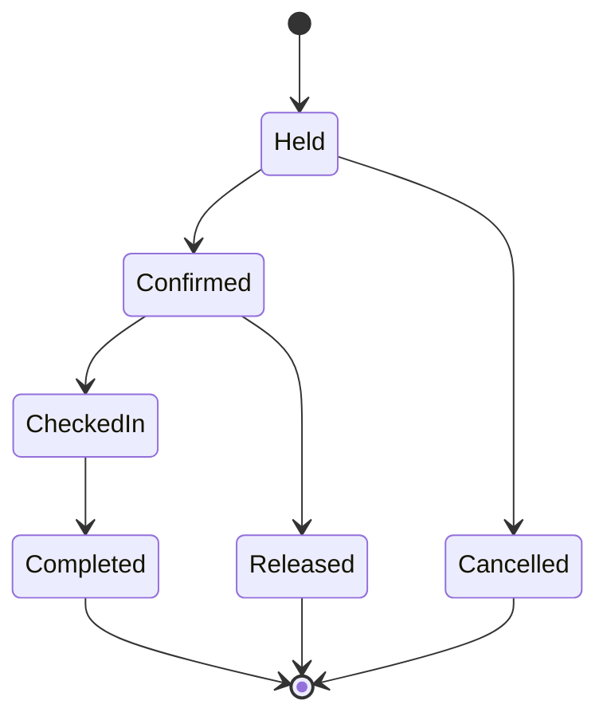

# Reference example — meeting-room booking service

> **Illustrative example, not this repository's product truth (UC-DR3).** A
> fictional-but-plausible worked case showing profile + concern composition. Do
> not cite it as evidence for real work.

**Profile:** `stateful-service` (a service owning a lifecycle-bearing datastore),
composed with a public API surface.
**Concern triggers that fire:** transactions (double-booking), concurrency (the
boundary instant), async delivery (confirmation email), multitenancy (per-org
rooms), public API (partner integrations), SLOs (availability).

This shows *which* sections the composition emits — not a section for every slot,
only the ones the concerns populate.

## Use-case spine (stable IDs)

- `duc:reserve` — a member reserves a free room for a time window.
- `duc:check-in` — a member checks in within the grace period; a no-show releases the room.
- `duc:cancel` — a member cancels a held reservation before it starts.
- `rule:no-double-book` — two confirmed reservations never overlap for one room.
- `rule:grace-release` — a reservation not checked in by `start + grace` is released.

## Domain model (the `domain_model` member cites this; the PRD cites state names)

Reservation lifecycle (a business-state machine, so it lives in the architecture
set's domain model, never in the PRD body):

- **Invariant** (`rule:no-double-book`): no two `Confirmed`/`CheckedIn`
  reservations overlap for one room.
- **Terminal, no revival:** `Completed`, `Cancelled`, `Released`.
- **Excluded candidate:** "Pending payment" — this service does not charge, so
  there is no payment state (a slot the profile offers but evidence does not
  populate — left out, not invented).

## Concern-triggered sections

- **Transactions** — a reservation is `Held` under a row lock over
  `(room, time-window)`; `Held → Confirmed` commits only if no overlapping
  `Confirmed` exists, so `rule:no-double-book` holds under contention.
- **Concurrency** — the boundary instant: a reservation ending exactly when
  another begins does not overlap (end-exclusive windows, a single named clock).
- **Async delivery** — `Confirmed` enqueues a confirmation email; delivery
  failure does not roll back the reservation (the email is `at-least-once`, the
  reservation is the source of truth).
- **Multitenancy** — rooms and reservations are scoped per organization; a
  member never sees or books another org's rooms.
- **Public API** — `POST /reservations`, `POST /reservations/{id}/check-in`; the
  reservation state is the response's `status`.
- **SLOs** — 99.9% availability on the reserve path; check-in tolerates a
  degraded read replica.

## Test-case ↔ result binding (coverage staleness)

`tc:reserve-overlap` verifies `rule:no-double-book`; its latest `tr:` result
binds the `duc:reserve` revision, the `tc:reserve-overlap` revision, and the code
commit. If `rule:grace-release` later changes the lifecycle, the bound
requirement revision moves and coverage reads **stale**, not covered.
