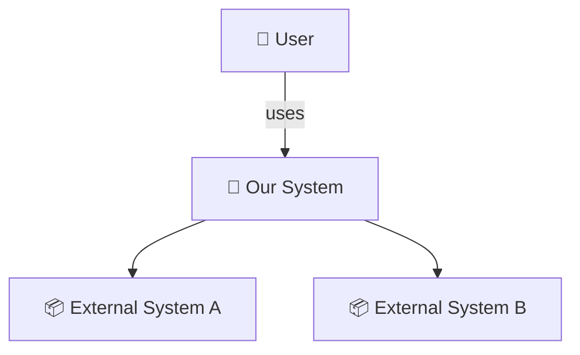
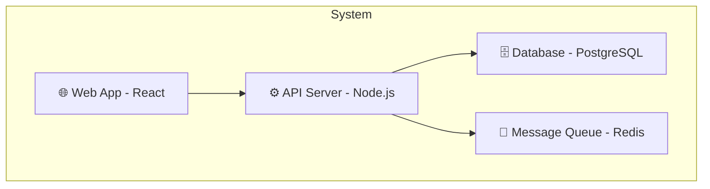
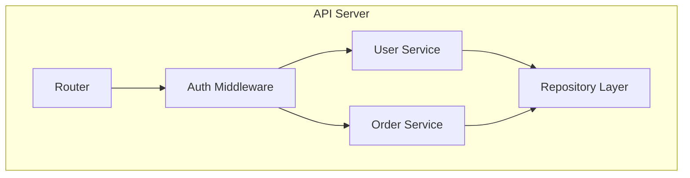
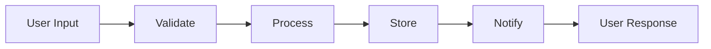
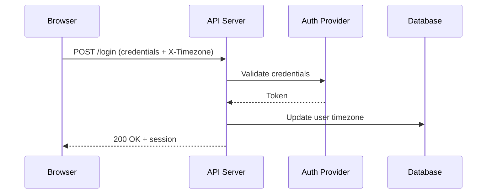
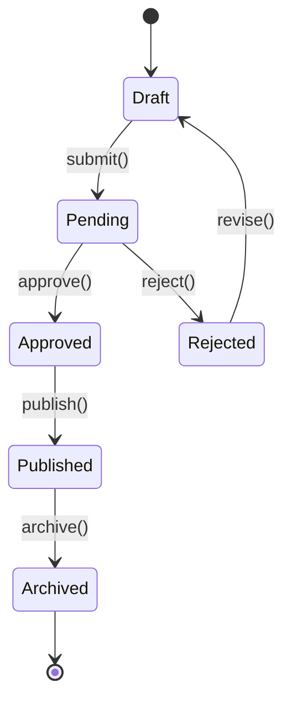

# Architecture Assessment

**When to use:** Referenced by mu-scope (Quick Probe), mu-arch (C4 positioning + design diagrams), mu-wiki (project-level architecture documentation), and mu-reviewer (review-design mode).

## Diagram Type by Profile

Diagram selection follows the project's **profile axes** (@project-profiles.md) —
the same classification that composes PRD and architecture sections, made once
and reused. Take the union of the diagram sets the activated axes imply, and drop
a diagram whose neighbourhood this change does not touch.

| Axis value | Recommended diagrams | Why |
|---|---|---|
| product `library-sdk` | C3 Component + API surface | Component relationships and the public surface, not containers |
| product `developer-tool` | C3 Component | Command/task surface over components; no multi-container complexity |
| product `end-user-app` | C1 Context + C2 Container | System boundary + device ↔ cloud ↔ third-party containers |
| product `data-ai` | Data Flow (primary) + model/tool boundary | How data flows and transforms, and where the model/tool boundary sits |
| impl `stateful-service` | + State machine | The lifecycle the state owns |
| impl `event-driven` | + Data Flow | Event/message flow and delivery are the core complexity |
| impl `infrastructure` | C2 Container + topology | Resource topology and failure domains are the concern |
| impl `plugin-agent` | C1 Context (host relationship) + C3 Component | "Where do I fit in the host system?" is the key question |
| surface `api` | + API boundary on C2/C3 | The inside/outside contract is load-bearing |

## C4 Model Quick Reference

Use only the levels that add clarity. Most projects need 1-2 levels, not all 4.

### C1: System Context
"What is this system and who/what interacts with it?"

**When to include:** Always for new systems. For changes to existing systems, include when the change affects external interactions.

### C2: Container
"What are the major technical building blocks?"

**When to include:** When the system has multiple deployable units (server, database, queue, etc.).

### C3: Component
"What are the major structural pieces inside a container?"

**When to include:** When the change adds/modifies components within a container.

### Data Flow Diagram
"How does data move through the system?"

**When to include:** When the change introduces or modifies a data processing path.

### Sequence Diagram
"How do participants interact in a specific scenario?"

**When to include:** When the design involves multi-party interactions, external system callbacks, or request chains where data availability at each hop matters. Draw one diagram **per scenario** — not a single combined diagram. Per-scenario diagrams expose data availability gaps (e.g., a browser redirect loses custom headers).

### State Machine Diagram
"What states can this entity be in, and how does it transition?"

**When to include:** When the design involves entities with lifecycle states (orders, subscriptions, approval workflows, account status). The diagram forces you to enumerate all valid transitions and spot missing ones (e.g., can a Published item go back to Draft?).

## Change Overlay Notation

When showing proposed changes on an existing architecture diagram:
- ➕ New component/connection
- ✏️ Modified component/connection
- ➖ Removed component/connection

## Diagram Format

- **Preferred:** Mermaid compatibility subset: quote every flowchart node and
  edge label, use ASCII punctuation in labels, and do not use raw `<` or HTML.
  Diagram-producing skills load `mermaid-compat.md` for examples and the
  mechanical self-check.
- **Fallback:** ASCII art (when working in contexts without Mermaid rendering)
- **Rule:** Diagrams live in the design spec, not in a separate file. They are part of the design, not standalone artifacts.

## When to Skip Detailed Diagrams

- Bug fixes that don't change component boundaries
- Config changes, documentation-only changes, test-only changes
- Quick Probe shows: 1 component affected, no boundaries crossed, no new components → brief text description suffices
