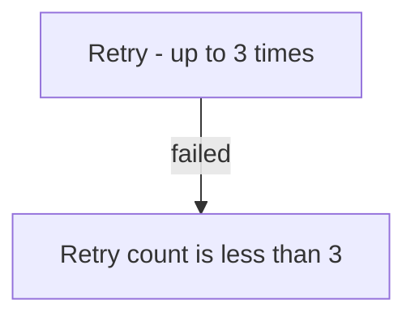

# Mermaid Compatibility Subset

Use this subset for diagrams that must survive different Mermaid versions and
Markdown hosts. If the diagram needs syntax outside the subset, use ASCII.

## Safe subset

- Prefer `graph TD`, `graph TB`, `graph LR`, `sequenceDiagram`, or
  `stateDiagram-v2`.
- Quote every flowchart node label: `A["Label"]`, `DB[("Database")]`.
- Quote every flowchart edge label: `A -->|"accepted"| B`.
- Use ASCII punctuation inside labels. Avoid fullwidth Chinese punctuation.
- Do not put raw `<` or HTML such as `<br/>` in a Mermaid block. Write
  comparisons in words, such as `retry count is less than 3`.
- Keep identifiers simple: ASCII letters, digits, `_`, and `-`.

Unsafe flowchart syntax:

```text
graph TD
    A[重试（最多 3 次）] -->|失败| B[count < 3]
```

Compatible form:



Before handing off a diagram, scan every Mermaid block for unquoted flowchart
labels, raw `<`, HTML, and fullwidth punctuation. Run
`node scripts/check-mermaid-compat.mjs <path>` when the repository provides the
checker. If rendering remains uncertain, use ASCII.
