# <Project> Domain Model

> The domain's concept structure, settled **before** PRD and design work. Check here before naming anything in code, artifacts, or docs.
>
> **Dependency direction (one-way):** this file may cite `research/` and `brief/` (evidence and provenance); it does **not** cite `prd/`, `specs/`, or `plans/` — those cite this file.
> **Acceptance:** every concept must survive the §1 principles and have a counterpart in the §2 example. A concept that cannot be located in the example is a broken concept.

## 1. Principles

2–3 product constitutions. **Each must be able to reject a concept** — one that cannot is decoration, not a principle.

- **<Principle>** — <what it commits to, and what it therefore forbids.>

## 2. Worked Example

One real case, carried through the entire file. Every concept below is validated against it.

> <Who, building what, on what stack, for whom.>

<The example's own goals or questions — these usually foreshadow the model's top-level split.>

## 3. Concept Table

Archetypes: **Role** · **Thing** · **Moment** (has a lifecycle) · **Description** (type-level, no lifecycle of its own) · **Derived** (computed value, not an object).

| Concept | Archetype | One line | Who produces | Who maintains | Arbitration source |
|---|---|---|---|---|---|
| **<Term>** | Role | ... | — | — | — |
| **<Term>** | **Moment** | ... | ... | ... | <industry precedent, or "self-invented"> |

**Open ambiguities** (delete when empty) — one term with two meanings, or two terms for one thing, not yet ruled:

- "<term>" means both <X> and <Y> — **open**. Blocks: <what cannot be decided until this is ruled>.

## 4. Spine

**How it was derived** — keep the derivation, not just the conclusion; whoever changes the model next has to re-run it:

```
1. Tag every concept with an archetype (§3)
2. List the Moments
3. Count how many other concepts depend on each
4. Highest = candidate
5. Verify: can the whole product be told as "the life of X"?
∴ spine = <X>   (or: no candidate survived → organize by data flow, and say so here)
```

**The spine's shape** — the loop or lifecycle the whole product turns on.

**Time axis** — what changes, in what order. Pure state-migration sequence; how these get staged into an experience, and what they look like on screen, belong downstream.

| # | Trigger | State change |
|---|---|---|
| 1 | ... | ... |

## 5. Structure Overview

One diagram — who connects to whom, what flows where — then the §2 example walked through it.

```
<diagram>
```

| Concept | In the example = |
|---|---|
| **<Term>** | ... |

## 6. Concepts in Detail

### <Term>

<Definition.>

**Differs from the industry sense:** <borrowed terms only — what this project means that common usage does not. Owing this line is a debt to pay, not grounds for removal.>

**State machine** (Moments only):

```mermaid
stateDiagram-v2
    [*] --> <State>: <trigger>
```



**Domain guarantees** — constraints that must hold beyond the transitions themselves:

- <invariant>

_Avoid_: <synonym>, <synonym>

## 7. History

Concepts added / changed / retired · spine changes · state-machine changes. A retirement records its reasoning, so the dead word does not get picked back up.

| Date | Commit | Change |
|---|---|---|
| YYYY-MM-DD | `<sha>` | Initial model: <the spine, and the decisions that shaped it> |
