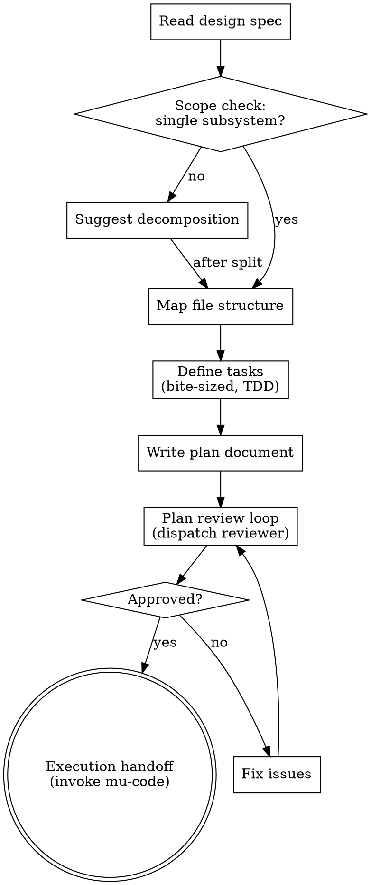

# Writing Plans

## Overview

Write comprehensive implementation plans assuming the engineer has zero context for our codebase. Document everything they need to know: which files to touch for each task, interfaces and constraints, tests, docs they might need to check, how to verify it. Give them the whole plan as bite-sized tasks. DRY. YAGNI. TDD. Frequent commits.

**Tests are the contract; bodies are the implementer's.** Test code appears in the plan verbatim — it pins behavior checkably. Implementation steps carry a signature plus the load-bearing constraints (the decisions a fresh implementer could get wrong), never full bodies: a copied body turns the TDD loop into a transcription checksum, while a fresh derivation checked against the plan's tests is a genuine second opinion. Include a full body only when the code itself is the decision — a worked algorithm, a tricky regex, a schema — and say why.

Assume they are a skilled developer, but know almost nothing about our toolset or problem domain. Assume they don't know good test design very well.

**Announce at start:** "I'm using the mu-plan skill to create the implementation plan."

**Context:** Resolve the active collaboration surface before authoring; worktree
isolation happens later, at mu-code Step 1.

## Project Context Binding

Read `references/devmuse/knowledge/principles/project-context.md` and run `resolve`. In
GitHub-first mode, the first meaningful commit is the Draft PR boundary: find or
create that exact-work Draft PR, run `authorize` for each mutation, and publish
a `render-managed` managed plan revision. Run `recover-attempt` after an
indeterminate PR/comment create. The packaged `project-context/cli.mjs` is the
deterministic binding; use the same contract with host-native tools when it is
unavailable and record the binding.

Offline, non-GitHub, read-only, or declined publication selects the dated
`docs/plans/YYYY-MM-DD-<feature-name>.md` fallback drafted per
references/devmuse/knowledge/principles/prose-discipline.md. Record the work ID and fallback
reason. A user-selected artifact location still overrides either default.

## Process Flow



## Prior Plan Check

Before writing, select the highest valid managed plan revision or the active
fallback plan for the same work ID. An unconsumed fallback plan — no `[x]`
checkboxes and no commits referencing its tasks — is revised in place. A
consumed fallback gets a new file with bidirectional `Supersedes:` / `Extends:`
per references/devmuse/knowledge/principles/artifact-succession.md. Managed PR revisions use
the monotonic revision and conflict rules in the project-context contract.

## Scope Check

If the spec covers multiple independent subsystems, it should have been broken into sub-project specs during mu-arch. If it wasn't, suggest breaking this into separate plans — one per subsystem. Each plan should produce working, testable software on its own.

## File Structure

Before defining tasks, map out which files will be created or modified and what each one is responsible for. This is where decomposition decisions get locked in.

- Design units with clear boundaries and well-defined interfaces. Each file should have one clear responsibility.
- You reason best about code you can hold in context at once, and your edits are more reliable when files are focused. Prefer smaller, focused files over large ones that do too much.
- Files that change together should live together. Split by responsibility, not by technical layer.
- In existing codebases, follow established patterns. If the codebase uses large files, don't unilaterally restructure - but if a file you're modifying has grown unwieldy, including a split in the plan is reasonable.

This structure informs the task decomposition. Each task should produce self-contained changes that make sense independently.

## Bite-Sized Task Granularity

**Each step is one action (2-5 minutes):**
- "Write the failing test" - step
- "Run it to make sure it fails" - step
- "Implement the minimal code to make the test pass" - step
- "Run the tests and make sure they pass" - step
- "Commit" - step

## Plan Document Header

**Every plan MUST start with this header:**

```markdown
# [Feature Name] Implementation Plan

> **For agentic workers:** REQUIRED SUB-SKILL: Use devmuse:mu-code to implement this plan task-by-task. Steps use checkbox (`- [ ]`) syntax for tracking.
> **Supersedes / Extends:** [path to the prior plan] — omit when this is the first plan for this work; the target file carries the matching reverse field

**Goal:** [One sentence describing what this builds]

**Architecture:** [2-3 sentences about approach]

**Tech Stack:** [Key technologies/libraries]

---
```

## Cross-Task Contract (conditional)

After drafting the task boundaries, scan for facts a fresh task worker cannot
recover safely from its task alone. Add this contract only when at least one
trigger fires:

1. an exact approved-spec requirement applies across the whole implementation
   and affects at least two implementation tasks;
   or
2. one task produces an exact function, type, schema, command, file format, or
   other named output that another task consumes.

If neither trigger fires, omit the Global Constraints section and every
Interfaces block. Self-contained plans pay no cross-task template cost.
When either trigger fires, read `cross-task-contract.md` before
finalizing the tasks and apply every rule there. The branch is complete when
every shared spec rule and task dependency edge passes its Completion Check.

## Task Structure

````markdown
### Task N: [Component Name]

**Covers:** UC-1, UC-3

**Files:**
- Create: `exact/path/to/file.py`
- Modify: `exact/path/to/existing.py:123-145`
- Test: `tests/exact/path/to/test.py`

<!-- Add Interfaces here only when this task crosses a task boundary. -->

- [ ] **Step 1: Write the failing test**

```python
def test_specific_behavior():
    result = function(input)
    assert result == expected
```

- [ ] **Step 2: Run test to verify it fails**

Run: `pytest tests/path/test.py::test_name -v`
Expected: FAIL with "function not defined"

- [ ] **Step 3: Implement to make the test pass**

Signature: `def function(input: InputType) -> OutputType`
Constraints:
- <each load-bearing decision a fresh implementer could get wrong, one line — e.g. "boundary is inclusive: reject at count > limit, not >=">
- <e.g. "the fail-open catch wraps every Redis call, not just the first">

(Full body only when the code itself is the decision — then include it and say why.)

- [ ] **Step 4: Run test to verify it passes**

Run: `pytest tests/path/test.py::test_name -v`
Expected: PASS

- [ ] **Step 5: Commit**

```bash
git add tests/path/test.py src/path/file.py
git commit -m "feat: add specific feature"
```
````

## Remember
- Exact file paths always
- Complete TEST code in plan; implementation as signature + constraints — name the exact rules ("reject emails without @", not "add validation"); a full body only where the code is the decision
- Exact commands with expected output
- Reference relevant skills with @ syntax
- DRY, YAGNI, TDD, frequent commits
- Include `Covers: UC-xxx` per task when requirements evidence carries UC IDs — this tells the coder which use cases to trace in tests

## Plan Review Loop

After writing the complete plan:

1. Dispatch the **mu-reviewer subagent in `review-plan` mode** with precisely crafted review context — never your session history. This keeps the reviewer focused on the plan, not your thought process.
   - Provide exactly one of `PLAN_FILE_PATH` or `PLAN_EVIDENCE_URL`, plus `SPEC_FILE_PATH`.
   - The reviewer will validate inputs, build an anchor list (UC-IDs, task numbers, file paths) from the documents, and only emit findings tied to those anchors — preventing hallucinated UCs / class names / file paths.
   - When the Cross-Task Contract is present, the reviewer also verifies every
     shared spec constraint and producer/consumer edge closes exactly.
2. If ❌ Issues Found: fix the issues, re-dispatch reviewer for the whole plan
3. If ✅ Approved: proceed to execution handoff

**Review loop guidance:**
- Same agent that wrote the plan fixes it (preserves context)
- If loop exceeds 3 iterations, surface to human for guidance
- Reviewers are advisory — explain disagreements if you believe feedback is incorrect

## Execution Handoff

After publishing/saving and reviewing the plan, announce its evidence location and hand it to mu-code
per the Pipeline Graph. **mu-code selects the execution mode** from task count,
coupling, write-set overlap, and subagent availability; a user preference already
stated in the conversation overrides that default. Do not add a mode-selection
question solely because two implementations are available.

## Integration

- **Invoked by:** the Pipeline Graph (after mu-arch), or directly when a design spec exists
- **Produces:** reviewed implementation plan evidence in a Draft PR managed revision or dated local fallback
- **Consumed by:** mu-code (reads plan, executes tasks)
- **Terminal state:** per the Pipeline Graph (bootstrap)
