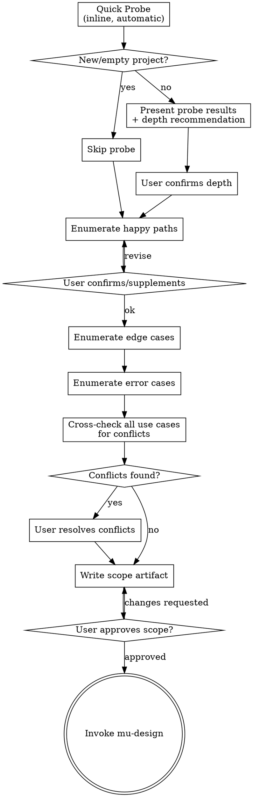

# Requirements Engineering Integration — Implementation Plan

> **For agentic workers:** REQUIRED SUB-SKILL: Use devmuse:mu-code (recommended) to implement this plan task-by-task. Steps use checkbox (`- [ ]`) syntax for tracking.

**Goal:** Add a mandatory `mu-scope` skill before `mu-design`, with UC-ID traceability through all pipeline stages and a `review-coverage` mode for verification.

**Architecture:** New `mu-scope` skill produces a Use Case Set artifact consumed by all downstream stages. mu-reviewer gains a `review-coverage` mode. Existing skills get minimal modifications to carry UC-IDs. Mode names change from letters to descriptive names.

**Tech Stack:** Markdown (skill/agent definitions), JSON (plugin config)

**Design Spec:** `docs/specs/2026-03-25-requirements-engineering-design.md`

---

## File Structure

### Files to create

| File | Responsibility |
|------|---------------|
| `skills/mu-scope/SKILL.md` | New skill: use case elicitation, conflict detection, Quick Probe |
| `knowledge/templates/scope.md` | Use Case Set template (referenced by mu-scope via `@`) |

### Files to modify

| File | Change |
|------|--------|
| `agents/mu-reviewer.md` | Add review-coverage mode, rename Mode A/B/C to descriptive names |
| `skills/mu-design/SKILL.md` | Add scope artifact gate, narrow clarifying questions, add Requirements Reference |
| `skills/mu-plan/SKILL.md` | Add `Covers: UC-xxx` to task structure |
| `agents/mu-coder.md` | Add Test Traceability section |
| `skills/mu-code/SKILL.md` | Add traceability guideline to TDD section |
| `skills/mu-review/SKILL.md` | Add review-coverage dispatch step |
| `rules/bootstrap.md` | Update skill priority, add scope to decision flow |
| `docs/architecture.md` | Update pipeline, skill table, agent descriptions |
| `docs/architecture_cn.md` | Same updates in Chinese |

| `.claude-plugin/plugin.json` | Update description to include "scope" |

### Files unchanged

- `skills/mu-debug/SKILL.md`
- `skills/mu-write-skill/SKILL.md`
- `knowledge/languages/*`

---

### Task 1: Create scope template

**Covers:** Use Case Set artifact format (referenced by all downstream components)

**Files:**
- Create: `knowledge/templates/scope.md`

- [ ] **Step 1: Create templates directory**

```bash
mkdir -p knowledge/templates
```

- [ ] **Step 2: Write the scope template**

```markdown
# Scope: <feature-name>

> **Date:** YYYY-MM-DD
> **Source:** <link to issue or user request>

## Context
- Background and motivation (why this work is needed)
- Scope of impact (which modules, users, or systems are affected)

## Quick Probe Results
- Files involved: [list of files directly related to this change]
- Fan-out: [N callers / M dependents]
- Test coverage: [existing test coverage for affected code]
- Risk signal: [low / medium / high]

## Use Cases

### Happy Paths
- UC-1: When <action>, Then <expected result>

### Edge Cases
- UC-N: Given <precondition>, When <action>, Then <expected result>

### Error Cases
- UC-N: When <failure condition>, Then <error handling>

## Conflicts
- ⚠️ CONFLICT: UC-X vs UC-Y — <description of contradiction>
  - Resolution: <user decision> | PENDING

## Non-Functional Constraints
- [Performance] <constraint>
- [Security] <constraint>
- [Accessibility] <constraint>

## Constraints & Assumptions
- <technical or business constraint>
- <assumption that must hold>

## Out of Scope
- <explicitly excluded item> — <reason>

## Impact Analysis
- Affected modules: [list]
- Existing tests that may break: [list]
- Migration needs: [yes/no, details]
```

- [ ] **Step 3: Verify the template file**

Run: `cat knowledge/templates/scope.md | head -5`
Expected: Shows `# Scope: <feature-name>` header

- [ ] **Step 4: Commit**

```bash
git add knowledge/templates/scope.md
git commit -m "feat: add Use Case Set template for mu-scope"
```

---

### Task 2: Create mu-scope skill

**Covers:** Component 1 from design spec — the core new skill

**Files:**
- Create: `skills/mu-scope/SKILL.md`

**Reference:** Read current `skills/mu-design/SKILL.md` for style/structure patterns. Read design spec Component 1 and Knowledge Migration Matrix.

- [ ] **Step 1: Create skill directory**

```bash
mkdir -p skills/mu-scope
```

- [ ] **Step 2: Write mu-scope SKILL.md**

The skill must include:
1. YAML frontmatter (name, description)
2. Hard gate: terminal state is invoke mu-design
3. Anti-pattern section (migrated from mu-design: "too simple to need scoping")
4. Checklist with all 5 phases
5. Phase 1: Quick Probe (inline, checks table, skip for new projects)
6. Phase 2: Depth Decision (confirm with user)
7. Phase 3: Use Case Elicitation (happy → edge → error, one category at a time)
8. Phase 4: Conflict Detection (cross-check, mark, resolve)
9. Phase 5: Output (write to docs/scope/, user confirms)
10. Methodology migrated from mu-design:
    - One question at a time, multiple choice preferred
    - Scope assessment (multi-subsystem → decompose into sub-projects)
    - Focus on purpose, constraints, success criteria
    - Incremental validation
    - YAGNI
11. Use case format: `UC-<N>: [Given <precondition>] When <action> Then <result>`
12. Conflict format: `⚠️ CONFLICT: UC-X vs UC-Y`
13. Template reference: `@../../knowledge/templates/scope.md`
14. Key principles section
15. Process flow diagram (dot format, matching mu-design style)

```markdown
---
name: mu-scope
description: "Use before mu-design to scope work — enumerate use cases, detect conflicts, assess impact on existing code."
---

# Scope

Scope work by enumerating use cases, detecting conflicts, and assessing impact on existing code. Produces a Use Case Set that feeds into mu-design.

Start by probing the codebase for impact, then work with the user to exhaust scenarios and resolve conflicts.

<HARD-GATE>
Do NOT invoke mu-design or any implementation skill until you have a complete Use Case Set approved by the user. This applies to EVERY task regardless of perceived simplicity.
</HARD-GATE>

## Anti-Pattern: "This Is Too Simple To Need Scoping"

Every task goes through scoping. A bug fix, a config change, a one-liner — all of them. "Simple" tasks are where omissions cause the most wasted work. The scope can be a single use case (30 seconds), but you MUST produce it and get approval.

## Checklist

You MUST create a task for each of these items and complete them in order:

1. **Quick Probe** — scan codebase for impact (skip for new/empty projects)
2. **Depth decision** — present probe results, confirm depth with user
3. **Use case elicitation** — enumerate happy paths → edge cases → error cases
4. **Conflict detection** — cross-check all use cases, resolve with user
5. **Write scope artifact** — save to `docs/scope/YYYY-MM-DD-<name>.md`, user confirms
6. **Transition to design** — invoke mu-design skill with scope file path

## Process Flow



**The terminal state is invoking mu-design.** Do NOT invoke any other skill. The ONLY skill you invoke after mu-scope is mu-design.

## Phase 1: Quick Probe

Before asking the user anything, scan the codebase to understand what this change touches.

**Skip if:** The project is new (empty codebase) or user explicitly says "new project."

**Checks:**

| Check | Method | What it reveals |
|-------|--------|-----------------|
| Locate code | grep/glob for keywords from user's description | What files are involved |
| Fan-out | Count callers of affected functions/modules | Blast radius |
| Test coverage | Find existing tests for affected code | Safety net status |
| Historical signals | git log for recent changes and bug fixes | Stability of affected area |
| Interface risk | Check if change affects public API/contracts | Breaking change potential |

**Output to user:**

```
Quick Probe Results:
- Files: [list]
- Fan-out: [N callers / M dependents]
- Test coverage: [summary]
- Risk: [low/medium/high]

Recommendation: [quick scope (2-3 use cases) / full enumeration]
```

## Phase 2: Depth Decision

Present the probe results and recommend a depth level. The user confirms or overrides.

- **Low risk, small fan-out:** "This touches 1 file with no dependents. I'll list a couple of use cases to confirm, then proceed?"
- **Medium/high risk:** "This touches shared-form, used by 12 pages. Recommend enumerating all affected scenarios. Agree?"

## Phase 3: Use Case Elicitation

Work through scenarios with the user, one category at a time.

**Methodology (migrated from mu-design):**
- Ask one question at a time — do not overwhelm with multiple questions
- Prefer multiple choice when possible
- Focus on understanding: purpose, constraints, success criteria
- If the request covers multiple independent subsystems, flag immediately — decompose into sub-projects before detailing

**Order:** Happy paths first (establish the core), then edge cases (expand boundaries), then error cases (handle failures).

**Present each category, get user confirmation before moving to the next.**

**Use case format:**
```
- UC-<N>: [Given <precondition>] When <action> Then <expected result>
```

Simple cases can omit Given:
```
- UC-1: When user logs in with valid credentials, Then return JWT and redirect to dashboard
```

Complex cases include Given:
```
- UC-3: Given password expired, When user logs in, Then force password reset flow
```

## Phase 4: Conflict Detection

After all use cases are enumerated, cross-check every pair for contradictions.

**What to look for:**
- Two use cases that trigger under overlapping conditions with different outcomes
- Use cases that assume contradictory preconditions
- Undefined behavior in gaps between use cases

**Format:**
```
- ⚠️ CONFLICT: UC-X vs UC-Y — <description of contradiction>
  - Resolution: <user decision> | PENDING
```

**All conflicts must be resolved before proceeding.** Present each conflict, let the user decide. No PENDING items in the final artifact.

## Phase 5: Output

Write the Use Case Set to `docs/scope/YYYY-MM-DD-<name>.md` using the template at @../../knowledge/templates/scope.md.

Commit the file, then ask the user to review:

> "Scope written and committed to `<path>`. Please review and let me know if you want changes before we proceed to design."

Wait for confirmation.

## Key Principles

- **Exhaustive over efficient** — Better to enumerate one extra use case than miss a real scenario
- **Conflicts are valuable** — Finding a conflict now saves a rewrite later
- **YAGNI applies to scope too** — Don't add use cases for scenarios the user explicitly puts out of scope
- **Depth is probed, not preset** — Quick Probe data determines how thorough to be, not the user's word count
- **One question at a time** — Don't overwhelm, especially during conflict resolution
- **User is the authority** — AI enumerates and detects, user decides and resolves

## Integration

- **Invoked by:** bootstrap rule (highest-priority process skill)
- **Produces:** Use Case Set artifact at `docs/scope/YYYY-MM-DD-<name>.md`
- **Consumed by:** mu-design (reads scope, designs to cover all UCs)
- **Terminal state:** invoke mu-design
- **Template:** @../../knowledge/templates/scope.md
```

- [ ] **Step 3: Verify the skill file**

Run: `head -5 skills/mu-scope/SKILL.md`
Expected: Shows YAML frontmatter with `name: mu-scope`

Run: `grep -c "HARD-GATE" skills/mu-scope/SKILL.md`
Expected: 2 (opening and closing tags)

Run: `grep "mu-design" skills/mu-scope/SKILL.md | head -3`
Expected: References to invoking mu-design as terminal state

- [ ] **Step 4: Verify knowledge migration**

Check that each migrated item from the Knowledge Migration Matrix is present:

Run: `grep -i "one question at a time" skills/mu-scope/SKILL.md`
Expected: Found (migrated from mu-design)

Run: `grep -i "multiple choice" skills/mu-scope/SKILL.md`
Expected: Found (migrated from mu-design)

Run: `grep -i "sub-project\|subsystem\|decompose" skills/mu-scope/SKILL.md`
Expected: Found (scope assessment migrated from mu-design)

Run: `grep -i "purpose.*constraint\|constraints.*success" skills/mu-scope/SKILL.md`
Expected: Found (focus on purpose/constraints/success criteria)

Run: `grep -i "YAGNI" skills/mu-scope/SKILL.md`
Expected: Found

Run: `grep -i "too simple" skills/mu-scope/SKILL.md`
Expected: Found (anti-pattern migrated from mu-design)

- [ ] **Step 5: Commit**

```bash
git add skills/mu-scope/SKILL.md
git commit -m "feat: add mu-scope skill for use case elicitation and conflict detection"
```

---

### Task 3: Modify mu-reviewer — add review-coverage mode and rename modes

**Covers:** Component 2 from design spec + Design Decision 3

**Files:**
- Modify: `agents/mu-reviewer.md`

**Reference:** Read current `agents/mu-reviewer.md` for structure. Read design spec Component 2.

- [ ] **Step 1: Rename existing modes from letters to descriptive names**

Replace all occurrences:
- `Mode A` → `review-design`
- `Mode B` → `review-code`
- `Mode C` → `review-compliance`

Update section headers:
- `## Mode A: Design Document Review` → `## review-design: Design Document Review`
- `## Mode B: Code Review` → `## review-code: Code Review`
- `## Mode C: Spec Compliance Review` → `## review-compliance: Spec Compliance Review`

Update the description in frontmatter:
- `Three-mode reviewer` → `Four-mode reviewer`
- Add descriptive mode names to description

- [ ] **Step 2: Add review-coverage mode**

Add after the `review-compliance` section:

```markdown
## review-coverage: Requirements Coverage Review

Verify every use case from the scope artifact has corresponding implementation and tests. Produces the coverage report that closes the traceability loop.

**Inputs:**
- `{SCOPE_FILE_PATH}` — path to Use Case Set (docs/scope/*.md)
- `{BASE_SHA}` / `{HEAD_SHA}` — git range to analyze

**Process:**

1. Read Use Case Set at `{SCOPE_FILE_PATH}`, extract all UC-IDs (UC-1, UC-2, etc.)
2. Scan test files in the git diff range for UC-ID references (`// Covers: UC-xxx` comments)
3. For each test with a UC-ID, identify the production code it exercises (follow imports, function calls from test to source)
4. Cross-reference UC-IDs against found tests and code, generate coverage matrix

**Production code mapping:** Production code does not carry UC-ID annotations. Trace from test → the functions/classes the test calls → mark those source locations as the "Code" column. If a UC-ID has a test but the test only exercises mocks (no real production code path), flag as `⚠️ Test only`.

**Output:**

```
## Requirements Coverage

| Use Case | Test | Code | Status |
|----------|------|------|--------|
| UC-1 | file:line | file:line | ✅ Covered |
| UC-2 | file:line | file:line | ✅ Covered |
| UC-3 | — | — | ❌ Missing |

**Status:** All Covered | Gaps Found

**Gaps (if any):**
- [UC-ID]: [description] - [what's missing: test, implementation, or both]
```

**Calibration:** Only report findings with >80% confidence. If a UC-ID is not explicitly referenced in tests but the functionality is clearly covered, mark as `⚠️ Likely covered (no explicit UC-ID reference)` rather than `❌ Missing`.
```

- [ ] **Step 3: Add UC Coverage check to review-design mode**

In the `review-design` section, add to the checklist table:

```markdown
| UC Coverage | Does the design address ALL use cases from the scope artifact? Any UC without a corresponding design section? |
```

- [ ] **Step 4: Verify changes**

Run: `grep "review-design\|review-code\|review-compliance\|review-coverage" agents/mu-reviewer.md`
Expected: All four mode names present, no "Mode A/B/C" remaining

Run: `grep -c "Mode [ABC]" agents/mu-reviewer.md`
Expected: 0 (all letter modes replaced)

Run: `grep "Four-mode" agents/mu-reviewer.md`
Expected: Found in description

- [ ] **Step 5: Commit**

```bash
git add agents/mu-reviewer.md
git commit -m "feat: add review-coverage mode, rename reviewer modes to descriptive names"
```

---

### Task 4: Modify mu-design — add scope gate and narrow responsibilities

**Covers:** Component 3 from design spec + Knowledge Migration Matrix

**Files:**
- Modify: `skills/mu-design/SKILL.md`

**Reference:** Read design spec Component 3 and Knowledge Migration Matrix carefully. Every section of the current SKILL.md must be accounted for.

**CRITICAL:** Before making changes, read the entire current `skills/mu-design/SKILL.md` and verify against the Knowledge Migration Matrix that every piece of content is either retained, migrated (already in mu-scope), or explicitly removed with justification.

- [ ] **Step 1: Add scope artifact hard gate**

The current file has a `<HARD-GATE>...</HARD-GATE>` block about not implementing before design approval (around line 12-14). Keep that block unchanged. Add a NEW hard gate block immediately after the closing `</HARD-GATE>` tag of the existing block:

```markdown
<HARD-GATE>
mu-design requires a scope artifact (docs/scope/*.md) as input. If no scope artifact exists, invoke mu-scope first. Do NOT proceed with design without a scope artifact.
</HARD-GATE>
```

- [ ] **Step 2: Update checklist**

Replace the current checklist with:

```markdown
1. **Read scope artifact** — read the Use Case Set, understand all use cases, conflicts, and constraints
2. **Explore project context** — check files, docs, recent commits
3. **Find architecture doc** — look for existing architecture/design docs
4. **Offer visual companion** (if topic will involve visual questions)
5. **Ask clarifying questions** — one at a time, **technical direction only** (not "what to build" — that's in the scope)
6. **Propose 2-3 approaches** — with trade-offs, your recommendation, impact on existing architecture, and **UC coverage per approach**
7. **Present design** — in sections, get user approval after each section
8. **Write design doc** — save to project's docs directory, **include Requirements Reference field**, commit
9. **Spec review loop** — dispatch mu-reviewer review-design mode (max 3 iterations)
10. **User reviews written spec**
11. **Transition to implementation** — invoke mu-plan skill
```

- [ ] **Step 3: Add Requirements Reference to design doc format**

In the "After the Design" / documentation section, add:

```markdown
**Required field in every design doc:**

```markdown
## Requirements Reference
- Scope: docs/scope/YYYY-MM-DD-<name>.md
- Covers: UC-1, UC-2, UC-3, ...
- NFRs: NFR-1, NFR-2, ...
```

This field establishes the traceability link from design back to scope.
```

- [ ] **Step 4: Narrow clarifying questions scope**

In "The Process" → "Understanding the idea" section, add:

```markdown
**When a scope artifact exists (normal case):**
- The scope answers "what to build" — DO NOT re-ask purpose, user scenarios, or success criteria
- Focus clarifying questions on TECHNICAL DIRECTION: approach preferences, performance constraints, compatibility requirements, integration points
- The use cases from scope are your design constraints — your design must cover all of them
```

- [ ] **Step 5: Remove content migrated to mu-scope**

Remove or update these sections that are now mu-scope's responsibility:
- The "assess scope" paragraph about multi-subsystem decomposition — add a note: "Scope decomposition is handled by mu-scope. If the scope covers multiple subsystems, mu-scope should have decomposed it before reaching mu-design."
- The paragraph about "Focus on understanding: purpose, constraints, success criteria" — narrow to: "Focus on understanding: technical approach, integration constraints, compatibility requirements"

**DO NOT delete content silently.** For each removal, verify the equivalent exists in `skills/mu-scope/SKILL.md`.

- [ ] **Step 6: Update spec review dispatch**

Change: `dispatch mu-reviewer subagent (Mode A: Design Document Review)`
To: `dispatch mu-reviewer subagent (review-design mode)`

- [ ] **Step 7: Update process flow diagram**

Update the dot diagram to start with "Read scope artifact" instead of "Explore project context". Add the scope gate check.

- [ ] **Step 8: Verify changes**

Run: `grep "scope artifact\|scope.*gate\|Requirements Reference" skills/mu-design/SKILL.md`
Expected: Multiple hits — gate, checklist step 1, documentation section

Run: `grep "review-design" skills/mu-design/SKILL.md`
Expected: Found (replaces "Mode A")

Run: `grep -c "Mode A" skills/mu-design/SKILL.md`
Expected: 0

Run: `grep "purpose.*constraints.*success criteria" skills/mu-design/SKILL.md`
Expected: Should reference technical context, not requirements elicitation

- [ ] **Step 9: Commit**

```bash
git add skills/mu-design/SKILL.md
git commit -m "feat: add scope artifact gate to mu-design, narrow to technical design only"
```

---

### Task 5: Modify mu-plan — add UC-ID per task

**Covers:** Component 4 from design spec

**Files:**
- Modify: `skills/mu-plan/SKILL.md`

- [ ] **Step 1: Add Covers field to task structure**

In the "Task Structure" section, add `**Covers:** UC-X, UC-Y` after the task header:

````markdown
### Task N: [Component Name]

**Covers:** UC-1, UC-3

**Files:**
- Create: `exact/path/to/file.py`
````

- [ ] **Step 2: Add note about UC-ID propagation**

In the "Remember" section, add:

```markdown
- Include `Covers: UC-xxx` per task when a scope artifact exists — this tells the coder which use cases to trace in tests
```

- [ ] **Step 3: Verify changes**

Run: `grep "Covers.*UC" skills/mu-plan/SKILL.md`
Expected: Found in task structure and remember section

- [ ] **Step 4: Commit**

```bash
git add skills/mu-plan/SKILL.md
git commit -m "feat: add UC-ID traceability to plan task structure"
```

---

### Task 6: Modify mu-coder — add test traceability section

**Covers:** Component 5 from design spec (agent side)

**Files:**
- Modify: `agents/mu-coder.md`

- [ ] **Step 1: Add Test Traceability section**

Add before the "When to Stop and Escalate" section:

```markdown
## Test Traceability

When the task includes `Covers: UC-xxx`, annotate your tests to establish traceability:

- Add `// Covers: UC-xxx` comment before the describe/test block
- Include the use case description in test names where natural

**Example:**

```typescript
// Covers: UC-1
describe('login', () => {
  // UC-1: valid credentials → JWT + redirect
  it('should return JWT for valid credentials', () => {
    // ...
  });
});
```

If the task has no `Covers:` field, write tests normally without UC-ID annotations.
```

- [ ] **Step 2: Verify changes**

Run: `grep "Test Traceability\|Covers.*UC" agents/mu-coder.md`
Expected: Section header and UC-ID references found

- [ ] **Step 3: Commit**

```bash
git add agents/mu-coder.md
git commit -m "feat: add test traceability guideline to mu-coder agent"
```

---

### Task 7: Modify mu-code — add traceability guideline

**Covers:** Component 5 from design spec (skill side)

**Files:**
- Modify: `skills/mu-code/SKILL.md`

- [ ] **Step 1: Add traceability note to TDD section**

In the TDD section, after "Good Tests" table, add:

```markdown
### UC-ID Traceability

When the plan includes `Covers: UC-xxx` per task, ensure the coder annotates tests with UC-ID comments. This enables the review-coverage mode to verify all use cases are implemented.

The coder agent handles this automatically when given the `Covers:` field — see @../../agents/mu-coder.md Test Traceability section.
```

- [ ] **Step 2: Update review-compliance references**

Replace any remaining `Mode C` references with `review-compliance` and `Mode B` with `review-code`.

- [ ] **Step 3: Verify changes**

Run: `grep "UC-ID Traceability\|review-compliance\|review-code" skills/mu-code/SKILL.md`
Expected: Found

Run: `grep -c "Mode [BC]" skills/mu-code/SKILL.md`
Expected: 0

- [ ] **Step 4: Commit**

```bash
git add skills/mu-code/SKILL.md
git commit -m "feat: add UC-ID traceability to mu-code, rename reviewer mode references"
```

---

### Task 8: Modify mu-review — add review-coverage step

**Covers:** Component 6 from design spec

**Files:**
- Modify: `skills/mu-review/SKILL.md`

- [ ] **Step 1: Update process diagram**

Update the dot diagram to include the new steps:

```
dispatch → feedback → review-coverage → handle gaps → verify → finish
```

- [ ] **Step 2: Add Step 3: Dispatch review-coverage**

After the existing "Step 2: Handle Feedback" section, add:

```markdown
## Step 3: Requirements Coverage Check

After code quality review passes, verify all use cases from scope are covered.

**Dispatch review-coverage:**
1. Read the Design Spec for this feature
2. Find the `Requirements Reference` section → extract scope file path
3. If no Requirements Reference found (legacy spec without scope): skip this step, log warning, continue to Verification
4. Dispatch mu-reviewer subagent with review-coverage mode:
   - `{SCOPE_FILE_PATH}`: the scope file path from Requirements Reference
   - `{BASE_SHA}` / `{HEAD_SHA}`: git range for this feature

**Handle coverage gaps:**

```
All Covered → continue to Verification
Gaps Found →
  ├─ Missing implementation (❌) → send back to mu-code to implement
  ├─ Missing test (⚠️) → add test for the uncovered use case
  └─ Missing in scope itself → inform user (not a code problem, scope was incomplete)
```

This step is always executed when a scope artifact exists. It is never skipped — the coverage report may be small (2 rows) or large (20 rows), but it always runs.
```

- [ ] **Step 3: Renumber existing steps**

The final step structure should be 6 steps total:
- Step 1: Dispatch review (review-code) — existing, unchanged
- Step 2: Handle feedback — existing, unchanged
- Step 3: Dispatch review-coverage — NEW (added in Step 2 above)
- Step 4: Handle coverage gaps — NEW (added in Step 2 above)
- Step 5: Verification — was Step 3, renumber
- Step 6: Finish — was Step 4, renumber

- [ ] **Step 4: Update mode references**

Replace `Mode B` with `review-code` throughout the file.

- [ ] **Step 5: Verify changes**

Run: `grep "review-coverage\|Requirements Coverage\|SCOPE_FILE_PATH" skills/mu-review/SKILL.md`
Expected: All present

Run: `grep -c "Mode [AB]" skills/mu-review/SKILL.md`
Expected: 0

- [ ] **Step 6: Commit**

```bash
git add skills/mu-review/SKILL.md
git commit -m "feat: add review-coverage step to mu-review pipeline"
```

---

### Task 9: Modify bootstrap.md — update skill priority

**Covers:** Component 7 from design spec

**Files:**
- Modify: `rules/bootstrap.md`

- [ ] **Step 1: Update Skill Priority section**

Replace the current priority section with:

```markdown
## Skill Priority

When multiple skills could apply, use this order:

1. **Scoping skill first** (scope) - determines WHAT to build
2. **Process skills second** (design, debugging) - determines HOW to approach the task
3. **Implementation skills third** (plan, code, review) - these guide execution

"Let's build X" → scope first, then design, then plan, then code.
"Fix this bug" → scope first (1 use case: repro steps), then debug, then code.
"Add a button" → scope first (quick), then design, then plan, then code.
```

- [ ] **Step 2: Add scope red flags to the table**

Add to the existing red flags table:

```markdown
| "This is too simple to need scoping" | Simple tasks are where omissions hurt most. Scope can be 1 use case. |
| "I already know what to build" | You know what YOU want. Scope finds what you missed. |
| "Just a quick fix" | Quick Probe takes 30 seconds. Just do it. |
```

- [ ] **Step 3: Update the decision flow diagram**

Update the dot diagram to include mu-scope as the first decision point for creative work.

- [ ] **Step 4: Verify changes**

Run: `grep "scope\|Scoping skill" rules/bootstrap.md`
Expected: Multiple hits — priority section, red flags, flow

Run: `grep "too simple to need scoping" rules/bootstrap.md`
Expected: Found in red flags table

- [ ] **Step 5: Commit**

```bash
git add rules/bootstrap.md
git commit -m "feat: add mu-scope as highest-priority process skill in bootstrap"
```

---

### Task 10: Update architecture docs and plugin.json

**Covers:** Documentation updates for architecture docs (EN + CN) and plugin metadata

**Files:**
- Modify: `docs/architecture.md`
- Modify: `docs/architecture_cn.md`
- Modify: `.claude-plugin/plugin.json`

- [ ] **Step 1: Update architecture.md**

Changes needed:
1. Pipeline description: `design → plan → code → review` → `scope → design → plan → code → review`
2. Skills table: add mu-scope row, update count from 6 to 7
3. Skills table: update dispatch columns to use descriptive mode names (review-design, review-code, etc.)
4. Agents table: update from "Three-mode reviewer" to "Four-mode reviewer", update mode names
5. Knowledge section: add `templates/scope.md` entry
6. Chain call example: update to include `mu-scope → mu-design → mu-plan → ...`

- [ ] **Step 2: Update architecture_cn.md**

Apply the same changes in Chinese:
1. 核心管线: `scope → design → plan → code → review`
2. Skills 表: add mu-scope row (需求分析/用例枚举/冲突检测)
3. Agent 描述: 三模式 → 四模式, 模式名改为描述性名称
4. Knowledge: add templates/scope.md
5. Chain call: add mu-scope

- [ ] **Step 3: Verify changes**

Run: `grep "mu-scope" docs/architecture.md`
Expected: Found in pipeline, skills table, chain call example

Run: `grep "mu-scope" docs/architecture_cn.md`
Expected: Found

Run: `grep "Four-mode\|review-design\|review-coverage" docs/architecture.md`
Expected: All present

Run: `grep -c "Mode [ABC]" docs/architecture.md`
Expected: 0

Run: `grep -c "Three-mode" docs/architecture.md`
Expected: 0

- [ ] **Step 4: Update plugin.json description**

Change the `description` field in `.claude-plugin/plugin.json` from:
```
"Core workflow plugin for Claude Code: design, plan, code, review, debug"
```
To:
```
"Core workflow plugin for Claude Code: scope, design, plan, code, review, debug"
```

- [ ] **Step 5: Verify plugin.json**

Run: `grep "scope" .claude-plugin/plugin.json`
Expected: Found in description

- [ ] **Step 6: Commit**

```bash
git add docs/architecture.md docs/architecture_cn.md .claude-plugin/plugin.json
git commit -m "docs: update architecture docs and plugin metadata for requirements engineering"
```

---

### Task 11: Final verification

**Covers:** End-to-end consistency check

**Files:** All modified files (read-only verification)

- [ ] **Step 1: Verify traceability chain references**

Check that each stage references the correct upstream artifact:

```bash
# mu-scope references template
grep "@../../knowledge/templates/scope.md" skills/mu-scope/SKILL.md

# mu-design references scope artifact
grep "docs/scope/" skills/mu-design/SKILL.md

# mu-plan references UC-IDs
grep "Covers.*UC" skills/mu-plan/SKILL.md

# mu-coder references UC-IDs
grep "Covers.*UC" agents/mu-coder.md

# mu-review references review-coverage
grep "review-coverage" skills/mu-review/SKILL.md

# mu-reviewer has review-coverage mode
grep "review-coverage" agents/mu-reviewer.md

# bootstrap references mu-scope
grep "mu-scope\|scope" rules/bootstrap.md
```

Expected: All commands return matches.

- [ ] **Step 2: Verify no stale mode references**

```bash
# No letter-based mode references remain
grep -r "Mode A\|Mode B\|Mode C" skills/ agents/ rules/ --include="*.md"
```

Expected: No matches (all replaced with descriptive names).

- [ ] **Step 3: Verify knowledge migration completeness**

Read `skills/mu-scope/SKILL.md` and verify each item from the Knowledge Migration Matrix in the design spec is present.

- [ ] **Step 4: Verify plugin auto-discovery**

```bash
ls skills/mu-scope/SKILL.md
```

Expected: File exists. Since plugin.json uses `"skills": ["./skills/"]`, mu-scope will be auto-discovered.

- [ ] **Step 5: Commit verification results (if any fixes needed)**

If any issues found, fix and commit. If all clean:

```bash
echo "All verification checks passed"
```
