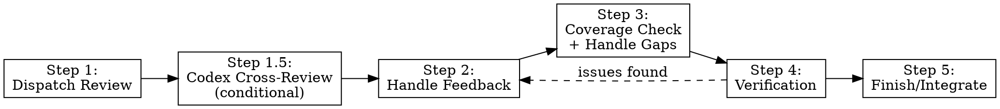

# Codex Cross-Review Implementation Plan

> **For agentic workers:** REQUIRED SUB-SKILL: Use devmuse:mu-code to implement this plan task-by-task. Steps use checkbox (`- [ ]`) syntax for tracking.

**Goal:** Add an optional Codex CLI cross-review step to mu-review, providing a second opinion from a different model family.

**Architecture:** Instruction-based — add Step 1.5 to mu-review SKILL.md with codex detection, invocation, and result presentation logic. Structured output via `codex exec --output-schema` with a JSON schema in `knowledge/schemas/`.

**Tech Stack:** Codex CLI (`codex exec`), JSON Schema, Bash

---

### Task 1: Create Output Schema

**Covers:** UC-3, UC-8

**Files:**
- Create: `knowledge/schemas/codex-review-output.json`

- [ ] **Step 1: Create the schema file**

Create `knowledge/schemas/codex-review-output.json`:

```json
{
  "$schema": "https://json-schema.org/draft/2020-12/schema",
  "type": "object",
  "properties": {
    "summary": {
      "type": "string",
      "description": "One-paragraph overview of the review findings"
    },
    "issues": {
      "type": "array",
      "items": {
        "type": "object",
        "properties": {
          "severity": {
            "type": "string",
            "enum": ["critical", "important", "minor"]
          },
          "file": {
            "type": "string",
            "description": "Affected file path"
          },
          "description": {
            "type": "string",
            "description": "What the issue is"
          },
          "suggestion": {
            "type": "string",
            "description": "How to fix it"
          }
        },
        "required": ["severity", "description"]
      }
    },
    "assessment": {
      "type": "string",
      "enum": ["block", "needs-work", "ready-to-proceed"],
      "description": "Overall verdict"
    },
    "confidence": {
      "type": "string",
      "enum": ["high", "medium", "low"],
      "description": "Self-assessed review confidence"
    }
  },
  "required": ["summary", "issues", "assessment", "confidence"]
}
```

- [ ] **Step 2: Validate JSON syntax**

Run: `python3 -c "import json; json.load(open('knowledge/schemas/codex-review-output.json')); print('Valid JSON')"`

Expected: `Valid JSON`

- [ ] **Step 3: Commit**

```bash
git add knowledge/schemas/codex-review-output.json
git commit -m "feat(knowledge): add codex review output schema"
```

---

### Task 2: Add Step 1.5 to mu-review SKILL.md

**Covers:** UC-1, UC-2, UC-5, UC-6, UC-7, UC-8, UC-9, UC-R1, UC-R2

**Files:**
- Modify: `skills/mu-review/SKILL.md:145-146` (insert between Step 1 and Step 2)

**Note:** This is the main task. The new section is inserted between the existing "Integration with Workflows" subsection (end of Step 1) and "Step 2: Handle Feedback". Also update the process flow diagram at the top to include Step 1.5.

- [ ] **Step 1: Update the process flow diagram**

In `skills/mu-review/SKILL.md`, replace the existing process flow diagram (lines 14-31) to include the new Step 1.5:



- [ ] **Step 2: Insert Step 1.5 section**

Insert the following after the "Integration with Workflows" subsection (after the "Ad-Hoc Development" block) and before "## Step 2: Handle Feedback":

```markdown
## Step 1.5: Codex Cross-Review (Conditional)

Optional cross-review using OpenAI Codex CLI for a second opinion from a different model family. This step is entirely invisible when Codex is not installed.

### Codex Availability Detection

**Run once per session, cache result:**

```bash
command -v codex >/dev/null 2>&1
```

- **Found:** Codex capability available — proceed to trigger evaluation
- **Not found:** Skip this entire step silently. Do not mention Codex, do not suggest installation, do not reference this step in any output. The capability does not exist.

### Trigger Paths

**Path A — User Explicit Request:**
If the user explicitly asks for Codex review (e.g., "let codex review this", "get codex's opinion"), proceed directly to Codex Invocation.

**Path B — System Suggestion (after Step 1 completes):**
Evaluate these high-risk signals. If ANY one fires, suggest Codex cross-review to the user:

| Signal | Detection |
|--------|-----------|
| Security-sensitive | `review-security` mode was dispatched in Step 1 |
| Large diff | `git diff --stat ${BASE_SHA}..${HEAD_SHA}` total lines > 300 |
| Cross-module | Extract top-level module dirs from diff file paths, dedup, count ≥ 2 |
| Low confidence | Claude reviewer output contains "Low confidence" or ≥ 3 PENDING items |

**Suggestion wording:**
> "This change has [signal description]. A Codex cross-review could provide a second opinion. Run it? (y/n)"

- **User confirms:** proceed to Codex Invocation
- **User declines (UC-9):** continue to Step 2. Do not suggest Codex again in this session.

### Codex Invocation

Construct and run the codex exec command:

```bash
SCHEMA_PATH="$(git rev-parse --show-toplevel)/knowledge/schemas/codex-review-output.json"
OUTPUT_PATH="/tmp/codex-review-${HEAD_SHA}.json"

git diff ${BASE_SHA}..${HEAD_SHA} | codex exec \
  -s read-only \
  --output-schema "$SCHEMA_PATH" \
  -o "$OUTPUT_PATH" \
  - <<'PROMPT'
You are a code reviewer. Review the diff provided via stdin.

Context:
- What was implemented: ${WHAT_WAS_IMPLEMENTED}
- Requirements: ${PLAN_OR_REQUIREMENTS}

Focus on: correctness, security, behavioral regressions, missing tests.
Skip: style-only feedback, formatting.

Respond according to the output schema.
PROMPT
```

**Placeholder values** (same as mu-reviewer dispatch):
- `${BASE_SHA}` / `${HEAD_SHA}` — git range for the changes
- `${WHAT_WAS_IMPLEMENTED}` — description of what was built
- `${PLAN_OR_REQUIREMENTS}` — what it should do

### Error Handling

After `codex exec` completes, evaluate the result:

```
IF exit code = 0 AND output file exists AND JSON is valid:
  → Parse output, proceed to Result Presentation

IF exit code ≠ 0 AND stderr contains "auth" / "unauthorized" / "API key":
  → Report: "Codex auth failed. Run 'codex login' or set OPENAI_API_KEY env var."
  → Fall back to Claude-only review (proceed to Step 2)

IF exit code ≠ 0 (other error) OR timeout:
  → Report: "Codex review failed: <stderr snippet>"
  → Fall back to Claude-only review (proceed to Step 2)

IF output file missing OR JSON parse fails OR required fields missing:
  → Best-effort: extract any parseable fields
  → Surface raw output to user
  → Fall back to Claude-only review (proceed to Step 2)
```

**Fallback principle:** All failures fall back silently to Claude-only review. Codex failure never blocks the review pipeline (UC-R2).

### Result Presentation

**Codex-primary mode** (Path A, user explicitly requested):

Present the codex report directly:

```
## Codex Cross-Review Results

**Assessment:** <assessment> | **Confidence:** <confidence>

### Issues (<N> critical, <N> important, <N> minor)

**Critical:**
1. [<file>] <description> — <suggestion>

**Important:**
1. [<file>] <description> — <suggestion>

**Minor:**
1. [<file>] <description> — <suggestion>
```

Enter Step 2 using the "External Reviewers" handling path.

**Dual report mode** (both Claude and Codex reviews completed):

Present side-by-side comparison:

```
## Review Results: Claude vs Codex

| Dimension | Claude (mu-reviewer) | Codex |
|-----------|---------------------|-------|
| Assessment | <assessment> | <assessment> |
| Critical issues | <count> | <count> |
| Important issues | <count> | <count> |

### Claude-only findings:
- [<severity>] <description>

### Codex-only findings:
- [<severity>] <description>

### Shared findings:
- [<severity>] <description>
```

**Dedup logic:** Match issues by exact file path + description text. Matching items go to "Shared", unique items stay with their source.

**Contradictory assessments (UC-7):** If assessments differ, add:
> "⚠️ Contradictory assessments. Claude says '<X>', Codex says '<Y>'. Please decide how to proceed."

Enter Step 2 with the combined findings. User decides which findings to act on.
```

- [ ] **Step 3: Verify SKILL.md structure**

Read the modified file and verify:
- Process flow diagram includes Step 1.5
- Step 1.5 section appears between Step 1 and Step 2
- No broken markdown (headers, code blocks, tables all properly closed)
- Existing steps (1-5) unchanged

- [ ] **Step 4: Commit**

```bash
git add skills/mu-review/SKILL.md
git commit -m "feat(mu-review): add Step 1.5 Codex cross-review"
```

---

### Task 3: Update Architecture Doc

**Covers:** Documentation alignment

**Files:**
- Modify: `docs/architecture.md`

- [ ] **Step 1: Add knowledge/schemas/ to knowledge section**

In `docs/architecture.md`, update the knowledge directory tree to include the new `schemas/` subdirectory:

Add to the knowledge/ tree:

```
├── schemas/
│   └── codex-review-output.json  # Structured output schema for codex exec
```

Add to the knowledge category table:

```
| schemas/ | Structured output schemas for external tool invocation | mu-review (codex cross-review) |
```

- [ ] **Step 2: Verify architecture doc consistency**

Read the updated `docs/architecture.md` and verify the new entry is consistent with surrounding entries.

- [ ] **Step 3: Commit**

```bash
git add docs/architecture.md
git commit -m "docs: add knowledge/schemas to architecture doc"
```
