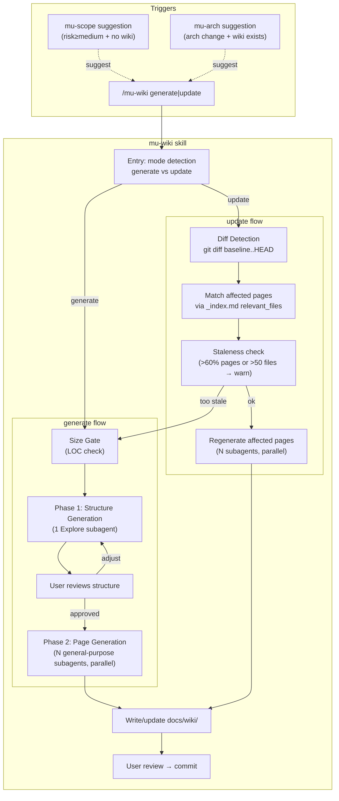
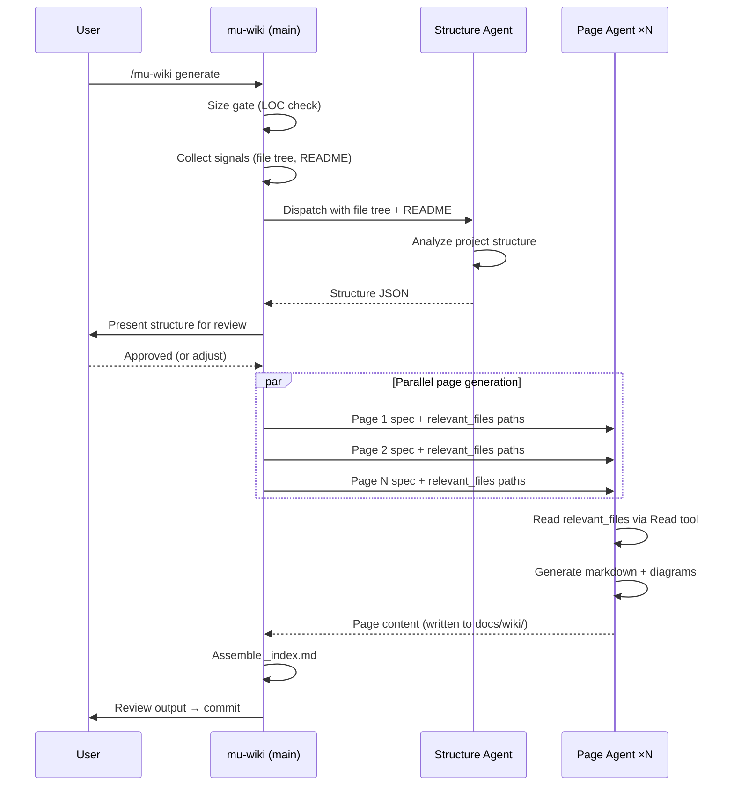
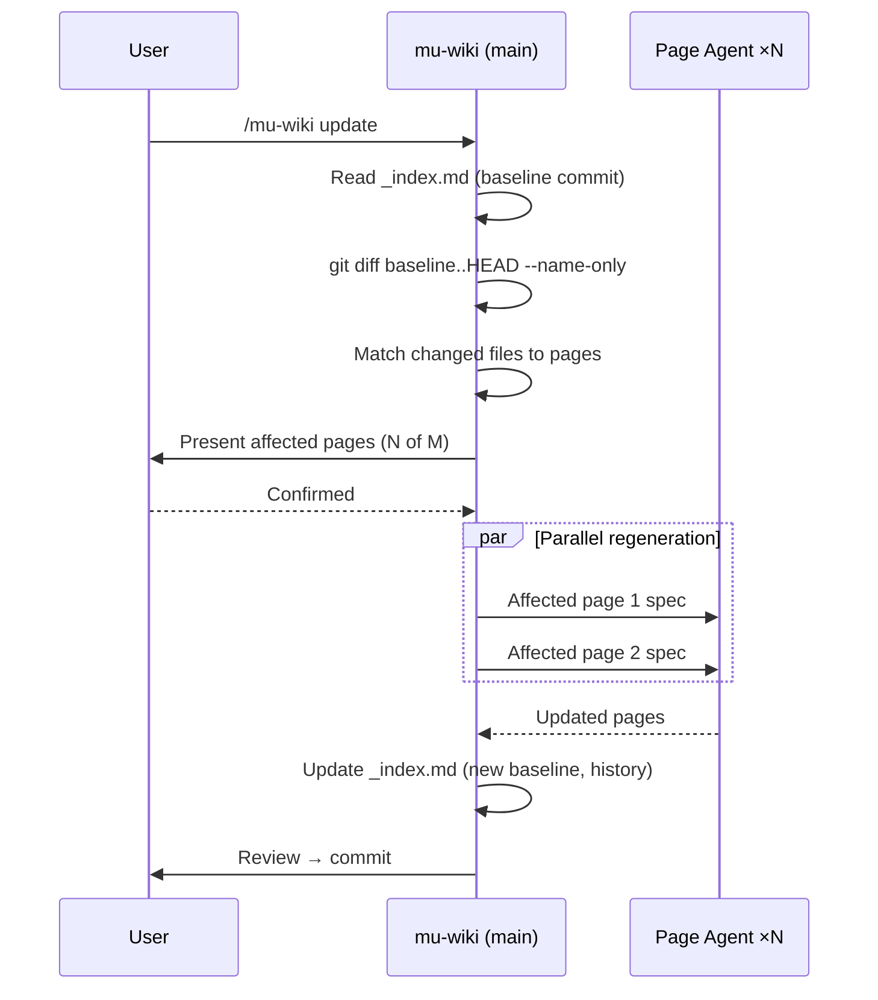

# Architecture: mu-wiki — Project Architecture Wiki Generation & Maintenance

> **Date:** 2026-04-29
> **Scope reference:** docs/scope/2026-04-29-mu-wiki.md
> **Stance:** create

## Requirements Reference

- Scope: docs/scope/2026-04-29-mu-wiki.md
- Covers: UC-1, UC-2, UC-3, UC-4, UC-5, UC-6, UC-E1, UC-E2, UC-E3, UC-ERR1, UC-ERR2, UC-R1, UC-R2, UC-R3
- NFRs: Performance (Phase 1 <2min), Token efficiency (per-page scoping), Anti-hallucination (source citations)

## Architecture Overview

mu-wiki is a new **on-demand skill** that generates and maintains project-level architecture documentation using a two-phase approach inspired by [deepwiki-open](https://github.com/AsyncFuncAI/deepwiki-open). It produces structured markdown files in `docs/wiki/` with Mermaid diagrams and mandatory source citations.

The skill has two modes: `generate` (full creation) and `update` (incremental maintenance via git diff). It integrates with existing skills through lightweight suggestion points (mu-scope, mu-arch) without blocking any pipeline flow.



## Alternatives Considered

| Approach | Pros | Cons | Failure mode | Verdict |
|----------|------|------|-------------|---------|
| A: Single-step generation | Simple, one prompt | Context overflow, no partial retry, no structure review | Quality degrades severely past page 4-5 | **Rejected** — can't cover UC-2, UC-ERR1 |
| B: Two-phase (Structure → Pages) | Per-page context control, structure review gate, partial retry, proven in testing | Requires subagent coordination | Phase 1 structure may be imperfect (user review mitigates) | **Selected** |
| C: Three-phase (Preprocess → Structure → Pages) | Slightly better relevant_files via file classification | Adds complexity, Litho testing showed poor results on markdown-heavy projects | Preprocessing stage fails on non-standard project types | **Rejected** — marginal benefit, disproportionate complexity |

## Component Design

### SKILL.md (mu-wiki skill definition)

- **Responsibility:** Define the complete skill workflow, prompt templates, flow control logic, and integration contract
- **Interface:** `/mu-wiki generate [--concise]` and `/mu-wiki update [--page=<id>]`
- **Dependencies:** Agent tool (subagent dispatch), Read/Bash tools (file tree, git ops)

### Structure Subagent (Phase 1)

- **Responsibility:** Analyze project file tree + README → produce wiki structure JSON
- **Interface:** Input: file tree string, README content, optional CLAUDE.md. Output: JSON conforming to structure schema (returned in subagent result, NOT persisted to disk — the structure is transient, used only to coordinate Phase 2 dispatch; `_index.md` captures the final page list for future updates)
- **Dependencies:** Read tool (README, CLAUDE.md), Bash tool (git ls-files)
- **Subagent type:** Explore (optimized for codebase analysis)

**Structure JSON schema:**

```json
{
  "title": "string — wiki title",
  "description": "string — project description",
  "sections": [
    {
      "id": "string",
      "title": "string",
      "pages": ["page-id-1", "page-id-2"]
    }
  ],
  "pages": [
    {
      "id": "string — kebab-case, becomes filename",
      "title": "string — page heading",
      "description": "string — what this page covers",
      "importance": "high | medium | low",
      "relevant_files": ["path/to/file — must exist in repo"],
      "related_pages": ["other-page-id"]
    }
  ]
}
```

### Page Subagent (Phase 2)

- **Responsibility:** Read assigned relevant_files → generate a single wiki page as markdown
- **Interface:** Input: page spec (title, description, relevant_files list, project path). Output: writes `docs/wiki/<page-id>.md`
- **Dependencies:** Read tool (source files), Write tool (output page)
- **Subagent type:** general-purpose
- **Template:** Page format requirements are inlined in the SKILL.md prompt (not a separate template file) — keeps the page subagent self-contained without requiring `@` references

**Page generation prompt requirements:**
1. Read ALL files in relevant_files list using Read tool
2. Generate markdown with H1 title, intro, H2/H3 sections
3. Include Mermaid diagrams (graph TD only, never graph LR; sequenceDiagram with proper syntax)
4. Include Markdown tables for structured information
5. **Mandatory source citations** — `Sources: [filename:start_line-end_line]()` format, minimum 5 distinct files per page
6. All information solely from source files — no external knowledge, no fabrication
7. Language follows user preference (default: Chinese per CLAUDE.md)

### _index.md (Wiki Index)

- **Responsibility:** Navigation index + tracking metadata for incremental updates
- **Interface:** Read by update flow (baseline commit, relevant_files mapping), read by mu-arch (architecture context), read by users (navigation)
- **Dependencies:** None

**Format:**

```markdown
# Wiki: <project-name>

> **Generated:** YYYY-MM-DD
> **Baseline commit:** `<full SHA>`
> **Generator:** mu-wiki v1

## Pages

| Page | Status | Relevant Files |
|------|--------|---------------|
| [Page Title](page-id.md) | ✅ | file1.md, file2.ts, ... |

## Sections

- **Section Title**: page-1, page-2, ...

## History

| Date | Commit | Action | Pages affected |
|------|--------|--------|---------------|
| YYYY-MM-DD | `<SHA>` | generate | all (initial) |
```

## Data Flow

### Generate Flow



### Update Flow



## Error Handling

| Failure mode | Detection | Recovery |
|-------------|-----------|----------|
| Structure subagent fails | Agent tool returns error | Surface error, prompt user to retry `/mu-wiki generate` |
| Single page subagent fails | Check subagent result for error | Mark page `status: failed` in _index.md, other pages unaffected, prompt retry |
| Git not available | `git rev-parse` fails | Skip update flow, suggest generate instead |
| _index.md corrupted/unparseable | Regex parse fails on expected fields | Prompt user to regenerate: "index 异常，建议 `/mu-wiki generate` 重建" |
| Project >200k LOC | `wc -l` check in size gate | Limit to top-level modules only (no deep dive), inform user they can later deep-dive specific subsystems |
| Diff too large (>50 files or >60% pages) | Count check after matching | Warn, suggest full regenerate over incremental |
| relevant_files no longer exist | File existence check during match | Degrade to full regenerate |
| Wiki exists when generate called | Check `_index.md` existence | Prompt: "覆盖重建还是增量 update？" |

## Testing Strategy

mu-wiki is a pure skill file (SKILL.md + templates) with no executable code. Testing follows DevMuse's standard skill testing approach:

| Test type | Method | Covers |
|-----------|--------|--------|
| Manual smoke test | Run `/mu-wiki generate` on a real project, verify two-phase flow completes | UC-1 |
| Incremental update test | Modify files after generate, run `/mu-wiki update`, verify diff detection | UC-2 |
| Integration test | Run mu-scope on cross-module task, verify wiki suggestion appears | UC-3 |
| Integration test | Run mu-arch with wiki present, verify it reads wiki context | UC-4, UC-5 |
| Boundary test | Run generate on existing wiki, verify prompt | UC-E3 |
| Boundary test | Run update with stale baseline, verify warning | UC-E1 |
| Pipeline non-blocking | Skip wiki suggestions in mu-scope and mu-arch, verify normal flow | UC-R2 |
| Negative path test | Run mu-scope on low-risk task, verify NO wiki suggestion appears | UC-6 |

## Failure Mode Analysis (Inversion Test)

**What would make this design fail?**

1. **Structure generation produces poor page decomposition** — Mitigated by user review gate before Phase 2. User can adjust structure.
2. **Source citations are fabricated** — Mitigated by prompt constraint ("information solely from source files") + subagent reads actual files. Can't fully prevent but dramatically reduces risk vs. no-citation approach (validated in deepwiki-rs vs deepwiki-open comparison).
3. **Update diff matching is too coarse** — A file change may not actually affect the page content. Acceptable: re-generating a page unnecessarily is cheap; missing a genuine update is worse.
4. **Subagent parallel dispatch hits API rate limits** — Mitigated by Claude Code's built-in rate limiting. If issues arise, can serialize.

**Assumptions that must hold:**
- Git is available and the project is a git repository
- Project has a README.md (or equivalent) for Phase 1 context
- Claude Code's Agent tool supports parallel dispatch (currently does)
- Subagents can use Read/Write tools (currently can)

## Integration Changes Summary

| File | Change | Lines |
|------|--------|-------|
| `skills/mu-wiki/SKILL.md` | NEW — full skill definition (includes inline page generation prompt) | ~300 |
| `knowledge/templates/wiki-index.md` | NEW — _index.md template | ~30 |
| ~~`knowledge/templates/wiki-page.md`~~ | NOT NEEDED — page format inlined in SKILL.md prompt | — |
| `skills/mu-scope/SKILL.md` | ADD wiki suggestion after Quick Probe risk output | ~3 |
| `skills/mu-arch/SKILL.md` | ADD `docs/wiki/` to step 3 search list; ADD update suggestion in pre-terminal | ~5 |
| `rules/bootstrap.md` | ADD mu-wiki to On-demand list | 1 |
| `docs/architecture.md` | ADD mu-wiki to On-demand table + templates list | ~5 |
| `README.md`, `README_CN.md` | ADD mu-wiki to skill listing | ~3 each |

## Out of Scope

- mu-explore changes — remains completely independent
- Auto-routing via mu-route — mu-wiki is on-demand only
- Web UI / interactive viewer — plain markdown files
- Embedding/RAG pipeline — direct file reading only
- Automatic update hooks — user-initiated only
- Declared agent files — uses inline subagents (Agent tool)

## History

| Date | Commit | Change |
|------|--------|--------|
| 2026-04-29 | `<sha>` | Initial creation |
