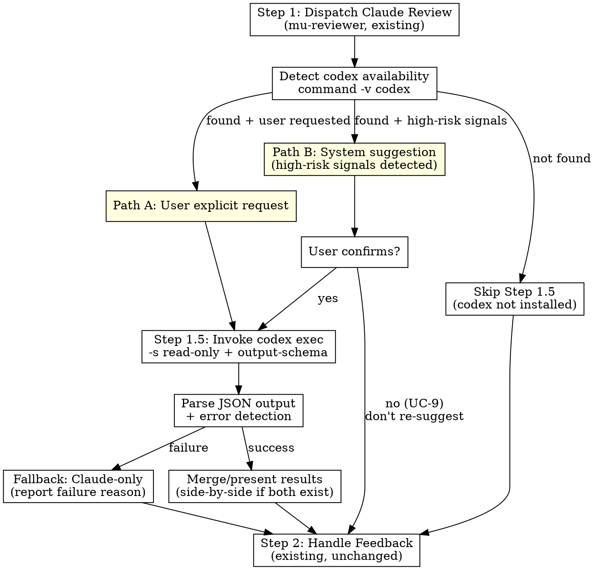

# Architecture: Codex Cross-Review

> **Date:** 2026-05-07
> **Scope reference:** docs/scope/2026-05-07-codex-cross-review.md
> **Stance:** create

## Requirements Reference
- Scope: docs/scope/2026-05-07-codex-cross-review.md
- Covers: UC-1, UC-2, UC-3, UC-5, UC-6, UC-7, UC-8, UC-9, UC-R1, UC-R2

## Architecture Overview

Add an optional Codex cross-review step (Step 1.5) to mu-review, between the existing Claude reviewer dispatch (Step 1) and feedback handling (Step 2). Codex is invoked via `codex exec` CLI in read-only mode with a structured output schema. The capability is invisible when Codex CLI is not installed.



## Alternatives Considered

| Approach | Pros | Cons | Failure mode | Verdict |
|----------|------|------|-------------|---------|
| A: Structured Schema (`--output-schema`) | Reliable JSON output, direct field mapping to mu-reviewer format | Requires maintaining a schema file; overly strict schema may reject valid reviews | Schema too tight → valid review rejected | **Selected** |
| B: Plain Text + Parse | Simplest, no extra files | Output format inconsistent, parsing fragile | Codex ignores format instructions → parse failure | Rejected — UC-8 handling too weak |
| C: JSONL Stream (`--json`) | Real-time events, rich metadata | Complex stream parsing, overkill for one-shot review | Stream parsing bugs, hard to debug | Rejected — over-engineering |

## Component Design

### 1. Codex Availability Detection

- **Responsibility:** Check if `codex` CLI binary exists on PATH; cache result per session
- **Interface:** `command -v codex >/dev/null 2>&1` — returns boolean
- **Dependencies:** None (shell built-in)
- **Behavior:**
  - Run once at Step 1.5 entry; cache result in conversational memory (do not re-check in same session)
  - If not found → entire Step 1.5 is invisible (UC-R1)
  - Session state (detection cache, UC-9 suppression flag) is maintained via conversational memory — no persistent runtime state needed

### 2. High-Risk Signal Detection (Path B triggers)

- **Responsibility:** After Claude review (Step 1) completes, evaluate whether to suggest Codex cross-review
- **Interface:** Evaluate 4 signals, any one triggers suggestion
- **Signals:**

| Signal | Detection method |
|--------|-----------------|
| Security-sensitive | `review-security` mode was triggered in Step 1 |
| Large diff | `git diff --stat ${BASE_SHA}..${HEAD_SHA}` → total lines > 300 |
| Cross-module changes | Extract top-level module dirs from diff file paths, dedup, count ≥ 2 |
| Low confidence | Claude reviewer output contains "Low confidence" or ≥ 3 items marked PENDING |

- **Dependencies:** Step 1 (Claude review) output, git diff stats

### 3. Codex Invocation

- **Responsibility:** Construct prompt, invoke `codex exec`, capture output
- **Interface:**

```bash
git diff ${BASE_SHA}..${HEAD_SHA} | codex exec \
  -s read-only \
  --output-schema knowledge/schemas/codex-review-output.json \
  -o /tmp/codex-review-${HEAD_SHA}.json \
  - <<'PROMPT'
You are a code reviewer. Review the diff provided via stdin.

Context:
- What was implemented: ${WHAT_WAS_IMPLEMENTED}
- Requirements: ${PLAN_OR_REQUIREMENTS}

Focus on: correctness, security, behavioral regressions, missing tests.
Skip: style-only feedback, formatting.

Respond according to the output schema.
PROMPT
```

- **Dependencies:** `codex` CLI, git, output schema file
- **Key flags:**
  - `-s read-only` — no code modifications allowed
  - `--output-schema` — enforce structured JSON output
  - `-o` — write final message to file for Claude to read
  - `-` — read prompt from stdin (heredoc)

### 4. Output Schema

- **Location:** `knowledge/schemas/codex-review-output.json`
- **Fields:**

| Field | Type | Required | Description |
|-------|------|----------|-------------|
| `summary` | string | yes | One-paragraph review overview |
| `issues` | array of Issue | yes | List of findings |
| `issues[].severity` | enum: critical/important/minor | yes | Severity level (aligns with mu-reviewer) |
| `issues[].file` | string | no | Affected file path |
| `issues[].description` | string | yes | What the issue is |
| `issues[].suggestion` | string | no | How to fix it |
| `assessment` | enum: block/needs-work/ready-to-proceed | yes | Overall verdict |
| `confidence` | enum: high/medium/low | yes | Self-assessed confidence |

### 5. Result Presentation

- **Responsibility:** Parse codex output, merge with Claude review if both exist, present to user
- **Two modes:**
  - **Codex-primary** (Path A, user explicitly requested codex review; Claude review may or may not have run): Present codex report as primary output, enter Step 2 as "External Reviewers" feedback
  - **Dual report** (both Claude and Codex reviews completed): Side-by-side comparison table + findings categorized as Claude-only / Codex-only / Shared (exact match dedup on file + description)
- **Contradictory assessments** (UC-7): Explicitly flag, let user decide

## Data Flow

```
Step 1 (Claude review) completes
  → [check codex availability]
  → [check trigger: Path A explicit / Path B signals]
  → [user consent if Path B]
  → git diff piped to codex exec stdin
  → codex exec writes JSON to /tmp/codex-review-${HEAD_SHA}.json
  → Claude reads JSON file
  → Parse + validate against expected schema fields
  → If dual review: dedup + merge with Claude findings
  → Present formatted report
  → Enter Step 2 (Handle Feedback) with combined findings
```

## Error Handling

| Scenario | Detection | Action | UC |
|----------|-----------|--------|-----|
| Codex not installed | `command -v codex` fails | Step 1.5 invisible | UC-R1 |
| Auth failure | exit non-zero + stderr matches auth/unauthorized/API key | Report error + fix hint, fall back | UC-5 |
| Timeout / crash | Bash tool timeout (120s) or exit non-zero | Report failure, fall back | UC-6 |
| Malformed output | JSON parse error or missing required fields | Best-effort parse + surface raw output | UC-8 |
| User declines suggestion | User says no to Path B suggestion | Continue Claude-only, suppress re-suggestion in session | UC-9 |
| Any codex failure | Any of above | Existing mu-review flow unblocked | UC-R2 |

**Auth error hint format:** `"Codex auth failed. Run 'codex login' or set OPENAI_API_KEY env var."`

## Testing Strategy

DevMuse is an instruction-based system (no runtime code to unit test). Validation approach:

- **Manual integration test:** Install codex CLI, run mu-review on a known diff, verify structured output and correct integration with Step 2
- **Dry-run verification:** Run `command -v codex` detection in a session without codex installed, verify Step 1.5 is completely invisible
- **Schema validation:** Run `codex exec` with the schema against a sample diff, verify output conforms
- **Failure path:** Test with invalid `OPENAI_API_KEY`, verify auth error detection and fallback

### UC Coverage Mapping

| UC | Tested by |
|----|-----------|
| UC-1 | Manual: user requests "codex review" |
| UC-2 | Manual: trigger on security-sensitive diff |
| UC-3 | Verify JSON output parses into feedback format |
| UC-5 | Test with expired/missing auth |
| UC-6 | Test with network disconnect or timeout |
| UC-7 | Run both Claude + Codex review, verify side-by-side |
| UC-8 | Feed invalid schema to codex, verify fallback |
| UC-9 | Decline suggestion, verify no re-suggestion |
| UC-R1 | Test without codex installed |
| UC-R2 | Any failure → verify Claude flow unblocked |

## Failure Mode Analysis (Inversion Test)

| What would make this fail? | Mitigation |
|---|---|
| Codex CLI changes `exec` syntax or deprecates `--output-schema` | Schema and command are isolated in mu-review SKILL.md + knowledge file; easy to update in one place |
| Codex output doesn't respect schema even with `--output-schema` | UC-8 fallback: best-effort parse + raw output |
| Codex CLI requires interactive auth that can't be pre-configured | Auth is runtime-detected (UC-5); we don't depend on `codex login status` |
| Bash tool 120s timeout too short for large diffs | Acceptable trade-off; very large diffs should be split anyway |
| `knowledge/schemas/` path not resolved correctly by codex exec | Use absolute path via `$(git rev-parse --show-toplevel)/knowledge/schemas/...` or relative to cwd |

## Out of Scope
- Codex installation guidance — capability is invisible when not installed
- Replacing mu-reviewer — additive only
- Multi-harness orchestration (dmux/tmux) — single-process only
- GAN-style adversarial loops — one-shot review only
- Customizable codex model selection — use codex default model

## History

| Date | Commit | Change |
|------|--------|--------|
| 2026-05-07 | — | Initial creation |
