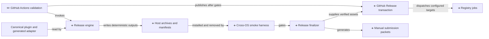
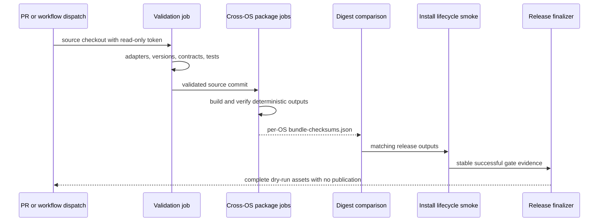
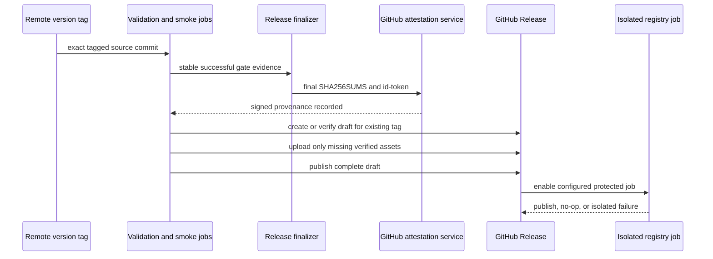
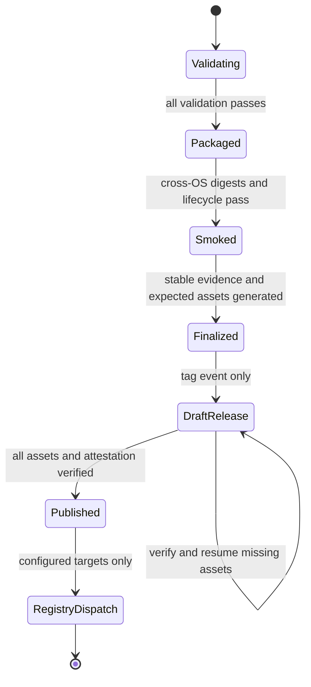

# Architecture: A local release engine makes multi-host publication reproducible

> **Date:** 2026-08-21
> **Requirements evidence:** [GitHub issue #49](https://github.com/knotmark-ai/devmuse/issues/49)
> **Stance:** create

DevMuse will build every host distribution through one dependency-free Node.js
release engine, then let GitHub Actions validate, attest, release, and publish
those immutable outputs. This document designs the remaining work after #49's
pull-request validation phase; it does not choose new host capabilities or
change skill behavior.

## Requirements Reference

- Requirements evidence: [GitHub issue #49](https://github.com/knotmark-ai/devmuse/issues/49), including the Phase 1 completion comment
- Covers: UC-1 through UC-9 and UC-R1 through UC-R5 below
- External constraints:
  - [GitHub artifact attestations](https://docs.github.com/en/actions/concepts/security/artifact-attestations)
  - [GitHub Release CLI](https://cli.github.com/manual/gh_release_create)
  - [npm trusted publishing](https://docs.npmjs.com/trusted-publishers/)

### Use cases

- **UC-1 — Pull-request validation:** Given any pull request, when CI runs,
  then it builds adapters, rejects generated drift, validates versions and
  manifests, and runs the existing contract tests without publishing.
- **UC-2 — Release dry run:** Given a manual workflow dispatch in dry-run
  mode, when the pipeline completes, then it executes validation, packaging,
  checksum comparison, and cross-OS smoke tests without mutating GitHub
  Releases or registries.
- **UC-3 — Deterministic host artifacts:** Given the same source commit and
  version, when clean Linux, macOS, and Windows checkouts build release
  outputs, then the Claude, Codex, Gemini, and Hermes archives have identical
  names, manifests, and SHA-256 digests.
- **UC-4 — OpenClaw compatibility:** Given the Claude-compatible runtime
  archive, when OpenClaw compatibility is tested, then its required bundle
  layout passes without generating a separate OpenClaw archive.
- **UC-5 — Install lifecycle smoke:** Given any supported host archive, when
  the smoke harness installs, updates, validates, and uninstalls it in a
  temporary location, then no stale file or installation directory remains.
- **UC-6 — Tag release:** Given a remote `v<package-version>` tag, when all
  validation and smoke jobs pass, then the workflow publishes one GitHub
  Release containing the verified archives, checksums, manifests, provenance,
  and manual submission packet.
- **UC-7 — Registry publication:** Given a registry target enabled by
  repository configuration, when the GitHub Release succeeds, then its
  isolated, environment-protected job publishes the already-validated version
  without sharing credentials or mutable state with another registry.
- **UC-8 — Manual marketplaces:** Given a supported marketplace without a
  publication API, when release validation is finalized, then a
  ready-to-submit packet names the artifact, checksum, validation evidence,
  and human steps.
- **UC-9 — Smallest installation path:** Given a supported host, when a user
  reads the installation documentation, then its primary instructions point to
  that host's smallest release archive and do not require cloning repository
  docs or tests.

### Reverse use cases

- **UC-R1:** A pull request or ordinary `main` push must never publish a
  release or registry version.
- **UC-R2:** Runtime archives must not include repository documentation,
  historical artifacts, test suites, or development-only configuration.
- **UC-R3:** Re-running a partially completed tag must not create a second
  release, replace a published asset, or attempt to republish an identical npm
  version.
- **UC-R4:** A registry outage or rejected environment approval must not alter
  the GitHub Release or prevent another independently configured registry job
  from running.
- **UC-R5:** OpenClaw compatibility must not introduce a duplicate canonical
  runtime or another host-specific source tree.

### Resolved requirement tensions

| What appears to conflict? | How is it resolved? |
|---|---|
| Reproducible archives versus build provenance | Archive bytes contain only deterministic source facts. GitHub's signed attestation records the workflow identity externally, so timestamps and runner identity never perturb archive digests. |
| Idempotent retries versus immutable releases | Assets are assembled and verified before a draft release is published. A retry skips byte-identical assets, fills only missing draft assets, and fails on any digest mismatch. A published release is verification-only and never uses `--clobber`. |
| Automatic tag release versus optional npm distribution | GitHub Release is the tag default. npm runs only when its repository variable and protected environment are configured; otherwise the npm artifact remains downloadable without publication. |

## Alternatives Considered

| Which approach? | What does it make easy? | What does it make hard? | How would it fail? | Verdict |
|---|---|---|---|---|
| **A: Local-first Node release engine** | Deterministic output, cross-platform tests, fakeable boundaries, one host manifest model | Requires a small archive implementation | Fails if platform metadata or file modes leak into archive headers; golden digest tests and Git mode normalization catch this | **Selected** |
| B: Shell packaging plus workflow actions | Short initial workflow | Local Windows execution and exact archive parity | Breaks when GNU/BSD/Windows tools differ or a runner lacks an assumed binary | Rejected |
| C: Independent builder per host | Host ownership is visually explicit | Shared validation and release semantics drift | Fails when one host forgets a version field, exclusion, checksum, or retry rule | Rejected |

## C4 Positioning

The change adds a release subsystem around the existing canonical plugin and
generated adapter. It changes no runtime skill boundary.

### Component responsibilities

| Which component? | What does it own? | What must it not own? |
|---|---|---|
| Bundle catalog | Host file selection, required manifest paths, OpenClaw-to-Claude compatibility mapping | Archive encoding or network publication |
| Version validator | Equality among package and host manifest versions plus `v<version>` tag matching | Version mutation |
| Deterministic archive writer | Stable path ordering, Git-derived modes, normalized ownership and time, gzip output | Host policy decisions |
| Release manifest builder | Per-file and per-archive digests, sizes, source commit, source epoch, submission inputs | Signed runner identity or post-smoke claims |
| Smoke harness | Extract, install, update, validate, and uninstall in temporary roots | Real user configuration or credentials |
| Release finalizer | Stable validation evidence, expected asset set, submission packet, final checksums | Building or changing runtime archives |
| GitHub workflow | Validation order, cross-OS matrix, attestations, draft-release transaction, protected environments | Packaging logic duplicated in YAML |
| Registry job | One registry's authentication, existence check, and publish command | Another registry's credentials or mutable workspace |

## Functional Design

### Local command contracts

The repository exposes these stable npm commands; implementation may divide
them into internal modules without changing the interface.

| Which command? | What input does it accept? | What does success produce? |
|---|---|---|
| `npm run release:build -- --output <dir>` | Clean checkout and optional source ref | Host archives, npm tarball, bundle manifest, `bundle-checksums.json`, deterministic source provenance, submission inputs |
| `npm run release:verify -- --input <dir>` | Built output directory and current source checkout | Exit 0 only when versions, file sets, archive contents, checksums, and provenance agree |
| `npm run release:smoke -- --input <dir>` | Verified output directory | Install/update/uninstall evidence for every bundle and OpenClaw compatibility |
| `npm run release:finalize -- --input <dir> --evidence <file>` | Verified bundles plus successful named gate results | Final release manifest, expected asset contract, submission packet, and final checksums |
| `npm run test:release` | Repository checkout | Two-build determinism, negative fixtures, archive verification, lifecycle smoke, and workflow contract tests |

Unknown options, missing manifests, symlinks, untracked bundle inputs, version
mismatches, and output paths inside a source bundle fail before an archive is
written. Commands never infer a version from a mutable branch name.

### Runtime bundle contracts

The bundle catalog selects tracked runtime files from canonical homes rather
than maintaining copied file inventories in documentation. Its rules are:

- Claude contains marketplace metadata plus the Claude plugin runtime;
- Codex contains Codex marketplace metadata plus the generated adapter;
- Gemini contains its extension metadata, context, canonical skills, agents,
  and referenced knowledge, excluding Claude hooks and marketplace metadata;
- Hermes contains its root registration files plus canonical skills, agents,
  and referenced knowledge, excluding host-specific hooks and marketplace
  metadata;
- OpenClaw validates the Claude archive and emits no additional archive.

Each archive has one top-level `devmuse/` directory so extraction cannot spray
files into the destination. Paths are sorted bytewise, separators are `/`,
tracked executable bits come from Git, other files use mode `0644`, directories
use `0755`, ownership is numeric zero, and modification time is always the
source commit epoch. A caller-supplied time cannot alter archive bytes.

### Cross-platform lifecycle oracles

Every distribution-level smoke runs on Linux, macOS, and Windows. It exercises
archive extraction and the filesystem contract rather than launching a
proprietary host CLI.

| Which target? | Where is it installed under the temporary root? | What proves the layout is usable? |
|---|---|---|
| Claude | `claude-marketplace/devmuse/` | Marketplace metadata resolves `./plugin`; the plugin manifest exists; referenced rules, skills, agents, knowledge, and executable hooks match the bundle manifest |
| Codex | `codex-marketplace/devmuse/` | Marketplace metadata resolves `./adapters/codex`; the Codex plugin manifest exists; every generated skill dependency resolves inside the installation |
| Gemini | `gemini-extensions/devmuse/` | Extension metadata resolves `GEMINI.md`; canonical skill references resolve; Claude marketplace metadata and hooks are absent |
| Hermes | `hermes-plugins/devmuse/` | `plugin.yaml` and `__init__.py` resolve the canonical skill root; host-specific marketplace metadata and hooks are absent |
| OpenClaw compatibility | `openclaw-marketplace/devmuse/`, installed from the Claude archive | The Claude marketplace source and plugin layout satisfy the OpenClaw-compatible bundle contract; no OpenClaw archive or source tree exists |

The update phase first installs a synthetic previous state derived from the
same bundle: it changes a tracked fixture copy and adds an obsolete sentinel.
Installing the release archive uses a staged replacement: extract and validate
a sibling staging directory, move the old target to a rollback sibling, move
staging into place, then delete the rollback copy. A failed move restores the
old target. This is recoverable replacement, not a claim of crash-atomic
directory exchange on every OS. The final target must restore every tracked
digest and remove the sentinel. Uninstall removes only the target installation
directory; a sibling canary must remain unchanged, and no path may exist
outside the temporary root.

### Release output contracts

The build phase records the package version, source commit, source epoch,
builder schema version, compatibility targets, and every archive's digest and
size in a bundle manifest. Bundle checksums are sorted by artifact name.
Deterministic source provenance repeats only source facts.
`bundle-checksums.json` is the build-stage cross-OS comparison contract: it
contains sorted archive and npm-tarball names, digests, and sizes, and is never
uploaded as a release asset.

After cross-OS comparison and smoke succeed, the finalizer consumes a stable
evidence file containing only named gate results and the source commit. It
generates the ready-to-submit marketplace packet and final release manifest,
then writes `SHA256SUMS` over every uploadable asset except the checksum file
itself. Finally it writes a local-only `expected-assets.json` contract derived
from the bundle catalog and release metadata schema; that contract includes
the name and digest of every uploadable asset, including `SHA256SUMS`, but is
not itself uploaded. This ordering has no checksum self-reference. Run IDs,
timestamps, runner names, and URLs are excluded so the same source still
finalizes byte-identically. GitHub Actions then adds signed workflow identity
by attesting the final checksums through `actions/attest`; the signature is
deliberately not embedded back into the archives.

The npm tarball is built once in the package job and becomes the exact input to
the npm publication job. Its SHA-512 integrity is recorded so a retry can
compare an already-published version before deciding to no-op or fail.

### Pull-request and dry-run sequence

### Tag release sequence

### Release lifecycle

Failures before `DraftRelease` leave GitHub Release and registry state
unchanged. The preceding attestation step may have recorded idempotent remote
attestation state for the same checksum subjects. Once a draft exists, a
partially uploaded draft is a recoverable durable checkpoint; re-running
verifies its matching assets and resumes only the missing uploads. A published
release remains verification-only.

### GitHub Release transaction

The tag must already exist remotely and equal `v<package-version>`. The order
below is the only allowed remote transaction order.

1. Verify the generated expected asset contract locally before any remote
   mutation.
2. Attest the final checksum subjects with `id-token: write` and
   `attestations: write` granted only to the release job.
3. If no release exists, create a draft with `--verify-tag`; otherwise verify
   that the existing release belongs to the same tag and source commit.
4. For a draft, download or inspect every existing asset and compare its
   digest. Matching assets are skipped; missing assets are uploaded; mismatches
   fail without deletion.
5. Publish the draft only after the expected asset set is complete.
6. If a published release exists, verify its assets and treat an exact match as
   success. Never mutate or recreate it.

### Registry isolation

The npm job depends on the published GitHub Release, runs in a dedicated
`npm-production` environment, and uses npm trusted publishing through OIDC.
No long-lived npm token is exposed to validation, packaging, smoke, or manual
submission jobs. Before publishing, it compares the local tarball integrity
with `npm view` for the same version: an exact match is an idempotent success,
absence publishes, and a mismatch is a hard failure.

Other supported marketplaces remain manual until they expose an authenticated
publication API that can meet the same retry and isolation contract. Their
submission packet is a release asset, not a separate source of host metadata.

## Non-Functional Design

### Reliability

Release mutations are ordered after pure validation, and every external write
has an existence-and-digest check. Draft publication is the transaction
boundary: incomplete drafts are recoverable, while published releases are
verification-only. Registry jobs consume immutable artifacts and cannot
rewrite the release.

### Security

Pull-request jobs keep `contents: read` and receive no publication secrets.
The release job receives only `contents: write`, `id-token: write`, and
`attestations: write`; npm receives `id-token: write` inside its protected
environment. Paths are rejected when they escape the repository or extraction
root, and archives reject symlinks to prevent traversal through link targets.

### Maintainability

Host differences live in a declarative bundle catalog, while archive,
checksum, smoke, and error semantics are shared. Tests fake external commands
at process boundaries and keep the core deterministic functions free of
network calls. Workflow YAML invokes public commands and contains no duplicate
file-selection logic.

### Compatibility and portability

All local release code uses supported Node.js APIs and path normalization rather
than GNU shell utilities. The CI matrix runs on Linux, macOS, and Windows and
compares outputs, catching both archive nondeterminism and host-specific path
assumptions. Existing host manifests remain the ingestion authority for their
archives.

### Observability

Every job writes a concise summary containing source commit, version, artifact
digests, smoke targets, skipped idempotent operations, and publication URLs.
Failures name the component boundary and preserve the provider error without
printing credentials or complete environment dumps.

## Architecture Decision Records

- [ADR-0001](../adr/0001-local-first-release-engine.md) — packaging is a local, dependency-free release engine; workflows remain thin orchestration

## Error Handling

| What fails? | What is the response? | What remains safe? |
|---|---|---|
| Version or tag mismatch | Stop before packaging or publication and list the disagreeing canonical manifests | No release or registry mutation |
| Unsupported file type, symlink, or escaping path | Reject the bundle and name the offending tracked path | No partial archive |
| Cross-OS digest mismatch | Fail comparison and retain each runner's manifests as diagnostic artifacts | No release mutation |
| Smoke install, update, or uninstall failure | Report host, bundle, lifecycle phase, and remaining paths | Temporary roots are cleanup targets; publication stays blocked |
| Existing draft asset has a different digest | Fail without `--clobber`, deletion, or draft publication | Original asset remains available for investigation |
| Existing published release differs | Fail permanently for that tag and require a new version | Immutable release remains untouched |
| npm version exists with matching integrity | Report idempotent no-op | No duplicate publish attempt |
| npm version exists with different integrity | Fail and require a new version or registry investigation | Existing registry version remains untouched |
| One registry fails | Fail only that job and preserve logs for retry | GitHub Release and sibling registry jobs remain unchanged |

## Testing Strategy

| Which evidence? | Which use cases does it cover? |
|---|---|
| Version and bundle-catalog unit tests with malformed fixtures | UC-1, UC-3, UC-R2 |
| Two clean builds compared byte-for-byte | UC-3, UC-R3 |
| Archive parser and path-traversal negative tests | UC-3, UC-R2 |
| Bundle catalog negative assertion that no OpenClaw archive or source tree is emitted | UC-R5 |
| Temporary install, stale-file update, validation, and uninstall tests | UC-4, UC-5 |
| Workflow contract tests for triggers, permissions, dependencies, and environments | UC-1, UC-2, UC-6, UC-7, UC-R1, UC-R4 |
| Fake `gh` and `npm` boundary tests for absent, matching, and mismatched remote state | UC-6, UC-7, UC-R3, UC-R4 |
| Manual packet snapshot, finalization-order test, and required-field validation | UC-8 |
| Installation-path link and archive-name checks in English and Chinese platform docs | UC-9 |
| Linux, macOS, and Windows package/smoke matrix | UC-2, UC-3, UC-4, UC-5 |

The existing skill, routing, hook, Mermaid, token, generated-adapter, and
platform contract tests remain release gates. The platform contract test is
made self-contained so it requires neither `rg` nor Bash `mapfile`.

## Out of Scope

- Changing skill behavior, host invocation policy, or safety semantics.
- Creating an OpenClaw-specific runtime tree or archive.
- Publishing to a marketplace without an authenticated, automatable API.
- Deciding that npm is the permanent primary distribution channel.
- Native end-to-end automation inside every proprietary host CLI; the matrix
  verifies distribution layout and lifecycle, while marketplace-specific
  acceptance remains in the submission packet.

## History

| Date | Commit | Change |
|---|---|---|
| 2026-08-21 | — | Initial creation: selected a local-first deterministic release engine, transactional GitHub Release publication, cross-OS lifecycle smoke, signed provenance, and isolated npm publishing |
