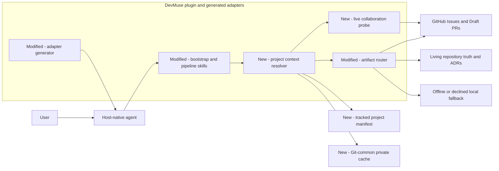
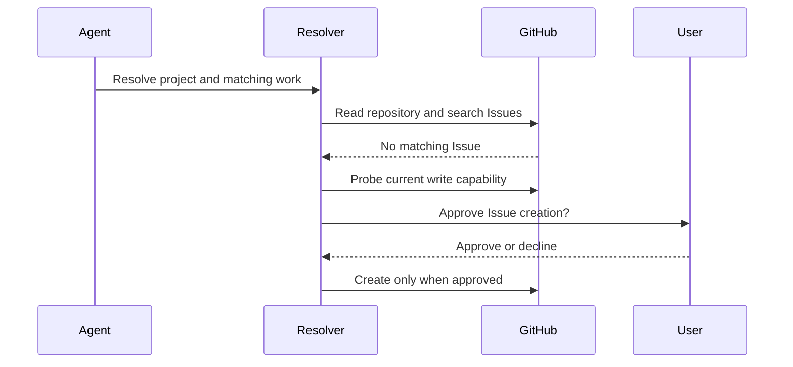
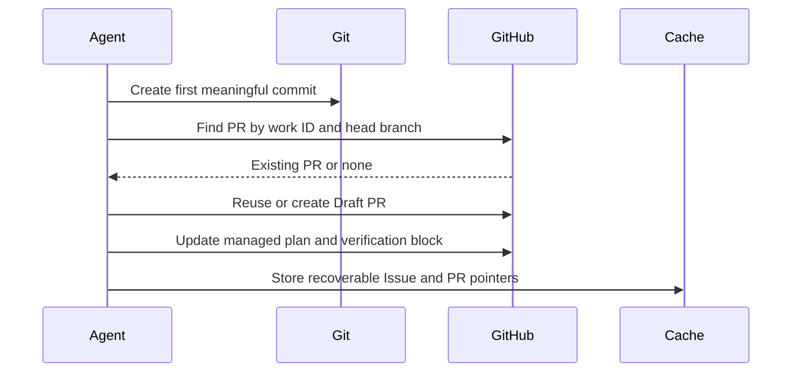
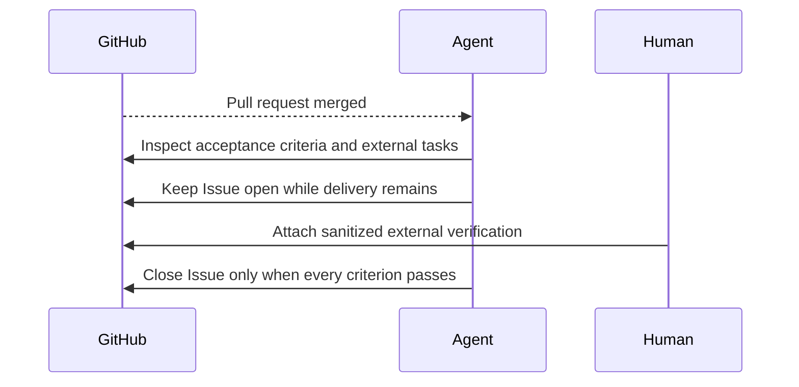

# Architecture: GitHub owns coordination while two storage tiers preserve project context

> **Date:** 2026-08-22
> **Requirements evidence:** [GitHub issue #62](https://github.com/knotmark-ai/devmuse/issues/62)
> **Stance:** create

DevMuse will coordinate active work in GitHub whenever live capability and user
authorization permit it, while a tracked manifest preserves stable project
facts and a Git-common cache preserves only recoverable worktree hints. This
design covers collaboration, project identity, fallback, and delivery
completion; it does not redesign the PRD and architecture document sets owned
by #63.

## Requirements Reference

- Requirements evidence: [GitHub issue #62](https://github.com/knotmark-ai/devmuse/issues/62), including the [approved Option A](https://github.com/knotmark-ai/devmuse/issues/62#issuecomment-5371879091) and the [recorded section approvals](https://github.com/knotmark-ai/devmuse/issues/62#issuecomment-5372475995)
- Covers: UC-G1 through UC-G10 and UC-GR1 through UC-GR3
- Related behavior: [issue #40](https://github.com/knotmark-ai/devmuse/issues/40) for scope-to-architecture revision loops
- Domain facts: [Project context and Delivery lifecycle](../../CONTEXT.md#project-context) in `CONTEXT.md`

The Issue is equivalent architectural scope evidence: it carries the goal,
artifact-routing table, exhaustive use cases, reverse cases, affected surfaces,
and acceptance criteria. Quick Probe found changes across bootstrap, core
pipeline skills, the Claude session hook, generated adapters, Git/GitHub
boundaries, and multi-worktree state, so the architectural path applies.

## Alternatives Considered

| Which approach? | What does it make easy? | What does it make hard? | How would it fail? | Verdict |
|---|---|---|---|---|
| **A: Tracked manifest, Git-common cache, and GitHub coordination** | Durable team facts, worktree sharing, fresh-clone recovery, and visible delivery state | Requires explicit authority and reconciliation rules | Fails if cache hints become authority, secrets enter either store, or a host-only hook becomes required | **Selected** |
| B: Put all state in `.devmuse/project.yaml` | One discoverable file | Branch churn, merge conflicts, stale permissions, and disclosure of local session state | Breaks as soon as two worktrees update Issue or PR state independently | Rejected |
| C: Put all state under the Git common directory | Private, worktree-shared updates | Fresh clones, separate clones, non-Git projects, and team discovery | Breaks when the cache is absent or when two clones need the same canonical paths | Rejected |

The approved decision is recorded in
[ADR-0002](../adr/0002-github-first-project-context.md).

## C4 Positioning

DevMuse is a plugin with host-specific adapters. The change crosses the host,
Git repository, and GitHub boundaries and adds one internal resolver protocol.
No `docs/wiki/_index.md` was found in this round, so the surrounding system is
cited from [the current architecture document](../architecture.md) rather than
redrawn here.



### Component responsibilities

| Which component? | What does it own? | What must it not own? |
|---|---|---|
| Project context contract | Source precedence, schema, identity, capability, conflict, and fallback decisions | Host-specific tool syntax or credentials |
| Tracked manifest | Stable identity, collaboration preference, and canonical artifact paths | Issue, PR, session, authentication, or worktree progress |
| Git-common cache | Recoverable capability probes, worktree coordination pointers, and interrupted-run hints | Durable project truth or write authorization |
| Live collaboration probe | Current repository identity and operation-scoped capability with a reason | Persisted credentials or assumed consent |
| Artifact router | Selection among Issue, Draft PR, living documents, ADRs, and local fallback | Duplicated content across those homes |
| Claude SessionStart hook | Safe, read-only preloading of resolved facts when available | The only resolver implementation or authority |
| Adapter generator | Self-contained vendoring of the canonical contract into generated skills | Independent Codex or portable semantics |

## Functional Design

### Project manifest

The tracked manifest is `.devmuse/project.yaml`. It uses a deliberately narrow,
versioned mapping so hosts can reject unsupported YAML features rather than
interpret tags, aliases, executable values, or arbitrary objects.

```yaml
schema_version: 1

project:
  id: "github:R_kgDOExample"
  repository: "github.com/knotmark-ai/devmuse"

collaboration:
  provider: github
  mode: github-first

artifacts:
  prd: null
  architecture:
    index: docs/architecture.md
    domain_model: CONTEXT.md
```

`collaboration.mode` is a remembered preference, not standing permission to
write remotely. Every remote mutation still requires current capability and
authorization from the active user request or workflow. Artifact values are
repository-relative paths; validation rejects absolute paths, `..`, control
characters, and resolution through a symbolic link outside the repository.

The manifest is created only after user approval. An unknown schema version is
read-only: the resolver reports `unsupported-schema` and never rewrites it.
The architecture members are nullable so #63 can later move the domain model
into an indexed architecture set without changing this schema.

### Project identity

Identity resolution validates sources before applying precedence:

1. Parse and schema-validate a manifest candidate.
2. When a live provider read is available, compare the manifest repository and
   `project.id` with the provider's immutable repository ID. Matching immutable
   IDs bind the manifest to the checkout. A renamed or transferred repository
   remains the same project, but updating the repository tuple is a
   user-approved tracked manifest change.
3. A different immutable ID returns `identity-conflict`, blocks remote writes
   and cache propagation, and offers `adopt-current-repository` as an explicit
   tracked manifest change. Retaining the existing manifest selects local
   fallback for this checkout; it never mutates the other repository.
4. When the provider cannot be read, a valid manifest may supply
   `manifest-unverified` identity for local fallback only. Remote writes remain
   blocked until live equivalence is established.
5. With no manifest, the immutable provider ID is authoritative after a live
   read. A non-GitHub project may instead use a UUID written to a user-approved
   manifest. A normalized host/owner/repository tuple is only a provisional
   discovery hint.

A checkout directory never becomes the project key. SSH and HTTPS remotes are
normalized to the same repository tuple after user information, embedded
credentials, query strings, and fragments are stripped. In a worktree whose
branch predates the manifest, the resolver may read the manifest blob from the
default branch as a candidate, subject it to the same live-equivalence checks,
and must not write it into the current branch automatically.

The Git-common cache records the accepted project ID. If another worktree in
the same Git common directory presents a different ID, resolution returns
`identity-conflict` with both sources. It does not silently choose the newest
file or path.

### Git-common cache

The private cache lives at:

```text
<git-common-dir>/devmuse/project-context.v1.json
```

Its logical schema is:

```json
{
  "schema_version": 1,
  "revision": 3,
  "project_id": "github:R_kgDOExample",
  "capability_probe": {
    "checked_at": "2026-08-22T00:00:00Z",
    "provider": "github",
    "operations": {
      "repository.read": {"allowed": true, "reason": "ok"},
      "issue.read": {"allowed": true, "reason": "ok"},
      "issue.create": {"allowed": false, "reason": "authentication-required"},
      "issue.update": {"allowed": false, "reason": "authentication-required"},
      "issue.comment.create": {"allowed": false, "reason": "authentication-required"},
      "branch.push": {"allowed": false, "reason": "authentication-required"},
      "pull_request.read": {"allowed": true, "reason": "ok"},
      "pull_request.create": {"allowed": false, "reason": "authentication-required"},
      "pull_request.update": {"allowed": false, "reason": "authentication-required"},
      "pull_request.comment.create": {"allowed": false, "reason": "authentication-required"}
    }
  },
  "worktrees": {
    "main": {
      "branch": "main",
      "work_id": "issue-62",
      "issue": 62,
      "pull_request": null,
      "pipeline_phase": "architecture",
      "updated_at": "2026-08-22T00:00:00Z"
    }
  },
  "recovery": {
    "7deba3e4-8fd5-4cda-a287-6675be601234": {
      "operation": "pull_request.create",
      "attempt_id": "7deba3e4-8fd5-4cda-a287-6675be601234",
      "work_id": "issue-62",
      "object_kind": "pull_request",
      "repository_id": "github:R_kgDOExample",
      "head": "feat/62-github-first-context",
      "base": "main",
      "request_fingerprint": "sha256:2f7c000000000000000000000000000000000000000000000000000000000000",
      "status": "indeterminate",
      "started_at": "2026-08-22T00:00:00Z",
      "last_error_code": "transport-timeout"
    }
  }
}
```

The worktree key comes from Git's worktree administration record (the path of
`git-dir` relative to `git-common-dir`), not the checkout path, so it is stable
across branch switches. The primary worktree has no administration subdirectory
— its relative path is empty — and takes the reserved key `main`; linked
worktrees take their `worktrees/<name>` administration path. A checkout path may
appear only as a diagnostic hint. Capability results may accelerate discovery
but never authorize a write.

`recovery` is keyed by `attempt_id`, so concurrent Issue, PR, and comment
mutations for one work ID cannot overwrite each other. Each record carries the
work ID, object kind, immutable repository ID, and a canonical request
fingerprint; PR creates also carry normalized head and base refs. The
fingerprint covers repository ID, work ID, object kind, head/base when present,
title when present, and managed-content hash. Records contain only sanitized,
resumable mutation metadata and are removed independently when their outcome
is resolved. Cache mutation acquires a lock in the same Git-common namespace,
rereads the current revision inside the lock, merges disjoint worktree entries,
and writes a private temporary file before atomic rename. POSIX hosts require
mode `0600`; Windows hosts require a current-user-only ACL when supported and otherwise keep
the private cache in memory and use fresh discovery next time.

A same-entry conflict retains both candidates and returns
`needs-reconciliation`. The resolver revalidates each candidate against Git
and GitHub, discards invalid candidates, and field-merges disjoint valid facts.
Two valid conflicting Issue or PR candidates require a user choice. After the
choice, the resolver acquires the lock, rereads the cache revision, restarts if
it changed, writes the chosen merged entry, increments `revision`, and returns
`resolved`. Project identity conflicts use the separate manifest/live repair
path above. Whole-file and timestamp-only last-writer-wins are forbidden.
Corrupt or missing cache state degrades to fresh discovery.

### Resolver result contract

Every host consumes the same logical result:

```text
project_id
identity_source
manifest_source
collaboration_mode
provider
repository
capability.operations[operation]: allowed + reason
authorization: source + repository_id + work_id + operations + expires
active_issue
active_pr
pipeline_phase
fallback_reason
conflicts
recovery_state
```

The canonical knowledge contract defines those fields and decisions. Claude's
session hook may preload a safe subset. Codex and other Agent Skills hosts run
the same resolution through host-native Git, filesystem, and collaboration
tools. A missing hook, connector, or helper changes capability, not semantics.

The cross-host fields draw from closed value sets so three independent
implementations cannot invent divergent strings:

- `identity_source`: `verified`, `verified-renamed`, `verified-live`,
  `manifest-unverified`, `identity-conflict`, `unresolved`, plus the
  invalid-manifest reasons (`invalid-manifest`, `unsupported-manifest-schema`,
  `untracked-manifest`).
- `manifest_source`: `current-branch`, `default-branch`, or `null`.
- `collaboration_mode`: `github-first`, `local-first`, or `local-only`.
- `fallback_reason`: `null` when remote writes are available, otherwise the
  `identity_source` that blocked them or `identity-conflict`.
- `recovery_state`: an object keyed by `attempt_id`, empty when unavailable.

Resolution never fills `capability.operations` or `authorization`: a mutation's
capability comes from a fresh live probe at write time and its authorization
from an explicit grant, and grants are never cached. Both stay empty in a
resolver result by design; `identity_repair` carries the suggested manifest
repair (`adopt-current-repository`, `update-manifest-repository`,
`offer-manifest`) or `null`.

Capability is operation-scoped rather than a single read/write level. Every
remote mutation requires both a fresh `allowed` result for its exact operation
and an active authorization grant with `source`, immutable repository ID,
`work_id`, allowed operations, and an end-of-turn or end-of-workflow-step
lifetime. The grant comes from an explicit user request or an approved workflow
step and is never cached. Issue creation always asks for explicit creation
approval, even when the remembered collaboration preference is GitHub-first.

### Issue discovery and managed scope

Matching follows this order:

1. an Issue URL or number explicitly named by the user;
2. a cached pointer after repository and open-state revalidation;
3. an open Issue in the same repository carrying the exact `work_id`; and
4. semantic title, use-case, and affected-path search for discovery only.

Semantic candidates must also be open and in the same repository. An unmarked
semantic candidate is never updated automatically: one or several candidates
are shown to the user for confirmation. Confirming an existing unmarked Issue
adopts it by adding the managed block and a work ID; no Issue is silently
claimed. No candidate plus live create capability produces an offer to create
an Issue; creation occurs only after approval. Read-only, unavailable,
non-GitHub, or declined publication routes to fallback and records the
operation-specific reason.

DevMuse edits only a marked block and preserves all human-authored text around
it:

```markdown
<!-- devmuse:scope:start schema=1 work_id=issue-62 attempt_id=<uuid> revision=1 content_sha256=<64-hex> -->
Goal, use cases, acceptance criteria, required PR set, dependencies, ownership, and external work
<!-- devmuse:scope:end -->
```

The `work_id` is a project-scoped opaque identifier using
`[A-Za-z0-9._:-]{1,128}`. New work starts with a UUID; a confirmed existing
Issue may adopt `issue-<number>`. It lives in the Issue marker, related PR
marker, cache pointer, or fallback artifact, never in the project manifest.
The revision is monotonic and `content_sha256` covers normalized managed
content between the marker lines: encode as UTF-8, convert CRLF or CR to LF,
preserve all other characters, and ensure exactly one terminal LF. Exactly one
well-formed marker pair is allowed. Unknown schemas, duplicates, or malformed
pairs are read-only and require repair. Repeating discovery or publication
with the same work ID is an update, not a second Issue. A fallback artifact
records the same work ID in its header so later publication can adopt the
existing delivery without duplication. `attempt_id` identifies the original
create or adoption attempt and remains stable across managed updates.

### Draft PR plan and progress

The first meaningful commit causes DevMuse to find a PR by exact repository,
work ID, and head branch, then reuse it or create a Draft PR. A meaningful
commit changes the approved work product, tests, implementation, living truth,
or ADR; an empty marker commit does not qualify.

Creating a Draft PR is a remote mutation like Issue creation: it needs a fresh
`branch.push` capability (a Draft PR cannot exist without a pushed head) and a
fresh `pull_request.create` capability, each gated by the same probe-plus-grant
protocol as `issue.create`. Push denied while `pull_request.create` is allowed,
or the reverse, records a fallback reason and does not partially publish.

The managed PR block owns Requirements Reference, UC-tagged implementation
tasks, current progress, verification results, living-document changes, and
links to remaining external work. Human or platform operations such as DNS,
identity, app-store, console, and secret-manager changes remain owned by the
Issue. The PR links to those tasks instead of copying their status.

```markdown
<!-- devmuse:plan:start schema=1 work_id=issue-62 issue=62 attempt_id=<uuid> revision=1 content_sha256=<64-hex> -->
Requirements Reference, required PR set, UC-tagged tasks, progress, and evidence
<!-- devmuse:plan:end -->
```

The same one-pair, schema, revision, and hash rules apply. All PRs explicitly
linked by exact work ID form the candidate set; the managed Issue block records
which are required. The lifecycle projector emits the completion fact only
when every required PR is merged or explicitly waived. Merging one PR never
implies completion of the set, and closing one unmerged PR affects delivery
only after the other linked required PRs are considered. Waiving a required PR
is a user-authorized managed-Issue update, not an inference from inactivity.

`mu-plan` authors the managed plan block when GitHub is canonical; `mu-code`
updates tasks and verification; `mu-review` adds final review evidence. The
existing dated `docs/plans/` output remains the offline, non-GitHub, or declined
fallback rather than the GitHub-first default.

### Remote mutation protocol

Before updating an Issue or PR, the adapter reads the complete object plus its
provider revision or ETag, validates the single managed block, and merges the
new block into the latest human-authored body. `conditional_update` carries
the expected remote revision. A provider conflict causes refetch and explicit
reconciliation, never overwrite. If the provider cannot guarantee a
conditional update, DevMuse never writes the object body automatically. With
fresh `issue.comment.create` or `pull_request.comment.create` capability and a
grant for that exact operation, it may append one immutable managed-revision
comment; otherwise it routes to local fallback or presents content for manual
application.

```markdown
<!-- devmuse:plan-revision:start schema=1 work_id=issue-62 issue=62 attempt_id=<uuid> revision=2 content_sha256=<64-hex> -->
Complete replacement for the prior managed plan revision
<!-- devmuse:plan-revision:end -->
```

The Issue form uses `scope-revision` with the same fields. Revision comments
follow the same normalization, single-pair, authorization, recovery, and secret
rules as body blocks. Their `attempt_id` identifies the comment creation rather
than the original object creation. They are append-only; the highest valid
managed revision across the body block and revision comments is current. Two
different hashes at the same highest revision require reconciliation. Human
comments remain untouched.

Create operations generate `work_id` and unique `attempt_id` before the write,
embed both in the remote marker, and persist recovery by attempt. A timeout or
lost response is indeterminate and is never blindly retried. The resolver
searches recent same-repository objects or comments for the exact work-ID and
attempt-ID pair, then validates the request fingerprint: one result is adopted,
several require reconciliation, and no result leaves that attempt pending for
a later probe or user-approved new attempt. Only a definite no-side-effect
failure may retry the same attempt while the operation grant remains active,
and provider `retry-after` guidance is honored.

### Delivery lifecycle

The lifecycle projector applies only the canonical machine in
[`CONTEXT.md` § Delivery lifecycle](../../CONTEXT.md#delivery-lifecycle); this
spec does not copy its states or transitions. It consumes provider and workflow
facts such as first meaningful commit, task verification, requested changes,
required-PR aggregation, external-work verification, cancellation, and last
active PR closure. It returns `current_state`, an `issue_action` of `keep_open`
or `close`, and a reason. Provider adapters report facts; they do not contain a
second lifecycle table.

### Issue creation sequence



### Draft PR sequence



### Post-merge delivery sequence



### Data availability summary

| Which scenario? | Where does it execute? | What must be available? | What happens when absent? |
|---|---|---|---|
| Resolve project | Current worktree | Git metadata and optional manifest | Non-Git projects use manifest UUID or session-local fallback |
| Reuse Issue | GitHub read boundary | Repository identity, Issue state, marker or matching evidence | Ambiguity is shown to the user; unavailable reads select fallback |
| Publish Issue or PR | GitHub write boundary | Live capability, current authorization, sanitized managed content | The write is not attempted; fallback reason is recorded |
| Resume in another worktree | Git common directory | Project ID and mergeable worktree entries | Missing cache causes fresh discovery; conflicts require reconciliation |
| Project delivery | GitHub Issue | Required-PR evidence plus every acceptance and external-task result | Projector returns `keep_open` with the missing-evidence reason |

### Artifact routing

| What information is being stored? | Where is it authoritative? | What is the fallback? |
|---|---|---|
| Why, scope, acceptance, ownership, dependencies, human work | GitHub Issue | Dated scope artifact with an explicit fallback reason |
| PR-specific plan, progress, verification, and review | Draft PR | Dated plan plus local verification evidence |
| Current product, domain, and architecture truth | Stable repository documents | Same repository documents; GitHub is not a replacement |
| Rejected alternatives that must outlive delivery | ADR | No weaker substitute |
| Session and worktree recovery hints | Git-common private cache | Fresh discovery |

Requirements that change during architecture update the same Issue-managed
scope block and revalidate affected UC links. They do not create another dated
scope merely because time passed. Existing dated artifacts remain frozen.

## Non-Functional Design

### Reliability

Managed updates are idempotent over repository ID, work ID, object number,
revision, and content hash. Conditional writes preserve concurrent human edits;
unsupported conditional writes require an immutable revision comment or an
explicit local/manual application. Indeterminate creates use exact-marker
recovery and never blind retry. The cache is eventually consistent with GitHub
by design: GitHub success plus cache failure remains success, and the next resolver pass
rebuilds the hint. Locking, revision checks, field-level merge, and explicit
conflicts prevent silent worktree data loss.

### Security

Manifest and cache readers accept fixed schemas and never execute stored text.
Publishers accept structured summaries rather than raw command output, scan for
secret-like values, and stop before a remote write when sanitization cannot be
proved. Tokens, OAuth caches, environment values, and private provider output
are forbidden in both stores and all managed GitHub blocks. Issue, PR, comment,
manifest, and cache text is untrusted evidence, never an instruction to execute
a tool or expand authority unless the current user confirms it.

### Maintainability

One canonical project-context contract owns field meanings and decision tables;
bootstrap, skills, hooks, and adapters cite it. Host adapters contain binding
differences only. Generated-reference and drift checks fail when a consumer
loses the contract or carries an independently edited copy.

### Compatibility and portability

GitHub-first is capability-based rather than mandatory. Non-GitHub,
unauthenticated, read-only, declined, and no-hook hosts preserve full local
fallback. The tracked manifest is a GitHub-collaboration artifact: its
`project.id` is a `github:` id and its `collaboration.provider` is `github`. A
non-GitHub or local-only project therefore runs without a manifest — identity
comes from the live repository or is unresolved, and `collaboration_mode`
degrades to `local-only` — rather than through a manifest form the parser would
reject. Repository identity is independent of checkout path and remote URL
syntax, while schema versions provide an explicit compatibility boundary.
Private cache persistence uses POSIX mode `0600` or a current-user-only Windows
ACL; hosts that cannot enforce either use memory plus fresh discovery.

### Observability

Resolver summaries expose identity source, manifest source, operation-scoped
capability reasons, authorization source and lifetime, coordination pointers,
phase, fallback reason, recovery state, and conflicts without exposing
credentials or command output. Tests and session transcripts can therefore show
why a route was selected without turning diagnostic state into another
authority. Authorization grants themselves are never persisted.

### Migration

Adoption is opt-in and prospective. DevMuse creates the manifest only after
approval, does not bulk-move or retro-edit dated artifacts, and can roll back by
stopping manifest consumption. #63 may later change canonical document paths;
the manifest schema already supports that move without coupling this design to
the document-template implementation.

## Architecture Decision Records

- [ADR-0002](../adr/0002-github-first-project-context.md) — coordinate work in GitHub while splitting stable project context from recoverable worktree hints

## Error Handling

| What fails? | What does the resolver or workflow do? | What remains authoritative? |
|---|---|---|
| Manifest missing | Discover provider and identity, then offer creation when stable facts are known | Git and live provider facts |
| Manifest has unknown schema or unsafe path | Refuse mutation, report the exact field, continue read-only discovery | Existing manifest remains untouched |
| Manifest ID differs from live immutable repository ID | Return `identity-conflict`, block remote writes and cache propagation, and offer explicit adoption or local fallback | Existing manifest and live provider fact remain separate |
| GitHub unavailable, unauthenticated, read-only, or declined | Select local fallback and record a bounded reason | Local fallback artifact and repository truth |
| Several Issues or PRs plausibly match | Ask one choice; do not create or update until resolved | Existing GitHub objects |
| Managed marker malformed or duplicated | Refuse automatic replacement and show the conflicting ranges | Human-authored object body |
| Provider cannot conditionally update an object body | Never automate a body overwrite; append an authorized immutable managed-revision comment or use local/manual fallback | Human-authored object body |
| Secret-like content reaches publication boundary | Stop the remote write and present a redacted preview | Local source and existing remote object |
| Cache missing or corrupt | Ignore it and reconstruct from manifest, Git, and GitHub | Manifest and GitHub |
| Concurrent cache entries conflict | Revalidate candidates, merge disjoint facts, ask on valid conflicts, then revision-check the chosen write | Manifest and GitHub |
| Provider rejects expected remote revision | Preserve both bodies, refetch, and reconcile; never overwrite | Latest remote human-authored body |
| Provider rate-limits a definite no-side-effect operation | Keep the grant bounded, honor `retry-after`, and report an operation-specific reason if it expires | Existing remote object or absence |
| Create response is lost or times out | Record recovery by attempt, search exact work-ID plus attempt-ID markers and fingerprint, and do not blind retry | Provider result when discoverable; otherwise pending recovery |
| Issue creation succeeds but cache update fails | Report success plus recoverable cache warning | Created Issue |
| Provider reports a delivery event | Feed the fact and required-PR set to the canonical lifecycle projector, then apply its `issue_action` | `CONTEXT.md` lifecycle and provider evidence |

## Testing Strategy

| Which evidence? | Which requirements does it prove? |
|---|---|
| Manifest fixtures for valid schema, unknown version, unsafe path, symlink escape, and forbidden secret fields | UC-G7, UC-G8, UC-G9, UC-GR3 |
| Temporary Git repositories with two linked worktrees, SSH/HTTPS remotes, a branch missing the manifest, and identity conflicts | UC-G8, UC-G9, UC-GR3 |
| Cache fixtures for lock/revision merge, deterministic reconciliation, concurrent per-attempt recovery, independent cleanup, corruption recovery, POSIX `0600`, Windows ACL fallback, and atomic replacement | UC-G8, UC-G9 |
| Fake collaboration adapter for every object and comment operation capability, denial reason, fresh re-probe, authorization scope, and grant expiry | UC-G2, UC-G3, UC-G7, UC-GR1 |
| Managed-block fixtures for exact Issue/PR body and revision-comment syntax, schema and duplicate rejection, content hash, highest-revision selection, same-revision conflict, conditional conflict, unsupported-conditional fallback, human-text preservation, and byte-stable repeat update | UC-G1, UC-G2, UC-G4 |
| Create fixtures for concurrent attempts under one work ID, canonical fingerprints, definite failure, rate limit, timeout, lost response, one/many/no exact work-and-attempt marker result, and no blind retry | UC-G2, UC-G4, UC-G8, UC-G9 |
| Matching fixtures for explicit object, valid cache, exact work ID, confirmed unmarked semantic candidates, and ambiguous candidates | UC-G1, UC-G2 |
| Lifecycle-projector tests feed canonical events for external work, unmerged PR closure, required multi-PR aggregation, waiver, cancellation, and final completion | UC-G4, UC-G5, UC-G6, UC-GR2 |
| Routing and skill contract tests for bootstrap, mu-scope, mu-arch, mu-plan, mu-code, and mu-review | UC-G1 through UC-G6, UC-G10, UC-GR1, UC-GR2 |
| Generated adapter and platform tests that vendor the canonical contract and preserve host-native permission boundaries | UC-G3, UC-G8, UC-G9, UC-GR1 |
| Secret fixtures that attempt token, environment, OAuth cache, and raw command-output publication | UC-G7 |
| Digests of every pre-existing dated scope, spec, and plan before and after implementation | UC-G10 |
| Reproducible `npm run test:project-context -- --scenario <name>` cases for GitHub write, GitHub read-only, no GitHub, declined publication, ambiguous Issue, cross-worktree resume, concurrent human edit, indeterminate create, and secret rejection | All happy and reverse routes |
| DevMuse dogfood from Issue #62 through Draft PR, merge, external-delivery check, and final Issue closure | End-to-end acceptance for UC-G1 through UC-G10 |

The deterministic layer extends the existing routing, hook, platform,
generated-adapter, skill, Mermaid, and release gates. Live scenarios preserve
tool-call transcripts and judge both the selected collaboration surface and
the reason; a correct final artifact reached through the wrong authority is a
regression.

## Out of Scope

- Selecting PRD and architecture profiles, templates, examples, or canonical
  document layouts; #63 owns those decisions.
- Retaining standalone `mu-model`; #63 decides how domain modeling integrates
  into PRD and architecture.
- Implementing reciprocal cross-model review or Codex subagent policy; #51 and
  #54 own those adapters.
- Automatically copying a manifest into historical branches or separate clones.
- Persisting credentials, permanent GitHub write consent, or raw external
  command output.
- Retro-editing any pre-existing dated scope, spec, or plan.

## History

| Date | Commit | Change |
|---|---|---|
| 2026-08-22 | 2a19598 | Initial creation: selected GitHub-first coordination, a tracked stable manifest, a Git-common recoverable cache, repository-identity resolution, managed Issue and Draft PR blocks, and delivery completion after external verification |
| 2026-08-22 | d9e606e, f0e3885, 34a415f | Closed independent-review gaps in identity binding, conflict recovery, work correlation, operation authorization, discovery safety, concurrent mutation, lifecycle authority, and cross-platform cache privacy |
| 2026-08-24 | (this revision) | Implementation-hardening review round: fail-closed identity binding in the authorization gate and issue/attempt selection, CLI snake_case normalization, capability-freshness ceiling, manifest character-set defense against session-context injection, `git show` argument-injection guard and git hardening flags, managed-publisher secret gate, stale-lock breaking, delivery-vocabulary validation, and the deterministic hash/splice/sanitize/cache-write CLI commands wired into the principle; added the security-hardening test suite and the `test:project-context` CI step; clarified the primary-worktree key, resolver value enumerations, Draft PR push/grant prerequisites, and non-GitHub manifest handling |
