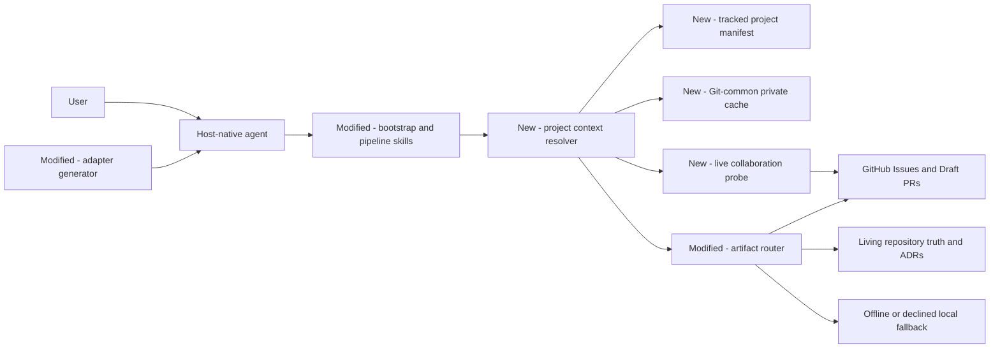
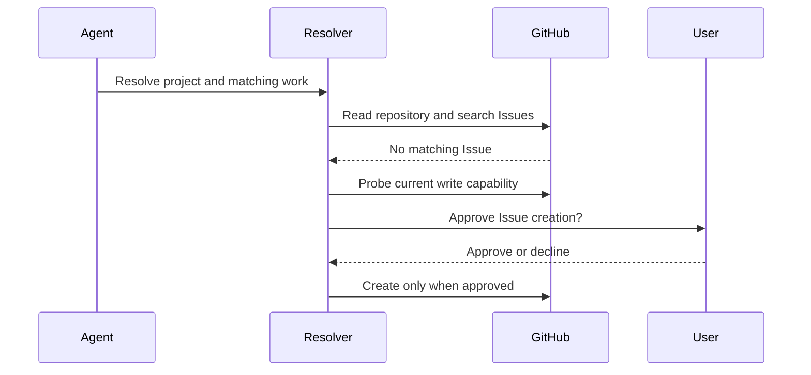
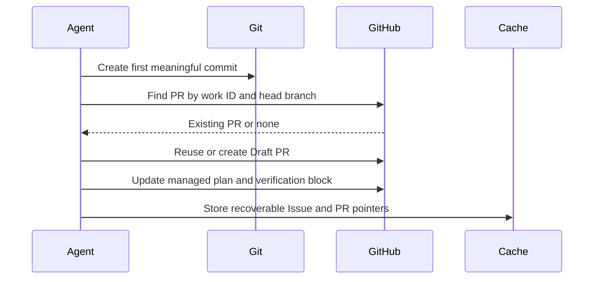
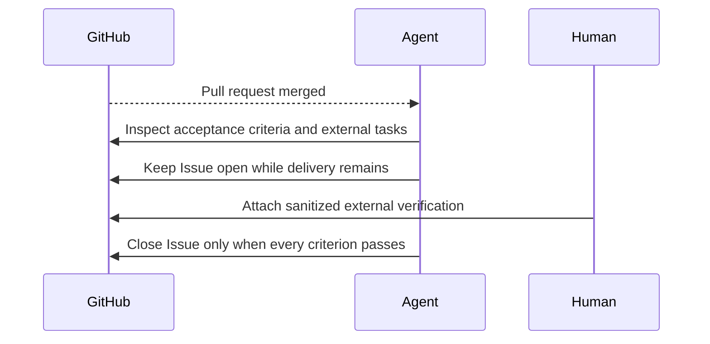

# Architecture: GitHub owns coordination while two storage tiers preserve project context

> **Date:** 2026-08-22
> **Requirements evidence:** [GitHub issue #62](https://github.com/knotmark-ai/devmuse/issues/62)
> **Stance:** create

DevMuse will coordinate active work in GitHub whenever live capability and user
authorization permit it, while a tracked manifest preserves stable project
facts and a Git-common cache preserves only recoverable worktree hints. This
design covers collaboration, project identity, fallback, and delivery
completion; it does not redesign the PRD and architecture document sets owned
by #63.

## Requirements Reference

- Requirements evidence: [GitHub issue #62](https://github.com/knotmark-ai/devmuse/issues/62), including the approved Option A and the subsequent section approvals
- Covers: UC-G1 through UC-G10 and UC-GR1 through UC-GR3
- Related behavior: [issue #40](https://github.com/knotmark-ai/devmuse/issues/40) for scope-to-architecture revision loops
- Domain facts: [Project context and Delivery lifecycle](../../CONTEXT.md#project-context) in `CONTEXT.md`

The Issue is equivalent architectural scope evidence: it carries the goal,
artifact-routing table, exhaustive use cases, reverse cases, affected surfaces,
and acceptance criteria. Quick Probe found changes across bootstrap, core
pipeline skills, the Claude session hook, generated adapters, Git/GitHub
boundaries, and multi-worktree state, so the architectural path applies.

## Alternatives Considered

| Which approach? | What does it make easy? | What does it make hard? | How would it fail? | Verdict |
|---|---|---|---|---|
| **A: Tracked manifest, Git-common cache, and GitHub coordination** | Durable team facts, worktree sharing, fresh-clone recovery, and visible delivery state | Requires explicit authority and reconciliation rules | Fails if cache hints become authority, secrets enter either store, or a host-only hook becomes required | **Selected** |
| B: Put all state in `.devmuse/project.yaml` | One discoverable file | Branch churn, merge conflicts, stale permissions, and disclosure of local session state | Breaks as soon as two worktrees update Issue or PR state independently | Rejected |
| C: Put all state under the Git common directory | Private, worktree-shared updates | Fresh clones, separate clones, non-Git projects, and team discovery | Breaks when the cache is absent or when two clones need the same canonical paths | Rejected |

The approved decision is recorded in
[ADR-0002](../adr/0002-github-first-project-context.md).

## C4 Positioning

DevMuse is a plugin with host-specific adapters. The change crosses the host,
Git repository, and GitHub boundaries and adds one internal resolver protocol.
No `docs/wiki/_index.md` was found in this round, so the surrounding system is
cited from [the current architecture document](../architecture.md) rather than
redrawn here.



### Component responsibilities

| Which component? | What does it own? | What must it not own? |
|---|---|---|
| Project context contract | Source precedence, schema, identity, capability, conflict, and fallback decisions | Host-specific tool syntax or credentials |
| Tracked manifest | Stable identity, collaboration preference, and canonical artifact paths | Issue, PR, session, authentication, or worktree progress |
| Git-common cache | Recoverable capability probes, worktree coordination pointers, and interrupted-run hints | Durable project truth or write authorization |
| Live collaboration probe | Current repository identity and read/write capability with a reason | Persisted credentials or assumed consent |
| Artifact router | Selection among Issue, Draft PR, living documents, ADRs, and local fallback | Duplicated content across those homes |
| Claude SessionStart hook | Safe, read-only preloading of resolved facts when available | The only resolver implementation or authority |
| Adapter generator | Self-contained vendoring of the canonical contract into generated skills | Independent Codex or portable semantics |

## Functional Design

### Project manifest

The tracked manifest is `.devmuse/project.yaml`. It uses a deliberately narrow,
versioned mapping so hosts can reject unsupported YAML features rather than
interpret tags, aliases, executable values, or arbitrary objects.

```yaml
schema_version: 1

project:
  id: "github:R_kgDOExample"
  repository: "github.com/knotmark-ai/devmuse"

collaboration:
  provider: github
  mode: github-first

artifacts:
  prd: null
  architecture:
    index: docs/architecture.md
    domain_model: CONTEXT.md
```

`collaboration.mode` is a remembered preference, not standing permission to
write remotely. Every remote mutation still requires current capability and
authorization from the active user request or workflow. Artifact values are
repository-relative paths; validation rejects absolute paths, `..`, control
characters, and resolution through a symbolic link outside the repository.

The manifest is created only after user approval. An unknown schema version is
read-only: the resolver reports `unsupported-schema` and never rewrites it.
The architecture members are nullable so #63 can later move the domain model
into an indexed architecture set without changing this schema.

### Project identity

Identity resolution uses this order:

1. a validated `project.id` from the manifest;
2. the immutable GitHub repository node ID from a live read probe;
3. a UUID written to a user-approved manifest for a non-GitHub project; and
4. a normalized remote host/owner/repository tuple only as a provisional
   discovery hint.

A checkout directory never becomes the project key. SSH and HTTPS remotes are
normalized to the same repository tuple. A rename or transfer keeps the
immutable provider ID. In a worktree whose branch predates the manifest, the
resolver may read the manifest blob from the default branch as a candidate but
must not write it into the current branch automatically.

The Git-common cache records the accepted project ID. If another worktree in
the same Git common directory presents a different ID, resolution returns
`identity-conflict` with both sources. It does not silently choose the newest
file or path.

### Git-common cache

The private cache lives at:

```text
<git-common-dir>/devmuse/project-context.v1.json
```

Its logical schema is:

```json
{
  "schema_version": 1,
  "revision": 3,
  "project_id": "github:R_kgDOExample",
  "capability_probe": {
    "checked_at": "2026-08-22T00:00:00Z",
    "provider": "github",
    "read": true,
    "write": false,
    "reason": "authentication-required"
  },
  "worktrees": {
    "main": {
      "branch": "main",
      "issue": 62,
      "pull_request": null,
      "pipeline_phase": "architecture",
      "updated_at": "2026-08-22T00:00:00Z"
    }
  },
  "recovery": []
}
```

The worktree key comes from Git's worktree administration record, not the
checkout path. A path may appear only as a diagnostic hint. Capability results
may accelerate discovery but never authorize a write.

Cache mutation acquires a lock in the same Git-common namespace, rereads the
current revision inside the lock, merges disjoint worktree entries, and writes
a mode-`0600` temporary file before atomic rename. A conflict in the same
worktree's Issue, PR, or project identity is retained as candidates and
returned as `needs-reconciliation`; it is never reduced by whole-file or
timestamp-only last-writer-wins. Corrupt or missing cache state degrades to
fresh discovery.

### Resolver result contract

Every host consumes the same logical result:

```text
project_id
identity_source
manifest_source
collaboration_mode
provider
repository
capability: none | read | write
active_issue
active_pr
pipeline_phase
fallback_reason
conflicts
```

The canonical knowledge contract defines those fields and decisions. Claude's
session hook may preload a safe subset. Codex and other Agent Skills hosts run
the same resolution through host-native Git, filesystem, and collaboration
tools. A missing hook, connector, or helper changes capability, not semantics.

### Issue discovery and managed scope

Matching follows this order:

1. an Issue URL or number explicitly named by the user;
2. a cached pointer after repository and open-state revalidation;
3. an Issue carrying the same `work_id`; and
4. a uniquely strong title, use-case, and affected-path match.

Several plausible candidates produce one user choice. No candidate plus live
write capability produces an offer to create an Issue; creation occurs only
after approval. Read-only, unavailable, non-GitHub, or declined publication
routes to fallback and records the reason.

DevMuse edits only a marked block and preserves all human-authored text around
it:

```markdown
<!-- devmuse:scope:start schema=1 work_id=<uuid> -->
Goal, use cases, acceptance criteria, dependencies, ownership, and external work
<!-- devmuse:scope:end -->
```

The `work_id` is created when a scope becomes durable. It lives in the Issue
marker, related PR marker, cache pointer, or fallback artifact, never in the
project manifest. Repeating discovery or publication with the same work ID is
an update, not a second Issue.

### Draft PR plan and progress

The first meaningful commit causes DevMuse to find a PR by exact repository,
work ID, and head branch, then reuse it or create a Draft PR. A meaningful
commit changes the approved work product, tests, implementation, living truth,
or ADR; an empty marker commit does not qualify.

The managed PR block owns Requirements Reference, UC-tagged implementation
tasks, current progress, verification results, living-document changes, and
links to remaining external work. Human or platform operations such as DNS,
identity, app-store, console, and secret-manager changes remain owned by the
Issue. The PR links to those tasks instead of copying their status.

`mu-plan` authors the managed plan block when GitHub is canonical; `mu-code`
updates tasks and verification; `mu-review` adds final review evidence. The
existing dated `docs/plans/` output remains the offline, non-GitHub, or declined
fallback rather than the GitHub-first default.

### Delivery lifecycle

The canonical state names and transitions live in
[`CONTEXT.md` § Delivery lifecycle](../../CONTEXT.md#delivery-lifecycle). The
technical realization keeps the Issue open through Scoped, Implementing,
Reviewing, and MergedPendingDelivery. A merged PR does not close the Issue when
external tasks, documentation, or acceptance checks remain. An unmerged closed
PR returns the work to Scoped unless another associated PR still implements
it; blocked is a reason attached to a task, not another lifecycle state.

### Issue creation sequence



### Draft PR sequence



### Post-merge delivery sequence



### Data availability summary

| Which scenario? | Where does it execute? | What must be available? | What happens when absent? |
|---|---|---|---|
| Resolve project | Current worktree | Git metadata and optional manifest | Non-Git projects use manifest UUID or session-local fallback |
| Reuse Issue | GitHub read boundary | Repository identity, Issue state, marker or matching evidence | Ambiguity is shown to the user; unavailable reads select fallback |
| Publish Issue or PR | GitHub write boundary | Live capability, current authorization, sanitized managed content | The write is not attempted; fallback reason is recorded |
| Resume in another worktree | Git common directory | Project ID and mergeable worktree entries | Missing cache causes fresh discovery; conflicts require reconciliation |
| Close delivery | GitHub Issue | Merged PR evidence plus every acceptance and external task result | Issue remains open in MergedPendingDelivery |

### Artifact routing

| What information is being stored? | Where is it authoritative? | What is the fallback? |
|---|---|---|
| Why, scope, acceptance, ownership, dependencies, human work | GitHub Issue | Dated scope artifact with an explicit fallback reason |
| PR-specific plan, progress, verification, and review | Draft PR | Dated plan plus local verification evidence |
| Current product, domain, and architecture truth | Stable repository documents | Same repository documents; GitHub is not a replacement |
| Rejected alternatives that must outlive delivery | ADR | No weaker substitute |
| Session and worktree recovery hints | Git-common private cache | Fresh discovery |

Requirements that change during architecture update the same Issue-managed
scope block and revalidate affected UC links. They do not create another dated
scope merely because time passed. Existing dated artifacts remain frozen.

## Non-Functional Design

### Reliability

Remote writes are idempotent over repository ID, work ID, object number, and
managed marker. The cache is eventually consistent with GitHub by design:
GitHub success plus cache failure remains success, and the next resolver pass
rebuilds the hint. Locking, revision checks, field-level merge, and explicit
conflicts prevent silent worktree data loss.

### Security

Manifest and cache readers accept fixed schemas and never execute stored text.
Publishers accept structured summaries rather than raw command output, scan for
secret-like values, and stop before a remote write when sanitization cannot be
proved. Tokens, OAuth caches, environment values, and private provider output
are forbidden in both stores and all managed GitHub blocks.

### Maintainability

One canonical project-context contract owns field meanings and decision tables;
bootstrap, skills, hooks, and adapters cite it. Host adapters contain binding
differences only. Generated-reference and drift checks fail when a consumer
loses the contract or carries an independently edited copy.

### Compatibility and portability

GitHub-first is capability-based rather than mandatory. Non-GitHub,
unauthenticated, read-only, declined, and no-hook hosts preserve full local
fallback. Repository identity is independent of checkout path and remote URL
syntax, while schema versions provide an explicit compatibility boundary.

### Observability

Resolver summaries expose identity source, manifest source, capability,
coordination pointers, phase, fallback reason, and conflicts without exposing
credentials or command output. Tests and session transcripts can therefore
show why a route was selected without turning diagnostic state into another
authority.

### Migration

Adoption is opt-in and prospective. DevMuse creates the manifest only after
approval, does not bulk-move or retro-edit dated artifacts, and can roll back by
stopping manifest consumption. #63 may later change canonical document paths;
the manifest schema already supports that move without coupling this design to
the document-template implementation.

## Architecture Decision Records

- [ADR-0002](../adr/0002-github-first-project-context.md) — coordinate work in GitHub while splitting stable project context from recoverable worktree hints

## Error Handling

| What fails? | What does the resolver or workflow do? | What remains authoritative? |
|---|---|---|
| Manifest missing | Discover provider and identity, then offer creation when stable facts are known | Git and live provider facts |
| Manifest has unknown schema or unsafe path | Refuse mutation, report the exact field, continue read-only discovery | Existing manifest remains untouched |
| GitHub unavailable, unauthenticated, read-only, or declined | Select local fallback and record a bounded reason | Local fallback artifact and repository truth |
| Several Issues or PRs plausibly match | Ask one choice; do not create or update until resolved | Existing GitHub objects |
| Managed marker malformed or duplicated | Refuse automatic replacement and show the conflicting ranges | Human-authored object body |
| Secret-like content reaches publication boundary | Stop the remote write and present a redacted preview | Local source and existing remote object |
| Cache missing or corrupt | Ignore it and reconstruct from manifest, Git, and GitHub | Manifest and GitHub |
| Concurrent cache entries conflict | Preserve both candidates and return `needs-reconciliation` | Manifest and GitHub |
| Issue creation succeeds but cache update fails | Report success plus recoverable cache warning | Created Issue |
| Draft PR closes without merge | Return to Scoped unless another linked PR remains active | Open Issue |
| PR merges while external delivery remains | Keep the Issue open in MergedPendingDelivery | Open Issue and merged PR evidence |

## Testing Strategy

| Which evidence? | Which requirements does it prove? |
|---|---|
| Manifest fixtures for valid schema, unknown version, unsafe path, symlink escape, and forbidden secret fields | UC-G7, UC-G8, UC-G9, UC-GR3 |
| Temporary Git repositories with two linked worktrees, SSH/HTTPS remotes, a branch missing the manifest, and identity conflicts | UC-G8, UC-G9, UC-GR3 |
| Cache fixtures for lock/revision merge, same-entry conflict, corruption recovery, mode `0600`, and atomic replacement | UC-G8, UC-G9 |
| Fake collaboration adapter for none/read/write capability and current-write re-probe | UC-G2, UC-G3, UC-G7, UC-GR1 |
| Managed-block fixtures that preserve human text and remain byte-stable on repeated update | UC-G1, UC-G2, UC-G4 |
| Matching fixtures for explicit object, valid cache, work ID, unique semantic candidate, and ambiguous candidates | UC-G1, UC-G2 |
| Delivery transition table tests for merged external work, unmerged PR closure, multiple PRs, cancellation, and final completion | UC-G4, UC-G5, UC-G6, UC-GR2 |
| Routing and skill contract tests for bootstrap, mu-scope, mu-arch, mu-plan, mu-code, and mu-review | UC-G1 through UC-G6, UC-G10, UC-GR1, UC-GR2 |
| Generated adapter and platform tests that vendor the canonical contract and preserve host-native permission boundaries | UC-G3, UC-G8, UC-G9, UC-GR1 |
| Secret fixtures that attempt token, environment, OAuth cache, and raw command-output publication | UC-G7 |
| Digests of every pre-existing dated scope, spec, and plan before and after implementation | UC-G10 |
| Live behavior scenarios for GitHub write, GitHub read-only, no GitHub, declined publication, ambiguous Issue, cross-worktree resume, and secret rejection | All happy and reverse routes |
| DevMuse dogfood from Issue #62 through Draft PR, merge, external-delivery check, and final Issue closure | End-to-end acceptance for UC-G1 through UC-G10 |

The deterministic layer extends the existing routing, hook, platform,
generated-adapter, skill, Mermaid, and release gates. Live scenarios preserve
tool-call transcripts and judge both the selected collaboration surface and
the reason; a correct final artifact reached through the wrong authority is a
regression.

## Out of Scope

- Selecting PRD and architecture profiles, templates, examples, or canonical
  document layouts; #63 owns those decisions.
- Retaining standalone `mu-model`; #63 decides how domain modeling integrates
  into PRD and architecture.
- Implementing reciprocal cross-model review or Codex subagent policy; #51 and
  #54 own those adapters.
- Automatically copying a manifest into historical branches or separate clones.
- Persisting credentials, permanent GitHub write consent, or raw external
  command output.
- Retro-editing any pre-existing dated scope, spec, or plan.

## History

| Date | Commit | Change |
|---|---|---|
| 2026-08-22 | — | Initial creation: selected GitHub-first coordination, a tracked stable manifest, a Git-common recoverable cache, repository-identity resolution, managed Issue and Draft PR blocks, and delivery completion after external verification |
