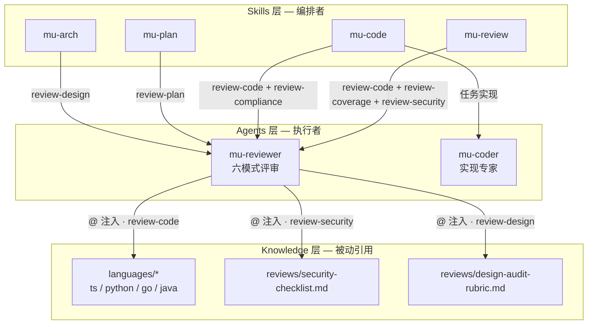

Referenced source files (7 files)

- agents/mu-reviewer.md
- agents/mu-coder.md
- docs/architecture.md
- knowledge/languages/typescript.md
- knowledge/languages/go.md
- knowledge/reviews/security-checklist.md
- knowledge/reviews/design-audit-rubric.md

# 代理系统：mu-reviewer 与 mu-coder

DevMuse 的代理层只有两个成员：**mu-reviewer**（六模式评审专家）与 **mu-coder**（实现专家）。两者均运行在 opus 模型上，由 skills 层单向派发执行，代理自身被禁止反向触发用户级工作流（agents → skills 调用在调用方向矩阵中被明确标记为 forbidden）。Sources: [agents/mu-reviewer.md:1-6](), [agents/mu-coder.md:1-6](), [docs/architecture.md:121-131]()

这一层的核心设计决策是"2 个通用代理 + 知识注入"，而非为每种语言各建一个专用代理——评审逻辑 80% 是通用的，改一处即全局生效；新增一门语言只需要新增一个 knowledge 文件。本页解释这个决策、六种评审模式的分工、防止评审幻觉的 anchor 纪律，以及各技能到代理的派发映射。Sources: [docs/architecture.md:99]()

## 设计决策：2 个通用代理 + 知识注入

架构文档将其记录为一条显式的设计决策：

> "2 generic agents + knowledge injection, not N language-specific agents. Review logic is 80% universal; change once, effective globally. Adding a new language only requires a knowledge file."

Sources: [docs/architecture.md:99]()

具体机制体现在 mu-reviewer 的 review-code 模式中：代理从 diff 中检测主要语言，再按需加载对应的语言知识文件（TypeScript/JavaScript、Python、Go、Java），将语言特定标准叠加在通用检查清单之上。Sources: [agents/mu-reviewer.md:167-173]()

语言知识文件自身也声明了这一定位——例如 TypeScript 与 Go 的文件开头都写着 "Language-specific review criteria for mu-reviewer. Supplements the universal checklist."，即它们是通用清单的**补充**而非替代。Sources: [knowledge/languages/typescript.md:1-3](), [knowledge/languages/go.md:1-3]()

知识注入通过插件内的 `@` 相对路径实现（knowledge/ 目录不被插件机制自动发现，只能被动引用）；knowledge 层是纯被动的，只被引用、从不调用任何东西。Sources: [docs/architecture.md:36-66](), [docs/architecture.md:134]()

被注入的知识文件承载的是具体、可操作的评审标准，而非泛泛原则。以 TypeScript 文件为例：类型安全一节要求避免 `any`（"Every `any` is a suppressed bug"，应改用 `unknown` + 类型守卫或泛型），并禁用 `as` 类型断言与非空断言 `!`；异步模式一节则点名 floating promises——每个异步调用必须被 `await`、被 return 或显式 `void`，并发操作应使用 `Promise.all()` / `Promise.allSettled()` 而非循环内顺序 `await`。Sources: [knowledge/languages/typescript.md:7-12](), [knowledge/languages/typescript.md:23-25]()

评审类知识文件同样体现这一"标准外置"思路：design-audit-rubric 按设计模板结构组织评审维度，并对评审者本身施加输出约束——每节最多 8 条 issue（"prioritize, don't enumerate exhaustively"）；security-checklist 的第五阶段专查 CI/CD 管线，覆盖未按 SHA 固定的 GitHub Actions（`@main` vs `@sha`）、经 `${{ github.event.* }}` 的脚本注入、以及 checkout PR 代码的 `pull_request_target` 三类具体隐患。Sources: [knowledge/reviews/design-audit-rubric.md:3-9](), [knowledge/reviews/security-checklist.md:25-28]()

## 派发映射：谁派发谁

skills → agents 是单向派发：技能负责编排，代理负责执行。四个技能会派发代理，其余技能不派发任何代理。Sources: [docs/architecture.md:83-90](), [docs/architecture.md:130]()

| 技能 | 派发的代理（模式） |
|------|-------------------|
| mu-arch | mu-reviewer（review-design） |
| mu-plan | mu-reviewer（review-plan） |
| mu-code | mu-coder；mu-reviewer（review-code + review-compliance） |
| mu-review | mu-reviewer（review-code + review-coverage + review-security） |

Sources: [docs/architecture.md:83-90]()

Sources: [docs/architecture.md:83-90](), [agents/mu-reviewer.md:100](), [agents/mu-reviewer.md:167-173](), [agents/mu-reviewer.md:329]()

## mu-reviewer：六种评审模式

mu-reviewer 是单一代理，按派发指令选择评审模式，覆盖设计文档、实现计划、代码质量、规格合规、需求覆盖、安全六种场景。Sources: [agents/mu-reviewer.md:1-10]()

### 模式 × 派发方 × 注入的知识

| 模式 | 评审对象 | 派发方 | 注入的知识文件 |
|------|---------|--------|---------------|
| review-design | 设计文档是否完整、一致、可进入计划阶段 | mu-arch | reviews/design-audit-rubric.md |
| review-plan | 计划是否完整、忠于 spec、工程师可执行 | mu-plan | 无 |
| review-code | 代码变更的生产就绪度 | mu-code、mu-review | languages/typescript.md、python.md、go.md、java.md（按 diff 语言检测加载） |
| review-compliance | 实现是否与规格一致（不多不少） | mu-code | 无 |
| review-coverage | 每个用例是否有对应实现与测试 | mu-review | 无 |
| review-security | 安全漏洞（diff 含安全敏感模式时条件触发） | mu-review | reviews/security-checklist.md |

Sources: [agents/mu-reviewer.md:84-100](), [agents/mu-reviewer.md:118-123](), [agents/mu-reviewer.md:163-173](), [agents/mu-reviewer.md:259-264](), [agents/mu-reviewer.md:289-296](), [agents/mu-reviewer.md:325-329](), [docs/architecture.md:83-90]()

### 输入校验：先验证，后评审

任何模式启动前必须先校验必需输入；模式未知或输入缺失时立即停止并返回固定格式的错误信息，明确禁止即兴编造检查清单或伪造内容（"DO NOT improvise a checklist"、"DO NOT fabricate content"）。Sources: [agents/mu-reviewer.md:12-32]()

| 模式 | 必需输入 | 校验方式 |
|------|---------|---------|
| review-code | BASE_SHA、HEAD_SHA | `git rev-parse {SHA}` 逐一验证 |
| review-design | SPEC_FILE_PATH | Read 工具确认文件存在 |
| review-plan | PLAN_FILE_PATH、SPEC_FILE_PATH | Read 工具确认两个文件都存在 |
| review-compliance | REQUIREMENTS、IMPLEMENTER_REPORT（文本） | 均非空 |
| review-coverage | SCOPE_FILE_PATH、BASE_SHA、HEAD_SHA | Read 确认文件 + `git rev-parse` 验证 SHA |

Sources: [agents/mu-reviewer.md:16-22]()

### 各模式的关键约束

- **review-code**：若 diff 为空直接返回 "No changes in range"；检查清单按严重度分层——安全（CRITICAL）、代码质量与测试与需求（HIGH）、架构与生产就绪（MEDIUM）。Sources: [agents/mu-reviewer.md:198-233]()
- **review-compliance**：核心指令是 "**Do not trust the report**"——不采信实现者报告的任何声明，必须读实际代码，逐行对照需求，查漏（声称实现但没做）也查多（做了但没提）。Sources: [agents/mu-reviewer.md:267-283]()
- **review-coverage**：从 scope 文件提取所有 UC-ID，扫描 diff 范围内测试文件中的 `// Covers: UC-xxx` 注释，再从测试追溯其调用的生产代码，产出覆盖矩阵闭合可追溯性回路；若测试只触发 mock 而未经过真实生产代码路径，标记为 `⚠️ Test only`。Sources: [agents/mu-reviewer.md:289-323]()
- **review-security**：按 security-checklist 的五阶段执行——架构心智模型、攻击面普查、diff 中的密钥考古、依赖供应链、CI/CD 管线检查；CRITICAL 与 HIGH 必须在合并前修复，MEDIUM/LOW 为建议性。Sources: [agents/mu-reviewer.md:325-342](), [knowledge/reviews/security-checklist.md:1-34]()
- **review-design**：架构严谨性一项引用设计审计量表（design-audit-rubric），量表按设计模板结构组织——C4 定位、功能设计、非功能设计、ADR、错误处理、可测试性，每个维度 0-10 打分，低于 7 分需说明如何达到 10 分。Sources: [agents/mu-reviewer.md:100](), [knowledge/reviews/design-audit-rubric.md:1-38]()

## Anchor 纪律：反幻觉的结构化门禁

对 `review-design`、`review-plan`、`review-coverage` 三种文档评审模式，anchor 纪律是**结构化输出要求，而非软性指南**。Sources: [agents/mu-reviewer.md:34-36]()

两步机制：

1. **Step A — 先输出 Anchor 列表**：输出的第一节必须是 `## Anchors Extracted`，穷举列出后续将引用的每个标识符（UC-ID、任务编号、组件/文件名），带文件路径、行号和逐字引用的原文片段。若文件内容与预期不符导致无法提取，直接停止并报告 "Anchor extraction failed"。Sources: [agents/mu-reviewer.md:38-62]()
2. **Step B — 每条发现必须落锚**：每条 issue 必须引用 anchor 列表中**逐字出现**的标识符，并从源文档复制粘贴 1-3 行原文（不允许转述），附文件路径与行号。**引用了 anchor 列表之外标识符的发现即为幻觉，输出前必须删除**。Sources: [agents/mu-reviewer.md:64-70]()

文件中列举的反面模式包括：编造 UC-ID、编造类名、编造任务编号、用转述替代原文引用、以及"按典型项目的模式做模式匹配"而无逐字锚点。存在这套纪律的原因被明确写入文档：评审者的职责是验证文档里**实际有什么**，而不是"这类文档通常该有什么"——Sonnet 级模型容易用训练数据中似是而非的模式替换真实内容，Anchors Extracted 就是拦截这种错误的结构化门禁。Sources: [agents/mu-reviewer.md:72-82]()

在所有模式通用的执行纪律层面，同样的原则再次收紧：绝不对未用 Read 工具读过的文件产出发现，绝不伪造文件路径、行号或代码片段；文件不存在、不可读或已在 diff 中删除时如实报告并跳过；每次评审末尾必须附 Coverage 小节，列出范围内文件数、已评审文件、未评审文件及原因。Sources: [agents/mu-reviewer.md:361-381]()

## mu-coder：实现专家

mu-coder 按任务规格实现功能，仅由 mu-code 技能派发。工作流为：读任务（不清楚就先提问）→ 按规格实现（要求 TDD 则走 TDD）→ 验证 → 自审 → 提交并回报。Sources: [agents/mu-coder.md:1-19](), [docs/architecture.md:97]()

三项关键纪律：

- **可追溯性**：任务带 `Covers: UC-xxx` 字段时，在测试的 describe/test 块前加 `// Covers: UC-xxx` 注释，并在测试名中自然融入用例描述——这正是 review-coverage 模式扫描的锚点。Sources: [agents/mu-coder.md:30-49](), [agents/mu-reviewer.md:299-302]()
- **主动升级**："说这对我太难了永远是可以的。坏的产出比没有产出更糟"（"Bad work is worse than no work"）。遇到需要架构决策、无法获得足够上下文、或对方案正确性没把握时，以 BLOCKED 或 NEEDS_CONTEXT 状态回报，说明卡点、已尝试的方法和需要的帮助。Sources: [agents/mu-coder.md:51-62]()
- **回报前自审**：从完整性、质量、克制（YAGNI）、测试有效性四个维度复查；报告状态为 DONE / DONE_WITH_CONCERNS / BLOCKED / NEEDS_CONTEXT 四态，完成但对正确性有疑虑用 DONE_WITH_CONCERNS——**绝不静默交付没把握的工作**。Sources: [agents/mu-coder.md:64-86]()

## 两个代理的对照

| 维度 | mu-reviewer | mu-coder |
|------|------------|----------|
| 角色 | 六模式评审专家 | 实现专家 |
| 工具 | Read、Grep、Glob、Bash（只读为主） | Read、Edit、Write、Bash、Grep、Glob（可写） |
| 模型 | opus | opus |
| 派发方 | mu-arch、mu-plan、mu-code、mu-review | mu-code |
| 反幻觉机制 | anchor 纪律 + 输入校验 + Coverage 追踪 | 四态报告 + 主动升级 + 自审 |

Sources: [agents/mu-reviewer.md:1-6](), [agents/mu-coder.md:1-6](), [docs/architecture.md:93-97]()

---

See also: [实现与评审](implementation-and-review.md) · [核心管线](core-pipeline.md)
