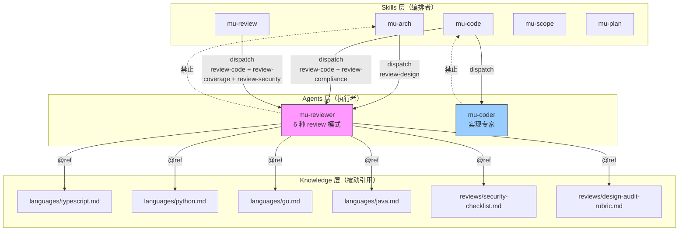
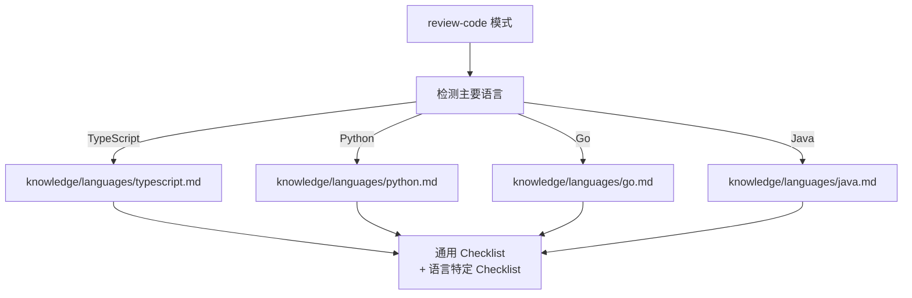

Source files referenced

- agents/mu-reviewer.md
- agents/mu-coder.md
- docs/architecture.md
- knowledge/languages/typescript.md
- knowledge/languages/python.md

# 代理系统

DevMuse 的代理层采用 **2 个通用代理 + knowledge 注入** 的设计，而非为每种语言或场景创建专用代理。核心理念是：review 逻辑 80% 是通用的，只需维护一处即可全局生效；新增语言支持时只需添加一个 knowledge 文件，无需新增代理。

代理由 skills 层单向派遣执行具体工作，代理本身**不可反向触发用户级工作流**（即 agents -> skills 调用被明确禁止）。这一约束确保了架构的依赖方向严格向下，避免循环调用。Sources: [docs/architecture.md:179-185]()

## 架构总览

Sources: [docs/architecture.md:85-95](), [docs/architecture.md:122-128]()

## 代理清单

| 代理名称 | 角色 | Model | Tools | 派遣来源 |
|---------|------|-------|-------|---------|
| mu-reviewer | 六模式 review 专家 | opus | Read, Grep, Glob, Bash | mu-scope, mu-arch, mu-plan, mu-code, mu-review |
| mu-coder | 实现专家 | opus | Read, Edit, Write, Bash, Grep, Glob | mu-code |

Sources: [agents/mu-reviewer.md:1-6](), [agents/mu-coder.md:1-6](), [docs/architecture.md:122-128]()

## mu-reviewer：六模式 Review 专家

mu-reviewer 是一个多模态 review 代理，根据 skill 派遣时携带的 mode 指令选择对应的 review 行为。支持以下六种模式：

| 模式 | 用途 | 必需输入 | 典型派遣者 |
|------|------|---------|-----------|
| review-design | 设计文档评审 | SPEC_FILE_PATH | mu-arch |
| review-plan | 实现计划评审 | PLAN_FILE_PATH, SPEC_FILE_PATH | mu-plan |
| review-code | 代码质量评审 | BASE_SHA, HEAD_SHA | mu-code, mu-review |
| review-compliance | 规格符合性评审 | REQUIREMENTS, IMPLEMENTER_REPORT | mu-code |
| review-coverage | 需求覆盖度评审 | SCOPE_FILE_PATH, BASE_SHA, HEAD_SHA | mu-review |
| review-security | 安全评审 | (diff context) | mu-review |

Sources: [agents/mu-reviewer.md:14-26]()

### Anchor Discipline 机制

mu-reviewer 在 document-review 模式（review-design、review-plan、review-coverage）中实施一种名为 **Anchor Discipline** 的结构化约束，用于防止 hallucination：

1. **Step A** — 在输出任何 finding 之前，必须先生成 `## Anchors Extracted` 段落，列出所有将被引用的 identifier（UC-ID、Task、Component），附带 file path 和 line number
2. **Step B** — 每条 finding 必须引用 Anchor List 中存在的标识符，并附上源文档的逐字引用

这一机制的设计目的是：reviewer 的工作是验证文档中**实际存在的内容**，而非基于训练数据推断"典型文档通常包含什么"。Sources: [agents/mu-reviewer.md:34-83]()

### 语言特定知识注入

review-code 模式会根据 diff 中检测到的主要语言，动态加载对应的 knowledge 文件作为补充 checklist：

Sources: [agents/mu-reviewer.md:167-170]()

### review-code 通用 Checklist

| 类别 | 优先级 | 关注点 |
|------|--------|-------|
| Security | CRITICAL | 硬编码凭证、SQL 注入、XSS、CSRF |
| Code Quality | HIGH | 关注点分离、错误处理、类型安全 |
| Testing | HIGH | 测试真实逻辑而非 mock 行为、边界用例 |
| Requirements | HIGH | 所有需求已实现、无 scope creep |
| Architecture | MEDIUM | 设计决策合理性、可扩展性 |
| Production Readiness | MEDIUM | 迁移策略、向后兼容性 |

Sources: [agents/mu-reviewer.md:204-232]()

## mu-coder：实现专家

mu-coder 是一个专注于代码实现的代理，由 mu-code skill 派遣。其工作流程：

1. 阅读 task specification，不清楚时**主动提问**
2. 按规格实现（支持 TDD 流程）
3. 验证实现可用性
4. 自我 review
5. 提交并回报

Sources: [agents/mu-coder.md:12-19]()

### 自我 review 与 escalation 机制

mu-coder 内置了两个质量保障机制：

**Self-Review（完成前）：** 检查完整性、代码质量、YAGNI 原则、测试质量。Sources: [agents/mu-coder.md:65-73]()

**Escalation（遇困时）：** 当遇到需要架构决策、代码理解受阻、方案不确定等情况时，mu-coder 会主动停止并上报 BLOCKED 或 NEEDS_CONTEXT 状态，而非静默产出低质量代码。Sources: [agents/mu-coder.md:53-62]()

### 报告状态

| 状态 | 含义 |
|------|------|
| DONE | 完成，无问题 |
| DONE_WITH_CONCERNS | 完成，但对正确性有疑虑 |
| BLOCKED | 无法完成 |
| NEEDS_CONTEXT | 需要更多信息 |

Sources: [agents/mu-coder.md:77-86]()

## Knowledge 注入机制

Knowledge 层是纯被动的引用材料，通过 `@` 相对路径在 plugin 内跨目录引用。这种设计使得同一个 mu-reviewer 代理能够服务于不同的技术栈，而无需为每种语言维护独立的 review 代理。

Sources: [docs/architecture.md:57-65]()

### 语言知识文件对比

| 维度 | TypeScript | Python |
|------|-----------|--------|
| 类型安全 | 避免 `any`，用 `unknown` + type guards；strict mode | 公共 API 必须 type hints；用 `Protocol` 替代 ABC |
| 错误处理 | throw typed errors；Promise 链必须 `.catch()` | 捕获具体异常；使用 `raise ... from e` 保留链 |
| Async | 避免 floating promises；用 `Promise.all()` | 不混用 sync/async；async 中禁止 blocking 调用 |
| 安全 | Zod/Valibot 做边界校验；防 prototype pollution | 禁止 `eval()`；`subprocess` 禁用 `shell=True` |
| 测试 | Mock 边界不 mock 内部；用 `vi.mocked()` | pytest 惯用法；`@patch("module.where_used.thing")` |

Sources: [knowledge/languages/typescript.md:1-54](), [knowledge/languages/python.md:1-60]()

## 设计决策

**为什么是 2 个通用代理而非 N 个专用代理？**

> Review logic is 80% universal; change once, effective globally. Adding a new language only requires a knowledge file.

这一决策记录在架构文档中。实际效果是：扩展语言支持只需在 `knowledge/languages/` 下新增一个 `.md` 文件（如未来可能的 `frameworks/` 子目录），mu-reviewer 的 review-code 模式会自动按语言加载对应 checklist。Sources: [docs/architecture.md:128](), [docs/architecture.md:164]()
