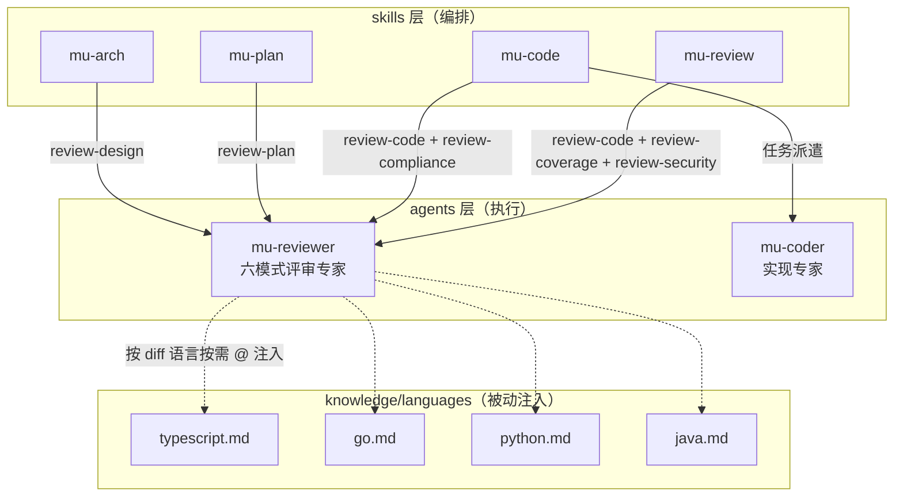
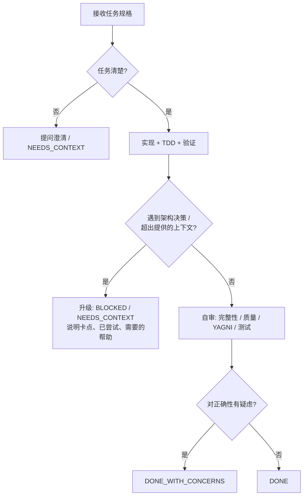

Referenced source files (7 files)

- agents/mu-reviewer.md
- agents/mu-coder.md
- docs/architecture.md
- knowledge/languages/typescript.md
- knowledge/languages/go.md
- knowledge/languages/python.md
- knowledge/languages/java.md

# 代理系统：mu-reviewer 与 mu-coder

DevMuse 的 agents 层只有两个成员：**mu-reviewer**（六模式评审专家）与 **mu-coder**（实现专家）。两者都运行在 opus 模型上，由 skills 层派遣执行具体工作；架构上的关键约束是 **skills → agents 单向派遣**——skills 编排、agents 执行，agents 反向调用 skills 在调用方向矩阵中被明确标记为 forbidden。Sources: [agents/mu-reviewer.md:1-6](), [agents/mu-coder.md:1-6](), [docs/architecture.md:119-134]()

支撑这一层的核心设计决策是"**2 个通用代理 + 知识注入**，而非 N 个语言专用代理"：评审逻辑 80% 是通用的，改一处全局生效；新增一门语言只需新增一个 knowledge 文件。本页解释派遣模型、mu-reviewer 的六种模式与锚点验证纪律、mu-coder 的实现工作流与四状态汇报，以及 TS/Go/Python/Java 四个语言知识文件如何按需注入实现技术栈无关。Sources: [docs/architecture.md:99]()

## 派遣模型：skills → agents 单向约束

四个管线技能向两个代理派遣工作，mu-reviewer 的评审模式由派遣方在指令中指定；review-code 模式再按 diff 中检测到的主要语言，经 `@` 相对路径按需注入语言知识文件。Sources: [docs/architecture.md:83-90](), [agents/mu-reviewer.md:167-173]()

完整的派遣映射（此表的 canonical home 即 `docs/architecture.md`）：

| Skill | 派遣目标 |
|-------|---------|
| mu-arch | mu-reviewer（review-design） |
| mu-plan | mu-reviewer（review-plan） |
| mu-code | mu-coder；mu-reviewer（review-code + review-compliance） |
| mu-review | mu-reviewer（review-code + review-coverage + review-security） |

其余技能不派遣任何代理。方向性约束来自调用方向矩阵：skills → agents 是 dispatch，agents → skills 是 **✗ forbidden**（代理不触发用户级工作流）；knowledge 层完全被动，只被 `@` 引用、从不调用任何东西。依赖方向严格向下，无向上回调。Sources: [docs/architecture.md:83-90](), [docs/architecture.md:119-147]()

## mu-reviewer：六模式评审专家

mu-reviewer 评审设计文档、代码变更与规格符合性，根据派遣指令选择评审模式。工具为 Read、Grep、Glob、Bash（以只读为主），模型为 opus。Sources: [agents/mu-reviewer.md:1-10]()

### 六模式与 Anchor Validation

任何模式开工前必须先验证输入（Anchor Validation）。若派遣的模式不在六种支持范围内，代理必须原样返回 "Unknown mode" 并停止，**不得即兴发挥检查清单**；任何必需输入缺失或无效同样立即停止，不得编造内容。Sources: [agents/mu-reviewer.md:12-32]()

| 模式 | 职责 | 必需输入 | 验证方式 |
|------|------|---------|---------|
| review-design | 设计文档完整性/一致性/UC 覆盖/架构严谨度 | SPEC_FILE_PATH | Read 验证文件存在 |
| review-plan | 计划完整性、规格对齐、任务可执行性 | PLAN_FILE_PATH, SPEC_FILE_PATH | Read 验证两个文件存在 |
| review-code | 代码生产就绪度（安全/质量/测试/需求/架构） | BASE_SHA, HEAD_SHA | `git rev-parse` 验证 SHA 存在 |
| review-compliance | 实现是否恰好匹配规格（不多不少） | REQUIREMENTS, IMPLEMENTER_REPORT（文本） | 两者非空 |
| review-coverage | 每个 UC 均有实现与测试的追溯矩阵 | SCOPE_FILE_PATH, BASE_SHA, HEAD_SHA | Read + `git rev-parse` |
| review-security | 安全漏洞评审（diff 含安全敏感模式时条件触发） | —（不在输入验证表中） | 按 security-checklist 五阶段流程 |

Sources: [agents/mu-reviewer.md:16-22](), [agents/mu-reviewer.md:84-100](), [agents/mu-reviewer.md:118-141](), [agents/mu-reviewer.md:259-284](), [agents/mu-reviewer.md:289-304](), [agents/mu-reviewer.md:325-343]()

几个模式各有特点：review-compliance 的核心指令是 **"Do not trust the report"**——不信实现者的报告，逐行对照真实代码验证有无遗漏和多余；review-coverage 从 scope 文件提取全部 UC-ID，扫描测试中的 `// Covers: UC-xxx` 注释，再从测试反向追踪其调用的生产代码生成覆盖矩阵（仅走 mock 不触真实代码路径的标记为 `⚠️ Test only`）；review-design 与 review-plan 均带 Calibration 约束——只标记会造成真实问题的缺陷，措辞和风格偏好不算 issue。Sources: [agents/mu-reviewer.md:265-283](), [agents/mu-reviewer.md:297-323](), [agents/mu-reviewer.md:102](), [agents/mu-reviewer.md:142]()

### Anchor Discipline：结构化反幻觉门禁

对 review-design、review-plan、review-coverage 三个文档评审模式，Anchor Discipline 是**结构化输出要求而非软性指导**：

- **Step A**：输出的第一节必须是 `## Anchors Extracted`，穷举列出后续将引用的每个标识符（UC-ID、任务号、组件/文件名），附文件路径、行号和逐字引文；若锚点提取与文件实际内容对不上，直接停止。Sources: [agents/mu-reviewer.md:34-62]()
- **Step B**：每条 finding 必须引用锚点列表中**逐字存在**的标识符，并粘贴 1-3 行源文档原文（复制而非转述）；引用了锚点列表外标识符的 finding 即幻觉，输出前必须删除。Sources: [agents/mu-reviewer.md:64-70]()

文档列举的反面模式：编造 UC-ID、编造类名、编造任务编号、用转述替代原文、按"典型项目通常长什么样"做模式匹配。存在此纪律的原因被写进文件本身：评审者的职责是验证文档里**实际有什么**，而 Sonnet 级模型容易用训练数据里似是而非的模式替换真实内容，Anchors Extracted 是拦截这类错误的结构化门禁。Sources: [agents/mu-reviewer.md:72-82]()

所有模式还受统一的 Execution Discipline 约束：绝不对未 Read 过的文件产出 finding，绝不伪造路径/行号/代码片段，文件不存在或不可读时如实报告并跳过；每次评审末尾必须附 Coverage 小节，列出已评审与未评审文件及原因。通用原则包括只报告置信度 >80% 的问题、合并同类发现、不评论未变更代码（CRITICAL 安全问题除外）。Sources: [agents/mu-reviewer.md:361-390]()

## 语言知识注入：技术栈无关的实现方式

review-code 模式从 diff 检测主要语言，加载对应 knowledge 文件，将语言特定标准叠加在通用检查清单之上——四个文件开头均自我声明 "Supplements the universal checklist"（补充而非替代）。architecture.md 的 knowledge 表将 languages/ 的消费方登记为 mu-reviewer（review-code）。Sources: [agents/mu-reviewer.md:163-173](), [docs/architecture.md:101-105](), [knowledge/languages/typescript.md:1-3](), [knowledge/languages/go.md:1-3](), [knowledge/languages/python.md:1-3](), [knowledge/languages/java.md:1-3]()

| 语言文件 | 代表性标准（各举两例） |
|---------|----------------------|
| typescript.md | 禁 `any`（"Every `any` is a suppressed bug"，用 `unknown` + type guard）；杜绝 floating promises——每个异步调用必须 `await`、return 或显式 `void` |
| go.md | 检查每个 error（`val, _ := fn()` 丢弃错误即 bug）；goroutine 必须有明确关闭路径，用 `context.Context` 取消，`-race` 零容忍 |
| python.md | 可变默认参数（`def f(items=[])` 跨调用共享）；`except Exception` 过宽、bare `except:` 禁用 |
| java.md | 虚拟线程（21+）内勿用 `synchronized`（pin carrier）；金额必须 `BigDecimal`，禁 `float`/`double` |

Sources: [knowledge/languages/typescript.md:7-25](), [knowledge/languages/go.md:5-25](), [knowledge/languages/python.md:16-38](), [knowledge/languages/java.md:26-46]()

这正是"技术栈无关"的落地机制：代理本体不含任何语言特定内容，新增一门语言只需在 knowledge/languages/ 下加一个文件，无需改动代理。Sources: [docs/architecture.md:99]()

## mu-coder：实现专家

mu-coder 按任务规格实现功能，仅由 mu-code 技能派遣；与 mu-reviewer 不同，它持有写工具（Read、Edit、Write、Bash、Grep、Glob）。Sources: [agents/mu-coder.md:1-6](), [docs/architecture.md:97]()

### 工作流：提问 → TDD 实现 → 自审 → 汇报

工作流五步：读任务描述（**任何不清楚之处现在就提问**）→ 严格按规格实现（任务要求 TDD 则走 TDD）→ 验证 → 自审 → 提交并回报。工作过程中遇到意外或不明之处随时可以暂停澄清——不猜、不做假设。Sources: [agents/mu-coder.md:12-20]()

代码组织纪律：遵循计划定义的文件结构，每个文件一个清晰职责；若正在创建的文件超出计划意图地膨胀，停下来报 DONE_WITH_CONCERNS，不自作主张拆文件；在既有代码库中遵循既有模式，不重构任务范围外的东西。测试可追溯性：任务带 `Covers: UC-xxx` 字段时，在 describe/test 块前加 `// Covers: UC-xxx` 注释——这正是 review-coverage 模式扫描的锚点。Sources: [agents/mu-coder.md:22-49](), [agents/mu-reviewer.md:299-302]()

汇报前自审覆盖四个维度：完整性（规格与边界情形是否全部实现）、质量（命名与可维护性）、克制（YAGNI，只做被要求的）、测试有效性（验证行为而非 mock 行为）；自审发现问题就地修复后再汇报。Sources: [agents/mu-coder.md:64-73]()

### 四状态汇报与主动升级

升级纪律的原文表述是 "It is always OK to stop and say 'this is too hard for me.' **Bad work is worse than no work.**"——需要架构决策、无法获得足够上下文、对方案正确性没把握、或在反复读文件仍无进展时，都应停止并升级。汇报采用固定四状态：**DONE | DONE_WITH_CONCERNS | BLOCKED | NEEDS_CONTEXT**，附实现内容、测试结果、变更文件、自审发现与顾虑；底线是 "Never silently produce work you're unsure about"。Sources: [agents/mu-coder.md:51-62](), [agents/mu-coder.md:75-86]()

## 两代理对照

| 维度 | mu-reviewer | mu-coder |
|------|------------|----------|
| 角色 | 六模式评审专家 | 实现专家 |
| 工具 | Read、Grep、Glob、Bash（只读为主） | Read、Edit、Write、Bash、Grep、Glob（可写） |
| 模型 | opus | opus |
| 派遣方 | mu-arch、mu-plan、mu-code、mu-review | mu-code |
| 知识注入 | languages/（review-code）、reviews/（design/security） | —（任务规格自带上下文） |
| 反失效机制 | Anchor Validation + Anchor Discipline + Coverage 追踪 | 提问优先 + 主动升级 + 自审 + 四状态汇报 |

Sources: [agents/mu-reviewer.md:1-6](), [agents/mu-coder.md:1-6](), [docs/architecture.md:93-109]()

---

See also: [计划与实现](plan-implement.md) · [评审与验证](review-verify.md) · [四层架构](four-layer-arch.md)
