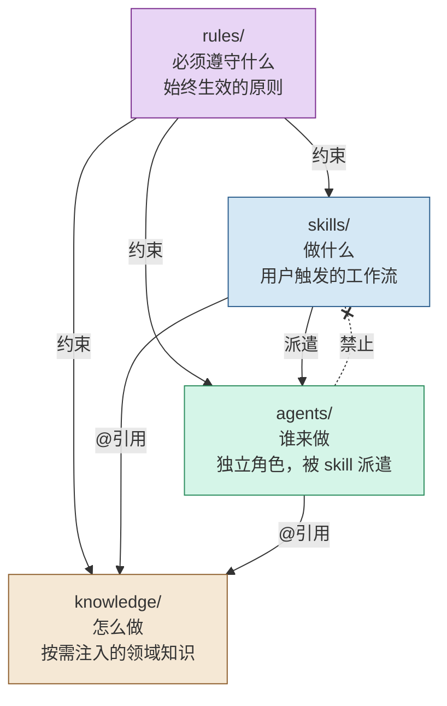
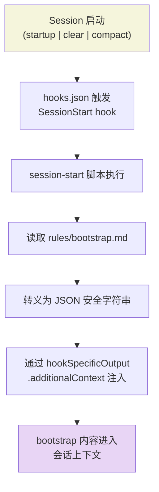
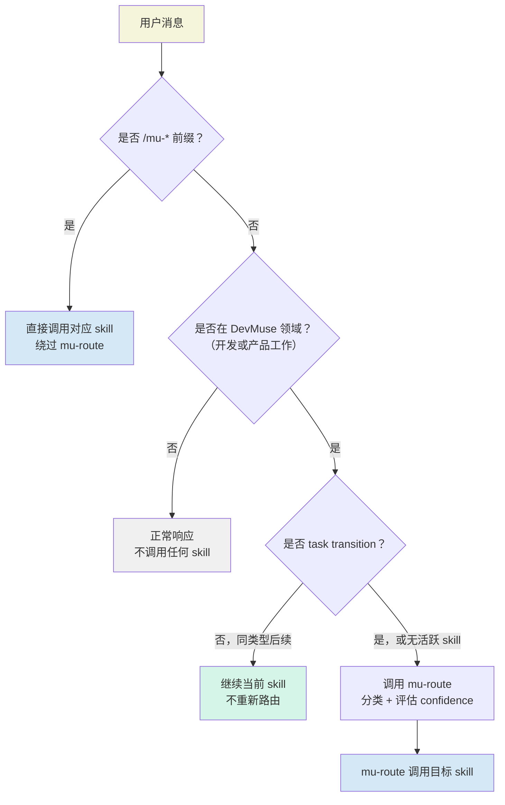

<details>
<summary>Source files referenced</summary>

- `docs/architecture.md`
- `docs/architecture_cn.md`
- `rules/bootstrap.md`
- `hooks/hooks.json`
- `hooks/session-start`
- `.claude-plugin/plugin.json`

</details>

# 四层架构设计

DevMuse 的核心架构由 **rules（规则层）、skills（技能层）、agents（代理层）、knowledge（知识层）** 四层组成。每一层回答一个根本问题：必须遵守什么、做什么、谁来做、怎么做。四层通过插件安装（`claude plugin add`）统一生效，无需手动配置，但各层的发现和加载机制各不相同。

这一设计的核心约束是 **依赖严格向下**：rules 约束所有层，skills 编排并派遣 agents，agents 执行但不反向触发 skills，knowledge 纯被动只被引用。这种单向依赖保证了系统的可预测性和可维护性。

## 四层总览



Sources: [docs/architecture_cn.md:1-11](docs/architecture_cn.md), [docs/architecture.md:3-11](docs/architecture.md)

## 分层判断标准

当新增功能或内容时，根据以下决策表确定它应归属哪一层：

| 判断问题 | 答案 | 归属层 |
|---------|------|--------|
| 每个会话都要生效，不需要用户触发？ | 是 | `rules/` |
| 用户主动 `/xxx` 启动？ | 是 | `skills/` |
| 独立角色，需要上下文隔离执行？ | 是 | `agents/` |
| 参考资料，被 agent/skill 按需读取？ | 是 | `knowledge/` |

### knowledge 的细化判断

| 情况 | 放置位置 | 理由 |
|------|---------|------|
| 只被一个 skill 使用 | 留在 skill 目录内 | 局部性优先 |
| 被多个 agent 跨场景注入 | `knowledge/` | 跨角色复用 |
| 语言/框架特定模式 | `knowledge/` | 同一 agent 不同技术栈 |
| 决策点的思维框架 | `knowledge/principles/` | 跨 skill 复用 |
| 特定关注点的审查清单 | `knowledge/reviews/` | 在 mu-reviewer 跨模式复用 |

Sources: [docs/architecture_cn.md:14-29](docs/architecture_cn.md), [docs/architecture.md:14-31](docs/architecture.md)

## 加载机制

四层的加载方式各不相同，这是理解系统运行时行为的关键：

| 目录 | 插件自动发现 | 加载机制 |
|------|------------|---------|
| `skills/` | Yes | `plugin.json` 声明目录，Claude Code 自动发现 `SKILL.md` |
| `agents/` | Yes | `plugin.json` 显式列出每个 agent 文件路径 |
| `hooks/hooks.json` | Yes | Claude Code v2.1+ 约定自动加载，不在 `plugin.json` 中声明 |
| `knowledge/` | No | 不自动发现，被 skill/agent 通过 `@` 相对路径按需引用 |
| `rules/` | No | 插件不原生支持，通过 SessionStart hook 注入 |

Sources: [docs/architecture_cn.md:34-42](docs/architecture_cn.md), [.claude-plugin/plugin.json:1-17](.claude-plugin/plugin.json)

### rules 的 Hook 注入流程

rules 层不被 Claude Code 插件系统原生支持，因此通过 Hook 机制间接加载：



`hooks.json` 声明了 SessionStart 事件的 matcher 为 `startup|clear|compact`，确保每次会话开始、清除或压缩时都重新注入 bootstrap 规则。`session-start` 脚本负责读取 `rules/bootstrap.md` 并将其内容通过 JSON 格式输出注入到会话上下文中。

Sources: [hooks/hooks.json:3-15](hooks/hooks.json), [hooks/session-start:1-35](hooks/session-start)

### knowledge 的引用机制

knowledge 文件不被自动发现，而是由 skill 和 agent 在其 Markdown 文件中通过 `@` 相对路径按需引用：

```markdown
# 在 skill 的 SKILL.md 中：
@../../knowledge/languages/java.md
```

由于安装时整个插件被复制到缓存，`@` 相对路径在插件内部跨目录有效。

Sources: [docs/architecture_cn.md:55-63](docs/architecture_cn.md)

### plugin.json 声明

```json
{
  "version": "0.2.0",
  "agents": [
    "./agents/mu-reviewer.md",
    "./agents/mu-coder.md"
  ],
  "skills": ["./skills/"]
}
```

`skills` 使用目录级声明（Claude Code 自动扫描目录下的 `SKILL.md`），`agents` 则显式列出每个文件。

Sources: [.claude-plugin/plugin.json:1-17](.claude-plugin/plugin.json)

## 各层内容

### rules 层（1 个文件）

| 文件 | 职责 |
|------|------|
| `bootstrap.md` | 全局决策引导：domain filter、routing flow、skill 优先级排序、continuation vs transition 检测 |

**设计原则：** rules 通过 hook 注入会消耗 token。只放无条件始终生效的内容，能通过 skill 按需加载的内容留在 skill 中。

bootstrap 中定义了三级指令优先级：

| 优先级 | 来源 | 说明 |
|--------|------|------|
| 最高 | 用户显式指令（CLAUDE.md、AGENTS.md、直接请求） | 用户始终拥有最终控制权 |
| 中 | DevMuse skills | 覆盖默认系统行为 |
| 最低 | 默认 system prompt | — |

Sources: [rules/bootstrap.md:1-30](rules/bootstrap.md)

### skills 层（12 个技能）

Skills 按功能分为五个类别：

**Pipeline（核心管线，auto-routed）：**

| 技能 | 职责 | 派遣 Agent |
|------|------|-----------|
| mu-scope | 用例枚举 + 冲突检测 + 影响分析 | — |
| mu-arch | Scope 转化为技术架构设计 | mu-reviewer (review-design) |
| mu-plan | 架构转化为实施计划 | — |
| mu-code | 按计划实现（TDD + worktree 隔离） | mu-coder, mu-reviewer |
| mu-review | 审查 + 验证 + 集成 | mu-reviewer |

**Orthogonal（正交技能，auto-routed）：**

| 技能 | 职责 |
|------|------|
| mu-explore | 系统化代码理解，产出心智模型 |
| mu-debug | 系统化根因分析 |
| mu-retro | 定期回顾 + git 指标 + 记忆捕获 |

**On-demand（仅 `/slash` 直接调用，NOT auto-routed）：**

| 技能 | 职责 |
|------|------|
| mu-biz | 商业分析 — 前提验证或完整分析 |
| mu-prd | 产品需求 — 用户流程、特性规格 |
| mu-wiki | 架构 Wiki 生成和维护 |

**Router：** mu-route — 基于 confidence 的路由器，高置信度静默调用，中置信度单行提议，低置信度完整提议。

**Meta：** mu-write-skill — 使用 TDD 方法论创建/编辑技能。

Sources: [docs/architecture.md:79-119](docs/architecture.md), [docs/architecture_cn.md:77-118](docs/architecture_cn.md)

### agents 层（2 个 Agent）

| Agent | 角色 | 被谁派遣 |
|-------|------|---------|
| mu-reviewer | 六模式审查者：review-design / review-plan / review-code / review-compliance / review-coverage / review-security | mu-scope, mu-arch, mu-plan, mu-code, mu-review |
| mu-coder | 实现专家 | mu-code |

**设计决策：** 采用 2 个通用 agent + knowledge 注入的模式，而非 N 个语言专用 agent。审查逻辑 80% 通用，改一处全局生效。扩展新语言只需添加一个 knowledge 文件。

Sources: [docs/architecture_cn.md:119-127](docs/architecture_cn.md), [docs/architecture.md:123-129](docs/architecture.md)

### knowledge 层

| 分类 | 用途 | 被谁引用 |
|------|------|---------|
| `languages/` | 语言特定审查标准（TypeScript, Python, Go, Java） | mu-reviewer (review-code) |
| `templates/` | 产物模板（scope 用例集、explore 心智模型） | mu-scope, mu-explore |
| `principles/` | 决策点思维框架（inversion, premise-check, stance-detection 等） | mu-arch, mu-scope, mu-biz, mu-prd |
| `reviews/` | 特定关注点审查清单（security-checklist, design-audit-rubric） | mu-reviewer |

Sources: [docs/architecture.md:131-165](docs/architecture.md), [docs/architecture_cn.md:130-143](docs/architecture_cn.md)

## 层间调用方向矩阵

| 调用方 → 被调用方 | rules | skills | agents | knowledge |
|-------------------|-------|--------|--------|-----------|
| **rules** | — | 引导触发 | 不可 | @引用 |
| **skills** | 受约束 | 链式调用 | 派遣 | @引用 |
| **agents** | 受约束 | **禁止** | 可嵌套派遣 | @引用 |
| **knowledge** | — | — | — | — |

### 关键约束

- **skills -> agents：单向派遣。** skill 是编排者，agent 是执行者。
- **agents -> skills：禁止。** agent 不反向触发用户级工作流，防止循环依赖。
- **skills -> skills：允许链式调用。** 如 `mu-biz -> mu-prd -> mu-scope -> mu-arch -> mu-plan -> mu-code -> mu-review`。
- **rules 引导但不调用。** `bootstrap.md` 告诉 Claude 遇到什么意图触发哪个 skill。
- **knowledge 纯被动。** 只被引用，不调用任何层。

Sources: [docs/architecture_cn.md:146-177](docs/architecture_cn.md), [docs/architecture.md:169-199](docs/architecture.md)

## Routing 流程

bootstrap 中定义的路由决策流决定了用户消息如何被分配到具体的 skill：



### Continuation vs Transition

不是每条消息都需要重新路由。在活跃 skill 执行期间，同类型的后续消息属于 continuation，直接响应即可。当用户意图发生类别转移时，才触发 transition 重新路由。

| 转移方向 | 信号词 | 目标 skill |
|---------|--------|-----------|
| debug/explore -> fix | "修复", "fix", "改掉" | mu-code |
| debug/explore -> implement | "实现", "implement", "加上" | mu-arch / mu-code |
| any -> review | "review", "检查", "提交" | mu-review |
| any -> new feature | "新增", "加个功能" | mu-arch |
| fix -> design | "重新设计", "重构" | mu-arch |

Sources: [rules/bootstrap.md:36-91](rules/bootstrap.md)

## Hook 系统

除 SessionStart 外，`hooks.json` 还声明了 PreToolUse 阶段的两个守卫 hook：

| Hook 类型 | Matcher | 脚本 | 职责 |
|-----------|---------|------|------|
| SessionStart | `startup\|clear\|compact` | `session-start` | 注入 bootstrap 规则到会话上下文 |
| PreToolUse | `Edit\|Write` | `pipeline-gate.sh` | 管线门控 — 在编辑/写入前检查前置条件 |
| PreToolUse | `Bash` | `destructive-guard.sh` | 破坏性操作守卫 — 在执行 bash 命令前检查安全性 |

这些 hook 由 Claude Code v2.1+ 的约定自动加载，不需要在 `plugin.json` 中声明。

Sources: [hooks/hooks.json:1-38](hooks/hooks.json), [docs/architecture.md:215-216](docs/architecture.md)
