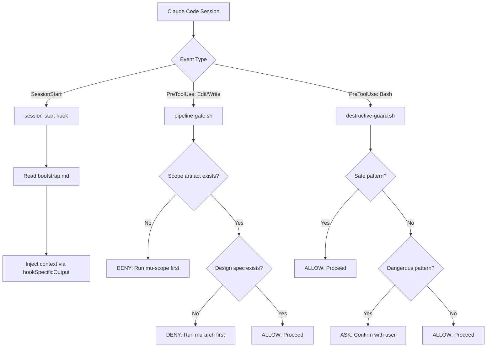

Source files referenced

- `hooks/hooks.json`
- `hooks/session-start`
- `hooks/pre-tool-use/pipeline-gate.sh`
- `hooks/pre-tool-use/destructive-guard.sh`
- `.claude-plugin/plugin.json`
- `knowledge/principles/defensive-boundary.md`
- `knowledge/principles/git-safety.md`

# 配置、钩子与安全门控

DevMuse 作为 Claude Code 的插件，通过 **hooks 系统** 在会话生命周期的关键节点注入上下文和安全检查。整个机制围绕三个核心能力展开：Session 启动时的 bootstrap 注入、文件编辑前的 pipeline 范围验证、以及 Bash 命令执行前的破坏性操作拦截。

这套钩子体系遵循 **fail-open** 原则——当钩子自身出错时不会阻断用户工作流，而是静默放行。安全门控则依托 `knowledge/principles/` 下的工程原则（Defensive Boundary、Git Safety Protocol）提供决策依据。

Sources: [hooks/hooks.json:1-38](), [knowledge/principles/defensive-boundary.md:1-4]()

## 插件注册

DevMuse 通过 `.claude-plugin/plugin.json` 注册为 Claude Code 插件，声明了名称、版本、agents 和 skills 目录。

| 字段 | 值 | 说明 |
|------|-----|------|
| `name` | `devmuse` | 插件标识 |
| `version` | `0.2.0` | 当前版本 |
| `agents` | `mu-reviewer`, `mu-coder` | 注册的 sub-agent |
| `skills` | `./skills/` | 技能目录（按需加载） |

Sources: [.claude-plugin/plugin.json:1-17]()

## Hooks 配置总览

`hooks/hooks.json` 定义了两类钩子事件，共绑定三个 hook handler：

| 事件类型 | Matcher | Handler 脚本 | 触发场景 |
|----------|---------|--------------|----------|
| `SessionStart` | `startup\|clear\|compact` | `hooks/session-start` | 会话启动、清屏、压缩时 |
| `PreToolUse` | `Edit\|Write` | `hooks/pre-tool-use/pipeline-gate.sh` | 编辑或写入文件前 |
| `PreToolUse` | `Bash` | `hooks/pre-tool-use/destructive-guard.sh` | 执行 Bash 命令前 |

所有 hook 均设置 `"async": false`，确保在 Claude Code 执行工具调用前 **同步完成** 检查。

Sources: [hooks/hooks.json:3-36]()

## SessionStart Hook: Bootstrap 注入

`hooks/session-start` 是一个 Bash 脚本，负责在每次会话启动时将 `rules/bootstrap.md` 的内容注入为 Claude Code 的上下文。

**执行流程：**

1. 定位插件根目录（通过脚本自身路径向上一级推算）
2. 读取 `rules/bootstrap.md` 文件内容
3. 通过 `escape_for_json()` 函数转义特殊字符（`\`、`"`、换行、回车、制表符）
4. 包装为 `<EXTREMELY_IMPORTANT>` 标签的 context 字符串
5. 输出 JSON 格式的 `hookSpecificOutput`，将 bootstrap 内容作为 `additionalContext` 注入

该脚本使用 `printf` 而非 heredoc 输出 JSON，原因是 bash 5.3+ 存在 heredoc 变量展开在内容超过约 512 字节时挂起的 bug。

Sources: [hooks/session-start:1-35]()

## Pipeline Gate: 范围验证门控

`pipeline-gate.sh` 在 `Edit` 或 `Write` 工具调用前执行，确保开发流程的前置步骤已完成。

### 检查逻辑

| 检查项 | 路径 | 未通过时的行为 |
|--------|------|----------------|
| Scope artifact | `docs/scope/*.md` | `deny` — 提示先运行 `mu-scope` |
| Design spec | `docs/specs/*-design*.md` | `deny` — 提示先运行 `mu-arch` |
| Plugin 自身文件 | `${CLAUDE_PLUGIN_ROOT}/*` | 豁免 — 直接放行 |

### 关键设计决策

- **Fail-open**：脚本顶部设置 `trap 'exit 0' ERR`，任何错误都不会阻断工作流
- **无外部依赖**：JSON 解析使用 `grep` + `sed` 替代 `jq`，避免运行时依赖
- **自编辑豁免**：对插件自身目录下的文件编辑不做门控，允许插件自我迭代

Sources: [hooks/pre-tool-use/pipeline-gate.sh:1-43]()

## Destructive Guard: 破坏性命令拦截

`destructive-guard.sh` 在 `Bash` 工具调用前执行，检测并拦截可能造成不可逆后果的命令。

### 安全白名单（直接放行）

以下常见的清理命令被视为安全操作，不触发确认：

- `rm -rf node_modules`
- `rm -rf dist`
- `rm -rf .next`
- `rm -rf build`
- `rm -rf __pycache__`

### 危险模式检测

| 检测模式 | 风险说明 |
|----------|----------|
| `rm -rf` | 递归强制删除（非白名单目标） |
| `git push -f` / `git push --force` | 强制推送，覆盖远程历史 |
| `git reset --hard` | 丢弃所有未提交更改 |
| `git clean -fd` | 删除未跟踪文件 |
| `DROP TABLE` | 数据库表删除 |

匹配到危险模式时，hook 返回 `permissionDecision: "ask"`，要求用户确认后才能继续。这与 Git Safety Protocol 原则中"破坏性操作前必须确认"的要求一致。

Sources: [hooks/pre-tool-use/destructive-guard.sh:1-46](), [knowledge/principles/git-safety.md:19-23]()

## 工程原则支撑

钩子系统的设计背后有两个核心工程原则提供理论支撑：

### Defensive Boundary（防御性边界）

适用于所有与外部系统交互的代码。核心要求：

- 假设每个字段都可能缺失、为 null、为空或类型错误
- 在边界处立即验证，不让坏数据传播到业务逻辑
- 每个代码路径必须显式处理（MECE 原则）

这一原则直接体现在 `pipeline-gate.sh` 和 `destructive-guard.sh` 中：两者都在输入边界处做验证，且对空输入（`FILE_PATH` 或 `COMMAND` 为空）采取显式的放行处理。

Sources: [knowledge/principles/defensive-boundary.md:6-42]()

### Git Safety Protocol（Git 安全协议）

适用于所有 git 分支操作。核心要求：

- 切换分支前确认当前分支和工作区状态
- 创建分支前搜索是否已存在同名分支
- 执行破坏性操作前确认远程备份、征求用户同意、执行后验证结果

`destructive-guard.sh` 是这一原则的自动化执行层——将"必须确认"从人工流程提升为系统级门控。

Sources: [knowledge/principles/git-safety.md:1-33]()

## Hook 输出协议

所有 hook 通过 JSON 输出与 Claude Code 通信，支持三种决策：

| 决策类型 | JSON 字段 | 效果 |
|----------|-----------|------|
| 允许 | 无输出 / `exit 0` | 工具调用正常执行 |
| 拒绝 | `"permissionDecision": "deny"` | 阻止工具调用，显示 `message` |
| 询问 | `"permissionDecision": "ask"` | 暂停并向用户确认 |
| 注入上下文 | `"hookSpecificOutput"` | 向会话注入额外上下文 |

Sources: [hooks/session-start:33](), [hooks/pre-tool-use/pipeline-gate.sh:33-38](), [hooks/pre-tool-use/destructive-guard.sh:42-43]()
