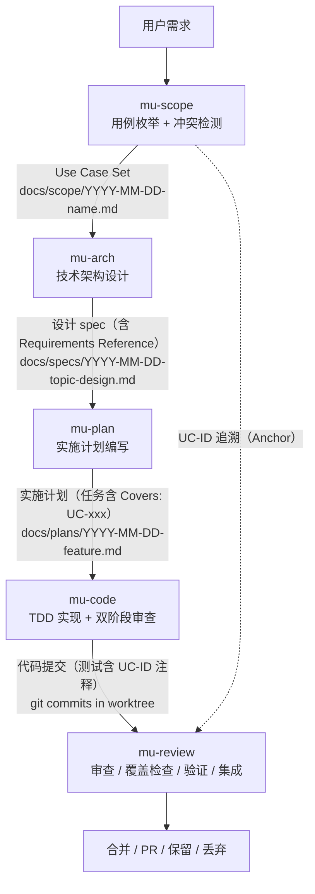

<details>
<summary>Referenced source files (7 files)</summary>

- `skills/mu-scope/SKILL.md`
- `skills/mu-arch/SKILL.md`
- `skills/mu-plan/SKILL.md`
- `skills/mu-code/SKILL.md`
- `skills/mu-review/SKILL.md`
- `README.md`
- `CONTEXT.md`

</details>

# 核心管线：Scope → Arch → Plan → Code → Review

核心管线（core pipeline）是 DevMuse 中有序、自动路由的技能链 mu-scope → mu-arch → mu-plan → mu-code → mu-review：每个阶段的产物是下一阶段的输入。这条链覆盖从需求界定到代码集成的完整开发生命周期——mu-scope 产出 Use Case Set，mu-arch 将其转化为设计 spec，mu-plan 拆解为实施计划，mu-code 逐任务执行实现，mu-review 完成最终审查与集成。Sources: [CONTEXT.md:11-13](), [README.md:37-51]()

管线的两条设计主线贯穿始终：其一是 **产物链路**——技能间通过落盘的 artifact 文件（而非会话上下文）传递信息，UC-ID 从 Use Case Set 一路传播到设计、计划任务、代码与测试，成为 coverage 审查的审计对象；其二是 **HARD-GATE**——嵌入技能正文的结构性、不可协商的前置条件（如"没有已批准的 scope artifact 就不做设计"），在 Stance 检测之前评估，`skip` stance 与 sign-off 都无法绕过。Sources: [CONTEXT.md:31-33](), [CONTEXT.md:47-49](), [CONTEXT.md:81-84]()

管线由始终开启的 bootstrap 路由规则驱动：无前缀消息按意图与仓库状态分类——意图清晰则静默路由，意图模糊则给出提议；非开发/产品类消息不路由。路由逻辑不再是独立技能，已内化到 bootstrap 规则中。Sources: [README.md:68-70]()

## 产物链路总览



Sources: [mu-scope/SKILL.md:210-215](), [mu-arch/SKILL.md:328-334](), [mu-plan/SKILL.md:174-179](), [mu-code/SKILL.md:1039-1043](), [mu-review/SKILL.md:961-967]()

| 阶段 | 输入 | 输出产物 | 终止状态 |
|------|------|----------|----------|
| mu-scope | 用户需求 + 代码库 Quick Probe | Use Case Set：`docs/scope/YYYY-MM-DD-<name>.md` | 调用 mu-arch |
| mu-arch | scope artifact（HARD-GATE 强制） | 设计 spec：`docs/specs/YYYY-MM-DD-<topic>-design.md` | 调用 mu-plan |
| mu-plan | 设计 spec | 实施计划：`docs/plans/YYYY-MM-DD-<feature-name>.md` | 调用 mu-code |
| mu-code | 实施计划 | worktree 中的代码提交 | 链接到 mu-review |
| mu-review | 代码变更（BASE_SHA..HEAD_SHA） | 审查结论 + 集成动作（merge/PR/keep/discard） | 完成 |

Sources: [mu-scope/SKILL.md:211-214](), [mu-arch/SKILL.md:330-332](), [mu-plan/SKILL.md:176-179](), [mu-code/SKILL.md:1041-1043](), [mu-review/SKILL.md:803-819]()

## mu-scope：界定范围，产出 Use Case Set

mu-scope 是管线入口，通过枚举用例、检测冲突、评估对现有代码的影响来界定工作范围，产出喂给 mu-arch 的 Use Case Set。它带有一条 HARD-GATE：在拿到用户批准的完整 Use Case Set 之前，不得调用 mu-arch 或任何实现技能——无论任务看起来多简单。"太简单不需要 scoping" 被明确列为反模式：bug 修复、配置修改、一行改动都要走 scoping，scope 可以只有一个用例（30 秒），但必须产出并获批准。Sources: [mu-scope/SKILL.md:8](), [mu-scope/SKILL.md:12-14](), [mu-scope/SKILL.md:16-18]()

### 五个阶段

| 阶段 | 内容 |
|------|------|
| Quick Probe | 自动扫描代码库：定位文件、fan-out（爆炸半径）、测试覆盖、git 历史信号、接口风险、守卫语义、架构上下文 |
| Depth Decision | 呈现探测结果并推荐深度（快速 scope 2-3 个用例 vs 完整枚举），用户确认 |
| Use Case Elicitation | 按序枚举：happy paths → edge cases → error cases → reverse cases（"什么必须保持不变"） |
| Conflict Detection | 两两交叉检查所有用例，发现矛盾条件、冲突前置、regression gap；所有冲突必须解决，最终 artifact 不允许 PENDING |
| Output | 写入 `docs/scope/YYYY-MM-DD-<name>.md`，提交并等待用户确认 |

Sources: [mu-scope/SKILL.md:22-29](), [mu-scope/SKILL.md:87-99](), [mu-scope/SKILL.md:146-152](), [mu-scope/SKILL.md:171-187](), [mu-scope/SKILL.md:189-197]()

用例采用统一格式 `UC-<N>: [Given <precondition>] When <action> Then <expected result>`——这些 UC-ID 就是后续所有阶段的追溯锚点。当变更涉及替换现有条件/过滤器/守卫时，Quick Probe 还要求做 Guard Semantic Analysis：枚举旧条件阻止的全部场景，计算 regression gap，并要求用户对每个 gap 项明确处置（"有意放行"或"必须继续阻止"）。Sources: [mu-scope/SKILL.md:156-169](), [mu-scope/SKILL.md:101-116]()

**终止状态是调用 mu-arch**——mu-scope 之后唯一可调用的技能就是 mu-arch。Sources: [mu-scope/SKILL.md:72]()

## mu-arch：从 Use Case Set 到设计 spec

mu-arch 把已批准的需求转化为技术设计。它带有两条 HARD-GATE：其一，在设计呈现并获用户批准前，不得调用任何实现技能、写任何代码；其二，mu-arch 要求 `docs/scope/*.md` 的 scope artifact 作为输入，不存在则先调用 mu-scope。两条 HARD-GATE 在 Phase 0（Stance 检测）之前评估，`skip` stance 也无法绕过。Sources: [mu-arch/SKILL.md:14-22]()

### 关键步骤

设计流程从 Phase 0 的 Stance 检测开始（`create` / `update` / `extract` / `skip` 四种进入姿态），然后读取 scope artifact、探索项目上下文、就技术方向提问（scope 已回答"做什么"，因此不再追问目的和场景）、提出 2-3 个方案并附带**每个方案的 UC 覆盖情况**与反演测试、做 C4 定位与功能设计、按 NFR 触发条件扫描、写设计文档、跑 spec 审查循环，最后交用户审阅。Sources: [mu-arch/SKILL.md:24-50](), [mu-arch/SKILL.md:56-77](), [mu-arch/SKILL.md:141-145]()

### Domain Language 横切关注点

命名在 mu-arch 中是与 ADR 并列的横切关注点：在给任何组件或概念起名之前，必须先读取仓库根部的 `CONTEXT.md`（若存在）并复用其术语，同时尊重 `_Avoid_` 列表。功能设计（步骤 8）中"用项目语言命名"这一子项也重申了同一约束。当设计新造了一个名字且用户批准后，要按 `knowledge/principles/domain-glossary.md` 的资格测试，把该条目（定义 + `_Avoid_` 同义词）在提交设计文档的同一 commit 中加入 `CONTEXT.md`。这保证了 Use Case Set、HARD-GATE、Anchor 等域语言术语在整条管线上保持一致，不被同义词稀释。Sources: [mu-arch/SKILL.md:246-248](), [mu-arch/SKILL.md:71](), [CONTEXT.md:1-3]()

### Requirements Reference：追溯性锚点

设计文档的追溯性由一个必填字段建立——每份设计 spec 必须包含 Requirements Reference：

```markdown
## Requirements Reference
- Scope: docs/scope/YYYY-MM-DD-<name>.md
- Covers: UC-1, UC-2, UC-3, ...
- NFRs: NFR-1, NFR-2, ...
```

这个字段是从设计回溯到 scope 的链接，mu-review 的 coverage 检查后续正是从这里提取 scope 文件路径。Sources: [mu-arch/SKILL.md:260-269](), [mu-review/SKILL.md:620-623]()

写完 spec 后进入两道关卡：先是 spec 审查循环（派发 mu-reviewer 的 review-design 模式，发现问题就修复并重派，超过 3 轮上报人类），再是用户审阅关卡（用户批准后才继续）。**终止状态是调用 mu-plan。** Sources: [mu-arch/SKILL.md:271-284](), [mu-arch/SKILL.md:129]()

## mu-plan：从设计 spec 到实施计划

mu-plan 的写作前提是假设执行者"对代码库零上下文、品味存疑"：文档化他们需要的一切——每个任务碰哪些文件、完整代码、测试方式、验证命令。计划保存到 `docs/plans/YYYY-MM-DD-<feature-name>.md`。Sources: [mu-plan/SKILL.md:8-13](), [mu-plan/SKILL.md:17-19]()

### 任务粒度与追溯

每个步骤是一个动作（2-5 分钟）："写失败测试"是一步，"运行确认失败"是一步，"写最小实现"是一步，"运行确认通过"是一步，"提交"是一步。每个任务头部标注 `Covers: UC-1, UC-3`——当 scope artifact 存在时这是必须项，它告诉 coder 要在测试中追溯哪些用例。Sources: [mu-plan/SKILL.md:65-72](), [mu-plan/SKILL.md:95-97](), [mu-plan/SKILL.md:143]()

计划写完后进入计划审查循环：派发 mu-reviewer 的 review-plan 模式，提供 `PLAN_FILE_PATH` 与 `SPEC_FILE_PATH`。审查者会从文档构建 **Anchor 列表**（UC-ID、任务编号、文件路径），只输出绑定到这些 Anchor 的发现——防止幻觉出不存在的 UC、类名或文件路径。审查通过后进入执行交接，提供两种模式选择（子代理驱动/内联），**终止状态是调用 mu-code**。Sources: [mu-plan/SKILL.md:145-158](), [mu-plan/SKILL.md:160-172](), [CONTEXT.md:59-61]()

## mu-code：逐任务执行实现

mu-code 逐任务执行实施计划，核心原则是"每任务一个全新子代理 + 两阶段审查（先 spec 合规、后代码质量）= 高质量、快迭代"。执行前先做 worktree 隔离：按"已有目录 > CLAUDE.md 偏好 > 询问用户"的优先级选择目录，验证目录被 gitignore，运行项目 setup，并跑测试确认干净基线。Sources: [mu-code/SKILL.md:8-14](), [mu-code/SKILL.md:46-56](), [mu-code/SKILL.md:88-105](), [mu-code/SKILL.md:154-168]()

### TDD 纪律与两阶段审查

实现遵循 Iron Law：`NO PRODUCTION CODE WITHOUT A FAILING TEST FIRST`——先于测试写的代码要删除重来，红-绿-重构循环中的"看着测试失败"（Verify RED）与"看着测试通过"（Verify GREEN）都是强制步骤。当计划包含 `Covers: UC-xxx` 时，coder 要在测试上标注 UC-ID 注释，这使得 review-coverage 模式能验证所有用例都已实现。Sources: [mu-code/SKILL.md:614-621](), [mu-code/SKILL.md:696-711](), [mu-code/SKILL.md:789-793]()

每个任务完成后经过两道审查关卡，顺序不可颠倒：

| 阶段 | 模式 | 检查内容 |
|------|------|----------|
| Stage 1 | review-compliance | 实现是否匹配任务规格？有无缺失需求？有无未要求的多余功能？ |
| Stage 2 | review-code | 代码质量、可读性、可维护性、测试质量与覆盖、错误处理 |

Stage 1 必须通过才能进入 Stage 2；任一审查存在未修复问题时不得进入下一任务。所有任务完成后，**链接到 mu-review 做最终审查**。Sources: [mu-code/SKILL.md:962-994](), [mu-code/SKILL.md:1010-1011]()

## mu-review：审查、覆盖检查、验证与集成

mu-review 是管线终点，五步走：派发审查 →（条件性）Codex 交叉审查 → 处理反馈 → 覆盖检查 → 验证 → 集成收尾。派发前先做安全信号扫描（diff 中匹配 auth/password/token/sql 等模式），命中则在 review-code 之外追加 review-security 模式。Sources: [mu-review/SKILL.md:12-33](), [mu-review/SKILL.md:43-51]()

### UC-ID 覆盖检查

代码质量审查通过后，验证 scope 中的所有用例都被覆盖：读取设计 spec 的 Requirements Reference 抽取 scope 文件路径，派发 review-coverage 模式。发现的 gap 分三类处置——缺实现（送回 mu-code）、缺测试（补测试）、scope 本身缺失（告知用户，这不是代码问题）。只要 scope artifact 存在，此步骤永远执行，从不跳过。这正是 UC-ID 追溯链的闭环：Use Case Set 中的 UC-ID 是 review-coverage 跨设计、计划、代码、测试审计的 Anchor。Sources: [mu-review/SKILL.md:616-638](), [CONTEXT.md:81-84]()

### 验证与收尾

验证环节有自己的 Iron Law：`NO COMPLETION CLAIMS WITHOUT FRESH VERIFICATION EVIDENCE`——没有在当前消息中运行过验证命令，就不能声称通过；"should / probably / seems to" 都是红旗。收尾前先确认测试通过，然后呈现恰好四个选项：本地合并、推送并建 PR、保留分支、丢弃（需要输入 'discard' 确认），并按选项处理 worktree 清理。Sources: [mu-review/SKILL.md:649-655](), [mu-review/SKILL.md:684-693](), [mu-review/SKILL.md:773-791](), [mu-review/SKILL.md:803-819]()

## HARD-GATE 与管线顺序的双重强制

核心管线的顺序由两种机制强制：pipeline gate（pre-tool-use 钩子）做机械强制——在 scope artifact 与设计 spec 落盘之前拒绝 Edit/Write；HARD-GATE 做文本强制——嵌入技能正文、在 Stance 检测前评估的不可协商前置条件。两者的区别在于层级：sign-off gate 是永远可跳过的非阻塞协议，而 HARD-GATE 从不被 `skip` stance 或 sign-off 绕过。Sources: [CONTEXT.md:31-41](), [CONTEXT.md:81-84](), [README.md:78]()

| 位置 | HARD-GATE 内容 |
|------|----------------|
| mu-scope | 无完整且获批的 Use Case Set 之前，不得调用 mu-arch 或任何实现技能 |
| mu-arch（其一） | 设计未呈现并获用户批准前，不得调用实现技能、写代码、搭脚手架 |
| mu-arch（其二） | 必须有 `docs/scope/*.md` 作为输入；没有就先调用 mu-scope |

Sources: [mu-scope/SKILL.md:12-14](), [mu-arch/SKILL.md:14-22]()

## 典型路径

- **现有项目加功能**：`mu-scope → mu-arch → mu-plan → mu-code → mu-review`
- **绿地产品**：`/mu-biz` → `/mu-prd` → 再进入上述功能循环
- **Bug 修复**：`mu-scope（1 个 UC）→ mu-debug → mu-code`

Sources: [README.md:73-76]()

---

See also: [实现与审查](implementation-and-review.md) · [代理系统](agent-system.md) · [钩子与门控](hooks-and-gates.md)
