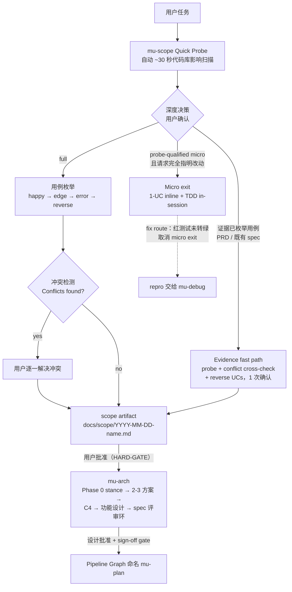
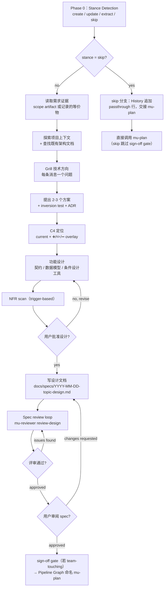
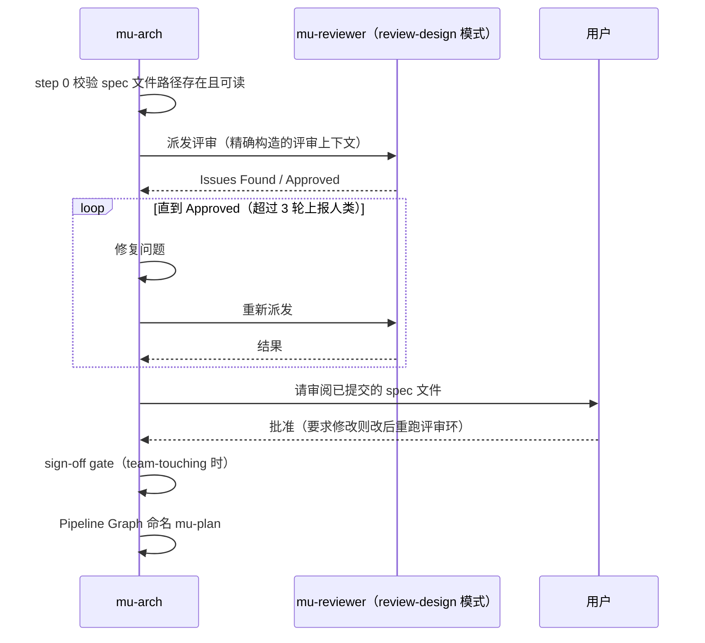

Referenced source files (7 files)

- `skills/mu-scope/SKILL.md`
- `skills/mu-arch/SKILL.md`
- `knowledge/principles/stance-detection.md`
- `knowledge/principles/sign-off-gate.md`
- `knowledge/templates/scope.md`
- `knowledge/templates/architecture.md`
- `CONTEXT.md`

# 核心管线：Scope 与 Arch

核心管线（core pipeline）是 DevMuse 中有序、自动路由的技能链 mu-scope → mu-arch → mu-plan → mu-code → mu-review：每个阶段的产物是下一阶段的输入。本页覆盖它的前半段——mu-scope 通过枚举用例、检测冲突、评估对现有代码的影响来界定工作范围，产出 Use Case Set；mu-arch 把已批准的需求证据转化为技术设计 spec。后半段（mu-plan / mu-code / mu-review）见 [计划与实现](plan-implement.md)。Sources: [CONTEXT.md:12-14](), [mu-scope/SKILL.md:8-10](), [mu-arch/SKILL.md:8-12]()

两个技能各带 HARD-GATE——嵌入技能正文的结构性、不可协商的前置条件：mu-scope 在拿到用户批准的完整 Use Case Set 之前不得调用 mu-arch 或任何实现技能；mu-arch 在设计呈现并获用户批准之前不得写任何代码、搭任何脚手架。顺序替代路径（evidence fast path、用户持有的 override）定义在 Pipeline Graph（`rules/bootstrap.md`）中，但 UC 批准本身永远不可由 agent 豁免。技能完成时宣布产物，由 Pipeline Graph 命名后继——边消费的是证据，不是文件路径。Sources: [mu-scope/SKILL.md:12-16](), [mu-arch/SKILL.md:14-16](), [CONTEXT.md:27-29](), [CONTEXT.md:35-37]()

两个技能都把"太简单不需要走流程"列为反模式：bug 修复、配置修改、一行改动全都要走 scoping 与设计；scope 可以只有一个用例（30 秒），设计可以只有几句话，但必须产出并获批准。Sources: [mu-scope/SKILL.md:18-20](), [mu-arch/SKILL.md:45-47]()

## 前半段总览

```mermaid
graph TD
    REQ["用户任务"] --> PROBE["mu-scope Quick Probe<br/>自动 ~30 秒代码库影响扫描"]
    PROBE --> DEPTH{"深度决策<br/>用户确认"}
    DEPTH -->|"probe-qualified micro<br/>且请求完全指明改动"| MICRO["Micro exit<br/>1-UC inline + TDD in-session"]
    DEPTH -->|"证据已枚举用例<br/>PRD / 既有 spec"| FAST["Evidence fast path<br/>probe + conflict cross-check<br/>+ reverse UCs，1 次确认"]
    DEPTH -->|"full"| ENUM["用例枚举<br/>happy → edge → error → reverse"]
    ENUM --> CONFLICT{"冲突检测<br/>Conflicts found?"}
    CONFLICT -->|"yes"| RES["用户逐一解决冲突"]
    RES --> ART["scope artifact<br/>docs/scope/YYYY-MM-DD-name.md"]
    CONFLICT -->|"no"| ART
    FAST --> ART
    MICRO -.->|"fix route：红测试未转绿<br/>取消 micro exit"| DEBUG["repro 交给 mu-debug"]
    ART -->|"用户批准（HARD-GATE）"| ARCH["mu-arch<br/>Phase 0 stance → 2-3 方案 →<br/>C4 → 功能设计 → spec 评审环"]
    ARCH -->|"设计批准 + sign-off gate"| PLAN["Pipeline Graph 命名 mu-plan"]
```

Sources: [mu-scope/SKILL.md:33-83](), [mu-arch/SKILL.md:72-122](), [CONTEXT.md:55-57]()

| 阶段 | 输入 | 核心产物 | 终止状态 |
|------|------|----------|----------|
| mu-scope | 用户需求 + Quick Probe 结果 | Use Case Set：`docs/scope/YYYY-MM-DD-<name>.md`；或 micro exit 的 1-UC inline；或 fix route 的 1-UC repro | 宣布产物，Pipeline Graph 命名下一步（常规为 mu-arch） |
| mu-arch | 已批准的 scope artifact（默认）或记录在案的等价证据 | 设计 spec：`docs/specs/YYYY-MM-DD-<topic>-design.md`，含 Requirements Reference | 设计批准并提交后，Pipeline Graph 命名 mu-plan |

Sources: [mu-scope/SKILL.md:83](), [mu-scope/SKILL.md:230-236](), [mu-arch/SKILL.md:122](), [mu-arch/SKILL.md:320-327]()

## mu-scope：界定范围，产出 Use Case Set

mu-scope 的检查清单是六步：Quick Probe → 深度决策 → 用例引导 → 冲突检测 → 写 scope artifact → 交接。Sources: [mu-scope/SKILL.md:23-31]()

### Quick Probe：先探测，再提问

在向用户提任何问题之前，先扫描代码库以理解改动触及什么。扫描前有一道 premise check：若存在 `docs/premise/*.md`、`docs/mrd/*.md`（legacy `docs/biz/*.md`）或 `docs/prd/*.md` 中任意一种，直接通过；一个都没有，则跑轻量的 3 问 premise check——用户给出强证据就快速放行，三轮后仍说"直接做"就标记 "Premise not validated — proceeding at user's request" 后继续。新建/空项目跳过 probe。Sources: [mu-scope/SKILL.md:87-96]()

| 检查项 | 方法 | 揭示什么 |
|--------|------|----------|
| Locate code | 按用户描述关键词 grep/glob | 涉及哪些文件 |
| Fan-out | 统计受影响函数/模块的调用方 | 爆炸半径 |
| Test coverage | 查找受影响代码的现有测试 | 安全网状态 |
| Historical signals | git log 近期改动与 bug 修复 | 受影响区域的稳定性 |
| Interface risk | 是否影响公共 API/契约 | 破坏性变更潜力 |
| Guard semantics | 修改条件/过滤器/守卫时，枚举它当前阻止的所有场景 | 条件替换的 regression gap |
| Architecture context | 读架构文档，把改动映射到组件 | 触及哪些层与边界 |

Sources: [mu-scope/SKILL.md:98-110]()

当改动涉及替换现有条件/过滤器/守卫时，还要做 **Guard Semantic Analysis**：一个条件常常承载多重隐式职责，为修一个场景替换它可能悄悄丢掉对其他场景的保护。步骤是：枚举旧条件阻止的全部场景（block set）→ 对比新旧条件计算 regression gap → 要求用户对 gap 中每一项明确处置（"有意放行"或"必须继续阻止"）。Probe 输出汇总文件、fan-out、测试覆盖、guard 分析、架构影响与风险等级，并给出深度建议；若风险 ≥ medium 且 `docs/wiki/_index.md` 不存在，附带建议 `/mu-wiki generate`。Sources: [mu-scope/SKILL.md:112-142]()

### 深度决策与 micro exit

呈现 probe 结果并推荐深度（快速 scope 2-3 个用例 vs 完整枚举），由用户确认或推翻。probe 合格的微小改动可以在这里走 **micro exit**——它由 probe 条件把关，从不凭感觉：

| 维度 | 规则 |
|------|------|
| 资格（全部满足） | probe 显示：单文件、0-1 个 dependent、不改公共接口/契约、不改 guard/条件/过滤器语义、低风险；且用户请求本身完全指明了改动（没有任何设计余地） |
| 执行 | 会话内陈述单条 UC → 用户点头 → 当场 test-first 实现 → 跑受影响测试 → 呈现 diff；不写 scope 文件、不进 mu-arch / mu-plan，改动落在当前分支，micro 确认即同意 |
| 取消条件 | 隐藏 dependent 浮现、无关测试失败、改动超出陈述范围、中途出现任何设计问题 → 回滚部分改动，回到深度决策走完整流程 |
| 永不适用 | guard/条件/过滤器修改（一行条件改动正是 Guard Semantic Analysis 的用武之地）、auth/安全相关代码、schema 或数据迁移、依赖/lockfile 变更 |

Sources: [mu-scope/SKILL.md:144-155]()

micro exit 不是"每个任务都要 scoping"的例外：probe 照跑，UC 照样陈述并获批准——它省掉的是 artifact 文件和下游阶段，不是思考本身。Sources: [mu-scope/SKILL.md:18-20]()

### 用例枚举与 evidence fast path

**Evidence fast path**：当需求证据已经把用例枚举清楚——一份详尽的 PRD 特性章节加对象模型，或来自别处的已批准 spec——不要重新访谈。scope 不重复的工作只有三件：probe（已跑）、对证据规则的冲突交叉检查、reverse UCs；三者合成一份报告，UC 从证据引用，一次确认，产出一份引用来源的薄 artifact。下面的引导流程只针对"需求还只在用户脑子里"的情况。Sources: [mu-scope/SKILL.md:159]()

常规引导按 grilling 方法论进行：每条消息一个问题、带选项与推荐，事实自查、决策留给用户、收敛每个分叉；顺序是 happy paths（立核心）→ edge cases（扩边界）→ error cases（处理失败）→ **reverse cases**（什么必须不发生）。每引入一个新行为都要问"哪些既有行为必须保持不变"，以负向断言表述——这是正向用例抓不到的回归，尤其在替换条件/守卫时。若存在 PRD 对象模型（`docs/prd/*.objects.md` 或 PRD 正文状态表），其迁移表就是 UC 清单：特性触及的每条迁移（含时钟驱动）至少一个用例，用模型的状态名；迁移周边的重试与竞态作为 edge cases。用例统一格式为 `UC-<N>: [Given <precondition>] When <action> Then <expected result>`。每类呈现后获用户确认再进下一类；快速 scope 则合并为一条消息、一轮确认。Sources: [mu-scope/SKILL.md:163-190]()

### 冲突检测

所有用例枚举完后，两两交叉检查矛盾：重叠条件下不同结果的用例、前置条件互斥的用例、用例间隙中的未定义行为，以及 **regression gaps**——旧代码阻止但新改动放开的场景（与 Guard Analysis 交叉引用）。每个冲突呈现给用户裁决，最终 artifact 中不允许 PENDING 项。Sources: [mu-scope/SKILL.md:194-208]()

### 产物、交接与 bug 复现分流

Use Case Set 按模板写入 `docs/scope/YYYY-MM-DD-<name>.md`，提交后请用户审阅并等待确认。模板包含 Context、Quick Probe Results、Guard Analysis、四类 Use Cases、Conflicts、Non-Functional Constraints、Out of Scope 与 Impact Analysis 等分区。Sources: [mu-scope/SKILL.md:210-218](), [knowledge/templates/scope.md:1-56]()

完成态有三种：已提交的 scope 文件、fix route 上的 inline 1-UC 复现（格式 `Given <broken state> When <action> Then <observed failure, vs expected>`）、或已完成的 micro exit。**Bug 复现分流**是留在技能内的唯一优先级规则：fix route 上红测试就是复现——若陈述的修改没能把它转绿，micro exit 作废，复现交给 mu-debug。这对应 CONTEXT.md 中的 Reproduce opening move：mu-scope 1-UC repro，然后 mu-debug。Sources: [mu-scope/SKILL.md:83](), [CONTEXT.md:7-9]()

## mu-arch：从需求证据到设计 spec

mu-arch 只做技术架构（组件、接口、数据流、错误处理、测试策略）：产品需求先走 mu-prd，市场问题先走 mu-mrd。它是 creative skill 之一——在 Phase 0 跑 stance 检测，在出口面对 sign-off gate。Sources: [mu-arch/SKILL.md:8](), [CONTEXT.md:23-25]()

```mermaid
graph TD
    P0["Phase 0：Stance Detection<br/>create / update / extract / skip"] --> SW{"stance = skip?"}
    SW -->|"yes"| PASS["skip 分支：History 追加<br/>passthrough 行，交接 mu-plan"]
    SW -->|"no"| EV["读取需求证据<br/>scope artifact 或记录的等价物"]
    EV --> CTX["探索项目上下文<br/>+ 查找既有架构文档"]
    CTX --> Q["Grill 技术方向<br/>每条消息一个问题"]
    Q --> AP["提出 2-3 个方案<br/>+ inversion test + ADR"]
    AP --> C4["C4 定位<br/>current + ➕/✏️/➖ overlay"]
    C4 --> FD["功能设计<br/>契约 / 数据模型 / 条件设计工具"]
    FD --> NFR["NFR scan（trigger-based）"]
    NFR --> OK{"用户批准设计?"}
    OK -->|"no, revise"| FD
    OK -->|"yes"| DOC["写设计文档<br/>docs/specs/YYYY-MM-DD-topic-design.md"]
    DOC --> LOOP["Spec review loop<br/>mu-reviewer review-design"]
    LOOP --> LP{"评审通过?"}
    LP -->|"issues found"| LOOP
    LP -->|"approved"| UR{"用户审阅 spec?"}
    UR -->|"changes requested"| DOC
    UR -->|"approved"| GATE["sign-off gate（若 team-touching）<br/>→ Pipeline Graph 命名 mu-plan"]
    PASS --> GATE2["直接调用 mu-plan<br/>（skip 跳过 sign-off gate）"]
```

Sources: [mu-arch/SKILL.md:72-122](), [mu-arch/SKILL.md:280-290]()

### 证据输入：设计之前必须有需求证据

任何方案讨论之前，设计需要需求证据，分三种情形：默认是**已批准的 scope artifact**；或一份**已经枚举了特性用例的等价物**（如详尽的 PRD 特性章节加对象模型）——此时把它记录在 Requirements Reference 下，并先跑 mu-scope 的 evidence fast path 三件套（Quick Probe、冲突交叉检查、reverse UCs——一份报告、一次确认）再设计；**完全没有证据**时推荐 mu-scope 并给出替代选项，由用户决定，override 会在 spec 中被标记。当 scope artifact 存在时，scope 已回答"做什么"——不再追问目的、用户场景或成功标准；澄清问题只聚焦技术方向（方案偏好、性能约束、兼容性、集成点），scope 中的用例就是设计约束，设计必须全部覆盖。Sources: [mu-arch/SKILL.md:18](), [mu-arch/SKILL.md:134-137]()

### Phase 0：立场检测（Stance Detection）

进入设计流程之前，先检测既有 arch artifact 的状态并选定进入姿态。mu-arch 的参数：artifact 类型 `arch`，artifact 目录 `docs/specs/*-design*.md`，watched source dirs 为 `src/`、`lib/`、`internal/`、`pkg/`、`cmd/`（取存在者；都不存在则 H3 返回 `insufficient-signal`），legacy 位置为根目录 `ARCHITECTURE.md`、`DESIGN.md`；artifact 目录永不进入自己的 watched set（防循环 staleness）。Sources: [mu-arch/SKILL.md:20-31]()

检测是确定性的 9 步算法，靠四个启发式驱动，最终查表（自上而下、首行命中）：

| 启发式 | 判据 |
|--------|------|
| H1 stub 检测 | 词数 < 300 或占位符 ≥ 3 为 clear stub；> 500 词且 0 占位符为 clear non-stub；灰区标 `AMBIGUOUS` |
| H2 覆盖检查 | artifact 的 H1/H2 标题与当前任务标识：子串匹配或 ≥ 60% Jaccard token 重叠 → covered，否则 gap |
| H3 staleness | watched dir 的提交时间戳 > artifact mtime + 7 天宽限 → stale；watched dirs 不存在返回 `insufficient-signal`（不是"not stale"） |
| H4 代码实质 | "code exists" 要求 watched dir 合计 ≥ 50 行非空行；稀疏代码走 extract 但 confidence 降为 ambiguous |

Sources: [knowledge/principles/stance-detection.md:15-64]()

结果落到四种 stance：无 artifact 无实质代码 → `create`；无 artifact 有实质代码 → `extract`；有 artifact 但 stub / 覆盖 gap / stale → `update`（sub-type 优先级 `expand > gap-fill > sync`）；有 artifact 且覆盖、不 stale → `skip`。置信度 high 静默继续，ambiguous 则呈现推荐并请用户一词 override；slash 提示（`/mu-arch <stance>`）视为预确认；用户强制 override 立即生效——不重检、不阻塞。`skip` 能通过只因既有 artifact 曾被批准，它从不绕过 HARD-GATE。Sources: [knowledge/principles/stance-detection.md:66-109](), [knowledge/principles/stance-detection.md:148-155]()

mu-arch 的分支路由：

| Stance | 动作 |
|--------|------|
| `create` | 跑完整流程（checklist 1-13 步） |
| `update` | 载入既有设计 artifact → 按 sub-type 处理（`expand` 填 stub 章节；`gap-fill` 追加 "Gap-fill: `<task>`" 新章节；`sync` 对照当前代码 diff 并提议段落更新）→ 经既有的分节批准环合并 |
| `extract` | 目标代码区域不熟悉时可先委托 mu-explore（pre-change 变体）；然后逐节读源码、逐节经用户批准填充 artifact；commit 前缀 `extract:` |
| `skip` | 向既有 artifact 的 History 追加 passthrough 行；直接按 Integration 调用 mu-plan |

Sources: [mu-arch/SKILL.md:33-42]()

### 2-3 方案、inversion test 与 ADR

技术方向问清后，提出 2-3 个方案：带 trade-offs、你的推荐（先讲推荐项及理由）、对现有架构的影响，以及**每个方案的 UC 覆盖**。呈现前对每个方案做 inversion test——"什么会让这个方案失败？"——失败模式作为对比表的一列而非独立小节。选定方案后记录 ADR。Sources: [mu-arch/SKILL.md:59](), [mu-arch/SKILL.md:145-152]()

ADR 是贯穿设计全程的横切关注点，不是单一步骤：方案选择（step 6）、功能设计选择（step 8）、NFR 权衡（step 9）中凡有实质 trade-off 的决定都记一条，格式为 Context / Decision / Alternatives / Consequences。值得记录的：2+ 可行方案间的选择、特定技术/模式/集成点的选定、NFR 类别间的权衡、会让未来读者惊讶的决定；不值得的：遵循项目既有惯例、没有真实替代项的显然选择、不影响架构的实现细节。Sources: [mu-arch/SKILL.md:213-238]()

### C4 定位与功能设计

方案获批后、详细设计前，先产出 C4 架构图确立结构地图：按 architecture-assessment 选择合适的图类型（C1/C2/C3/DFD），画出**当前**相关架构再叠加**拟议变更**（新增 ➕、修改 ✏️、移除 ➖），用 Mermaid（GitHub 可渲染）、不便时退化 ASCII；若 Quick Probe 显示"1 个组件、不跨边界、无新组件"则跳过，一段文字描述即可。Sources: [mu-arch/SKILL.md:154-159]()

功能设计按 C4 组件展开：**组件内**是数据模型（schema 变更、字段设计）与状态机（如适用）；**组件间**是接口契约（API 端点、请求/响应格式、错误码）与按场景的时序图（如适用）。命名先查仓库根部 `CONTEXT.md`、复用其术语并尊重 `_Avoid_` 列表；新造名字获用户批准后，在提交设计文档的同一 commit 里把词条加进 `CONTEXT.md`。每节按复杂度伸缩、逐节请用户确认；之后按 nfr-checklist 的触发条件扫描 NFR——只展开触发的类别，未触发的不必列为 "N/A"。Sources: [mu-arch/SKILL.md:161-171](), [mu-arch/SKILL.md:240-242]()

### 条件设计工具

两个工具在功能设计（step 8）中按触发条件启用：

| 工具 | 触发条件 | 关键规则 |
|------|----------|----------|
| Sequence Diagrams（每场景一张） | 多方交互（前端 ↔ 后端 ↔ 外部服务）、回调、webhook、OAuth 流程、数据途经多参与者的请求链 | 对 scope 的每个场景单独画图；每一跳标注可用数据（headers/cookies/body/session）与设计所需数据；任一场景出现"所需数据在执行点不可用"即设计缺口，先修再进。不画合并图——不同场景的请求来源不同（AJAX vs 浏览器 redirect vs webhook vs cron），合并图会掩盖数据可用性差异 |
| State Machine Diagrams | 实体有生命周期状态（订单状态、订阅状态、审批流、账户状态、内容发布状态） | step 0：存在 PRD 对象模型时，从它的状态与迁移出发，状态名 **verbatim** 继承（它们是 CONTEXT.md 词汇），只设计技术实现：idempotency、transactions、compensation states、timers；产品层看不到的实现态（如 "refund-in-flight"）是对模型的扩展，回流标记给 PRD 而非重命名产品状态。之后枚举全部状态、画出全部合法迁移、查缺失迁移与死端状态，记入设计文档 |

Sources: [mu-arch/SKILL.md:186-211]()

### 规格评审环与出口关卡

设计文档写入目标项目的 docs 目录（默认 `docs/specs/YYYY-MM-DD-<topic>-design.md`）并提交，每份 spec 必含 Requirements Reference 字段——需求证据路径、覆盖的 UC 列表、NFR 列表——建立从设计回溯 scope 的链接。之后进入评审环与人审：

```mermaid
sequenceDiagram
    participant A as mu-arch
    participant R as mu-reviewer（review-design 模式）
    participant U as 用户
    A->>A: step 0 校验 spec 文件路径存在且可读
    A->>R: 派发评审（精确构造的评审上下文）
    R-->>A: Issues Found / Approved
    loop 直到 Approved（超过 3 轮上报人类）
        A->>A: 修复问题
        A->>R: 重新派发
        R-->>A: 结果
    end
    A->>U: 请审阅已提交的 spec 文件
    U-->>A: 批准（要求修改则改后重跑评审环）
    A->>A: sign-off gate（team-touching 时）
    A->>A: Pipeline Graph 命名 mu-plan
```

Sources: [mu-arch/SKILL.md:254-278](), [mu-arch/SKILL.md:288-290]()

调用 mu-plan 之前查阅 sign-off gate 原则：当三个条件同时成立——artifact 已获用户批准、HARD-GATE 已满足、stakeholder-scope 为 team-touching——才触发。team-touching 的检测信号任一即可：S1 存在 CODEOWNERS 文件；S2 近 90 天 watched dirs（mu-arch 为 `src/`、`lib/`、`internal/`、`pkg/`、`cmd/`）上 ≥ 3 位作者；S3 用户明确声明。协议是一句话宣布、等待用户回复 "signed off" 或 "skip sign-off"、把结果记入 artifact 的 History 行、然后交接。sign-off gate **不是** HARD-GATE：它是协作性、随时可跳过的非阻塞协议；stance 为 `skip` 时连同 gate 一起跳过。Sources: [mu-arch/SKILL.md:280-282](), [knowledge/principles/sign-off-gate.md:8-34](), [knowledge/principles/sign-off-gate.md:36-53](), [knowledge/principles/sign-off-gate.md:83-85]()

另有一道非阻塞的 wiki 检查：若 `docs/wiki/_index.md` 存在且设计引入新组件、改变模块边界或数据流，建议 `/mu-wiki update`，用户可跳过。Sources: [mu-arch/SKILL.md:284-286]()

## 产物模板与追溯链

两个模板定义了前半段产物的形状，UC-ID 是贯穿其间的追溯锚点——Use Case Set 中的 UC-ID 会传播到设计、计划任务、代码与测试，是 coverage 审查的审计对象。Sources: [CONTEXT.md:51-53]()

| 维度 | scope 模板 | architecture 模板 |
|------|-----------|-------------------|
| 落盘位置 | `docs/scope/YYYY-MM-DD-<name>.md` | `docs/specs/YYYY-MM-DD-<topic>-design.md` |
| 头部元数据 | Date、Source | Date、Requirements evidence、Stance |
| 核心分区 | Quick Probe Results、Guard Analysis、四类 Use Cases、Conflicts、Non-Functional Constraints、Out of Scope、Impact Analysis | Requirements Reference、Alternatives Considered（含 Failure Modes 列）、C4 Positioning、Functional Design（契约/数据模型/时序图/状态机）、ADRs、Error Handling、Testing Strategy（UC coverage mapping）、History |
| 追溯角色 | 产出 UC-1…UC-N 与 UC-R（reverse）编号 | Requirements Reference 的 Covers 行回指这些 UC-ID |

Sources: [knowledge/templates/scope.md:1-56](), [knowledge/templates/architecture.md:1-93]()

---

See also: [管线图与路由](pipeline-graph.md) · [计划与实现](plan-implement.md) · [市场与产品分析](market-product-analysis.md)
