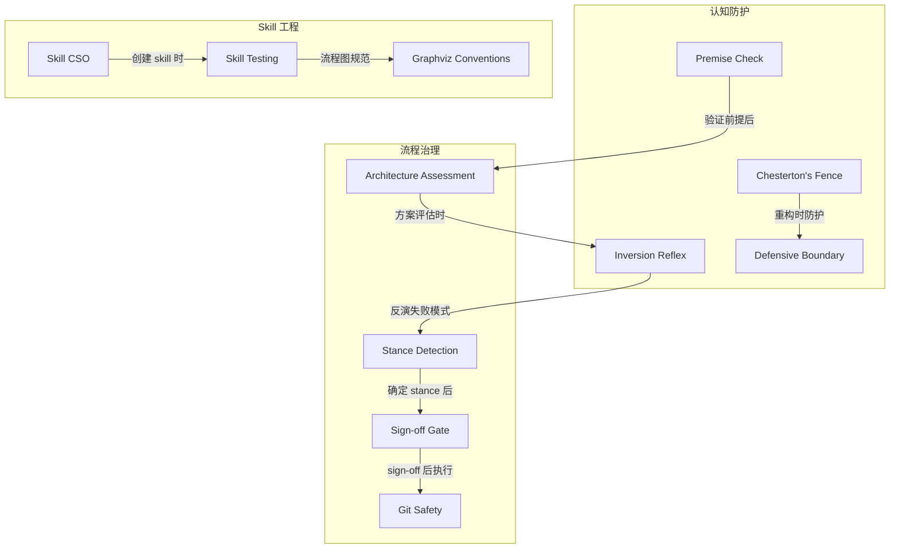
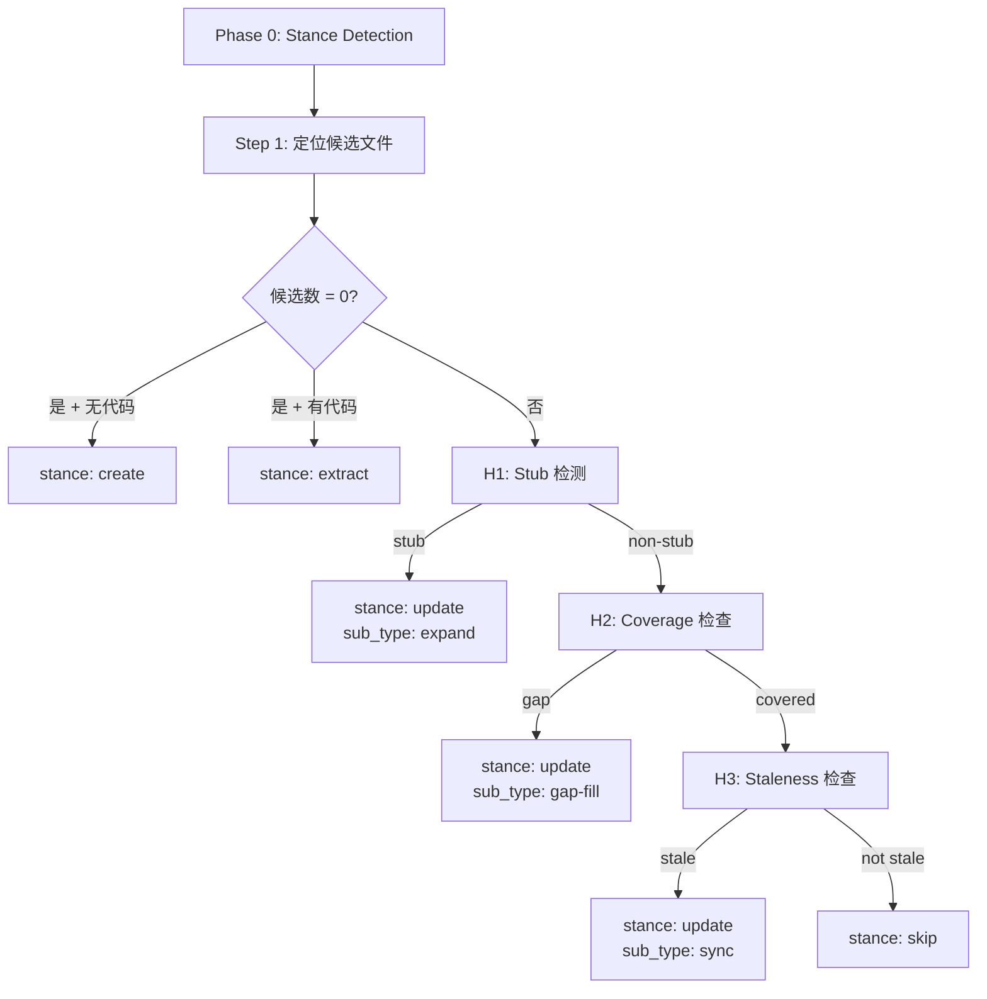

<details>
<summary>参考源文件</summary>

- `knowledge/principles/chestertons-fence.md`
- `knowledge/principles/inversion.md`
- `knowledge/principles/premise-check.md`
- `knowledge/principles/architecture-assessment.md`
- `knowledge/principles/stance-detection.md`
- `knowledge/principles/sign-off-gate.md`
- `knowledge/principles/git-safety.md`
- `knowledge/principles/defensive-boundary.md`
- `knowledge/principles/skill-cso.md`
- `knowledge/principles/skill-testing.md`
- `knowledge/principles/graphviz-conventions.md`

</details>

# 设计原则与思维框架

DevMuse 的设计依赖 11 个关键思维框架，它们贯穿从商业验证、架构设计到代码实现的完整流程。这些原则并非孤立存在——它们在 pipeline 的不同阶段被不同 skill 引用和组合，形成一套协同工作的决策系统。

这些原则可以分为三大类：**认知防护**（防止思维盲区）、**流程治理**（确保质量和协作）、以及 **skill 工程**（保证 agent 技能本身的质量）。下文逐一展开。



---

## 认知防护类原则

### Chesterton's Fence

在简化、重构或删除任何代码之前，先理解它为什么存在。核心思想源自 G.K. Chesterton 的名言：「在你知道一道栅栏为什么被竖起来之前，永远不要把它拆掉。」

在行动前必须回答五个问题：

| # | 问题 | 目的 |
|---|------|------|
| 1 | 这段代码的职责是什么？ | 理解"没有它什么会坏"，而不仅是"它做了什么" |
| 2 | 谁/什么调用了它？ | 追踪所有调用者，而非仅看显而易见的 |
| 3 | 它是何时写的，同期发生了什么变化？ | 通过 `git log` / `git blame` 还原上下文 |
| 4 | 是否有注释、commit message 或 PR 解释了原因？ | 寻找"why"而非"what" |
| 5 | 删除后哪个测试会失败？ | 测试不失败不代表不需要——可能是未覆盖 |

常见 red flag：「这看起来没人用」→ 搜索更彻底；「这比需要的复杂」→ 复杂度可能在处理你没见过的 edge case。

Sources: [chestertons-fence.md:1-29]()

### Inversion Reflex（反演思维）

对每一个方案提议，反向追问失败模式。主要用于 mu-arch 的方案评估阶段（Step 6）。

核心转换：
- 「怎样成功？」→ 「什么会导致失败？」
- 「这个功能做什么？」→ 「这个功能会被怎样误用？」
- 「这个方案可行吗？」→ 「在什么条件下这个方案会崩溃？」

在提出 2-3 个方案时，必须同时记录每个方案的 failure modes：

| Approach | Strengths | Failure Modes |
|----------|-----------|---------------|
| A | ... | Fails when ... |
| B | ... | Breaks if ... |

Sources: [inversion.md:1-22]()

### Premise Check（前提检验）

在投入 scoping/design 之前验证前提是否成立。被 mu-biz（完整 4 问）和 mu-scope Quick Probe（轻量 3 问，跳过 Q4）使用。

**四个 forcing questions：**

1. **Problem Specificity** — 「谁有这个问题？他们现在怎么绕过去的？」Red flag：回答模糊（"用户想要..."），无具体人物或变通方案。
2. **Temporal Durability** — 「3 年后世界变了，这件事更重要还是更不重要？」Red flag：依赖于可能逆转的趋势。
3. **Narrowest Wedge** — 「我们能构建的最小验证物是什么？」Red flag：「需要先建好完整平台」。
4. **Observation Test**（仅完整模式）— 「你是否在不帮助的情况下观察过别人使用类似方案？」Red flag：demo 是表演，没有意外发生。

Sources: [premise-check.md:1-31]()

### Defensive Boundary（防御性边界）

**核心原则：永远不信任外部数据。** 适用于任何接收外部系统输入或向外部系统发送输出的代码——跨服务 API 调用、webhook 回调、第三方 SDK 响应、消息队列 payload、文件导入等。

四条规则：

| 规则 | 要点 |
|------|------|
| 假设每个字段都可能缺失、null、空或类型错误 | 需分别处理 missing / null / empty / wrong type |
| 在边界处 fail fast | 立即验证，不让坏数据渗入业务逻辑 |
| MECE：每个代码路径必须显式 | 不依赖隐式 fallthrough |
| 出站：不假设接收方的行为 | 偏向不发送字段而非发送 null/empty |

常见 framework 陷阱：DRF `required=False` 不允许空字符串（需额外 `allow_blank=True`）；Pydantic v1 的 `Optional[str]` 允许 `None` 但不允许缺失。

Sources: [defensive-boundary.md:1-66]()

---

## 流程治理类原则

### Stance Detection（stance 检测）

Stance detection 是 mu-biz、mu-prd 和 mu-arch 在 Phase 0 运行的共享算法，用于自动判断应对已有 artifact 采取何种操作：`create`、`update`、`extract` 还是 `skip`。



**四个 heuristic：**

| Heuristic | 检测内容 | 关键阈值 |
|-----------|---------|----------|
| H1 — Stub detection | 文件是否为草稿 | word count < 300 或 placeholder ≥ 3 = stub |
| H2 — Coverage check | 任务是否已被现有文档覆盖 | heading 的 Jaccard token overlap ≥ 60% |
| H3 — Staleness check | 代码是否比 artifact 更新 | 代码 commit 时间 > artifact mtime + 7 天 |
| H4 — Code substance | 代码是否实质性存在 | 至少一个 watched dir 有 ≥ 50 行非空代码 |

**Sub-type 优先级：** `expand > gap-fill > sync`（结构优先，覆盖次之，内容同步最后）。用户可通过 forced-stance override 随时覆盖检测结果。

Sources: [stance-detection.md:1-167]()

### Sign-off Gate（签核门禁）

当 artifact 涉及团队协作（stakeholder-scope = team-touching）时，在 skill 退出前要求利益相关者签核。**不是** HARD-GATE——用户可以说「skip sign-off」跳过。

**触发条件**（任一满足即触发）：

| 信号 | 检测方式 |
|------|---------|
| S1: CODEOWNERS 文件存在 | `test -f .github/CODEOWNERS` |
| S2: 近 90 天多作者历史 | `git log` 去重 ≥ 3 个 author |
| S3: 用户显式声明 | 会话中提到「team project」等关键词 |

**Gate 协议：** 宣布 → 等待用户回复 → 记录到 artifact History section。用户回复 「signed off」或 「skip sign-off」均可，模糊回复（如 "meh"）视为 skip。

Sources: [sign-off-gate.md:1-104]()

### Git Safety Protocol（Git 安全协议）

**核心原则：先验证状态，再执行操作——不要假设当前分支或分支是否存在。**

三个关键场景的检查清单：

| 场景 | 必做检查 |
|------|---------|
| 切换分支前 | `git branch` 确认当前分支 + `git status` 确认工作区干净 |
| 创建分支前 | `git branch -a \| grep` 检查同名/近似分支 + 确认 base branch |
| 破坏性操作前 | 确认远端备份 + 向用户说明命令和影响 + 操作后验证结果 |

根本原因：**基于假设行动而非基于验证状态行动。** 5 秒 `git branch && git status` 能防止 15 分钟的恢复工作。

Sources: [git-safety.md:1-33]()

### Architecture Assessment（架构评估）

根据项目类型选择正确的 C4 图表层级。核心理念：只使用能增加清晰度的层级，大多数项目需要 1-2 个层级而非全部 4 个。

| 项目类型 | 推荐图表 | 原因 |
|----------|---------|------|
| CLI / Library | C3 Component | 无多容器复杂度 |
| Web app (前后端 + DB) | C1 Context + C2 Container | 需要系统边界 + 技术栈容器 |
| Microservices | C1 + C2 + Data Flow | 服务交互是核心复杂度 |
| Plugin / Extension | C1 + C3 | 关键问题：「我在宿主系统中的位置？」 |
| Data pipeline | Data Flow Diagram | 数据流转是核心关注点 |

**何时跳过详细图表：** Bug fix 不改变组件边界时；配置/文档/测试变更时；Quick Probe 显示仅影响 1 个组件且不跨边界时。

Sources: [architecture-assessment.md:1-106]()

---

## Skill 工程类原则

### Skill CSO (Claude Search Optimization)

确保 Claude 能找到并正确加载 skill 的发现性优化指南。核心洞察：**description 字段应只描述触发条件，绝不总结 skill 的工作流程。**

这一点至关重要——测试发现，当 description 包含流程摘要时，Claude 会将 description 当作 shortcut 来执行，跳过 skill 正文的详细流程图。

```yaml
# BAD: 总结了工作流程 — Claude 可能直接照此执行而跳过 skill 正文
description: Use when executing plans - dispatches subagent per task with code review between tasks

# GOOD: 仅描述触发条件
description: Use when executing implementation plans with independent tasks in the current session
```

**关键实践：**
- Token efficiency：getting-started workflow < 150 words，其他 skill < 500 words
- 命名采用动词优先的 active voice（如 `creating-skills` 而非 `skill-creation`）
- Cross-reference 使用 skill 名称而非 `@` 链接（避免强制加载浪费 context）

Sources: [skill-cso.md:1-153]()

### Skill Testing Methodology（Skill 测试方法论）

不同类型的 skill 需要不同的测试策略：

| Skill 类型 | 示例 | 测试方法 | 成功标准 |
|------------|------|---------|---------|
| Discipline-Enforcing | TDD, mu-review | 压力场景：时间压力 + 沉没成本 + 权威压力 | 在最大压力下仍遵守规则 |
| Technique | defensive-programming | 应用场景 + 边缘情况 + 信息缺失 | 能在新场景中正确应用 |
| Pattern | reducing-complexity | 识别 + 应用 + 反例 | 正确判断何时/如何应用 |
| Reference | API 文档 | 检索 + 应用 + 覆盖度 | 找到并正确使用参考信息 |

**压力测试层叠法：** 先单独测试每种压力（时间、沉没成本、权威、疲劳、例外寻求），再组合 2-3 种施加最大压力。任何有效的 rationalization 都是需要在 skill 中堵住的漏洞。

Sources: [skill-testing.md:1-75]()

### Graphviz Conventions（Graphviz 规范）

定义何时使用流程图以及如何规范地构建它们。

**仅在以下场景使用流程图：**
- 非显而易见的 decision point
- 可能过早停止的 process loop
- 「何时用 A vs B」的决策

**绝不用流程图表示：** 参考材料（用表格/列表）、代码示例（用 markdown block）、线性指令（用编号列表）。

**Node shape 规范：**

| Shape | 用途 |
|-------|------|
| `box` | Action / step |
| `diamond` | Decision point |
| `doublecircle` | Terminal state |
| `box` (filled, lightyellow) | 重要警告 / stop-the-line |
| `box` (filled, lightgreen) | 成功路径 |

Sources: [graphviz-conventions.md:1-55]()

---

## 原则间的协作关系

这 11 个原则并非独立运作，而是在 DevMuse pipeline 中互相引用和增强：

| 上游原则 | 下游原则 | 协作场景 |
|----------|---------|---------|
| Premise Check | Architecture Assessment | 前提验证通过后，选择合适的图表层级进行架构设计 |
| Inversion Reflex | Stance Detection | 方案反演后，stance detection 决定如何处理产出物 |
| Stance Detection | Sign-off Gate | stance 为 skip 时跳过 gate；其他 stance 在 team-touching 时触发 |
| Chesterton's Fence | Defensive Boundary | 重构时理解代码存在原因，边界处防御性验证外部数据 |
| Skill CSO | Skill Testing | CSO 确保 skill 被找到，testing 确保 skill 被正确执行 |
| Skill Testing | Graphviz Conventions | 测试中验证流程图是否符合规范 |
