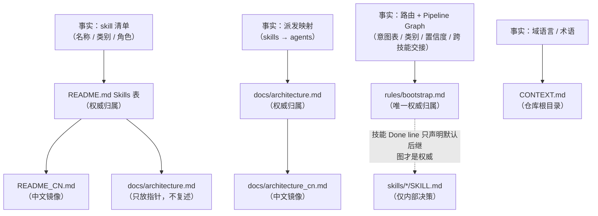
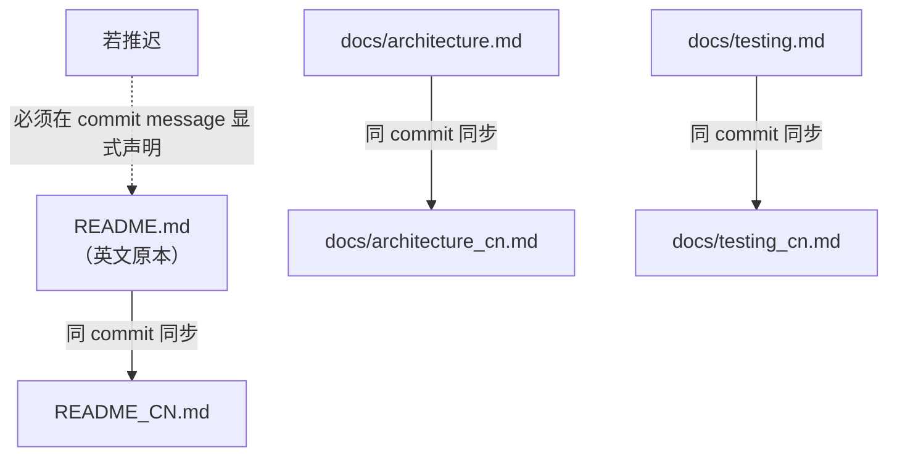

Referenced source files (8 files)

- [CLAUDE.md]()
- [README.md]()
- [README_CN.md]()
- [docs/architecture.md]()
- [docs/architecture_cn.md]()
- [CONTEXT.md]()
- [rules/bootstrap.md]()
- [knowledge/templates/wiki-index.md]()

# 文档维护契约与单一事实源

DevMuse 的文档维护契约写在仓库根目录的 `CLAUDE.md` 中，它防范的失效模式是：同一个事实被复制到多个文件后各自静默漂移。这不是假想的风险——在契约存在之前，skill 数量在不同文档里从 10 漂到 11、12、13。契约的核心手段是"一个事实，一个归属"（one fact, one place）：为每类容易被复制的事实指定唯一的权威文件（canonical home），其他文档只指向它、不复述它。Sources: [CLAUDE.md:1-3](), [CLAUDE.md:5]()

契约由五部分组成：权威归属地图、新增/重命名/重分类 skill 时的改动触达清单、中文双胞胎（Chinese twins）的同 commit 同步政策、生成文档与带日期快照的区分，以及"skill 即代码"的编辑纪律。本页逐一解释每部分的规则，并给出各归属文件中可验证的执行痕迹。Sources: [CLAUDE.md:5-32]()

## 权威归属地图：一个事实，一个归属

契约为每类容易被复制的事实指定了唯一的权威文件：

| 事实 | 权威归属 | 其他文档的义务 |
|------|---------|---------------|
| Skill 清单（名称、类别、角色） | `README.md` 的 Skills 表 | 全部指向它，不得复述 |
| Agent 派发映射（skills → agents） | `docs/architecture.md` | 别处一律不出现 |
| 路由（意图表、类别、置信度）**与跨技能 Pipeline Graph** | `rules/bootstrap.md` | **其唯一归属**——技能只决定内部流程 |
| 域语言（术语与禁用同义词） | 仓库根目录 `CONTEXT.md` | 使用其术语，遵守 `_Avoid_` 列表 |

Sources: [CLAUDE.md:7-10]()

配套的兜底规则是：任何文档中都**不允许硬编码数量或文件级目录清单**——它们必然漂移，正确写法是"见目录本身"。Sources: [CLAUDE.md:11]()

Sources: [CLAUDE.md:5-11](), [rules/bootstrap.md:94-97]()

### 路由与 Pipeline Graph：技能只做内部决策

路由这一行值得单独展开，因为它归属的不只是意图分类，还有**跨技能交接的 Pipeline Graph**。契约的措辞是：技能只决定内部流程（internal flow only）；技能的 Done line 可以点名默认后继（default successor），但图才是权威（the graph is the authority）。Sources: [CLAUDE.md:9]()

这条规则在 bootstrap 中的落地形态是 Pipeline Graph 一节：跨技能交接住在这里而不在技能里——技能以宣告制品（artifact）的方式结束，由图指名下一步（如 mu-scope 交出 approved scope 后接 mu-arch，mu-plan 交出 reviewed plan 后接 mu-code）。图的边消费的是证据而非文件路径（edges consume evidence, not file paths）：等价制品可替代默认制品满足一条边，但控制门（用户批准）与安全门（TDD、验证）永不可替代。Sources: [rules/bootstrap.md:94-109](), [rules/bootstrap.md:111-124]()

这一归属同时被域语言与架构文档确认：`CONTEXT.md` 把 **Pipeline Graph** 定义为"跨技能交接的唯一声明，位于 `rules/bootstrap.md`"；`docs/architecture.md` 的层间约束写明 "skills → skills: handoffs are declared in bootstrap's Pipeline Graph"，中文版同句对应。Sources: [CONTEXT.md:27-29](), [docs/architecture.md:132](), [docs/architecture_cn.md:132]()

路由本体（Domain Filter、意图动词表、confidence 分级、四类技能划分）也全部只在 bootstrap 中：README 的 Routing 小节不复述规则，只指向 always-on 的 bootstrap——"Routing lives in the always-on bootstrap rule"。Sources: [rules/bootstrap.md:46-92](), [README.md:68-70](), [README_CN.md:68-70]()

### 归属文件中的执行痕迹

这套规则不只是宣言，各归属文件里能看到它被执行的证据：

- **指针而非复述**：`docs/architecture.md` 的 skills 小节明确写道，权威 skill 清单在 README 的 Skills 表中，"this file does not repeat it"，本文件只记录架构层独有的信息——哪些 skill 派遣 agent（mu-arch、mu-plan、mu-code、mu-review 四个，其余不派遣）。中文版指针对称地指向 `README_CN.md` 的技能表。Sources: [docs/architecture.md:79-90](), [docs/architecture_cn.md:79-90]()
- **权威表本体**：`README.md` 的 Skills 表列出全部技能的类别与角色（Pipeline / Orthogonal / On-demand / Meta 四类）。Sources: [README.md:92-106]()
- **反硬编码的落地**：`README.md` 的 principles 行写 "see the directory for the current set"；`docs/architecture.md` 的 knowledge 小节写"目录本身即当前清单，文件级列表不在此复述——它们会漂移"。Sources: [README.md:133](), [docs/architecture.md:111]()
- **域语言归属**：`CONTEXT.md` 开篇声明它是本仓库的共享词汇表，人类与 agent 在代码、文档、commit、对话中统一使用其术语，`_Avoid_` 下的同义词被刻意弃用（如 Core pipeline 禁用 "main flow"、"workflow chain"）；bootstrap 则要求在给任何新事物命名前先查 `CONTEXT.md`。Sources: [CONTEXT.md:1-3](), [CONTEXT.md:11-13](), [rules/bootstrap.md:24-26]()

## 改动触达清单：新增 / 重命名 / 重分类 skill

即便有了权威归属，仍有少数事实必须多处出现（如 README 中清单以表格和叙述两种形式各出现一次）。契约对此的处理是：不消灭副本，而是把副本清单写死，要求**同一个 commit 内全部触达**：

| # | 文件 | 需触达的位置 | 触发条件 |
|---|------|-------------|---------|
| 1 | `README.md` | Skills 表 **和** Pipeline/Orthogonal/On-demand 叙述段（清单在该文件出现两次） | 总是 |
| 2 | `README_CN.md` | 上述两处的镜像 | 总是 |
| 3 | `rules/bootstrap.md` | 类别列表（该文件中出现两次） | 涉及类别变动时 |
| 4 | `docs/architecture.md`（+ `docs/architecture_cn.md`） | 派发表 | 该 skill 派遣 agent 时 |

Sources: [CLAUDE.md:13-20]()

"README 中清单出现两次"可在文件中直接验证：叙述形式在 Pipeline 章节（核心管线五步、正交技能、按需技能），表格形式在 Architecture 章节的 Skills 表；中文版同构。"bootstrap 中类别列表出现两次"同样可验证：一处在 Routing 段的 Four categories 划分，另一处即 Pipeline Graph 表中出现的管线技能序列。Sources: [README.md:37-66](), [README.md:92-106](), [README_CN.md:37-66](), [rules/bootstrap.md:82-92](), [rules/bootstrap.md:99-109]()

## 中文双胞胎政策

三对英文/中文文档互为镜像，契约称之为 Chinese twins：

| 英文原本 | 中文双胞胎 |
|---------|-----------|
| `README.md` | `README_CN.md` |
| `docs/architecture.md` | `docs/architecture_cn.md` |
| `docs/testing.md` | `docs/testing_cn.md` |

同步规则：改动英文原本的 commit 必须**同 commit** 更新其 `_CN` 双胞胎；若确需推迟，必须在 commit message 中显式声明推迟。Sources: [CLAUDE.md:22-24]()

镜像是结构级的：`README_CN.md` 逐节对应英文版（工作原理、管线、技能表、代理、钩子等）；`docs/architecture_cn.md` 同样复刻英文版的分层判断、加载机制、派发表与调用方向矩阵，且其"权威技能清单"指针指向 `README_CN.md` 的技能表——即指针规则在中文侧也成立。Sources: [README_CN.md:92-106](), [docs/architecture_cn.md:79-90]()

Sources: [CLAUDE.md:22-24]()

## 生成文档与带日期快照

契约把 `docs/` 下的非手写内容分成两类，规则截然不同：

| 目录 | 性质 | 规则 |
|------|------|------|
| `docs/wiki/**` | 由 `/mu-wiki` 生成 | **禁止手工编辑**；里程碑后运行 `/mu-wiki update` |
| `docs/scope\|specs\|plans/**` | 带日期的快照 | 历史记录，**禁止追溯修改** |

Sources: [CLAUDE.md:26-28]()

这一区分对应 `CONTEXT.md` 中的域语言词条 **Living artifact**：文件名不带日期、原地更新并逐次追加 History 行的文档（explore 产物、wiki、CONTEXT.md 本身），与 `docs/scope|specs|plans` 下的带日期快照相对。wiki 索引模板体现了 living artifact 的机制——记录 Generated 日期、Baseline commit 与 Generator 版本，并以 History 表逐行追加每次 generate/update。Sources: [CONTEXT.md:59-61](), [knowledge/templates/wiki-index.md:1-22]()

"快照永不追溯修改"也有实例：mu-design 更名为 mu-arch 后，`docs/plans/` 下的带日期计划快照保留旧名作为历史记录，不做回改。Sources: [CONTEXT.md:95]()

## Skill 即代码

契约的最后一条把文档编辑纳入代码纪律：编辑任何 `skills/*/SKILL.md` 或 `knowledge/principles/*.md`，都要遵循 mu-write-skill 的 Iron Law（先测试后部署）及其 8 步质量清单。换言之，skill 文本的改动与代码改动享受同等的验证门槛。Sources: [CLAUDE.md:30-32]()

---

See also: [四层架构](four-layer-arch.md) · [域语言](domain-language.md)
