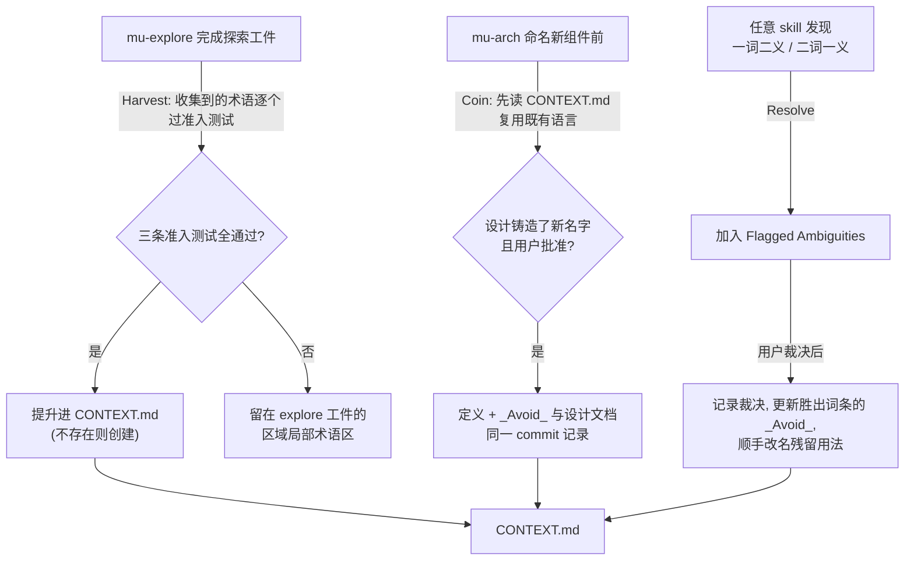
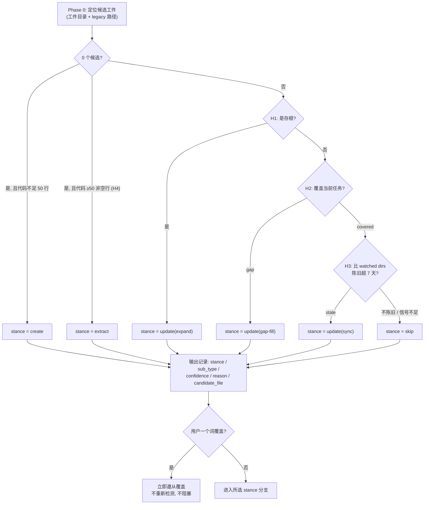

<details>
<summary>Referenced source files (6 files)</summary>

- `CONTEXT.md`
- `knowledge/principles/domain-glossary.md`
- `knowledge/templates/context-md.md`
- `knowledge/principles/skill-quality.md`
- `knowledge/principles/skill-cso.md`
- `knowledge/principles/stance-detection.md`

</details>

# 域语言与技能质量机制

DevMuse 把"语言"当作一等公民来维护：仓库根目录的 `CONTEXT.md` 是人与 agent 共享的领域词汇表，每个词条附带刻意弃用的同义词（`_Avoid_` 列表），由 `mu-explore`（harvest）与 `mu-arch`（coin）两条固定动作维护。Sources: [CONTEXT.md:1-3](), [knowledge/principles/domain-glossary.md:47-49]()

与之配套的是一组"skill 工程"机制，确保技能本身可靠且可被发现：creative skill 在 Phase 0 运行确定性的 **stance detection** 算法选择入场姿态；**Skill CSO** 规定 `description` frontmatter 只写触发条件、绝不概述工作流；**skill-quality 词汇表** 则提供一套评审语言（no-op、negation、leading word、branch test、two loads），把"可预测性"作为技能的根本美德。Sources: [knowledge/principles/stance-detection.md:1-3](), [knowledge/principles/skill-cso.md:13-19](), [knowledge/principles/skill-quality.md:5]()

---

## CONTEXT.md：领域词汇表

### 为什么存在

一个紧凑的术语替代一整句话，跨会话复用——共享语言让 agent 用项目自己的词汇命名变量与文件、导航代码库，并减少思考消耗的 token。但词汇表在每次会话开始时被读取，**每个词条每个会话都在消耗上下文**，因此准入门槛很高，修剪是维护的一部分。该机制改编自 mattpocock/skills 的 shared-language 实践。Sources: [knowledge/principles/domain-glossary.md:3-5]()

### 工件形态

| 属性 | 规则 |
|------|------|
| 位置 | 仓库根目录 `CONTEXT.md`，对人和 agent 同等可见；用户可从 `CLAUDE.md` 以 `@` 引用强制加载 |
| 创建时机 | 惰性创建——第一个合格术语出现时才建；空脚手架是噪音 |
| 规模 | 软上限约 25 个词条；到达上限先修剪或合并再新增 |
| 单一事实源 | explore 工件、设计文档、wiki 页面链接到 `CONTEXT.md`，绝不复述定义；仅在单个组件内使用的局部行话留在该区域的 explore 工件中 |

Sources: [knowledge/principles/domain-glossary.md:9-12]()

### 准入测试（Qualification Test）

一个术语进入 `CONTEXT.md`，**三条必须全部成立**：

| # | 条件 | 含义 |
|---|------|------|
| 1 | Project-specific | 由本项目发明或独有；通用工程词汇（TDD、frontmatter、worktree、dogfooding）与宿主平台概念无论出现多频繁都不合格 |
| 2 | Compression | 在关于项目的真实对话中替代一个短语或整句；不省字就不占坑 |
| 3 | Recurring | 跨文件、跨会话讨论项目时反复需要，而非描述单个文件的内部细节 |

犹豫时的决胜题：*一位精通技术栈但初来乍到的工程师，缺了这个词条会不会误解一场项目对话？* 不会 → 不收录。Sources: [knowledge/principles/domain-glossary.md:14-22]()

### 词条格式与 `_Avoid_` 反同义词

```markdown
**<Term>**
<One-sentence definition.>
_Avoid_: <synonym>, <synonym>
```

`_Avoid_` 行是**防漂移杠杆**：它点名项目刻意不用的同义词，让 agent 停止在"issue tracker / backlog manager / issue host"之间摇摆，收敛到一个词。凡是存在合理同义词的术语都要写这一行。Sources: [knowledge/principles/domain-glossary.md:26-32]()

DevMuse 自己的 `CONTEXT.md` 是活例：例如 **On-demand skill**（永不自动路由、只经显式斜杠调用的技能：mu-biz、mu-prd、mu-wiki、mu-retro、mu-grill），`_Avoid_`: slash-only skill、manual skill；**Skill CSO**（把 `description` 纯写成触发条件，绝不写工作流摘要），`_Avoid_`: skill SEO、discoverability tuning。Sources: [CONTEXT.md:19-21](), [CONTEXT.md:75-77]()

### 文件结构

模板规定三段结构：`## Language`（词条）、`## Relationships`（可选，仅记录结构性事实）、`## Flagged Ambiguities`（一词二义或二词一义，标注 open/resolved）。Sources: [knowledge/templates/context-md.md:5-22](), [knowledge/principles/domain-glossary.md:36-42]()

DevMuse 的 Flagged Ambiguities 一节当前记录了**三个已裁决案例**：(1)"UC" 专属于 mu-scope 的 Use Case，mu-explore 的五种探索类型统一改称 **variant**（2026-07-13 grill 会话裁决）；(2)"gate" 永不裸用，必须限定为 HARD-GATE / pipeline gate / sign-off gate / size-area gate 之一（2026-07-13 grill 会话裁决，四个复合名互斥、无需改名）；(3)"mu-design" vs "mu-arch"——2026-04-14 统一改名为 mu-arch（`108f3f6`；hook 残留在 `304043d` 修复），`docs/plans/` 下的带日期快照保留旧名作为历史记录。Sources: [CONTEXT.md:87-91]()

### 三个维护动作



| 动作 | 归属 skill | 内容 |
|------|-----------|------|
| **Harvest** | `mu-explore` | 探索工件完成后，把收集到的每个领域术语过一遍准入测试，合格者提升进 `CONTEXT.md`；explore 工件只保留区域局部术语，其余链接到 `CONTEXT.md` |
| **Coin** | `mu-arch` | 命名新组件/概念前先读 `CONTEXT.md` 复用既有语言；设计铸造并获用户批准的名字，连同定义与 `_Avoid_` 在设计文档同一 commit 中记录 |
| **Resolve** | 任意 skill | 发现一词二义或二词一义时加入 Flagged Ambiguities；用户裁决后记录结论、更新胜出词条的 `_Avoid_`，并顺手改名残留用法 |

退出标准：每个新增词条都通过准入测试、在同义词可能存在处带 `_Avoid_` 列表、且定义不在仓库其他文档中重复。Sources: [knowledge/principles/domain-glossary.md:45-53]()

---

## Stance Detection：creative skill 的入场姿态

### 四种 stance

`mu-biz`、`mu-prd`、`mu-arch` 三个 creative skill 在各自的 Phase 0 步骤消费同一条共享原则，针对自己的工件类型与来源目录本地运行该算法，选出正确的入场姿态：`create` | `update`（子类型 expand > gap-fill > sync）| `extract` | `skip`。算法是确定性的 9 步流程，即使在不确定情况下每次调用也恰好产出一个结果。Sources: [knowledge/principles/stance-detection.md:1-3](), [knowledge/principles/stance-detection.md:17-27](), [CONTEXT.md:27-29]()

一条通用规则：skill 的工件目录永远不在自己的 watched set 中，防止循环陈旧判定。Sources: [knowledge/principles/stance-detection.md:16]()

### H1–H4 启发式

| 启发式 | 检测什么 | 关键规则 |
|--------|----------|----------|
| **H1 — Stub detection** | 候选工件是否为存根 | 字数 < 300 **或** 占位符 ≥ 3（`TODO`、`<TBD>`、`FIXME`、行尾字面省略号）→ 明确存根；字数 > 500 **且** 无占位符 → 明确非存根；300–500 字、1–2 个占位符 → 灰区，标 `AMBIGUOUS`，倾向 `update(expand)` |
| **H2 — Coverage check** | 工件是否覆盖当前任务 | 解析工件的 Markdown H1+H2 标题，与当前任务标识做大小写不敏感子串匹配，或 ≥60% Jaccard token 重叠（去停用词）；≥1 个标题命中 → covered，0 命中 → gap |
| **H3 — Staleness check** | 工件是否落后于代码 | `git log -1 --format=%at -- <watched_dirs>`；任一 watched dir 的提交时间戳 > 工件 mtime + 7 天宽限期 → stale；watched dirs 全不存在时返回 `insufficient-signal`（独立值，**不得**当作"不陈旧"） |
| **H4 — Code substance check** | "代码存在"是否成立 | 至少一个 watched dir 内所有文件非空行合计 ≥50 行才算 substantial；仅有占位文件或骨架脚手架不算；代码稀疏时 `extract` 仍触发但置信度降为 `ambiguous`，并显式提示"code is sparse — consider `create`" |

Sources: [knowledge/principles/stance-detection.md:31-64]()

### 决策表

行自上而下求值，首个命中即胜出：

| # | 无候选工件 | H1 | H2 | H3 | 代码存在 (H4) | → stance | → 子类型 |
|---|-----------|----|----|----|--------------|----------|----------|
| R1 | 是 | — | — | — | 否（或稀疏 <50 行） | `create` | — |
| R2 | 是 | — | — | — | substantial（≥50 行） | `extract` | — |
| R2′ | 是 | — | — | — | 稀疏（<50 行但 >0） | `extract`（置信度 ambiguous） | — |
| R3 | 否 | stub | — | — | — | `update` | `expand` |
| R4 | 否 | 非 stub | gap | — | — | `update` | `gap-fill` |
| R5 | 否 | 非 stub | covered | stale | — | `update` | `sync` |
| R6 | 否 | 非 stub | covered | 不陈旧 / 信号不足 | — | `skip` | — |

多个 `update` 信号同时触发时，子类型优先级 `expand > gap-fill > sync`（先结构、再覆盖、后内容）——由决策表 R3→R4→R5 的行序隐式强制执行；工件 History 区记录**所有**触发的信号。Sources: [knowledge/principles/stance-detection.md:70-92]()



### 覆盖与降级：guidance over control

用户可通过 slash 提示（`/mu-<skill> <stance>`）或推荐后的一个词消息强制 stance，agent **立即遵从**——不重新检测、不阻塞。四种冲突场景为保住"no silent destruction"NFR 被显式定义：

| 用户强制 | 工件状态 | 行为 |
|----------|----------|------|
| `create` | 已存在 | 警告一次；在约定路径新建（可能同名覆盖）；**绝不**归档/移动/删除现有文件 |
| `extract` | 已存在 | 警告一次；抽取结果写入带时间戳的兄弟文件 `docs/<type>/<base>-extracted-YYYY-MM-DD.md`；原件不动 |
| `skip` | 无工件 | 报错：无物可跳；降级为提议 `create` 并询问用户 |
| `update` | 无工件 | 报错：无物可更新；降级为提议 `create` 并询问用户 |

所有错误路径均非阻塞——skill 产出的是推荐，不是终止。Phase 0 之后中途换 stance 同样不硬停：已产出内容追加到工件 History 区并注明 `mid-flow switch`，重跑检测后在新分支继续。Sources: [knowledge/principles/stance-detection.md:96-120]()

检测始终输出单条固定形状的记录：`stance / sub_type / confidence(high|ambiguous) / reason / candidate_file / h3_status`。启发式互相矛盾（ER-1）时输出 `confidence=ambiguous` 并给出最佳猜测；候选文件损坏（ER-2）时按工件不存在处理并在 reason 中标记路径。Sources: [knowledge/principles/stance-detection.md:122-146]()

---

## Skill CSO：description 只写触发条件

CSO（Claude Search Optimization）解决的是**技能能否被找到**：未来的 Claude 靠读 `description:` frontmatter 决定加载哪个 skill，description 必须回答"我现在该读这个 skill 吗？"，格式以 "Use when..." 开头。Sources: [knowledge/principles/skill-cso.md:1-12]()

### 核心规则：description = 何时用，而非做什么

测试揭示了陷阱：当 description 概述了 skill 的工作流，Claude 可能照着 description 走而不读完整 skill 内容。一个写着 "code review between tasks" 的 description 导致 Claude 只做了一次评审——尽管 skill 流程图明确要求两次（先 spec 合规、再代码质量）；改成只写触发条件的 "Use when executing implementation plans with independent tasks" 后，Claude 正确读了流程图并执行两阶段评审。**概述工作流的 description 制造了 Claude 一定会走的捷径，skill 正文沦为被跳过的文档。**Sources: [knowledge/principles/skill-cso.md:13-35]()

内容规则：用具体的触发器、症状与情境；描述*问题*（竞态、行为不一致）而非语言特定症状（setTimeout、sleep）；除非 skill 本身绑定某技术，否则触发条件保持技术无关；第三人称书写（会注入 system prompt）；**绝不概述流程**。Sources: [knowledge/principles/skill-cso.md:38-44]()

### 其余四杠杆

| 杠杆 | 要点 |
|------|------|
| 关键词覆盖 | 用 Claude 会搜索的词：报错信息（"Hook timed out"）、症状（flaky、hanging）、同义词（timeout/hang/freeze）、实际命令与库名 |
| 命名 | 动词开头主动语态（`creating-skills` 而非 `skill-creation`）；按你*做什么*或核心洞见命名；-ing 动名词适合过程类 skill |
| Token 效率 | getting-started 类每条 <150 词、高频加载 skill <200 词、其余 <500 词；细节下放到工具 `--help`，用交叉引用替代重复 |
| 交叉引用 | 引用其他 skill 只用名字加显式标记（`**REQUIRED SUB-SKILL:**`）；**禁止** `@` 链接 skill 文件——`@` 会立即强制加载、白烧上下文 |

Sources: [knowledge/principles/skill-cso.md:63-95](), [knowledge/principles/skill-cso.md:142-152]()

---

## Skill-Quality 词汇表：一套评审语言

CSO 管"技能是否被找到"，skill-quality 管"技能被加载后是否可靠且省钱地转向"。根本美德是**可预测性**——skill 存在的意义是从随机系统中拧出确定性：agent 每次运行走同一个*过程*，而非产出同一份输出。所有杠杆都为它服务。Sources: [knowledge/principles/skill-quality.md:5]()

### Two Loads：调用经济学

每个 skill 恰好支付两种成本之一，选错即浪费：

| 负载 | 支付方 | 场景 |
|------|--------|------|
| **Context load** | 上下文窗口 | 模型可调用的 skill，其 description 每轮都占据 token 与注意力——这是 agent 能自主够到该 skill 的价格 |
| **Cognitive load** | 人 | 用户调用的 skill（`disable-model-invocation: true`）不占上下文，但*人*必须记得它存在、何时该用 |

判定测试：模型能否有用地自主够到这个 skill？能 → 付 context load，保留触发丰富的模型侧 description；只会手动触发 → 关掉模型调用、description 缩成一行人类摘要。**评审红旗**：正文声明"绝不自动触发"的 skill 却挂着满是触发器的 description，是在为自己禁止的能力付上下文费——修 frontmatter，不是改措辞。拆分新 skill 同样要花费两种负载之一，"更整洁"不构成理由。Sources: [knowledge/principles/skill-quality.md:9-18]()

### Leading Word：一个 token 招募先验

**Leading word** 是模型预训练中已有的紧凑概念——如 *seam*、*tracer bullet*、*tight*（loop）、*red*（failing test）——一个 token 就锚定原本要用几个句子描述的一整片行为区域。它双重服务于可预测性：在正文中锚定*执行*，在 description 中锚定*调用*。**Collapse test**：被展开成清单的品质（"fast, deterministic, low-overhead"）坍缩为 *tight*；同一三元组在三处复述，就是在乞求坍缩成一个预训练词。优先用既有词——自造术语招募不到先验，还要花定义 token。弱到打不过模型默认行为的 leading word 就是 no-op（agent 本来就大致 thorough 时写 *be thorough*），解法是更强的词（*relentless*），不是更多句子。Sources: [knowledge/principles/skill-quality.md:22-28]()

### 完成标准与六种失败模式

每个步骤以**完成标准**收尾，两个属性构成杠杆：**清晰度**（agent 能否分辨完成与未完成）抵抗 premature completion；**要求度**决定 legwork——"每个变更字段判定 breaking 或 non-breaking 并给出理由"逼出彻底工作，"检查兼容性"不能。步骤被赶工时的防御顺序：先磨锋完成标准（便宜且局部）；仅当它无法再收紧*且*观察到赶工，才通过拆分序列隐藏后续步骤——而隐藏只在真实上下文边界（subagent 派发或独立的用户调用 skill）之外才生效。Sources: [knowledge/principles/skill-quality.md:31-37]()

| 失败模式 | 测试 | 治法 |
|----------|------|------|
| **No-op** | 这行相对模型默认行为改变了什么吗？ | 整句删除。"Be careful"、"be diligent" 是付费噪音；争议靠运行 skill 裁决，不靠辩论 |
| **Negation** | 这行靠禁止来转向吗？"Don't skim" 点名了 skimming 反而使它*更*可得 | 陈述目标行为，让被禁行为根本不被说出："read every changed line, including generated files"；仅无法正面表述的硬护栏保留禁令，且须配对正面目标 |
| **Duplication** | 同一含义在多处陈述？ | 保持单一事实源；重复会虚增优先级并邀请漂移——两份规则*必然*分叉（区别于 leading word：后者刻意重复*token*，从不复述含义） |
| **Premature completion** | 某步骤的标准模糊到能提前宣告完成？ | 先磨锋标准，拆分是最后手段 |
| **Sediment** | 这行是否陈旧——描述早已改变的行为或上下文？ | 删除。加感觉安全、删感觉冒险，陈旧层默认淤积；修剪是纪律，不是事件 |
| **Sprawl** | 每行都鲜活且唯一，但整体太长？ | 把 reference 沿层级下推，按分支或序列拆分，让每条路径只携带自己需要的 |

Sources: [knowledge/principles/skill-quality.md:43-50]()

### Branch Test：渐进披露的判据

Skill 内容非**步骤**（有序动作，主层级）即**参考**（按需查阅）。**Branch test 决定什么下移**：*每次*运行都需要的内联；只有*部分*分支才触达的推到指针后面——五步中只有一步需要的参考表，会为每次不经过它的运行埋没步骤，无论行数多少都应披露出去（"100+ 行"这类阈值是*重型*参考的下限，不是内联一切更小内容的许可证）。指针的*措辞*而非其目标决定 agent 何时取用材料：必读目标配弱措辞指针是一个方差 bug——先改措辞，改不动才内联。Sources: [knowledge/principles/skill-quality.md:54-58]()

### 评审清单

mu-write-skill 对任何草稿按序运行 8 项检查：① 调用方式与 frontmatter 匹配（Two Loads）；② no-op 逐句检查；③ negation 逐条改写为正面目标；④ duplication 合并且核对是否已分叉；⑤ 完成标准可检查且有要求度；⑥ leading-word 坍缩检查；⑦ branch test 披露仅部分路径触达的内联参考；⑧ sediment/sprawl 清理。"every line" 就是每一行。Sources: [knowledge/principles/skill-quality.md:62-73]()

---

## 三套机制如何互补

| 机制 | 回答的问题 | 承载文件 | 消费者 |
|------|-----------|----------|--------|
| 领域词汇表 | 项目对话用什么词？ | `CONTEXT.md` + `knowledge/principles/domain-glossary.md` | 全部 skill 与会话（会话启动被动加载）；mu-explore / mu-arch 主动维护 |
| Stance detection | creative skill 以什么姿态入场？ | `knowledge/principles/stance-detection.md` | mu-biz、mu-prd、mu-arch 的 Phase 0 |
| Skill CSO | 技能能否被找到？ | `knowledge/principles/skill-cso.md` | mu-write-skill（创建/编辑时） |
| Skill-quality 词汇表 | 技能加载后是否可靠转向？ | `knowledge/principles/skill-quality.md` | mu-write-skill（创建、编辑、评审时） |

Sources: [knowledge/principles/domain-glossary.md:3](), [knowledge/principles/stance-detection.md:3](), [knowledge/principles/skill-cso.md:3](), [knowledge/principles/skill-quality.md:3-5]()

值得注意的自洽性：CSO 与 skill-quality 的关系本身就用一句话划清——CSO 管*发现*，quality 管*加载后的转向*；而 "Skill CSO" 这个词已通过准入测试收进 `CONTEXT.md`，带着自己的 `_Avoid_` 列表（skill SEO、discoverability tuning）——机制在维护描述自己的语言。Sources: [knowledge/principles/skill-quality.md:5](), [CONTEXT.md:75-77]()

---

See also: [四层架构](four-layer-architecture.md) · [按需技能](on-demand-skills.md) · [文档维护契约](docs-maintenance-contract.md)
