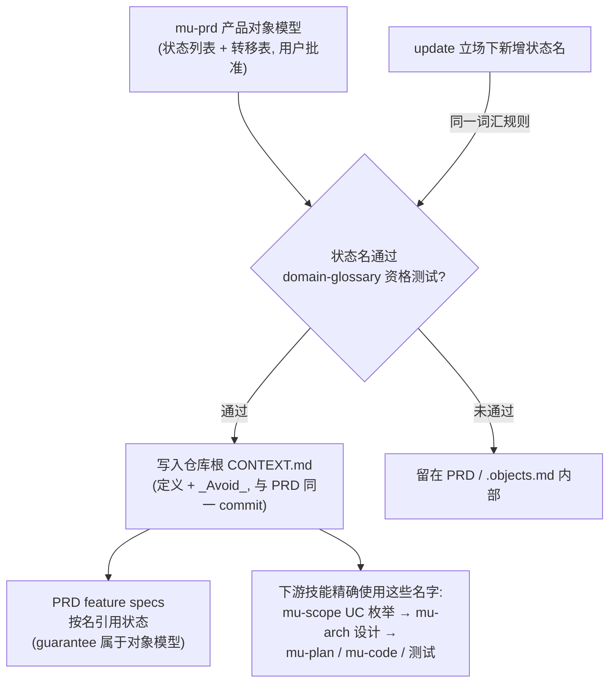
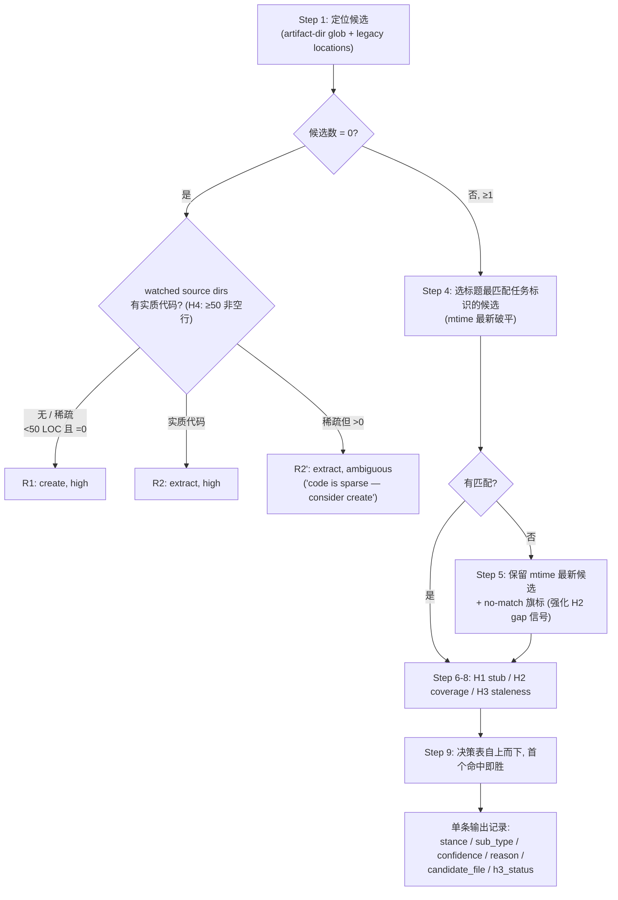

<details>
<summary>Referenced source files (5 files)</summary>

- `CONTEXT.md`
- `knowledge/principles/domain-glossary.md`
- `knowledge/principles/stance-detection.md`
- `knowledge/templates/context-md.md`
- `skills/mu-prd/SKILL.md`

</details>

# 域语言与立场机制

DevMuse 用两套互相咬合的机制保证"人、agent、工件"说同一种语言并以正确姿态进入工作。第一套是**域语言**：仓库根目录的 `CONTEXT.md` 共享词汇表，每个词条附带刻意弃用的同义词（`_Avoid_` 列表），由 `mu-explore`（harvest）与 `mu-arch`（coin）维护，准入由 `knowledge/principles/domain-glossary.md` 的三条资格测试把关。Sources: [CONTEXT.md:1-3](), [knowledge/principles/domain-glossary.md:1-5]()

第二套是**立场机制（Stance）**：creative skill（mu-mrd、mu-prd、mu-arch）在 Phase 0 运行 `knowledge/principles/stance-detection.md` 中的确定性检测算法，在 `create` / `update`（子类型 expand > gap-fill > sync）/ `extract` / `skip` 四种入场姿态中选其一，并通过统一的 Shared Consumption Protocol 处理置信度、slash 预确认与工件元数据。"Stance" 本身就是 `CONTEXT.md` 中的一个词条——域语言为立场机制命名，立场机制反过来守护产出域语言的技能，这正是两者放在同一页的原因。Sources: [knowledge/principles/stance-detection.md:1-3](), [CONTEXT.md:31-33]()

---

## CONTEXT.md：共享词汇表

### 为什么存在与懒创建

一个紧凑的术语替代一整句话，跨会话复用——共享语言让 agent 用项目自己的词汇命名变量与文件、按词汇导航代码库，并减少思考消耗的 token。但词汇表在每次会话开始时被读取，**每个词条每个会话都在消耗上下文**，因此准入门槛很高，修剪是维护的一部分。该机制改编自 mattpocock/skills 的 shared-language 实践。Sources: [knowledge/principles/domain-glossary.md:3-5]()

| 属性 | 规则 |
|------|------|
| 位置 | 仓库根目录 `CONTEXT.md`，对人和 agent 同等可见；用户可从 `CLAUDE.md` 以 `@` 引用强制加载 |
| 创建时机 | **懒创建**——第一个合格术语出现时才建文件；空脚手架是噪音 |
| 规模 | 软上限约 25 个词条；到达上限先修剪或合并再新增；只有当一份词汇表开始服务两套语汇时才按 bounded context 拆分 |
| 单一事实源 | explore 工件、设计文档、wiki 页面链接到 `CONTEXT.md`，绝不复述定义；仅单个组件内使用的局部行话留在该区域的 explore 工件中 |

Sources: [knowledge/principles/domain-glossary.md:9-12]()

### 资格测试（Qualification Test）

一个术语进入 `CONTEXT.md`，**三条必须全部成立**：

| # | 条件 | 含义 |
|---|------|------|
| 1 | Project-specific | 由本项目发明或独有；通用工程词汇（TDD、frontmatter、worktree、dogfooding）与宿主平台概念无论出现多频繁都不合格 |
| 2 | Compression | 在关于项目的真实对话中替代一个短语或整句；不省字就不占坑 |
| 3 | Recurring | 跨文件、跨会话讨论项目时反复需要，而非描述单个文件的内部细节 |

犹豫时的决胜题：*一位精通技术栈但初来乍到的工程师，缺了这个词条会不会误解一场项目对话？* 不会 → 不收录。Sources: [knowledge/principles/domain-glossary.md:14-22]()

### 词条格式与 `_Avoid_` 反漂移杠杆

```markdown
**<Term>**
<One-sentence definition.>
_Avoid_: <synonym>, <synonym>
```

`_Avoid_` 行是防漂移杠杆：它点名项目**刻意不用**的同义词，让 agent 停止在多个近义词之间摇摆，收敛到一个词。凡是存在合理同义词的术语都要写这一行。Sources: [knowledge/principles/domain-glossary.md:24-32]()

DevMuse 自己的 `CONTEXT.md` 是活例：**Stance**（creative skill 在 Phase 0 选择的入场模式，_Avoid_: mode、entry state）、**On-demand skill**（永不自动路由、只经显式斜杠调用的技能，_Avoid_: slash-only skill、manual skill）、**Guidance over control**（检测、路由与 gate 只产出可被用户一个词推翻的建议，_Avoid_: soft enforcement）。Sources: [CONTEXT.md:31-33](), [CONTEXT.md:19-21](), [CONTEXT.md:75-77]()

### 三段结构与 Flagged Ambiguities

模板规定三段结构：`## Language`（词条）、`## Relationships`（可选，仅记录结构性事实）、`## Flagged Ambiguities`（一词二义或二词一义，标注 open / resolved 及裁决日期）。Sources: [knowledge/templates/context-md.md:1-22](), [knowledge/principles/domain-glossary.md:34-43]()

DevMuse 的 Flagged Ambiguities 当前记录三个已裁决案例：(1) "UC" 专属于 mu-scope 的 Use Case，mu-explore 的五种探索类型统一称 **variant**（2026-07-13 grill 会话裁决）；(2) "gate" 永不裸用，必须限定为 HARD-GATE / pipeline gate / sign-off gate / size-area gate 之一（2026-07-13，四个复合名互斥、无需改名）；(3) "mu-design" vs "mu-arch" —— 2026-04-14 统一改名为 mu-arch（`108f3f6`，hook 残留在 `304043d` 修复），`docs/plans/` 下的带日期快照保留旧名作历史记录。Sources: [CONTEXT.md:91-95]()

### 三个维护动作

| 动作 | 执行者 | 时机与内容 |
|------|--------|-----------|
| **Harvest** | `mu-explore` | 建完 explore 工件后，把收集到的域术语逐个过资格测试；通过者提升进 `CONTEXT.md`（不存在则创建），explore 工件的 Domain Terms 区只留区域局部术语并链接 `CONTEXT.md` |
| **Coin** | `mu-arch` | 命名新组件/概念前先读 `CONTEXT.md` 复用既有语言；设计铸造的新名经用户批准后，定义 + `_Avoid_` 与设计文档同一 commit 记录 |
| **Resolve** | 任意 skill | 发现一词二义或二词一义时加入 Flagged Ambiguities；用户裁决后记录裁决、更新胜出词条的 `_Avoid_` 列表、顺手改名残留用法 |

Harvest 或 coin 的完成标准：每个新增词条通过资格测试、在合理存在同义词处带 `_Avoid_` 列表、且定义在仓库文档中无任何重复。Sources: [knowledge/principles/domain-glossary.md:45-53]()

---

## 词汇贯通：从产品状态名到实现层

域语言不只服务对话——它把 mu-prd 的产品对象模型状态名一路贯通到实现层。mu-prd 触发 Product Object Model 时（审批、订单、配额、时限有效性等有生命周期的业务对象），**经批准的状态名就是域语言**：通过 domain-glossary 资格测试的状态名，与 PRD 同一 commit 写入仓库根 `CONTEXT.md`（不存在则创建；定义 + `_Avoid_` 同义词），且"下游技能精确使用这些名字"。Sources: [skills/mu-prd/SKILL.md:134-142](), [knowledge/principles/domain-glossary.md:47-48]()



贯通的三个具体咬合点：

| 咬合点 | 规则 |
|--------|------|
| Feature spec 引用 | 触及已建模对象的 feature，其规则**按名引用**对象模型的状态；跨重试与竞态的保证（"双击永不产生两个订单"）属于对象模型而非 use case |
| Update 立场 | `update` 分支下 gap-fill 隐含的状态变更在对象模型中编辑、正文按状态名引用；**新状态名走与创建时相同的 CONTEXT.md 词汇规则** |
| 单一事实源 | 状态名的定义只在 `CONTEXT.md` 一处；explore 工件、设计文档、wiki 只链接不复述 |

Sources: [skills/mu-prd/SKILL.md:121](), [skills/mu-prd/SKILL.md:35](), [knowledge/principles/domain-glossary.md:12]()

---

## 立场检测（Stance Detection）

### 输入与四种立场

mu-mrd、mu-prd、mu-arch 三个 creative skill 在各自 Phase 0 以本地参数（artifact type / artifact dir / legacy locations / 当前任务标识 / watched source dirs）运行同一算法。通用规则：**技能自己的 artifact dir 永远不进自己的 watched set**（防循环 staleness）。例如 mu-prd 的参数为 artifact dir `docs/prd/`、legacy 根目录 `PRD.md`、watched dirs `src/pages/`、`src/screens/`、`src/views/`、`app/`（均缺失时回退 `src/`，再缺失则 H3 返回 `insufficient-signal`）。Sources: [knowledge/principles/stance-detection.md:5-16](), [skills/mu-prd/SKILL.md:20-28]()

| 立场 | 含义 | 子类型 |
|------|------|--------|
| `create` | 从零撰写工件 | — |
| `update` | 修订既有工件 | `expand`（填 stub 结构）> `gap-fill`（补覆盖缺口）> `sync`（对齐代码现状） |
| `extract` | 从既有代码逆向合成工件 | — |
| `skip` | 既有工件已获批准，直通下游 | — |

Sources: [knowledge/principles/stance-detection.md:1](), [knowledge/principles/stance-detection.md:82-90]()

### 确定性检测算法（9 步）

算法保证每次调用**恰好产出一个输出**，即使在不确定情形下。



Sources: [knowledge/principles/stance-detection.md:17-27](), [knowledge/principles/stance-detection.md:133-146]()

### 四个启发式

| 启发式 | 检测目标 | 判定规则 |
|--------|----------|----------|
| H1 stub | 工件是否为占位稿 | 字数 < 300 **或** 占位符 ≥ 3（`TODO` / `<TBD>` / `FIXME` / 行尾 `...`）→ 明确 stub；> 500 字且零占位 → 非 stub；300-500 字 + 1-2 占位 → 灰区，标 `AMBIGUOUS`，倾向 `update(expand)` |
| H2 coverage | 工件是否覆盖当前任务 | 解析 H1/H2 标题，对任务标识做大小写不敏感子串匹配**或** ≥60% Jaccard token 重叠（去停用词）；≥1 命中 → covered，0 命中 → gap |
| H3 staleness | 工件是否落后代码 | `git log -1 --format=%at -- <watched_dirs>`；任一 watched dir 的提交时间 > 工件 mtime + **7 天宽限** → stale；watched dirs 全部不存在 → 返回 `insufficient-signal`（是独立值，**不得**当作 not-stale） |
| H4 code substance | "code exists" 的资格 | 不是"目录里有文件"，而是至少一个 watched dir 合计 **≥50 非空行**；低于阈值仍走 extract 但 confidence 降为 `ambiguous` 并明示 create 覆盖路径 |

Sources: [knowledge/principles/stance-detection.md:31-64]()

### 决策表与子类型优先级

行自上而下求值，首个命中即胜：

| # | 0 候选 | H1 | H2 | H3 | code exists (H4) | → stance | → sub-type | 置信度 |
|---|--------|----|----|----|------------------|----------|-----------|--------|
| R1 | yes | — | — | — | 无（或 <50 LOC 稀疏） | `create` | — | high |
| R2 | yes | — | — | — | 实质（≥50 LOC） | `extract` | — | high |
| R2′ | yes | — | — | — | 稀疏（<50 LOC 但 >0） | `extract` | — | **ambiguous** |
| R3 | no | stub | — | — | — | `update` | `expand` | high |
| R4 | no | 非 stub | gap | — | — | `update` | `gap-fill` | high |
| R5 | no | 非 stub | covered | stale | — | `update` | `sync` | high |
| R6 | no | 非 stub | covered | not / insufficient | — | `skip` | — | high |

子类型优先级 `expand > gap-fill > sync`（先结构、再覆盖、后内容）由行序隐式强制——R3 先于 R4 先于 R5。commit 信息取胜出行的子类型，但工件 History 区记录**所有**触发的信号。legacy 位置命中会把 `0-candidate` 翻为 no。Sources: [knowledge/principles/stance-detection.md:66-94]()

### 强制覆盖、中途换立场与错误处理

用户可经 slash hint（`/mu-<skill> <stance>`）或建议后的一个词覆盖检测，agent **立即执行**——不重检、不阻塞。四个冲突场景显式定义以守住"no silent destruction"：

| 用户强制 | 工件状态 | 行为 |
|----------|----------|------|
| `create` | 已存在 | 警告一次；在约定路径新建（可能同名覆盖）；**不**归档/移动/删除旧文件——想保留由用户自己改名 |
| `extract` | 已存在 | 警告一次；抽取结果写入带时间戳的同级文件 `docs/<type>/<base>-extracted-YYYY-MM-DD.md`，原件不动 |
| `skip` | 无工件 | 报错降级：提议 `create` 并询问用户 |
| `update` | 无工件 | 报错降级：提议 `create` 并询问用户 |

Phase 0 之后用户要求换立场时不硬停：已产出内容以 `mid-flow switch: was <old>, now <new>` 记入 History，重跑 Phase 0 检测，用户显式覆盖优先，在新分支继续——体现 **Guidance over control**。错误路径（启发式互相矛盾 → `confidence=ambiguous` 带最佳猜测；候选文件损坏 → 视为不存在并标注路径；extract 无源 → 降级 create；sync 时文档与代码不可调和 → 双版本并置、绝不静默择一）全部**非阻塞**。Sources: [knowledge/principles/stance-detection.md:96-131](), [CONTEXT.md:75-77]()

### 共享消费协议（Shared Consumption Protocol）

算法返回后，每个消费技能跑同样四步；技能自身只携带参数块与分支路由表：

| 步骤 | 规则 |
|------|------|
| 1. Confidence handling | `high` → 静默继续、零对话；`ambiguous` → 呈现"Detected: stance=`<stance>`, confidence=`ambiguous`. Reason: `<one-line>`. Override? (`create` / `update` / `extract` / `skip`)" |
| 2. Slash 预确认 | `/<skill> <stance>` hint——包括上游技能 terminal 提示用户运行的 slash 命令（如 mu-mrd full 模式 terminal 的 `/mu-prd create`）——视为**预确认**：不弹对话，直接执行 |
| 3. Record and route | 记录获批立场，路由到技能自己的分支表；`skip` 直通仅因既有工件曾获批准——**永不绕过技能的 HARD-GATE**（HARD-GATE 在立场检测之前求值） |
| 4. Stance → 工件元数据 | 工件头部增加 `> **Stance:**`、`> **Sub-type:**`、`> **Detected at:** YYYY-MM-DD (commit <short-sha>)`；commit 前缀 `docs(<artifact-dir>): <stance>[(sub-type)]: ...` |

**Fresh-create 元数据修剪**：全新 `create`（未检出先前工件）省略 Sub-type 与 Detected-at——没有检测就无可记录；两者从首次 `update`/`extract` 起出现。History 首行须概括 create 轮的关键决策——光秃秃的 "Initial creation" 是噪音。每次调用可用 `--no-stance-meta` 退出元数据记录。Sources: [knowledge/principles/stance-detection.md:148-155](), [skills/mu-prd/SKILL.md:49](), [skills/mu-prd/SKILL.md:161-167](), [CONTEXT.md:88]()

---

## See also

- [四层架构](four-layer-arch.md) — knowledge/principles 层（domain-glossary、stance-detection 所在）如何被 skills 层消费
- [产品对象模型](product-object-model.md) — 状态建模的完整规则；本页只讲状态名如何进入域语言
- [市场与产品分析](market-product-analysis.md) — mu-mrd 与 mu-prd 的 Phase 0 立场检测在各自流程中的位置
