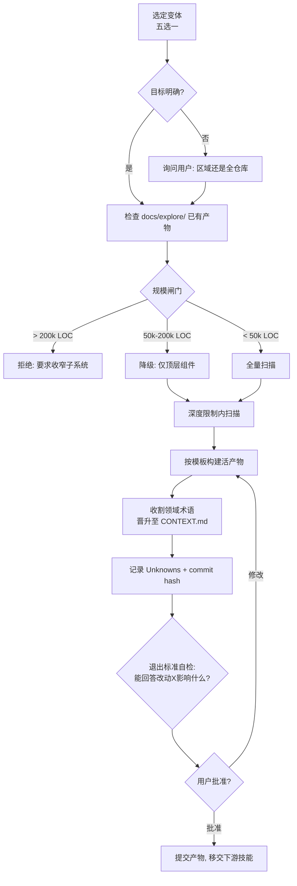
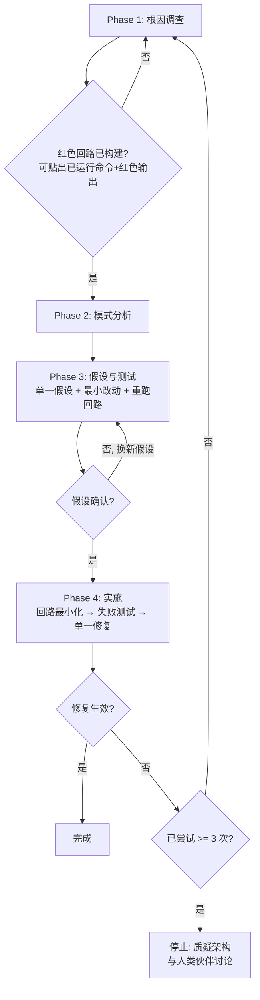

Referenced source files (6 files)

- `skills/mu-explore/SKILL.md`
- `skills/mu-debug/SKILL.md`
- `knowledge/templates/explore.md`
- `skills/mu-debug/root-cause-tracing.md`
- `skills/mu-debug/defense-in-depth.md`
- `skills/mu-debug/condition-based-waiting.md`

# 正交技能：mu-explore 与 mu-debug

DevMuse 的主管道处理"从需求到交付"的线性流程，而 `mu-explore` 与 `mu-debug` 是两个正交技能，分别对应开发中的两类非线性场景：**理解陌生代码**和**排查异常行为**。二者共享同一种设计哲学——用硬性门槛（gate）阻止最诱人的捷径：mu-explore 阻止"只在聊天里总结一下"（chat-only summary），mu-debug 阻止"没有复现就直接猜修复"（fixes without root cause）。

mu-explore 的产出是 `docs/explore/` 下的**活产物**（living artifact，无日期的持久文件，原地更新），并附带一个向仓库根 `CONTEXT.md` 收割领域术语的步骤；mu-debug 则以"红色回路"（Red Loop）为第一阶段的核心闸门，强制在提出任何假设之前先拿到一条已运行过、输出为红的复现命令。Sources: [mu-explore/SKILL.md:6-12](), [mu-debug/SKILL.md:16-22](), [mu-debug/SKILL.md:87-96]()

## mu-explore：五种探索变体与活产物

### 定位与硬性门槛

mu-explore 的目标是为陌生代码建立心智模型，并将其固化为**持久的、可跨会话复用的产物**——它明确区别于架构设计（`mu-arch`）、用例圈定（`mu-scope`）和一次性的代码问答（直接 Grep/Read 即可，无需产物）。Sources: [mu-explore/SKILL.md:6-8](), [mu-explore/SKILL.md:25-30]()

技能内置 HARD-GATE：在 `docs/explore/` 写入持久产物并获得用户确认之前，**不得**移交给 Implement / Design-tech / Reproduce 等后续工作。仅有聊天摘要不算产物——"跳过持久化"正是该技能要防止的默认失败模式："A chat summary without an artifact is a lost mental model"，下一个会话将从零开始。Sources: [mu-explore/SKILL.md:10-12](), [mu-explore/SKILL.md:14-23]()

### 五种变体

开始探索前必须**选定一种变体**（不明确时用一句话询问用户），不同变体有不同的聚焦点和深度：

| 变体 | 触发场景 | 聚焦点 | 深度 |
|------|---------|--------|------|
| **onboarding** | 刚 clone 的仓库 | 顶层结构、核心思路 | 全仓库，浅层 |
| **takeover** | 接手被弃置的项目 | 部落知识、死代码、归属不清 | 全仓库，深层 |
| **dependency-eval** | 评估是否采用某依赖 | 公共 API、质量信号、姿态 | 由外向内，浅层 |
| **pre-change** | 修改不熟悉的区域 | 目标区域 + 爆炸半径（调用方、依赖方） | 区域内，文件数封顶 |
| **pre-debug** | 不熟悉区域出现 bug | bug 邻近代码 + 数据流 | 区域内，症状导向 |

Sources: [mu-explore/SKILL.md:32-44]()

### 深度纪律与规模闸门

深度限制是**硬性停止条件**：超限的正确反应是停下来让用户收窄目标，而不是产出一份"看似完整实则肤浅"的产物。Sources: [mu-explore/SKILL.md:122-130](), [mu-explore/SKILL.md:150]()

| 变体 | 深度规则 |
|------|---------|
| onboarding / takeover / dep-eval | 组件图深度 ≤ 2；被推迟的分支要显式列出，供用户按需加深 |
| pre-change | 不限深度，但调用链封顶 **50 个文件**；超出则截断并明示 |
| pre-debug | 仅限 bug 邻近区域；从症状沿数据流追踪，封顶 50 个文件 |

扫描前还有按 LOC 的规模闸门：

| 区域规模 | 动作 |
|---------|------|
| < 50k LOC | 全量扫描 |
| 50k–200k LOC | 可执行，但仅覆盖顶层组件（不深入） |
| > 200k LOC | 拒绝执行；要求用户指定一个子系统 |

Sources: [mu-explore/SKILL.md:122-138]()

### 活产物模板与领域术语收割

产物按模板 `knowledge/templates/explore.md` 构建，路径无日期（`docs/explore/_overview.md` 或 `docs/explore/<component>.md`），更新原地覆盖，由 History 表（日期、commit、变体、变更摘要）追加记录演化轨迹。模板头部记录变体、目标和基线 commit SHA，作为未来重探的基准。Sources: [mu-explore/SKILL.md:114-120](), [explore.md:1-7](), [explore.md:91-97]()

清单中的**领域术语收割**是与 `CONTEXT.md` 的关键连接点：将探索中收集的每个术语过一遍 `knowledge/principles/domain-glossary.md` 的资格测试，通过者晋升到仓库根 `CONTEXT.md`（不存在则创建）；产物自身的 Domain Terms 区只保留**区域局部**术语，其余链接到 `CONTEXT.md`——项目级词汇的单一事实来源。模板还要求记录"本次探索晋升到 CONTEXT.md 的术语"清单。Sources: [mu-explore/SKILL.md:106](), [explore.md:46-54]()

产物中另有三个强制的诚实性区块：

- **Unknowns（必填）**——所有不确定性显式列出，禁止编造覆盖度；这是未来会话复用率最高的区块。
- **Doc vs Code Conflicts**——文档与代码不一致时，两个版本都记录，标注"文档可能过时"，不得默默裁决。
- **Exit Criterion Check**——请求批准前自检：产物能否回答"改动 X 会影响什么？"

Sources: [explore.md:56-67](), [explore.md:77-82](), [mu-explore/SKILL.md:107-109](), [mu-explore/SKILL.md:140-142]()

Sources: [mu-explore/SKILL.md:48-94](), [mu-explore/SKILL.md:96-112]()

## mu-debug：红色回路优先与四阶段根因分析

### 铁律与红色回路闸门

mu-debug 的铁律是 `NO FIXES WITHOUT ROOT CAUSE INVESTIGATION FIRST`——未完成 Phase 1 就不得提出修复方案。随机修复浪费时间并制造新 bug，症状级修补即失败。Sources: [mu-debug/SKILL.md:8-22]()

Phase 1 的核心是**构建红色回路（Build the Red Loop）**：一条能复现**用户确切症状**的命令——失败的测试、curl 脚本、与已知良好快照做 diff 的 CLI 运行、无头浏览器脚本、回放的捕获 trace、一次性 harness、fuzz 循环、二分运行或新旧差分运行（大致按此优先序选择）。关键纪律是：回路必须**从症状构建，而不是从你的理论构建**——由假设塑形的复现只能确认该假设的邻域。Sources: [mu-debug/SKILL.md:87-89]()

回路要**紧**：能变红（断言症状本身，而非"没崩溃"）、确定性（每次运行结论一致）、快（秒级）、agent 可自行运行（无需人工介入）。间歇性 bug 要先把复现率拉高到可调试水平（循环触发 100 次、并行化、加压、收窄时间窗——50% 的 flake 可调试，1% 不行）；确实无法构建时应停下明说，列出尝试过的方案并向用户索要复现环境、捕获产物（HAR、日志、core dump）或临时插桩许可。Sources: [mu-debug/SKILL.md:91-94]()

**闸门本身**：Phase 1 完成的标志是——你能贴出一条**已经运行过**的命令及其红色输出。在这条命令存在之前就读代码构建理论，正是该阶段要防止的失败；"我看到代码里就是这个 bug"不等于证明它，红色回路才能证明因果并验证修复。Sources: [mu-debug/SKILL.md:96](), [mu-debug/SKILL.md:258-260](), [mu-debug/SKILL.md:290-291]()

### 四阶段流程

| 阶段 | 关键活动 | 成功标准 |
|------|---------|---------|
| **1. 根因调查** | 精读报错、构建红色回路、检查近期变更、多组件系统逐边界插桩取证 | 红色回路可运行且在症状上变红 |
| **2. 模式分析** | 找同库可工作的相似代码、完整阅读参考实现、逐项列出差异 | 识别出可工作与损坏之间的差异 |
| **3. 假设与测试** | 形成单一假设、最小改动验证、每次探测后重跑红色回路 | 假设被确认，或换新假设 |
| **4. 实施** | 将红色回路最小化并晋升为失败测试、单一修复、验证 | bug 解决，测试全绿 |

Sources: [mu-debug/SKILL.md:294-301](), [mu-debug/SKILL.md:104-119](), [mu-debug/SKILL.md:154-201](), [mu-debug/SKILL.md:203-222]()

Phase 4 的第一步是把 Phase 1 的复现**最小化后晋升为失败测试**：逐个删减元素直到每个剩余元素都是承重的，修复前测试必须先存在。修复失败时有硬性熔断：尝试次数 < 3 则带着新信息回到 Phase 1；**≥ 3 次失败即停止修复、质疑架构**（每次修复都在别处暴露新的共享状态/耦合，是架构错误的信号，不是又一个失败假设），必须先与人类伙伴讨论。Sources: [mu-debug/SKILL.md:206-214](), [mu-debug/SKILL.md:224-245]()

Sources: [mu-debug/SKILL.md:46-71](), [mu-debug/SKILL.md:96]()

### 三项支撑技术

mu-debug 目录内附三份配套技术文档，服务于不同阶段：

| 技术 | 核心原则 | 何时使用 |
|------|---------|---------|
| **根因回溯**（root-cause-tracing） | 沿调用链向上回溯到原始触发点，在源头修复——"NEVER fix just the symptom" | 错误出现在调用栈深处、不清楚坏数据从哪来 |
| **纵深防御**（defense-in-depth） | 在数据经过的每一层加校验，让 bug 在结构上不可能——单点校验会被其他代码路径、重构或 mock 绕过 | 找到根因之后加固 |
| **条件等待**（condition-based-waiting） | 等待你真正关心的条件，而不是猜测耗时——任意 sleep 在快机器上通过、在负载/CI 下失败 | 测试 flaky、含任意延时 |

Sources: [mu-debug/SKILL.md:314-320](), [root-cause-tracing.md:1-8](), [root-cause-tracing.md:154](), [defense-in-depth.md:1-16](), [condition-based-waiting.md:1-8]()

根因回溯的流程是：观察症状 → 找到直接原因 → 追问"谁调用了它、传了什么值" → 持续上溯直到原始触发点（如实例中五层回溯发现空字符串 `projectDir` 源自测试在 `beforeEach` 之前访问了 `tempDir`），在源头修复后再配合纵深防御。Sources: [root-cause-tracing.md:32-64](), [root-cause-tracing.md:109-128]()

纵深防御的四层为：入口校验（API 边界拒绝非法输入）、业务逻辑校验、环境守卫（特定上下文中拒绝危险操作）、调试插桩（留存取证上下文）。实战中四层缺一不可——不同代码路径绕过入口校验、mock 绕过业务校验、平台差异需要环境守卫。Sources: [defense-in-depth.md:20-85](), [defense-in-depth.md:114-122]()

条件等待用轮询条件替代任意延时（如 `waitFor(() => machine.state === 'ready')`），仅当测试的就是计时行为本身时才允许固定延时，且必须先等触发条件、基于已知时序并注释说明理由。Sources: [condition-based-waiting.md:34-57](), [condition-based-waiting.md:95-107]()

## 两个技能的交汇

mu-explore 的 **pre-debug 变体**是二者的显式接口：bug 位于不熟悉的区域时，先用 mu-explore 沿症状追数据流建立局部心智模型（封顶 50 个文件），产物再作为 mu-debug 根因调查的输入。mu-debug 的 Phase 4 则移交给 `mu-code`（TDD Discipline）写失败测试、`mu-review` 验证修复。Sources: [mu-explore/SKILL.md:42](), [mu-explore/SKILL.md:164-169](), [mu-debug/SKILL.md:322-325]()

两者共同的反理性化设计也值得注意：mu-explore 用表格逐条驳斥"用户只想要快速答案""最后再补文件""没有 unknowns"等借口；mu-debug 同样驳斥"问题很简单不需要流程""紧急没时间""有了假设再搭复现"。闸门存在的意义正是在这些时刻生效。Sources: [mu-explore/SKILL.md:154-162](), [mu-debug/SKILL.md:279-292]()

---

See also: [工作流与路由](workflow-and-routing.md), [领域语言与质量](domain-language-and-quality.md)
