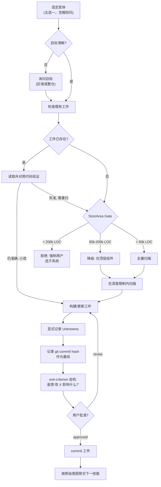
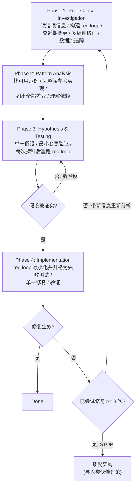

Referenced source files (7 files)

- `skills/mu-explore/SKILL.md`
- `skills/mu-debug/SKILL.md`
- `skills/mu-debug/root-cause-tracing.md`
- `skills/mu-debug/defense-in-depth.md`
- `skills/mu-debug/condition-based-waiting.md`
- `knowledge/templates/explore.md`
- `rules/bootstrap.md`

# 正交技能：mu-explore 与 mu-debug

mu-explore 与 mu-debug 是 DevMuse 的两个**正交（Orthogonal）技能**：它们不占据核心管线 Scope → Arch → Plan → Code → Review 中的固定位次，而是在管线外任意点由 bootstrap 路由规则自动触发——"understand / take over / evaluate" 类意图路由到 mu-explore，"fix / broken / bug / test failing" 类意图经 mu-scope 的 1-UC repro 进入 mu-debug。Sources: [rules/bootstrap.md:63-75](), [rules/bootstrap.md:83-85](), [rules/bootstrap.md:100-109]()

两者各自守卫一条不可协商的纪律：mu-explore 的 HARD-GATE 要求**持久心智模型工件落盘到 `docs/explore/` 并经用户确认**后才能移交下游——聊天摘要不算工件；mu-debug 的 Iron Law 要求**先完成根因调查、再提出修复**，其 Phase 1 的核心是先构建一条复现用户症状的 red loop（红圈），未跑出红色输出之前不得基于读代码的理论提修复。Sources: [mu-explore/SKILL.md:10-12](), [mu-debug/SKILL.md:17-22](), [mu-debug/SKILL.md:87-96]()

## 正交定位与自动路由

bootstrap 将技能分为四类：核心管线（auto-routed）、正交（auto-routed）、按需（slash only）与元技能。mu-explore 和 mu-debug 独占"正交"类——与管线技能一样自动路由，但不绑定管线次序。Sources: [rules/bootstrap.md:83-95]()

| 技能 | 触发信号（意图 → 开局动作） | 进入方式 | 终止状态 |
|------|------|------|------|
| mu-explore | understand / figure out / take over / evaluate / what does this do；reshape 且区域不熟悉（pre-change）；无动词匹配或病态仓库状态时的安全默认 | bootstrap 直接路由，或用户 `/mu-explore` | 移交由原始用户意图决定的下一技能；若意图仅为理解，则 commit 后结束 |
| mu-debug | fix / broken / error / bug / test failing / crash（先经 mu-scope 的 1-UC repro） | Pipeline Graph 边：mu-scope (fix route) → mu-debug | verified result → end |

Sources: [rules/bootstrap.md:63-75](), [rules/bootstrap.md:100-109](), [mu-explore/SKILL.md:164-169]()

两者也互为邻居：mu-explore 的 **pre-debug** 变体可在 bug 位于不熟悉区域时先行铺垫，其工件随后被 mu-debug 作为输入消费。Sources: [mu-explore/SKILL.md:30](), [mu-explore/SKILL.md:42](), [mu-explore/SKILL.md:168]()

## mu-explore：持久心智模型工件

mu-explore 为不熟悉的代码构建心智模型，产出一份**持久的、活的工件（living artifact）**，记录组件、入口点、领域术语与显式未知项。它与架构设计（mu-arch）、用例界定（mu-scope）、一次性代码问答（直接 Grep/Read）和调试（mu-debug）明确划界。Sources: [mu-explore/SKILL.md:6-8](), [mu-explore/SKILL.md:25-30]()

### HARD-GATE 与反模式

HARD-GATE 规定：在持久工件写入 `docs/explore/` **并且**用户确认之前，不得移交任何下游动作。该技能存在的意义正是防止其默认失败模式——"只在聊天里总结"：多段式 markdown 回复、"我这个会话记得住"、"用户只想要快速答案"、把 `docs/explore/` 当可选项，全部是违规。**没有工件的聊天摘要就是丢失的心智模型**——下个会话从零开始。Sources: [mu-explore/SKILL.md:10-12](), [mu-explore/SKILL.md:14-23]()

反合理化对照表进一步封堵借口：想要快就用 Grep/Read（那就不该调 mu-explore）；"最后再补文件"（不会补的，扫描时就写）；"Unknowns 太显然可以跳过"（它是未来会话复用最多的部分）。Sources: [mu-explore/SKILL.md:154-162]()

### 五种变体

开始前必须选定一个变体；不确定时用一句话询问用户。Sources: [mu-explore/SKILL.md:34-44]()

| 变体 | 场景 | 关注点 | 深度 |
|------|------|--------|------|
| **onboarding** | 刚 clone 仓库 | 顶层结构、核心思想 | repo-wide, shallow |
| **takeover** | 接手废弃项目 | tribal knowledge、死代码、归属不明 | repo-wide, deep |
| **dependency-eval** | 决定是否采用依赖 | 公共 API、质量信号、姿态 | outside-in, shallow |
| **pre-change** | 修改不熟悉的区域 | 目标区域 + 爆炸半径（callers, dependents） | 区域级，文件数封顶 |
| **pre-debug** | bug 位于不熟悉区域 | bug 相邻代码 + 数据流 | 区域级，症状聚焦 |

Sources: [mu-explore/SKILL.md:36-44]()

### 流程与规模门

Sources: [mu-explore/SKILL.md:48-94](), [mu-explore/SKILL.md:96-112]()

规模门（Size/Area Gate）与深度纪律是硬停止，不是可协商上限——超限是"让用户收窄目标"的信号，不是产出浅层假完整工件的理由：

| 区域规模 | 动作 |
|----------|------|
| < 50k LOC | 全量扫描 |
| 50k–200k LOC | 运行，但仅顶层组件（不深入） |
| > 200k LOC | 拒绝；强制用户选定子系统 |

| 变体 | 深度规则 |
|------|----------|
| onboarding / takeover / dep-eval | 组件图深度 ≤ 2；浮出被推迟的分支供用户加深 |
| pre-change | 深度不限；call chain 封顶 **50 files**，超出则分页/截断并浮出切口 |
| pre-debug | 仅 bug 相邻；从症状沿数据流追踪，封顶 50 files |

Sources: [mu-explore/SKILL.md:122-138](), [mu-explore/SKILL.md:150]()

### 工件模板与路径约定

工件路径无日期（living artifact，就地覆盖更新）：整仓定向 → `docs/explore/_overview.md`（下划线前缀排序靠前），组件级 → `docs/explore/<component>.md`。模板位于 `knowledge/templates/explore.md`，头部元数据记录变体、目标与 baseline commit（`git rev-parse HEAD` 全量 SHA）。Sources: [mu-explore/SKILL.md:114-120](), [knowledge/templates/explore.md:1-8]()

模板的几个关键强制段落：

| 段落 | 作用 |
|------|------|
| Unknowns | **必填**。所有缺口、不确定与"没看这块"都进这里——未来会话复用最多的段落 |
| Doc vs Code Conflicts | README/docs 与代码不一致时**双版本并记**，标注"文档可能过期"，绝不静默裁决 |
| Depth & Coverage Notes | 扫了什么、跳了什么；命中 50-file/depth-2 上限之处记录在案，供后续 re-explore 续扫 |
| Exit Criterion Check | 请求批准前自答："该工件能否回答'改 X 会影响什么？'" |
| Handoff / History | 下一技能及其所需输入；每次 re-explore 追加一行（日期、commit、变体、变更摘要） |

Sources: [knowledge/templates/explore.md:57-97](), [mu-explore/SKILL.md:140-142](), [mu-explore/SKILL.md:107-109]()

领域术语的处理遵循单一事实源：区域局部术语留在工件的 Domain Terms 段，通过资格测试的项目级词汇提升到仓库根 `CONTEXT.md`。Sources: [mu-explore/SKILL.md:106](), [knowledge/templates/explore.md:46-54]()

## mu-debug：红圈优先的四阶段根因分析

mu-debug 的核心原则：**永远先找根因再尝试修复，症状修复即失败**。适用于任何技术问题——测试失败、生产 bug、异常行为、性能问题、构建失败、集成问题——且**尤其**适用于时间压力下、"就一个快修"看似显然、已试过多次修复的场景。Sources: [mu-debug/SKILL.md:8-22](), [mu-debug/SKILL.md:24-44]()

### 四阶段流程

Sources: [mu-debug/SKILL.md:46-71](), [mu-debug/SKILL.md:294-301]()

### Phase 1 的核心：red loop（红圈）

红圈是一条**复现用户确切症状**的命令：失败测试、curl 脚本、与已知良好快照 diff 的 CLI 运行、headless-browser 脚本、回放捕获的 trace、一次性 harness、fuzz 循环、bisection、差分运行（旧 vs 新）——大致按此优先序选择。它必须**从症状构建，而非从理论构建**：按假设塑形的 repro 只能证实该假设的邻域。红圈要求四个"紧"性质：red-capable（断言症状本身而非"没崩溃"）、deterministic、fast（秒级）、agent-runnable（无需人工介入）。间歇性 bug 先把复现率拉高到可调试（触发 100 次循环、并行化、加压、收窄时间窗）；确实建不出来就停下如实说明，向用户要复现环境、捕获工件（HAR、log dump、core dump）或临时插桩许可。Sources: [mu-debug/SKILL.md:87-94]()

**Gate：Phase 1 未完成，直到你能粘贴一条已经跑过、且输出为红的命令。**在这条命令存在之前读代码构建理论，正是本阶段要阻止的失败。Sources: [mu-debug/SKILL.md:96]()

Phase 1 还包括：完整读错误信息与 stack trace、检查近期变更（git diff、新依赖、配置）、多组件系统在**每个组件边界**记录进出数据与环境传播后跑一次取证以定位失败层、以及对深栈错误的向后数据流追踪。Sources: [mu-debug/SKILL.md:79-101](), [mu-debug/SKILL.md:104-152]()

### 升级路径与红旗

Phase 4 先把红圈**最小化**（逐项裁剪至每个剩余元素都承重）再升格为失败测试（借用 mu-code 的 TDD Discipline），然后单一修复、验证。修复无效时计数：< 3 次回 Phase 1 重新分析；**≥ 3 次则 STOP 质疑架构**——每次修复在别处暴露新的共享状态/耦合、修复需要"大规模重构"、每次修复引发新症状，都指向架构性问题而非失败的假设，必须先与人类伙伴讨论。Sources: [mu-debug/SKILL.md:203-245]()

红旗清单（出现即回 Phase 1）："先快修再调查"、"改改 X 试试"、"一把多个变更跑测试"、在 red-capable 命令存在前读代码建理论、围绕假设而非用户症状构建 repro、已失败 2+ 次还要"再试一次"。用户信号如 "Is that not happening?"、"Stop guessing"、"We're stuck?" 同样意味着 STOP。Sources: [mu-debug/SKILL.md:247-277]()

若系统性调查确认问题真属环境性/时序性/外部性："无根因"也是完成——记录调查内容、实现恰当处理（retry、timeout、错误信息）、加监控。但 95% 的"无根因"其实是调查不完整。Sources: [mu-debug/SKILL.md:303-312]()

### 三份支持技术参考

mu-debug 目录内附三份技术文档，在流程的特定环节被引用：

| 参考文档 | 核心原则 | 何时用 |
|----------|----------|--------|
| `root-cause-tracing.md` | 沿调用链**向后**追踪到原始触发点，在源头修复，绝不只修症状点 | 错误出现在执行深处、stack trace 显示长调用链、不清楚坏数据从哪来（Phase 1 数据流追踪） |
| `defense-in-depth.md` | 数据经过的**每一层**都加校验，让 bug 结构性不可能——单点校验会被其他代码路径、重构或 mock 绕过 | 找到根因之后加固（root-cause-tracing 的 "BETTER: Also add defense-in-depth" 出口） |
| `condition-based-waiting.md` | 等待你真正关心的**条件**，而非猜测耗时的任意延迟 | 测试含任意 `setTimeout`/`sleep`、flaky、并行超时、等待异步完成 |

Sources: [mu-debug/SKILL.md:314-320](), [mu-debug/root-cause-tracing.md:1-8](), [mu-debug/defense-in-depth.md:1-8](), [mu-debug/condition-based-waiting.md:1-8]()

**根因追踪**的过程是五步：观察症状 → 找直接原因 → 问"谁调用了它" → 持续向上追踪传入的值 → 定位原始触发点。手动追不动时加插桩（操作前用 `new Error().stack` + `console.error` 记录目录、cwd、环境变量——测试里不要用可能被抑制的 logger），不知道哪个测试造成污染时用目录内的 bisection 脚本 `find-polluter.sh` 逐个跑测试定位首个污染者。真实案例：`.git` 被建进源码目录，五层回溯到测试在 `beforeEach` 之前访问了 `tempDir` 空串，修复在源头（getter 访问过早即抛错）。Sources: [mu-debug/root-cause-tracing.md:32-64](), [mu-debug/root-cause-tracing.md:66-95](), [mu-debug/root-cause-tracing.md:97-107](), [mu-debug/root-cause-tracing.md:109-128]()

**纵深防御**定义四层：Layer 1 入口点校验（API 边界拒绝明显非法输入）、Layer 2 业务逻辑校验（数据对本操作有意义）、Layer 3 环境守卫（如测试环境拒绝在 tmpdir 之外 `git init`）、Layer 4 调试插桩（留取证上下文）。同一案例中四层缺一不可：不同代码路径绕过入口校验、mock 绕过业务校验、平台边界情况需要环境守卫、插桩暴露结构性误用——最终 1847 个测试全过，bug 无法复现。Sources: [mu-debug/defense-in-depth.md:20-85](), [mu-debug/defense-in-depth.md:96-122]()

**条件等待**用轮询条件（每 10ms 轮询 + 必带超时与清晰报错 + 循环内取新鲜数据）替换任意延迟；仅在**测试计时行为本身**（debounce/throttle 间隔）时任意超时才合法，且需先等触发条件、基于已知计时、加注释说明理由。一次实战中修复 3 个文件 15 个 flaky 测试，通过率 60% → 100%，执行还快了 40%。Sources: [mu-debug/condition-based-waiting.md:24-33](), [mu-debug/condition-based-waiting.md:58-93](), [mu-debug/condition-based-waiting.md:95-115]()

## 与管线及彼此的集成

| 维度 | mu-explore | mu-debug |
|------|-----------|----------|
| 产出 | living artifact：`docs/explore/_overview.md` 或 `docs/explore/<area>.md` | 根因 + 从 red loop 升格的失败测试 + 单一修复 |
| 被谁消费 | mu-scope、mu-arch、mu-debug、mu-code（工件路径作为输入传递） | Pipeline Graph：verified result → end |
| 借用的邻接技能 | 个别查找委托给内置 Explore agent | 失败测试写法用 mu-code（TDD Discipline）；修复验证用 mu-review（Verification） |

Sources: [mu-explore/SKILL.md:164-171](), [mu-debug/SKILL.md:322-324](), [rules/bootstrap.md:100-109]()

数据支撑正交纪律的价值：系统化调试 15–30 分钟收敛 vs 随机修复 2–3 小时打摆，一次修复成功率 95% vs 40%，新增 bug 接近零。Sources: [mu-debug/SKILL.md:326-332]()

## See also

- [核心管线：Scope → Arch → Plan → Code → Review](core-pipeline.md) — 两个正交技能环绕的有序技能链
- [思维原则](thinking-principles.md) — HARD-GATE、反合理化等纪律模式的知识层来源
