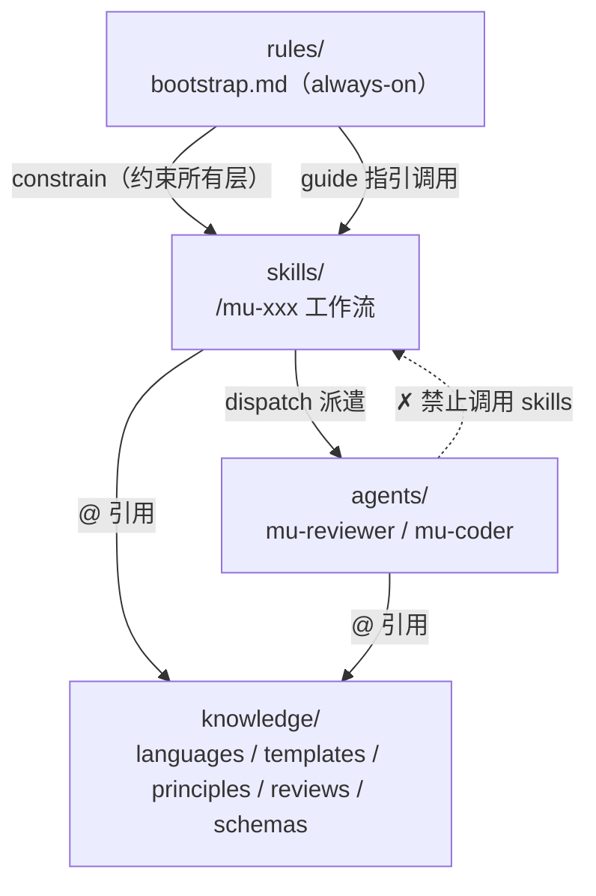
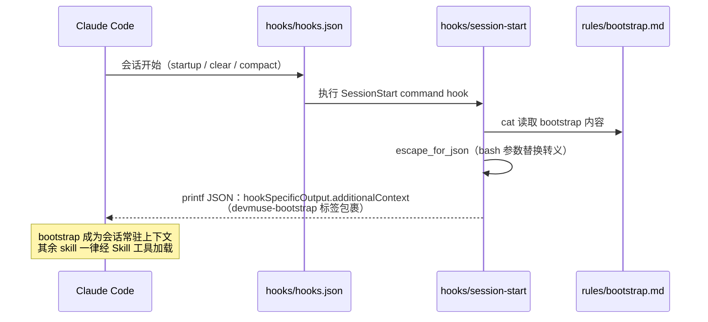

Referenced source files (7 files)

- [docs/architecture.md]()
- [rules/bootstrap.md]()
- [README.md]()
- [hooks/hooks.json]()
- [hooks/session-start]()
- [hooks/pre-tool-use/destructive-guard.sh]()
- [knowledge/principles/git-safety.md]()

# 四层架构：规则、技能、代理、知识

DevMuse 把一个完整的软件开发工作流插件组织为四个层次：`rules/` 回答"必须遵守什么"（always-on 原则）、`skills/` 回答"做什么"（用户触发的 `/mu-xxx` 工作流）、`agents/` 回答"谁来做"（由 skill 派遣的独立角色）、`knowledge/` 回答"怎么做"（按需注入的领域知识）。四层各有专属的装载通道：rules 经 SessionStart hook 注入每个会话，skills 经 Skill 工具加载，agents 由 skill 派遣（dispatch），knowledge 只被 `@` 相对路径被动引用。Sources: [docs/architecture.md:3-11](), [README.md:80-88]()

这套分层的核心动机是 token 成本模型：始终注入的内容（rules）刻意压到最小——"只放必须无条件常驻的内容，凡是能按需加载的都留在 skills 里"；而层与层之间的调用方向被约束为严格向下、禁止向上回调，保证 skills 编排、agents 执行、knowledge 被动这一职责边界不被侵蚀。Sources: [docs/architecture.md:75-77](), [docs/architecture.md:138-147]()

## 四层总览与判定标准

判断一段内容应归属哪一层，用四个问题即可裁决：

| 问题 | 回答 | 归属层 |
|------|------|--------|
| 始终生效、无需用户触发？ | 是 | `rules/` |
| 用户以 `/xxx` 调用？ | 是 | `skills/` |
| 独立角色、需要上下文隔离？ | 是 | `agents/` |
| 参考材料、按需加载？ | 是 | `knowledge/` |

Sources: [docs/architecture.md:13-20]()

`knowledge/` 还有一组细化标准：仅被单个 skill 使用的材料留在该 skill 目录内（locality first）；跨场景注入 agents、语言/框架特定模式、决策点思维评分卡（`principles/`）、特定关注点的 review checklist（`reviews/`）才进入 `knowledge/`。Sources: [docs/architecture.md:22-30]()

依赖方向严格向下，无向上回调：

Sources: [docs/architecture.md:138-147]()

## 装载机制

四层全部通过插件安装（`claude plugin add`）生效，无需手工配置，但各层的发现与加载方式不同：

| 目录 | 插件自动发现 | 机制 |
|------|:---:|------|
| `skills/` | ✅ | plugin.json 声明目录，Claude Code 发现各 SKILL.md |
| `agents/` | ✅ | plugin.json 逐个列出 agent 文件 |
| `hooks/hooks.json` | ✅ | 约定式自动加载（Claude Code v2.1+，不在 plugin.json 中声明） |
| `knowledge/` | ❌ | 不被自动发现；经 `@` 相对路径引用 |
| `rules/` | ❌ | 无原生支持；经 SessionStart hook 注入 |

Sources: [docs/architecture.md:34-44](), [docs/architecture.md:151-165]()

### rules/ — SessionStart 注入 bootstrap

`hooks/hooks.json` 声明 SessionStart hook（matcher 为 `startup|clear|compact`），执行 `hooks/session-start` 脚本。脚本读取 `rules/bootstrap.md`，做 JSON 转义后包进 `<devmuse-bootstrap>` 标签，经 `hookSpecificOutput.additionalContext` 注入每个会话的上下文——这就是 routing 规则"always-on"的实现方式。Sources: [hooks/hooks.json:3-14](), [hooks/session-start:10-33](), [docs/architecture.md:46-54]()

Sources: [hooks/session-start:7-33](), [hooks/hooks.json:3-14]()

被注入的 bootstrap 本身承担三件事：确立指令优先级（用户显式指令 > DevMuse skills > 默认 system prompt）、要求任何回应前先经 Skill 工具调用相关 skill（"invoke before any response"，成本不对称：多调一次浪费一个 tool call，漏调则整套工作流失效）、以及承载 routing——intent → opening move 表、四类 skill 分类（Core pipeline / Orthogonal / On-demand / Meta）和 Pipeline Graph（跨 skill 交接的唯一声明处）。Sources: [rules/bootstrap.md:10-22](), [rules/bootstrap.md:82-92](), [rules/bootstrap.md:94-109]()

### skills/ — Skill 工具加载

Skill 经 `Skill` 工具调用后内容才被加载并呈现，bootstrap 明确禁止用 Read 工具读 skill 文件。技能清单的 canonical 来源是 README 的 Skills 表（Pipeline / Orthogonal / On-demand / Meta 四类），architecture.md 只记录架构性事实——哪些 skill 派遣 agents。Sources: [rules/bootstrap.md:28-30](), [README.md:90-106](), [docs/architecture.md:79-90]()

### agents/ — skill 派遣

只有两个通用 agent：mu-reviewer（六模式评审：review-design / review-plan / review-code / review-compliance / review-coverage / review-security）与 mu-coder（实现专家）。设计决策是"2 个通用 agent + knowledge 注入"而非 N 个语言专属 agent：评审逻辑 80% 通用，改一处全局生效，新增语言只需加一个 knowledge 文件。派遣关系为 mu-arch / mu-plan / mu-code / mu-review 四个 skill 派遣 mu-reviewer，mu-code 另派遣 mu-coder。Sources: [docs/architecture.md:83-99](), [README.md:110-113]()

### knowledge/ — `@` 相对路径按需引用

Skills 与 agents 在自身 markdown 内以 `@../../knowledge/...` 形式引用知识文件；`@` 相对路径能跨目录生效是因为整个插件在安装时被复制进缓存。五个类目：`languages/`（语言评审标准，供 review-code）、`templates/`（工件模板）、`principles/`（决策点思维评分卡）、`reviews/`（评审 checklist）、`schemas/`（外部工具调用的结构化输出 schema）。每个文件以 "When to use" 开头声明其消费方 skill——目录本身即当前清单，不另维护文件级列表（会漂移）。Sources: [docs/architecture.md:56-65](), [docs/architecture.md:101-111]()

## 调用约束矩阵

| Caller → Callee | rules | skills | agents | knowledge |
|---|---|---|---|---|
| **rules** | — | 指引调用 | ✗ | @引用 |
| **skills** | 受约束 | 链式交接 | 派遣 | @引用 |
| **agents** | 受约束 | **✗ 禁止** | 嵌套派遣 | @引用 |
| **knowledge** | — | — | — | — |

Sources: [docs/architecture.md:117-126]()

五条关键约束：

- **skills → agents 单向派遣** — skills 编排，agents 执行。
- **agents → skills 禁止** — agent 不触发用户级工作流。
- **skills → skills 的交接声明在 bootstrap 的 Pipeline Graph** — skill 宣告完成，图指明后继（mu-mrd → mu-prd → mu-scope → mu-arch → mu-plan → mu-code → mu-review）；边消费的是 evidence 而非文件路径。
- **rules 只指引不调用** — bootstrap 告诉 Claude 何时调用哪个 skill。
- **knowledge 完全被动** — 只被引用，从不调用任何东西。

Sources: [docs/architecture.md:128-134](), [rules/bootstrap.md:94-124]()

## Hooks 基础设施

当前 `hooks/hooks.json` 只注册两个 hook：SessionStart 的 bootstrap 注入（上文已述）与 PreToolUse(Bash) 的 destructive-guard。历史上还存在过第三个——pipeline-gate（PreToolUse 对 Edit|Write 的管线次序强制），已在 v2.0（commit `33a26b7`，"guidance over enforcement"）移除：它是 skill-blind 的写入拒绝，存在 bootstrap 死锁（创建第一个 scope 文件的 Write 本身因缺少 scope 文件而被拒）且可被 Bash heredoc 轻易绕过；其职责由 bootstrap 的 Pipeline Graph（evidence-based 引导）取代。Sources: [hooks/hooks.json:1-28](), [rules/bootstrap.md:94-124]()

| Hook | 事件 / matcher | 角色 |
|------|---------------|------|
| session-start | SessionStart：`startup\|clear\|compact` | 读取 `rules/bootstrap.md` 注入会话上下文 |
| destructive-guard.sh | PreToolUse：`Bash` | 破坏性命令执行前请求用户确认 |

Sources: [hooks/hooks.json:1-28](), [README.md:121-125]()

### destructive-guard 安全钩

从 stdin 的 JSON 中提取 `command` 字段后分两级判定，整体 **fail-open**（任何脚本错误 → `exit 0`，不阻塞正常工作）：

1. **安全放行** — `rm -rf` 的目标若全部落在已知安全集（`node_modules dist .next build __pycache__`）且命令中无链式结构（`&&`、`||`、`;`、反引号、`$(`——防止借链式命令夹带），直接放行。
2. **危险模式询问** — 命中 `rm -rf`、`git push -f` / `--force`、`DROP TABLE`、`git reset --hard`、`git clean -fd` 之一时，输出 `{"permissionDecision":"ask", ...}` 请求用户确认。

Sources: [hooks/pre-tool-use/destructive-guard.sh:1-5](), [hooks/pre-tool-use/destructive-guard.sh:23-53](), [hooks/pre-tool-use/destructive-guard.sh:55-69]()

这个机械拦截钩与 knowledge 层的 `principles/git-safety.md` 构成互补：hook 在命令即将执行的瞬间拦截，而 git-safety 是行为协议——在任何分支操作前验证状态（`git branch && git status`）、破坏性操作（rebase / reset / force-push）前确认远端有备份并向用户陈述确切命令与后果、执行后验证结果。其根因诊断是同一句话："基于假设而非已验证的状态行事"；一次 5 秒的状态检查省掉一次 15 分钟的 `git reflog` 恢复。Sources: [knowledge/principles/git-safety.md:1-6](), [knowledge/principles/git-safety.md:19-32](), [README.md:121-125]()

## See also

- [pipeline-graph]() — bootstrap 中跨 skill 交接的唯一声明处：边、evidence 消费与控制/安全门
- [domain-language]() — `CONTEXT.md` 域语言：命名、术语与 `_Avoid_` 列表
