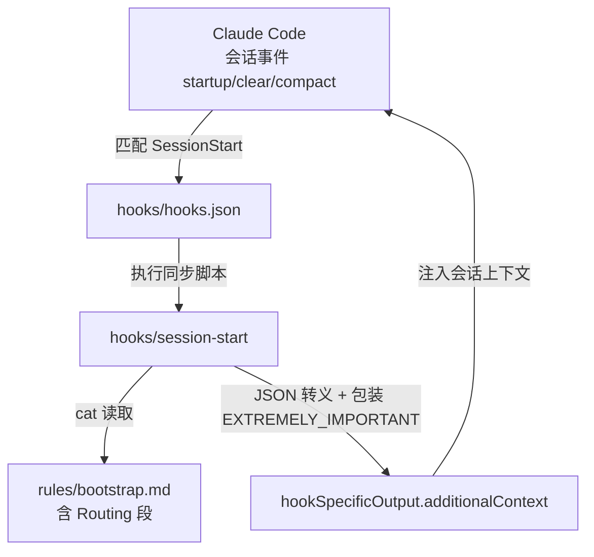
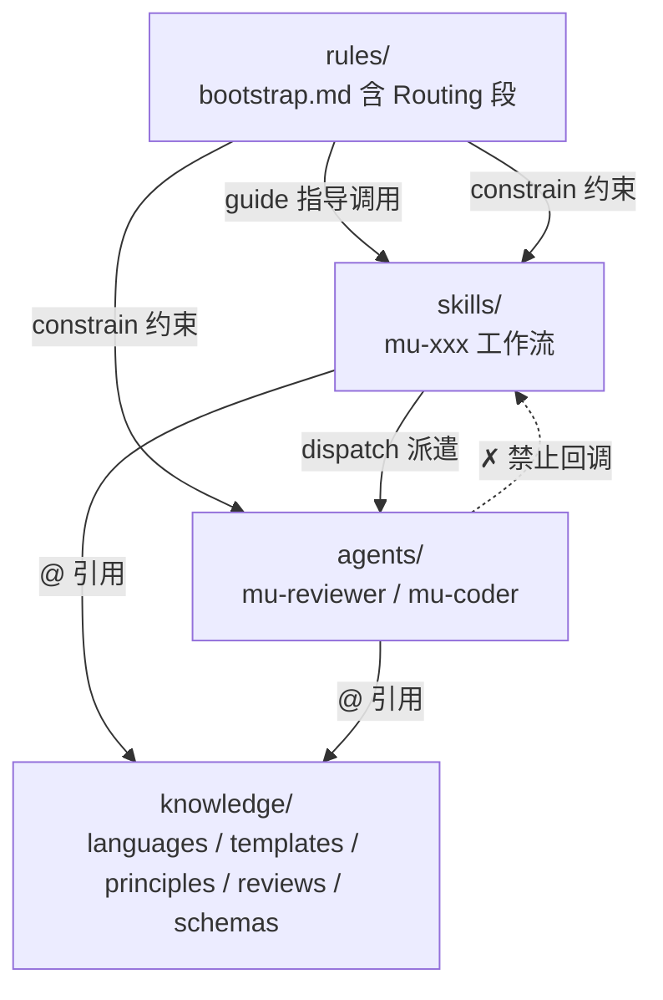

<details>
<summary>Referenced source files (6 files)</summary>

- [docs/architecture.md]()
- [README.md]()
- [.claude-plugin/plugin.json]()
- [rules/bootstrap.md]()
- [hooks/hooks.json]()
- [hooks/session-start]()

</details>

# DevMuse 四层架构

DevMuse 是一个面向 Claude Code 的完整软件开发工作流插件，其全部能力被组织为四个层次：`rules/`（必须遵守什么）、`skills/`（做什么）、`agents/`（谁来做）、`knowledge/`（怎么做）。本页解释这四层各自的职责边界、判定一段内容应归属哪一层的分类标准、每一层通过何种机制被加载进会话，以及层与层之间严格单向的调用约束。Sources: [README.md:5](), [docs/architecture.md:3-11]()

理解这套分层的意义在于：它把"始终生效的原则"、"用户触发的流程"、"需要上下文隔离的执行角色"和"按需注入的领域知识"放进了不同的加载通道和 token 成本模型中——始终注入的内容（rules）被刻意压到最小，而可以按需加载的一切都下沉到 skills 与 knowledge。Sources: [docs/architecture.md:71-77]()

## 四层总览

```
devmuse/
├── rules/        "What must be followed" — 始终生效的原则（经 SessionStart hook 加载）
├── skills/       "What to do" — 用户触发的工作流 (/mu-xxx)
├── agents/       "Who does it" — 由 skills 派遣的独立角色
└── knowledge/    "How to do it" — 按需注入的领域知识
```

Sources: [docs/architecture.md:5-11](), [README.md:82-88]()

### 层归属判定

一段新内容应该放进哪一层，由以下问题链决定——首个回答"是"的问题即确定归属：

| 判定问题 | 回答"是"时归属 |
|------|--------|
| 始终生效、无需用户触发？ | `rules/` |
| 用户通过 `/xxx` 调用？ | `skills/` |
| 独立角色、需要上下文隔离？ | `agents/` |
| 参考材料、按需加载？ | `knowledge/` |

Sources: [docs/architecture.md:13-20]()

对 `knowledge/` 还有一组细化标准：只被单个 skill 使用的材料留在该 skill 目录内（局部性优先）；跨场景注入到 agents、语言/框架特定的模式、决策点的思考准则（进 `principles/`）、特定关注点的评审清单（进 `reviews/`）才进入 `knowledge/`。Sources: [docs/architecture.md:22-30]()

## 加载机制

四层全部通过插件安装（`claude plugin add`）生效，无需手工配置，但底层机制各不相同：`skills/` 与 `agents/` 由 plugin.json 声明并被 Claude Code 自动发现，`hooks/hooks.json` 靠约定式自动加载，而 `knowledge/` 与 `rules/` 都不被自动发现——前者靠 `@` 相对路径引用，后者靠 SessionStart hook 注入。Sources: [docs/architecture.md:34-44]()

| 目录 | 插件自动发现 | 机制 |
|-----------|-------------|------|
| `skills/` | 是 | plugin.json 声明目录，Claude Code 自动发现 SKILL.md |
| `agents/` | 是 | plugin.json 逐个显式列出 agent 文件 |
| `hooks/hooks.json` | 是 | 约定式自动加载（不在 plugin.json 中声明） |
| `knowledge/` | 否 | 不被自动发现，通过 `@` 相对路径引用 |
| `rules/` | 否 | 原生不支持，经由 SessionStart hook 注入 |

Sources: [docs/architecture.md:34-44]()

### plugin.json：skills 与 agents 的入口

`.claude-plugin/plugin.json` 中，`skills` 以目录形式声明（`"./skills/"`），而 `agents` 逐文件列出（`./agents/mu-reviewer.md`、`./agents/mu-coder.md`）。`hooks/hooks.json` 则依靠 Claude Code v2.1+ 的约定式加载，不出现在 plugin.json 中。Sources: [.claude-plugin/plugin.json:12-16](), [docs/architecture.md:151-165]()

### rules 层的注入路径

`rules/` 不被插件系统原生支持，DevMuse 用一条 hook 链把它变成"每个会话都在场"的内容：

1. `hooks/hooks.json` 声明 SessionStart hook，matcher 为 `startup|clear|compact`，同步执行 `hooks/session-start` 脚本。Sources: [hooks/hooks.json:3-14]()
2. `session-start` 脚本读取 `rules/bootstrap.md`，做 JSON 转义后包装进 `<EXTREMELY_IMPORTANT>` 标记，经 `hookSpecificOutput.additionalContext` 输出，注入会话上下文。Sources: [hooks/session-start:11-33](), [docs/architecture.md:46-54]()

由于全部 rules 内容都收敛到 `bootstrap.md` 这一个文件，注入路径也只需读取它一个文件——这同时意味着后文的路由逻辑（Routing 段）会随 bootstrap 一起被每个会话加载。Sources: [hooks/session-start:11]()



Sources: [hooks/hooks.json:3-14](), [hooks/session-start:7-33]()

除 SessionStart 外，`hooks.json` 还注册了两个 PreToolUse hook：作用于 Edit/Write 的 `pipeline-gate.sh`（改码前强制 scope + design 产物存在，插件自编辑豁免，fail-open）和作用于 Bash 的 `destructive-guard.sh`（对 `rm -rf`、`git push -f` 等破坏性命令告警）。它们是 rules 层"约束所有层"语义在工具调用层面的执行者。Sources: [hooks/hooks.json:15-36](), [README.md:122-127]()

### knowledge 层的引用路径

skills 和 agents 在自身 Markdown 中用 `@` 相对路径引用 knowledge 文件（如 `@../../knowledge/languages/java.md`）。由于安装时整个插件被复制到缓存，`@` 相对路径可跨目录生效。Sources: [docs/architecture.md:56-65]()

## 各层职责

### rules/ — 全局决策指南（现含路由）

`rules/` 当前仅含一个文件 `bootstrap.md`，承担技能发现与调用规则、指令优先级、决策流程。设计原则是：rules 经 hook 注入、持续消耗 token，因此只放"必须无条件常驻"的内容，可按需加载的一律留在 skills。Sources: [docs/architecture.md:71-77](), [README.md:118-120]()

bootstrap.md 的核心内容包括：

- **指令优先级**：用户显式指令（CLAUDE.md/AGENTS.md/直接请求）> DevMuse skills > 默认系统提示——用户始终拥有最终控制权。Sources: [rules/bootstrap.md:18-26]()
- **领域过滤（路由前置）**：DevMuse 只处理软件工程与产品/商业分析两类工作，域外消息正常回复、不路由。Sources: [rules/bootstrap.md:42-48]()
- **路由（Routing 段）**：未加前缀的域内消息在此段被直接分类并路由，`/mu-*` 前缀绕过路由。路由信号是 git/fs 事实而非推断——意图动词、`docs/scope|specs|prd|biz/*.md` 下产物是否存在、近期作者熟悉度等。Sources: [rules/bootstrap.md:50-83]()
- **意图 → 开局动作**：首个匹配胜出，多动词优先级为 fix > review > reshape > create-feature > implement > understand；置信度决定摩擦力——单一无歧义动词静默调用，两个候选给一行确认，更模糊则给完整提案。Sources: [rules/bootstrap.md:63-82]()
- **四类技能划分**：Core pipeline（自动路由）、Orthogonal（自动路由）、On-demand（仅 slash 调用，匹配意图只给指针不调用）、Meta。Sources: [rules/bootstrap.md:84-93]()
- **子代理短路**：被派遣执行具体任务的 subagent 跳过 bootstrap，避免执行角色重新进入路由逻辑。Sources: [rules/bootstrap.md:6-8]()

> **架构变更提示**：路由曾是独立的 `mu-route` 技能，现已被折叠进 `bootstrap.md` 的 Routing 段——因此"意图分类与派单"这件事如今发生在 **rules 层**（每会话常驻），而非某个按需加载的技能。这也是当前 skills 数量为 13 的原因之一。Sources: [rules/bootstrap.md:50-93]()

### skills/ — 用户触发的工作流

技能清单（名称、分类、职责）的唯一权威来源是 README 的 Skills 表，架构文档只记录"哪些 skill 会派遣 agent"这一架构事实：

| Skill | 派遣的 agent 及模式 |
|-------|-----------|
| mu-arch | mu-reviewer (review-design) |
| mu-plan | mu-reviewer (review-plan) |
| mu-code | mu-coder；mu-reviewer (review-code + review-compliance) |
| mu-review | mu-reviewer (review-code + review-coverage + review-security) |

其余 skill 不派遣任何 agent。技能按用途分为四类：Core pipeline（mu-scope → mu-arch → mu-plan → mu-code → mu-review，自动路由）、Orthogonal（mu-explore、mu-debug，自动路由）、On-demand（mu-biz、mu-prd、mu-wiki、mu-retro、mu-grill，仅 slash 调用）、Meta（mu-write-skill）。Sources: [docs/architecture.md:79-90](), [README.md:92-107]()

### agents/ — 独立执行角色

只有两个 agent：`mu-reviewer`（六模式评审员：review-design / review-plan / review-code / review-compliance / review-coverage / review-security）与 `mu-coder`（实现专家）。关键设计决策是 **"2 个通用 agent + knowledge 注入"而非 N 个语言特定 agent**：评审逻辑 80% 通用，改一处全局生效；支持新语言只需新增一个 knowledge 文件。Sources: [docs/architecture.md:92-99](), [README.md:109-114]()

### knowledge/ — 按需注入的领域知识

| 分类 | 用途 | 引用者 |
|---|---|---|
| `languages/` | 语言特定的评审标准 | mu-reviewer (review-code) |
| `templates/` | 产物模板 | mu-scope, mu-explore, mu-arch, mu-wiki |
| `principles/` | 决策点的思考准则 | mu-arch, mu-scope, mu-biz, mu-prd |
| `reviews/` | 特定关注点的评审清单 | mu-reviewer (review-security, review-design) |
| `schemas/` | 外部工具调用的结构化输出 schema | mu-review (codex 交叉评审) |

每个文件以 "When to use" 头部标明消费方；目录本身即当前清单（文档不重复文件级列表，以防漂移）。Sources: [docs/architecture.md:101-113]()

## 层间调用约束

### 调用方向矩阵

| Caller → Callee | rules | skills | agents | knowledge |
|-------------------|-------|--------|--------|-----------|
| **rules** | — | 指导调用 | ✗ | @引用 |
| **skills** | 受约束 | 链式调用 | 派遣 | @引用 |
| **agents** | 受约束 | **✗ 禁止** | 嵌套派遣 | @引用 |
| **knowledge** | — | — | — | — |

Sources: [docs/architecture.md:119-126]()

### 关键约束

- **skills → agents 单向派遣**：skills 负责编排，agents 负责执行。
- **agents → skills 禁止**：agents 不得触发用户级工作流。
- **skills → skills 允许链式调用**：如 mu-biz → mu-prd → mu-scope → mu-arch → mu-plan → mu-code → mu-review。
- **rules 只指导、不调用**：bootstrap.md（含 Routing 段）告诉 Claude 何时调用哪个 skill，但自身不发起调用。
- **knowledge 完全被动**：只被引用，从不调用任何东西。

Sources: [docs/architecture.md:128-134]()

### 依赖方向

依赖严格向下，禁止向上回调：



Sources: [docs/architecture.md:136-147]()

---

See also: [工作流与路由](workflow-and-routing.md) · [Agent 系统](agent-system.md) · [领域语言与质量](domain-language-and-quality.md)
