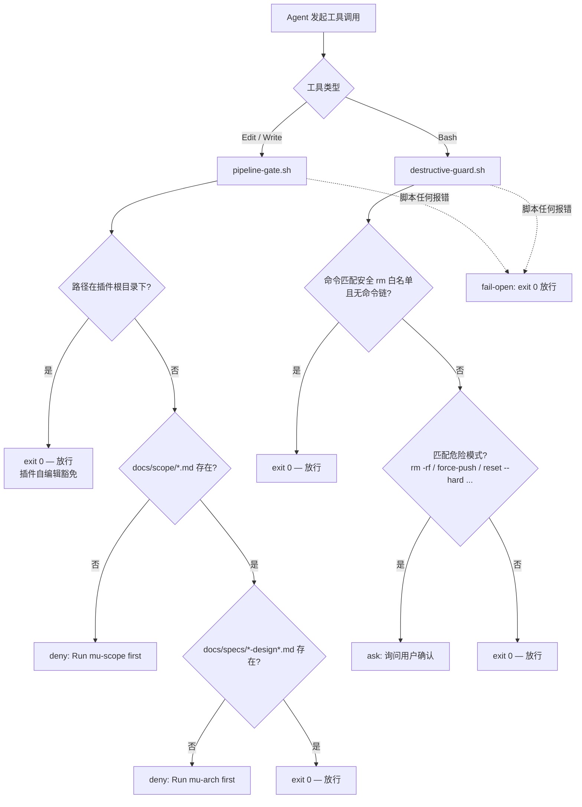

Referenced source files (7 files)

- [hooks/hooks.json](../../hooks/hooks.json)
- [hooks/pre-tool-use/pipeline-gate.sh](../../hooks/pre-tool-use/pipeline-gate.sh)
- [hooks/pre-tool-use/destructive-guard.sh](../../hooks/pre-tool-use/destructive-guard.sh)
- [hooks/session-start](../../hooks/session-start)
- [knowledge/principles/sign-off-gate.md](../../knowledge/principles/sign-off-gate.md)
- [knowledge/principles/git-safety.md](../../knowledge/principles/git-safety.md)
- [CONTEXT.md](../../CONTEXT.md)

# 钩子与门控：pipeline gate、destructive guard、sign-off gate

DevMuse 的约束体系分为两个层面：**harness 层的机械强制**（Claude Code 的 PreToolUse hooks 在工具调用前拦截，agent 无法用文字绕过）与**文本层的门控**（写在技能体和原则文件里，由 agent 阅读并执行）。前者包括 pipeline gate 和 destructive guard 两个 hook 脚本；后者包括嵌在技能体内、不可协商的 HARD-GATE，以及创作技能出口处可跳过的 sign-off gate。Sources: [hooks/hooks.json:15-36](), [CONTEXT.md:31-41]()

这一分工不是冗余，而是互补：核心管线的顺序由 pipeline gate 在工具层机械强制，同时由 HARD-GATE 在技能体内文本强制。Sources: [CONTEXT.md:81]()。整个体系服从 DevMuse 的"guidance over control"哲学——除 HARD-GATE 外，每条路径都是非阻塞的，用户可用一个词覆盖任何推荐。Sources: [CONTEXT.md:72-73]()

> **词汇纪律**：本仓库从不使用不加限定的"gate"一词——必须写全称：HARD-GATE / pipeline gate / sign-off gate / size-area gate。四个复合名互斥，无需改名。Sources: [CONTEXT.md:90]()

## Harness 层：hooks 注册与触发

`hooks/hooks.json` 是 harness 层的唯一注册点，声明了三个 hook：

| 事件 | 匹配器 | 脚本 | 作用 |
|---|---|---|---|
| SessionStart | `startup\|clear\|compact` | `hooks/session-start` | 注入 bootstrap 规则作为会话上下文 |
| PreToolUse | `Edit\|Write` | `hooks/pre-tool-use/pipeline-gate.sh` | pipeline gate：无 scope/design 工件则拒绝写文件 |
| PreToolUse | `Bash` | `hooks/pre-tool-use/destructive-guard.sh` | destructive guard：危险命令先询问 |

Sources: [hooks/hooks.json:3-36]()

`session-start` 不是门控：它读取 `rules/bootstrap.md`，做 JSON 转义后以 `additionalContext` 注入会话，把 bootstrap 技能装进每个新会话的上下文。它是 harness 层的"供给侧"——让 agent 知道规则存在；两个 PreToolUse hook 才是"约束侧"。Sources: [hooks/session-start:10-33]()

### Pipeline gate：写操作的机械前置条件

Pipeline gate 是 CONTEXT.md 定义的领域术语：拦截 Edit/Write，直到磁盘上同时存在 scope 工件与 design spec；豁免插件根目录下的路径；脚本出错时 fail-open。Sources: [CONTEXT.md:35-37]()

脚本的具体检查顺序：

1. 从工具输入 JSON 中提取 `file_path`（用 grep+sed，无 jq 依赖），提取失败直接放行。Sources: [hooks/pre-tool-use/pipeline-gate.sh:10-15]()
2. **插件自编辑豁免**：若目标路径位于 `$CLAUDE_PLUGIN_ROOT/` 之下（即编辑 devmuse 插件自身），立即 `exit 0` 放行——否则维护 DevMuse 自己的技能文件也需要先跑一遍 mu-scope/mu-arch，插件将无法自举。Sources: [hooks/pre-tool-use/pipeline-gate.sh:17-25]()
3. 检查 `docs/scope/` 下是否存在任何 `.md` 工件，缺失则输出 `{"permissionDecision":"deny"}` 并提示"Run mu-scope first"。Sources: [hooks/pre-tool-use/pipeline-gate.sh:27-33]()
4. 检查 `docs/specs/` 下是否存在 `*-design*.md`，缺失则 deny 并提示"Run mu-arch first"。Sources: [hooks/pre-tool-use/pipeline-gate.sh:35-40]()

这就是"核心管线由 hook 机械强制"的含义：无论 agent 的上下文里丢没丢掉技能指令，没有 scope + design 工件就写不了文件。Sources: [CONTEXT.md:81]()

### Destructive guard：危险 Bash 命令先问再执行

Destructive guard 拦截所有 Bash 调用，但它的决策是 `ask`（询问用户）而非 `deny`——破坏性操作不被禁止，只被要求确认。Sources: [hooks/pre-tool-use/destructive-guard.sh:66-68]()

- **安全 rm 白名单**：`rm -rf` 的目标若全部是 `node_modules dist .next build __pycache__` 之一，且命令中不含 `&&`、`||`、`;`、反引号、`$()` 等可夹带命令的链式结构，则直接放行。Sources: [hooks/pre-tool-use/destructive-guard.sh:23-53]()
- **危险模式清单**：`rm -rf`（非白名单目标）、`git push -f` / `--force`、`DROP TABLE`、`git reset --hard`、`git clean -fd` —— 命中任意一条即输出 `{"permissionDecision":"ask"}`。Sources: [hooks/pre-tool-use/destructive-guard.sh:55-69]()

它有一个文本层的搭档：`knowledge/principles/git-safety.md`。hook 只能在命令发出的瞬间机械拦截；git-safety 原则则指导 agent 在破坏性操作**之前**主动核实状态——确认远端备份、向用户陈述确切命令及影响、执行后验证结果——核心是"基于已验证的状态行动，而不是基于假设"。Sources: [knowledge/principles/git-safety.md:19-23](), [knowledge/principles/git-safety.md:27-32]()

### Fail-open 原则

两个 PreToolUse 脚本的第一行有效语句都是 `trap 'exit 0' ERR`：脚本内任何错误（缺目录、JSON 解析失败、环境异常）都转化为"无决策"退出，Claude Code 照常执行工具调用。Sources: [hooks/pre-tool-use/pipeline-gate.sh:2-5](), [hooks/pre-tool-use/destructive-guard.sh:2-5]()

为什么选 fail-open 而非 fail-closed？因为这两个 hook 是**辅助护栏而非安全边界**：一个有 bug 的 hook 若 fail-closed，会把所有写操作或 Bash 调用锁死，用户被迫卸载插件；fail-open 则保证 hook 故障的最坏结果只是退回"没有护栏"的默认体验。这与"guidance over control"一致——机制为用户服务，而不是反过来。Sources: [CONTEXT.md:72-73](), [hooks/pre-tool-use/pipeline-gate.sh:3]()

## 文本层：HARD-GATE 与 sign-off gate

### HARD-GATE：技能体内的结构性前置条件

HARD-GATE 是嵌在技能体中的结构性、不可协商的前置条件（例如"没有已批准的 scope 工件就不做设计"）。它在 stance 检测**之前**求值，且永远不会被 `skip` stance 或 sign-off 绕过。Sources: [CONTEXT.md:31-33](), [CONTEXT.md:84]()

它没有对应的 shell 脚本——执行者是阅读技能体的 agent 本身。这是它与 pipeline gate 的本质区别：同一条管线顺序，pipeline gate 在工具层验"工件是否存在于磁盘"，HARD-GATE 在文本层验"工件是否已被批准、流程是否走到位"。Sources: [CONTEXT.md:81]()

### Sign-off gate：非阻塞的干系人签核协议

Sign-off gate 是创作技能（mu-biz / mu-prd / mu-arch）在出口处运行的非阻塞干系人审批协议——**明确不是 HARD-GATE**。它只在工作是 team-touching 时触发，且用户随时可用 "skip sign-off" 跳过。Sources: [CONTEXT.md:39-41](), [knowledge/principles/sign-off-gate.md:83-85]()

触发需三个条件同时成立：(1) 技能既有出口标准已满足（工件已获用户批准）；(2) 技能自身的 HARD-GATE 已全部满足——sign-off 永不绕过 HARD-GATE；(3) stakeholder-scope 检测为 team-touching。Sources: [knowledge/principles/sign-off-gate.md:7-13]()

team-touching 的检测启发式，任一信号即触发：

| 信号 | 内容 |
|---|---|
| S1 | 存在 CODEOWNERS 文件 |
| S2 | 近 90 天内 watched-dirs 上有 ≥3 位作者 |
| S3 | 用户明确声明（"team project"、"shared code" 等） |

全部缺席则默认 solo，不触发。Sources: [knowledge/principles/sign-off-gate.md:21-30](), [CONTEXT.md:43-45]()

协议本身是四步：宣告（说明触发信号并列出干系人来源）→ 等待用户回复（非 HARD-GATE 式阻塞）→ 按 "signed off" / "skip sign-off" 在工件 History 表追加一行 → 继续既有的终端交接（管线下一技能）。歧义回复（如 "meh"）按 skip 处理并记录原文。Sources: [knowledge/principles/sign-off-gate.md:36-53](), [knowledge/principles/sign-off-gate.md:72]()

消费方式是引用而非复制：三个创作技能在 Process 末尾引用该原则文件，不各自重新实现检测与协议。Sources: [knowledge/principles/sign-off-gate.md:55-64]()

## 四类门控对比

| | pipeline gate | destructive guard | HARD-GATE | sign-off gate |
|---|---|---|---|---|
| **层面** | harness（PreToolUse hook） | harness（PreToolUse hook） | 文本（技能体） | 文本（原则文件，创作技能引用） |
| **拦截对象** | Edit / Write 工具调用 | Bash 工具调用 | 技能流程推进 | 创作技能出口交接 |
| **检查内容** | scope 工件 + design spec 是否存在于磁盘 | 命令是否匹配危险模式 | 结构性前置条件（如 scope 已批准） | stakeholder-scope 是否 team-touching |
| **决策** | `deny`（附修复提示） | `ask`（用户确认） | agent 拒绝推进 | 宣告并等待，非阻塞 |
| **可否绕过** | 插件根目录豁免；脚本出错 fail-open | 安全 rm 白名单直放；脚本出错 fail-open | 不可——`skip` stance 与 sign-off 均不能绕过 | 可——用户一句 "skip sign-off" |
| **来源** | [hooks/pre-tool-use/pipeline-gate.sh:27-40]() | [hooks/pre-tool-use/destructive-guard.sh:55-69]() | [CONTEXT.md:31-33]() | [knowledge/principles/sign-off-gate.md:83-85]() |

两层强制的分工可以概括为一句话：hook 防的是"agent 忘了规则"（上下文丢失也拦得住），文本门控防的是"流程走了捷径"（工件在但未批准、团队工作未经签核）。机械层从不试图覆盖文本层的判断性检查——那是 agent 的职责；文本层也从不假装自己有 hook 的强制力——除 HARD-GATE 外一切可被用户一词覆盖。Sources: [CONTEXT.md:72-73](), [CONTEXT.md:81]()

---

See also: [四层架构](four-layer-architecture.md) | [实现与评审](implementation-and-review.md) | [文档维护契约](docs-maintenance-contract.md)
