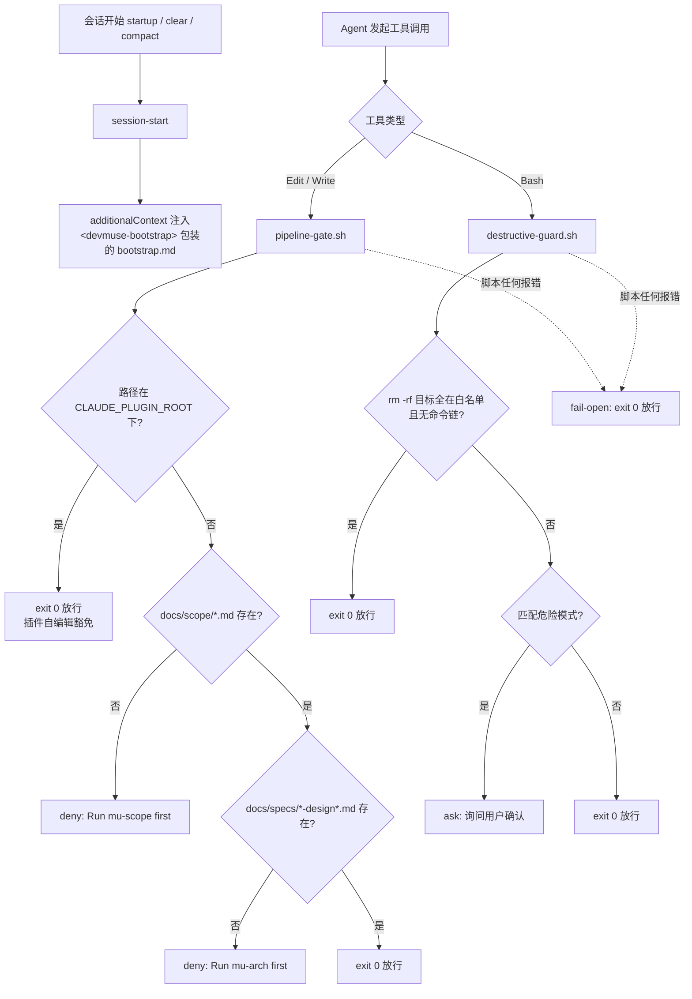
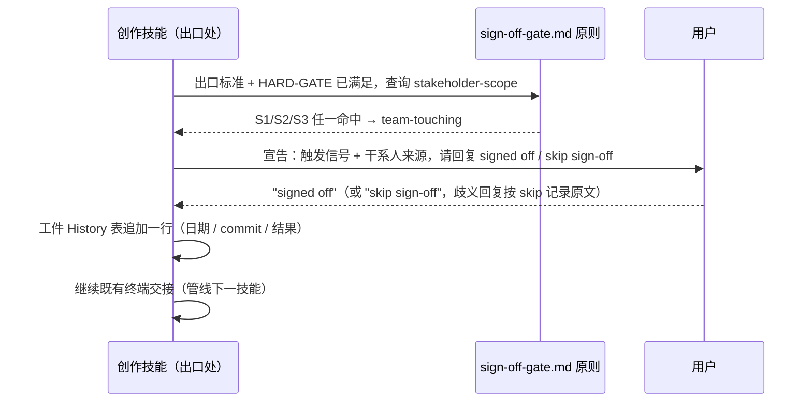

Referenced source files (7 files)

- [hooks/hooks.json](../../hooks/hooks.json)
- [hooks/pre-tool-use/pipeline-gate.sh](../../hooks/pre-tool-use/pipeline-gate.sh)
- [hooks/pre-tool-use/destructive-guard.sh](../../hooks/pre-tool-use/destructive-guard.sh)
- [hooks/session-start](../../hooks/session-start)
- [knowledge/principles/sign-off-gate.md](../../knowledge/principles/sign-off-gate.md)
- [knowledge/principles/git-safety.md](../../knowledge/principles/git-safety.md)
- [CONTEXT.md](../../CONTEXT.md)

# 钩子与门控

DevMuse 的运行时防线由两条通道组成：**供给侧**的 SessionStart hook 在每个新会话开始时把 `rules/bootstrap.md` 包装进 `<devmuse-bootstrap>` 标签注入上下文，让 agent 一开始就知道规则存在；**约束侧**的两个 PreToolUse hook 在工具调用发出的瞬间机械拦截——pipeline gate 拒绝缺少前置工件的 Edit/Write，destructive guard 对破坏性 Bash 命令先问再放。Sources: [hooks/hooks.json:3-36](), [hooks/session-start:27]()

机械拦截之外还有文本层的门控与之配合：嵌在技能体内、不可协商的 HARD-GATE；创作技能出口处可跳过的 sign-off gate；以及指导 agent 在 hook 触发**之前**就主动核实状态的 git-safety 原则。整个体系服从 "guidance over control" 哲学——除 HARD-GATE 外每条路径都非阻塞，用户可用一个词覆盖任何推荐。Sources: [CONTEXT.md:31-41](), [CONTEXT.md:71-73]()

> **词汇纪律**：本仓库从不使用不加限定的 "gate" 一词——必须写全称：HARD-GATE / pipeline gate / sign-off gate / size-area gate。四个复合名互斥。Sources: [CONTEXT.md:90]()

## Hook 注册总览

`hooks/hooks.json` 是 harness 层的唯一注册点，声明了三个 hook，全部同步执行（`"async": false`）：

| 事件 | 匹配器 | 脚本 | 角色 |
|---|---|---|---|
| SessionStart | `startup\|clear\|compact` | `hooks/session-start` | 供给侧：注入 `<devmuse-bootstrap>` 包装的 bootstrap |
| PreToolUse | `Edit\|Write` | `hooks/pre-tool-use/pipeline-gate.sh` | 约束侧：无 scope / design 工件则 `deny` 写文件 |
| PreToolUse | `Bash` | `hooks/pre-tool-use/destructive-guard.sh` | 约束侧：破坏性命令 `ask` 用户确认 |

Sources: [hooks/hooks.json:3-36]()

```mermaid
graph TD
    S[会话开始 startup / clear / compact] --> SS[session-start]
    SS --> INJ["additionalContext 注入<br/>&lt;devmuse-bootstrap&gt; 包装的 bootstrap.md"]

    A[Agent 发起工具调用] --> B{工具类型}
    B -->|Edit / Write| C[pipeline-gate.sh]
    B -->|Bash| D[destructive-guard.sh]

    C --> E{路径在 CLAUDE_PLUGIN_ROOT 下?}
    E -->|是| F[exit 0 放行<br/>插件自编辑豁免]
    E -->|否| G{docs/scope/*.md 存在?}
    G -->|否| H["deny: Run mu-scope first"]
    G -->|是| I{docs/specs/*-design*.md 存在?}
    I -->|否| J["deny: Run mu-arch first"]
    I -->|是| K[exit 0 放行]

    D --> L{rm -rf 目标全在白名单<br/>且无命令链?}
    L -->|是| M[exit 0 放行]
    L -->|否| N{匹配危险模式?}
    N -->|是| O[ask: 询问用户确认]
    N -->|否| P[exit 0 放行]

    C -.脚本任何报错.-> Q[fail-open: exit 0 放行]
    D -.脚本任何报错.-> Q
```

Sources: [hooks/hooks.json:3-36](), [hooks/pre-tool-use/pipeline-gate.sh:17-43](), [hooks/pre-tool-use/destructive-guard.sh:23-71]()

## SessionStart 注入：`<devmuse-bootstrap>`

`session-start` 脚本在会话启动、`/clear`、compact 三种时机运行。它从自身位置推导插件根目录，读取 `rules/bootstrap.md` 全文，经 `escape_for_json`（纯 bash 参数替换做转义，每种字符一次 C 级替换，远快于逐字符循环）处理后，包装进 `<devmuse-bootstrap>` 标签，并附一句引导语："Below is your bootstrap skill. For all other skills, use the Skill tool."。Sources: [hooks/hooks.json:5](), [hooks/session-start:6-27]()

最终以 Claude Code 的 `hookSpecificOutput.additionalContext` JSON 结构输出。这里刻意用 `printf` 而非 heredoc——绕开 bash 5.3+ 中 heredoc 变量展开在内容超过约 512 字节时挂起的 bug。Sources: [hooks/session-start:29-33]()

它不属于任何门控家族：注入的 bootstrap 承载路由规则（意图表、类别、置信度的唯一居所），是让规则**可见**的通道；两个 PreToolUse hook 才是让规则**可强制**的通道。Sources: [hooks/session-start:10-11](), [hooks/hooks.json:15-36]()

## PreToolUse 防线

### Pipeline gate：写操作的机械前置条件

Pipeline gate 是 CONTEXT.md 定义的领域术语：拦截 Edit/Write，直到磁盘上同时存在 scope 工件与 design spec；豁免插件根目录下的路径；脚本出错时 fail-open。Sources: [CONTEXT.md:35-37]()

脚本的检查顺序：

1. 用 grep+sed 从工具输入 JSON 提取 `file_path`（无 jq 依赖），提取失败直接放行。Sources: [hooks/pre-tool-use/pipeline-gate.sh:10-15]()
2. **插件自编辑豁免**：目标路径位于 `$CLAUDE_PLUGIN_ROOT/` 之下（即编辑 devmuse 插件自身）时立即 `exit 0`——否则维护 DevMuse 自己的技能文件也要先跑 mu-scope/mu-arch，插件无法自举。Sources: [hooks/pre-tool-use/pipeline-gate.sh:17-25]()
3. `docs/scope/` 顶层无任何 `.md` 工件 → 输出 `{"permissionDecision":"deny"}`，提示 "Run mu-scope first"。Sources: [hooks/pre-tool-use/pipeline-gate.sh:27-33]()
4. `docs/specs/` 顶层无 `*-design*.md` → deny，提示 "Run mu-arch first"。Sources: [hooks/pre-tool-use/pipeline-gate.sh:35-40]()

这就是核心管线"由 hook 机械强制、由 HARD-GATE 文本强制"这一双轨分工中的机械轨：无论 agent 的上下文里丢没丢掉技能指令，没有 scope + design 工件就写不了文件。Sources: [CONTEXT.md:81]()

### Destructive guard：危险 Bash 命令先问再执行

Destructive guard 拦截所有 Bash 调用，但决策是 `ask` 而非 `deny`——破坏性操作不被禁止，只被要求确认。提取命令时先把转义引号 `\"` 换成占位符再 grep，避免模式在转义引号处截断。Sources: [hooks/pre-tool-use/destructive-guard.sh:10-21](), [hooks/pre-tool-use/destructive-guard.sh:66-68]()

| 分支 | 条件 | 结果 |
|---|---|---|
| 安全 rm 白名单 | `rm -rf` 目标全部属于 `node_modules dist .next build __pycache__`，且命令不含 `&&`、`\|\|`、`;`、反引号、`$()` 等可夹带命令的链式结构 | 直接放行 |
| 危险模式 | `rm -rf`（非白名单）、`git push -f` / `--force`、`DROP TABLE`、`git reset --hard`、`git clean -fd` | `ask` 用户确认 |
| 其余 | 未命中任何模式 | 放行 |

Sources: [hooks/pre-tool-use/destructive-guard.sh:23-53](), [hooks/pre-tool-use/destructive-guard.sh:55-69]()

### Fail-open 原则

两个 PreToolUse 脚本的首行有效语句都是 `trap 'exit 0' ERR`：脚本内任何错误（缺目录、JSON 解析失败、环境异常）都转化为"无决策"退出，Claude Code 照常执行工具调用。这两个 hook 是辅助护栏而非安全边界：fail-closed 的 bug 会锁死所有写操作或 Bash 调用，fail-open 的最坏结果只是退回"没有护栏"的默认体验——与 "guidance over control" 一致。Sources: [hooks/pre-tool-use/pipeline-gate.sh:2-5](), [hooks/pre-tool-use/destructive-guard.sh:2-5](), [CONTEXT.md:71-73]()

## 文本层协作：sign-off gate 与 git-safety

### Sign-off gate：非阻塞的干系人签核协议

Sign-off gate 是创作技能（mu-biz / mu-prd / mu-arch）在出口处运行的非阻塞干系人审批协议——**明确不是 HARD-GATE**：HARD-GATE 是结构性的（"没有 scope 不做设计"），sign-off 是协作性的（"干系人同意后再推进"），运行更晚且可被用户显式跳过。Sources: [knowledge/principles/sign-off-gate.md:1-3](), [knowledge/principles/sign-off-gate.md:83-85]()

触发需三个条件同时成立：(1) 技能既有出口标准已满足（工件已获用户批准）；(2) 技能自身的 HARD-GATE 已全部满足——sign-off 永不绕过 HARD-GATE；(3) stakeholder-scope 检测为 team-touching。检测启发式任一信号即触发：S1 存在 CODEOWNERS 文件；S2 近 90 天 watched-dirs 上作者 ≥3 人；S3 用户明确声明（"team project"、"need RFC" 等）。全部缺席默认 solo，不触发、不追问。Sources: [knowledge/principles/sign-off-gate.md:7-13](), [knowledge/principles/sign-off-gate.md:21-30](), [CONTEXT.md:43-45]()

```mermaid
sequenceDiagram
    participant S as 创作技能（出口处）
    participant P as sign-off-gate.md 原则
    participant U as 用户

    S->>P: 出口标准 + HARD-GATE 已满足，查询 stakeholder-scope
    P-->>S: S1/S2/S3 任一命中 → team-touching
    S->>U: 宣告：触发信号 + 干系人来源，请回复 signed off / skip sign-off
    U-->>S: "signed off"（或 "skip sign-off"，歧义回复按 skip 记录原文）
    S->>S: 工件 History 表追加一行（日期 / commit / 结果）
    S->>S: 继续既有终端交接（管线下一技能）
```

Sources: [knowledge/principles/sign-off-gate.md:36-53](), [knowledge/principles/sign-off-gate.md:72]()

消费方式是引用而非复制：三个创作技能在 Process 末尾引用该原则文件，不各自重新实现检测与协议。若信号经 S2/S3 触发但 CODEOWNERS 缺失，agent 不得从 git-log 作者猜测干系人名单，必须向用户询问。Sources: [knowledge/principles/sign-off-gate.md:55-64](), [knowledge/principles/sign-off-gate.md:70]()

### Git-safety：destructive guard 的事前搭档

`git-safety.md` 与 destructive guard 覆盖同一类风险的不同时刻：hook 只能在命令**发出的瞬间**机械拦截，git-safety 原则则指导 agent 在破坏性操作**之前**主动核实状态。切换分支前先 `git branch` + `git status` 确认现场；建分支前先搜索同名/近名分支并确认基线；rebase / reset / force-push 前先确认远端有备份、向用户陈述确切命令及影响、执行后验证结果。Sources: [knowledge/principles/git-safety.md:3-5](), [knowledge/principles/git-safety.md:7-23]()

两者共享同一个根因诊断："基于假设而非已验证的状态行动"。5 秒的 `git branch && git status` 防住 15 分钟的 reflog 恢复；即使 agent 遵守了原则，destructive guard 仍作为最后一道机械网兜住 `git reset --hard`、`git push --force` 等命令。Sources: [knowledge/principles/git-safety.md:27-32](), [hooks/pre-tool-use/destructive-guard.sh:55-69]()

## 门控家族对比

| | pipeline gate | destructive guard | HARD-GATE | sign-off gate |
|---|---|---|---|---|
| **层面** | harness（PreToolUse hook） | harness（PreToolUse hook） | 文本（技能体） | 文本（原则文件，创作技能引用） |
| **拦截对象** | Edit / Write 工具调用 | Bash 工具调用 | 技能流程推进 | 创作技能出口交接 |
| **检查内容** | scope 工件 + design spec 是否存在于磁盘 | 命令是否匹配危险模式 | 结构性前置条件（如 scope 已批准） | stakeholder-scope 是否 team-touching |
| **决策** | `deny`（附修复提示） | `ask`（用户确认） | agent 拒绝推进 | 宣告并等待，非阻塞 |
| **可否绕过** | 插件根目录豁免；脚本出错 fail-open | 安全 rm 白名单直放；脚本出错 fail-open | 不可——`skip` stance 与 sign-off 均不能绕过 | 可——用户一句 "skip sign-off" |
| **来源** | [hooks/pre-tool-use/pipeline-gate.sh:27-40]() | [hooks/pre-tool-use/destructive-guard.sh:55-69]() | [CONTEXT.md:31-33]() | [knowledge/principles/sign-off-gate.md:83-85]() |

（size-area gate 属 mu-code 领域，不在本页展开。）HARD-GATE 在 stance 检测之前求值；`skip` stance 会跳过工件工作和 sign-off gate，但永远跳不过 HARD-GATE。Sources: [CONTEXT.md:84](), [CONTEXT.md:90]()

两层强制的分工可以概括为一句话：hook 防的是"agent 忘了规则"（上下文丢失也拦得住），文本门控防的是"流程走了捷径"（工件在但未批准、团队工作未经签核）。机械层从不试图覆盖文本层的判断性检查；文本层也从不假装自己有 hook 的强制力——除 HARD-GATE 外一切可被用户一词覆盖。Sources: [CONTEXT.md:71-73](), [CONTEXT.md:81]()

---

See also: [四层架构](four-layer-architecture.md) · [工作流与路由](workflow-and-routing.md)
