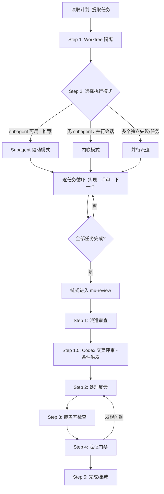
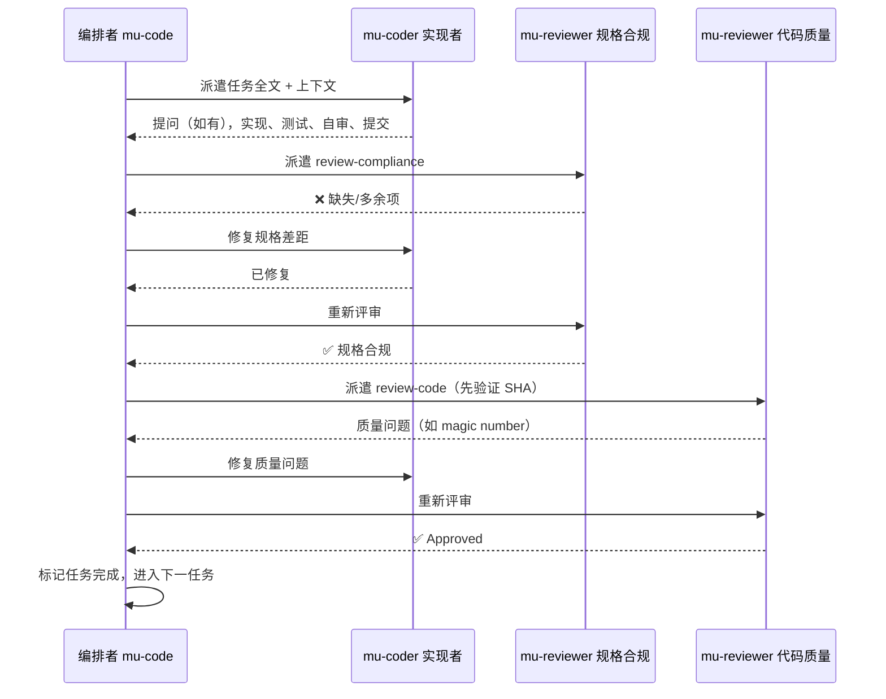

Referenced source files (6 files)

- skills/mu-code/SKILL.md
- skills/mu-review/SKILL.md
- agents/mu-coder.md
- agents/mu-reviewer.md
- skills/mu-code/testing-anti-patterns.md
- knowledge/schemas/codex-review-output.json

# 实现与审查：TDD、worktree 与两阶段评审

DevMuse 流水线的后半段由两个技能承担：`mu-code` 负责把实现计划逐任务落地，`mu-review` 负责在集成前完成审查、验证与合并决策。mu-code 的核心公式是"每任务一个全新 subagent + 两阶段评审（先规格后质量）= 高质量、快迭代"，并在 worktree 隔离、TDD 纪律和 Tidy First 约束下执行。Sources: [skills/mu-code/SKILL.md:8-14](), [skills/mu-code/SKILL.md:580-589]()

mu-review 则以"证据先于断言"为铁律，将审查拆为五步：派遣审查 → Codex 交叉评审（条件触发）→ 反馈处理 → 覆盖率检查 → 验证门禁 → 完成/集成。所有任务完成后 mu-code 链式进入 mu-review，两者共享同一个审查代理 `mu-reviewer`。Sources: [skills/mu-review/SKILL.md:12-33](), [skills/mu-code/SKILL.md:1039-1043]()

## 整体流程

Sources: [skills/mu-code/SKILL.md:18-44](), [skills/mu-review/SKILL.md:14-33]()

## mu-code：实现执行

### Worktree 隔离

mu-code 在实现前先建立隔离工作区。Git worktree 让多个分支共享同一仓库而互不干扰，目录选择遵循严格的优先级：已有目录（`.worktrees` 优先于 `worktrees`）→ CLAUDE.md 中的偏好声明 → 询问用户。Sources: [skills/mu-code/SKILL.md:46-86]()

项目内目录在创建 worktree 前**必须**用 `git check-ignore` 验证已被忽略；若未被忽略，先补 `.gitignore` 并提交，再继续——这是为了防止 worktree 内容被意外提交进仓库。全局目录（`~/.config/devmuse/worktrees`）则无需此验证。Sources: [skills/mu-code/SKILL.md:87-109]()

创建后会自动检测项目类型运行安装（npm/cargo/pip/poetry/go mod），并运行测试验证干净基线：基线测试失败时必须报告并询问是否继续，不能默默带病开工——否则无法区分新 bug 与既有问题。Sources: [skills/mu-code/SKILL.md:137-178](), [skills/mu-code/SKILL.md:204-207]()

| 情形 | 动作 |
|------|------|
| `.worktrees/` 存在 | 使用它（验证已忽略） |
| 两者都存在 | `.worktrees/` 胜出 |
| 都不存在 | 查 CLAUDE.md → 询问用户 |
| 目录未被忽略 | 加入 .gitignore 并提交 |
| 基线测试失败 | 报告失败并询问 |

Sources: [skills/mu-code/SKILL.md:180-190]()

### 双执行模式对比

| 维度 | Subagent 驱动模式（推荐） | 内联模式 |
|------|--------------------------|----------|
| 执行者 | 每任务派遣一个全新 mu-coder subagent | 主会话直接执行全部任务 |
| 上下文 | 隔离上下文，由编排者精确构造，绝不继承会话历史 | 共享主会话上下文 |
| 评审 | 每任务后两阶段评审（规格合规 → 代码质量） | 完成后链入 mu-review |
| 适用条件 | subagent 可用且任务大体独立 | 无 subagent 或并行会话 |
| 遇阻处理 | 按 DONE / BLOCKED 等状态分级处理 | 立即停下询问，不猜测 |

Sources: [skills/mu-code/SKILL.md:214-239](), [skills/mu-code/SKILL.md:394-445]()

Subagent 驱动模式的设计动机：向具有隔离上下文的专门代理委派任务，通过精确构造指令与上下文确保其聚焦成功，同时保留编排者自身的上下文用于协调工作。红线之一是"绝不让 subagent 自己读计划文件"——必须把任务全文提供给它。Sources: [skills/mu-code/SKILL.md:236-238](), [skills/mu-code/SKILL.md:1004-1005]()

此外还有第三种派遣方式：**并行派遣**，用于 3 个以上互相独立的失败（不同测试文件、不同子系统），每个独立问题域派一个代理并发工作；失败相互关联或共享状态时禁用。Sources: [skills/mu-code/SKILL.md:447-484]()

### 模型选择与实现者状态

派遣时只在两档模型间选择，**禁止使用 haiku**：孤立函数、规格完整、1-2 个文件的机械任务用 sonnet；多文件集成、需要判断、调试、架构、评审等一律用 opus，拿不准时倾向 opus。Sources: [skills/mu-code/SKILL.md:285-298]()

实现者（mu-coder）以结构化状态报告结果，编排者按状态分级处理：

| 状态 | 含义 | 编排者动作 |
|------|------|-----------|
| DONE | 完成 | 进入规格合规评审 |
| DONE_WITH_CONCERNS | 完成但有疑虑 | 先读疑虑；涉及正确性/范围则先解决 |
| NEEDS_CONTEXT | 缺信息 | 补充上下文后重新派遣 |
| BLOCKED | 无法完成 | 补上下文 / 换更强模型 / 拆小任务 / 上报人类 |

Sources: [skills/mu-code/SKILL.md:300-316](), [agents/mu-coder.md:75-86]()

mu-coder 的行为契约还包括：任务不清先提问、遵循计划的文件结构、发现文件超出计划意图时停下报告 DONE_WITH_CONCERNS 而非擅自拆分；上报前必须自审（完整性、质量、YAGNI、测试是否验证真实行为）。"说这太难了"永远是允许的——坏成果比没有成果更糟。Sources: [agents/mu-coder.md:10-28](), [agents/mu-coder.md:51-73]()

### TDD 纪律

铁律：`NO PRODUCTION CODE WITHOUT A FAILING TEST FIRST`。先于测试写下的代码要删除重来——不保留为"参考"、不"边写测试边改编"，删除就是删除。Sources: [skills/mu-code/SKILL.md:614-629]()

Red-Green-Refactor 循环中两个验证点都**强制不可跳过**：验证 RED 要确认测试因功能缺失而失败（不是报错、不是笔误）；验证 GREEN 要确认测试通过、其他测试仍绿、输出干净。核心原理是"没看着测试失败，就不知道它测的是不是对的东西"。Sources: [skills/mu-code/SKILL.md:591-597](), [skills/mu-code/SKILL.md:696-766]()

技能内置了完整的合理化话术对照表来对抗"就这一次跳过 TDD"的冲动，例如"太简单不用测"（简单代码也会坏）、"事后补测试目标一样"（tests-after 回答'这做了什么'，tests-first 回答'这应该做什么'）、"删掉 X 小时的工作太浪费"（沉没成本谬误，留着无法信任的代码才是技术债）。Sources: [skills/mu-code/SKILL.md:845-877]()

当计划带有 `Covers: UC-xxx` 字段时，mu-coder 会在测试上标注 `// Covers: UC-xxx` 注释建立可追溯性，供后续 review-coverage 模式核对所有用例是否实现。Sources: [skills/mu-code/SKILL.md:789-793](), [agents/mu-coder.md:30-49]()

### 测试反模式

配套参考文档定义了三条铁律：绝不测试 mock 行为、绝不给生产类加仅测试用的方法、绝不在不理解依赖的情况下 mock。Sources: [skills/mu-code/testing-anti-patterns.md:13-19]()

| 反模式 | 修复 |
|--------|------|
| 对 mock 元素做断言 | 测真实组件或去掉 mock |
| 生产类中的 test-only 方法 | 移到测试工具集 |
| 不理解依赖就 mock | 先理解依赖链，在正确层级最小化 mock |
| 不完整的 mock | 完整镜像真实 API 结构 |
| 测试当作事后补充 | TDD——测试先行 |
| mock 过度复杂 | 考虑用真实组件做集成测试 |

Sources: [skills/mu-code/testing-anti-patterns.md:273-282]()

严格 TDD 天然预防这些反模式：先写测试迫使思考到底在测什么，看着它失败确认测的是真实行为而非 mock——"如果你在测 mock 行为，说明你违反了 TDD"。Sources: [skills/mu-code/testing-anti-patterns.md:263-271]()

### 每任务两阶段评审

每个任务完成后必须依次通过两道评审门，顺序不可颠倒——"规格合规未批准就开始代码质量评审"是明确列出的错误顺序。派遣任一评审前都要先用 `git rev-parse` 验证 BASE_SHA/HEAD_SHA 有效；若评审者返回"NOT reviewed"文件清单，需为剩余文件重新派遣。Sources: [skills/mu-code/SKILL.md:962-994]()

Sources: [skills/mu-code/SKILL.md:242-283](), [skills/mu-code/SKILL.md:318-392]()

规格合规评审（review-compliance）的关键纪律是**不信任实现者报告**：不采信其对完整性的声称，而是读实际代码，与需求逐行比对，找漏掉的部分和未提及的多余功能。Sources: [agents/mu-reviewer.md:259-287]()

红线清单还包括：不并行派遣多个实现 subagent（会冲突）、不接受规格合规上的"差不多"、任一评审有未解决问题时不进入下一任务、不让实现者自审替代正式评审。Sources: [skills/mu-code/SKILL.md:996-1012]()

## mu-review：审查、验证与集成

### 评审模式与派遣纪律

mu-reviewer 是六模式评审专家，由技能带模式指令派遣；每个模式有各自的必填输入，派遣前验证，缺失即拒绝开始且不得编造内容。Sources: [agents/mu-reviewer.md:1-32]()

| 模式 | 审什么 | 必填输入 |
|------|--------|----------|
| review-design | 设计文档完整性/一致性 | SPEC_FILE_PATH |
| review-plan | 计划对规格的忠实度、可执行性 | PLAN_FILE_PATH + SPEC_FILE_PATH |
| review-code | 代码质量、生产就绪 | BASE_SHA + HEAD_SHA |
| review-compliance | 实现与规格严格一致 | REQUIREMENTS + IMPLEMENTER_REPORT |
| review-coverage | 用例→测试→代码追溯矩阵 | SCOPE_FILE_PATH + SHAs |
| review-security | 安全漏洞 | 条件触发（diff 含安全敏感模式） |

Sources: [agents/mu-reviewer.md:12-26](), [agents/mu-reviewer.md:325-341]()

安全评审的触发是自动的：派遣 review-code 前先对 diff 做安全信号扫描（auth/password/token/sql/eval 等关键词计数），命中则追加派遣 review-security，先安全后质量。Sources: [skills/mu-review/SKILL.md:41-52]()

评审执行纪律防幻觉：绝不为未用 Read 工具读过的文件产出结论，绝不编造文件路径/行号/代码片段，每条结论必须带真实读过内容的 file:line 引用，且输出末尾必须附覆盖率清单（in scope / reviewed / NOT reviewed）。Sources: [agents/mu-reviewer.md:361-381]()

### Codex 交叉评审（Step 1.5）

条件性地用 OpenAI Codex CLI 提供跨模型家族的第二意见。可用性检测每会话一次（`command -v codex`）；未安装时整步骤静默跳过——不提及、不建议安装、任何输出不引用此步骤。触发有两条路径：用户显式要求，或系统在四类高风险信号（安全敏感、diff 超 300 行、跨 2 个以上模块、Claude 评审低置信）任一命中时建议；用户拒绝后本会话不再建议。Sources: [skills/mu-review/SKILL.md:148-183]()

按 diff 尺寸路由调用方式——`codex review --base` 会先在内部构建完整 diff，超大范围会超时：

| 条件 | 路径 | 调用方式 |
|------|------|----------|
| 文件 ≤ 500 且行数 ≤ 10000 | A. 直接评审（快、结构化） | `codex review --base` |
| 文件 > 500 或行数 > 10000 | B. 代理式探索（自主选文件） | `codex exec` + 只读沙箱 + 输出 schema |
| A、B 均失败 | 逐 commit 兜底 | `codex review --commit` 循环 |

Sources: [skills/mu-review/SKILL.md:184-269]()

错误处理的关键认知：**exit code 0 不足以证明成功**——codex exec 在上游重试耗尽（如 5xx）后仍返回 0，必须验证输出产物（文件存在且为符合 schema 的合法 JSON）。所有失败都静默回退到 Claude-only 评审，Codex 失败绝不阻塞评审流水线。Sources: [skills/mu-review/SKILL.md:314-358]()

Path B 的结构化输出由 JSON Schema 约束。仓库在 `knowledge/schemas/codex-review-output.json` 维护了规范化版本：必填 `summary`、`issues`、`assessment`、`confidence` 四字段，issues 按 `critical/important/minor` 三级严重度分类，assessment 枚举为 `block/needs-work/ready-to-proceed`，confidence 为评审者自评置信度。Sources: [knowledge/schemas/codex-review-output.json:1-46]()

双报告模式下 Claude 与 Codex 结果并排呈现，按"精确文件路径 + 描述文本"去重归入共有发现；结论相互矛盾时明示用户裁决。Sources: [skills/mu-review/SKILL.md:389-413]()

### 反馈处理与覆盖率检查

处理评审反馈遵循六步模式：READ → UNDERSTAND → VERIFY → EVALUATE → RESPOND → IMPLEMENT，核心是"先验证再实现、先问清再假设、技术正确高于社交舒适"。表演性附和（"You're absolutely right!"）被明令禁止；外部评审者的建议是"待评估的建议而非待执行的命令"，发现建议错误时用技术论据反驳。Sources: [skills/mu-review/SKILL.md:415-444](), [skills/mu-review/SKILL.md:474-505]()

代码质量评审通过后执行需求覆盖率检查：从设计规格的 Requirements Reference 提取 scope 文件路径，派遣 review-coverage 生成 UC → 测试 → 代码的覆盖矩阵；缺实现送回 mu-code，缺测试补测试，scope 本身遗漏则告知用户。只要 scope 工件存在此步永不跳过。Sources: [skills/mu-review/SKILL.md:616-638](), [agents/mu-reviewer.md:289-323]()

### 验证门禁

铁律：`NO COMPLETION CLAIMS WITHOUT FRESH VERIFICATION EVIDENCE`——"未经验证就声称工作完成是不诚实，不是高效"。门禁函数五步：确定证明该断言的命令 → 完整新鲜地运行 → 读全输出查退出码 → 核对输出是否支持断言 → 然后才能声称。跳过任何一步等于说谎。Sources: [skills/mu-review/SKILL.md:640-670]()

典型断言与证据要求：回归测试要走红-绿循环（写→通过→撤销修复→必须失败→恢复→通过）；代理声称成功不可采信，要独立核对 VCS diff；"should / probably / seems to"以及验证前的任何满意表达都是红旗。Sources: [skills/mu-review/SKILL.md:672-737]()

### 集成决策（Step 5: Finish)

呈现选项前先验证测试通过，测试失败则停止不给选项。然后呈现且仅呈现 4 个结构化选项：

| 选项 | 合并 | 推送 | 保留 worktree | 清理分支 |
|------|------|------|---------------|----------|
| 1. 本地合并回基线分支 | ✓ | - | - | ✓ |
| 2. 推送并创建 PR | - | ✓ | ✓ | - |
| 3. 保留分支待处理 | - | - | ✓ | - |
| 4. 丢弃本次工作 | - | - | - | ✓（强制） |

Sources: [skills/mu-review/SKILL.md:773-819](), [skills/mu-review/SKILL.md:907-914]()

丢弃需要用户键入确切的 "discard" 确认才执行；worktree 只在选项 1、4 清理，选项 2、3 保留。本地合并后还要在合并结果上再跑一次测试才删除特性分支。Sources: [skills/mu-review/SKILL.md:822-905]()

---

See also: [核心管道](core-pipeline.md) · [代理系统](agent-system.md) · [钩子与门控](hooks-and-gates.md)
