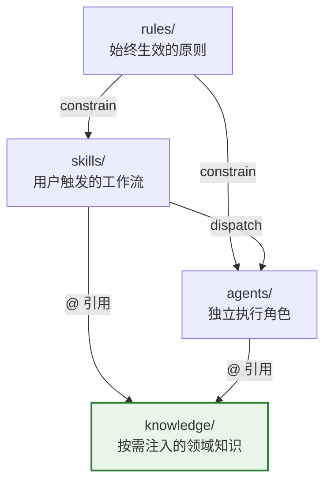
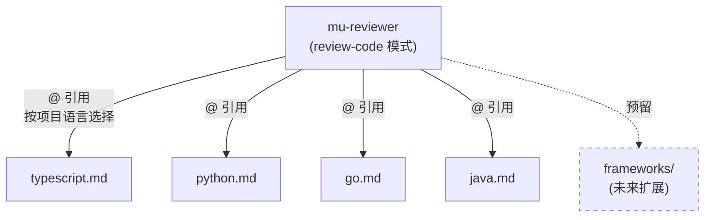
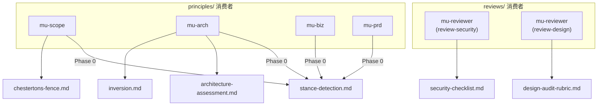

<details>
<summary>📂 Source files referenced</summary>

- `docs/architecture.md`
- `knowledge/languages/typescript.md`
- `knowledge/languages/python.md`
- `knowledge/languages/go.md`
- `knowledge/languages/java.md`
- `knowledge/templates/scope.md`
- `knowledge/templates/explore.md`
- `knowledge/templates/architecture.md`
- `knowledge/templates/wiki-index.md`

</details>

# 知识库组织与内容结构

knowledge/ 层是 DevMuse 四层架构中的"如何做"（How to do it）层，提供按需注入的领域知识。与 rules/（始终加载）和 skills/（用户触发）不同，knowledge/ 是**被动的**——它自身不调用任何其他层，仅通过 `@` 相对路径被 skills 和 agents 引用。

这种设计带来了两个核心优势：一是 token 成本可控，知识仅在需要时加载；二是扩展性强，新增一门语言或一个 review checklist 只需添加一个文件，无需修改 agent 逻辑。

Sources: [docs/architecture.md:10-11](), [docs/architecture.md:185-186]()

---

## 整体定位：四层架构中的 knowledge 层



knowledge/ 在四层中处于最底层，**依赖方向严格向下，无上行回调**。skills 和 agents 通过 `@` 相对路径按需引用 knowledge 文件，knowledge 本身不触发任何 skill 或 agent。

Sources: [docs/architecture.md:189-198](), [docs/architecture.md:169-178]()

---

## 四个子目录概览

knowledge/ 包含四个子目录，各有明确分工：

| 子目录 | 用途 | 被谁引用 | 文件数 |
|--------|------|----------|--------|
| `languages/` | 特定语言的 review 标准 | mu-reviewer (review-code) | 4 |
| `templates/` | 产出物模板 | mu-scope, mu-explore, mu-arch, mu-wiki | 4 |
| `principles/` | 决策点的思维框架 | mu-arch, mu-scope, mu-biz, mu-prd | 10 |
| `reviews/` | 特定关注领域的 review checklist | mu-reviewer (review-security, review-design) | 2 |

Sources: [docs/architecture.md:132-138]()

### 内容归属决策标准

并非所有参考资料都应放入 knowledge/。架构文档定义了明确的归属标准：

| 场景 | 应放置位置 | 原因 |
|------|-----------|------|
| 仅被一个 skill 使用 | 留在 skill 目录内 | 就近原则 |
| 跨场景注入到 agents | knowledge/ | 跨角色复用 |
| 语言/框架特定的模式 | knowledge/ | 同一 agent，不同技术栈 |
| 决策点的思维框架 | knowledge/principles/ | 跨 skill 复用 |
| 特定关注领域的 review checklist | knowledge/reviews/ | mu-reviewer 内跨模式复用 |

Sources: [docs/architecture.md:22-31]()

---

## languages/ — 语言专属 Review 标准

languages/ 目录存放各语言专属的 code review 标准，供 mu-reviewer agent 在 review-code 模式下按需加载。所有语言文件遵循统一结构，作为通用 checklist 的补充（"Supplements the universal checklist"）。



### 各语言文件统一覆盖的主题

| 主题领域 | TypeScript | Python | Go | Java |
|----------|:----------:|:------:|:--:|:----:|
| Type Safety | ✅ | ✅ | — | ✅ |
| Error Handling | ✅ | ✅ | ✅ | ✅ |
| Async Patterns | ✅ | ✅ | — | — |
| Concurrency | — | — | ✅ | ✅ |
| Common Pitfalls | ✅ | ✅ | ✅ | ✅ |
| Testing | ✅ | ✅ | ✅ | ✅ |
| Security | ✅ | ✅ | ✅ | ✅ |
| Module/Package Design | ✅ | — | ✅ | — |
| Interface Design | — | — | ✅ | — |
| Resource Management | — | — | — | ✅ |
| Pythonic Patterns | — | ✅ | — | — |

每个语言文件都针对该语言的特性提供具体的、可操作的规则。例如：

- **TypeScript**：强调避免 `any`、使用 discriminated unions 建模状态、避免 floating promises
- **Python**：强调 EAFP 模式、mutable default arguments 陷阱、`TYPE_CHECKING` 处理循环引用
- **Go**：强调检查每个 error、goroutine 生命周期管理、interface 在消费端定义
- **Java**：强调 `Optional<T>` 作为返回类型、try-with-resources、virtual threads (21+)

Sources: [knowledge/languages/typescript.md:1-2](), [knowledge/languages/python.md:1-2](), [knowledge/languages/go.md:1-2](), [knowledge/languages/java.md:1-2]()

### 设计决策：2 agent + 知识注入

架构选择了"2 个通用 agent + 知识注入"而非"N 个语言专属 agent"的方案。Review 逻辑 80% 是通用的，只需修改一次即可全局生效。新增语言支持只需添加一个 knowledge 文件。

Sources: [docs/architecture.md:128]()

---

## templates/ — 产出物模板

templates/ 存放各 skill 产出的标准化文档模板，确保不同 session 间产出物格式一致。

| 模板文件 | 对应 skill | 模板内容 |
|----------|-----------|----------|
| `scope.md` | mu-scope | Use Case Set 模板：Context、Quick Probe、Guard Analysis、Use Cases（Happy/Edge/Error/Reverse）、Conflicts、Impact Analysis |
| `explore.md` | mu-explore | Mental-model artifact 模板：Core Idea、Component Map、Entry Points、Key Flows、Domain Terms、Unknowns |
| `architecture.md` | mu-arch | 技术架构规格：Architecture Overview、Alternatives Considered、Component Design、Data Flow、Failure Mode Analysis |
| `wiki-index.md` | mu-wiki | Wiki 索引模板：Pages 表格、Sections 分组、History 追踪 |

### scope.md 模板关键 section

scope.md 定义了 mu-scope 产出物的完整结构，包含 use case 的四种分类：

- **Happy Paths**：正常路径的预期行为
- **Edge Cases**：边界条件下的预期行为
- **Error Cases**：失败条件下的错误处理
- **Reverse Cases (must NOT happen)**：回归保护——原有行为必须维持

Sources: [knowledge/templates/scope.md:24-35]()

### explore.md 模板关键 section

explore.md 定义了 mu-explore 的 mental-model artifact，支持五种 variant（onboarding、takeover、dependency-eval、pre-change、pre-debug），并包含强制要求的 **Unknowns** section——所有不确定性和未探索区域都必须记录。

Sources: [knowledge/templates/explore.md:1-9](), [knowledge/templates/explore.md:55-59]()

### architecture.md 模板关键 section

architecture.md 定义了 mu-arch 产出物结构，包含 **Alternatives Considered** 表格（强制比较多个方案）和 **Failure Mode Analysis (Inversion Test)** section。

Sources: [knowledge/templates/architecture.md:15-21](), [knowledge/templates/architecture.md:42-44]()

---

## principles/ 与 reviews/ — 思维框架与审查清单

这两个子目录与 languages/ 和 templates/ 的区别在于复用维度：

- **principles/**：跨 skill 复用的决策思维框架，在设计/范围界定阶段注入
- **reviews/**：mu-reviewer 内跨模式复用的审查清单



其中 `stance-detection.md` 被四个 creative skill（mu-biz、mu-prd、mu-scope、mu-arch）在 Phase 0 消费，是典型的跨 skill 复用案例。

Sources: [docs/architecture.md:136-137](), [docs/architecture.md:149-162]()

---

## 引用机制：@ 相对路径

knowledge/ 文件不通过 plugin 自动发现机制加载，而是通过 `@` 相对路径在 skill 或 agent 文件中显式引用：

```markdown
# 在某个 SKILL.md 中引用语言知识：
@../../knowledge/languages/java.md
```

这种机制依赖于 plugin 安装时整个 plugin 目录被复制到缓存的特性，因此 `@` 相对路径可以跨目录工作。

| 加载方式 | 适用层 | 特点 |
|----------|-------|------|
| plugin.json 声明 + 自动发现 | skills/, agents/ | 自动注册到 Claude Code |
| hooks.json + session-start 脚本 | rules/ | 每次会话启动自动注入 |
| `@` 相对路径引用 | knowledge/ | 按需加载，skill/agent 自行决定 |

Sources: [docs/architecture.md:39-45](), [docs/architecture.md:57-65]()

---

## 扩展指南

### 新增语言支持

新增一门语言只需在 `knowledge/languages/` 下添加一个 `.md` 文件，遵循现有文件的 section 结构（Type Safety / Error Handling / Common Pitfalls / Testing / Security 等），然后在 mu-reviewer 的引用逻辑中加入对该语言的识别即可。

### 未来规划：frameworks/ 子目录

架构文档预留了 `knowledge/frameworks/` 子目录（如 spring-boot.md、react.md、flutter.md），用于框架特定的 review 标准。目前尚未填充。

Sources: [docs/architecture.md:164]()

---

## 完整目录结构

```
knowledge/
├── languages/                  # 语言专属 review 标准
│   ├── typescript.md           # Type safety, async patterns, common pitfalls
│   ├── python.md               # Type hints, pythonic patterns, security
│   ├── go.md                   # Error handling, concurrency, interface design
│   └── java.md                 # Null handling, concurrency, resource management
├── templates/                  # 产出物模板
│   ├── scope.md                # mu-scope 的 Use Case Set 模板
│   ├── explore.md              # mu-explore 的 mental-model artifact 模板
│   ├── architecture.md         # mu-arch 的技术架构规格模板
│   └── wiki-index.md           # mu-wiki 的索引页模板
├── principles/                 # 决策点思维框架
│   ├── architecture-assessment.md
│   ├── chestertons-fence.md
│   ├── defensive-boundary.md
│   ├── git-safety.md
│   ├── graphviz-conventions.md
│   ├── inversion.md
│   ├── premise-check.md
│   ├── sign-off-gate.md
│   ├── skill-cso.md
│   ├── skill-testing.md
│   └── stance-detection.md
└── reviews/                    # 审查清单
    ├── design-audit-rubric.md
    └── security-checklist.md
```

Sources: [docs/architecture.md:139-162]()
