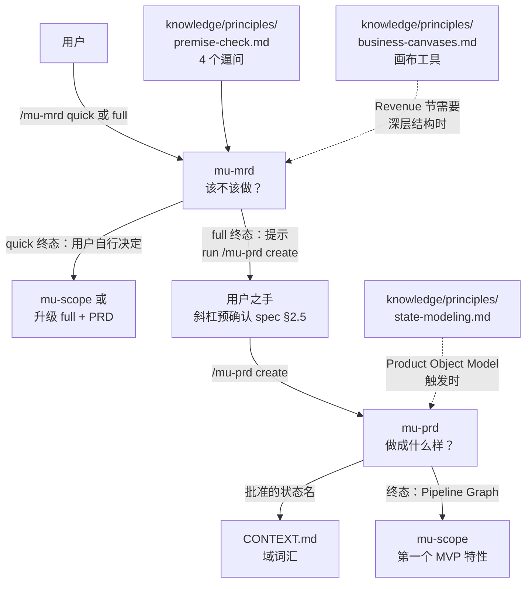
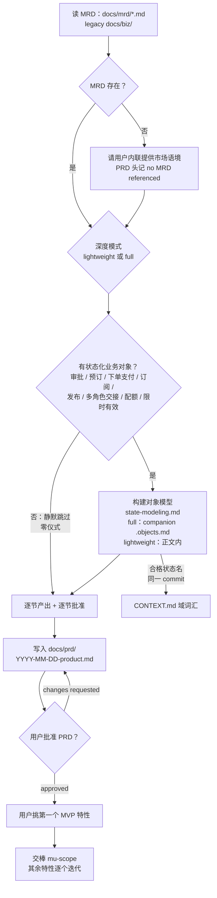

Referenced source files (6 files)

- `skills/mu-mrd/SKILL.md`
- `skills/mu-prd/SKILL.md`
- `knowledge/principles/premise-check.md`
- `knowledge/principles/state-modeling.md`
- `knowledge/principles/business-canvases.md`
- `CONTEXT.md`

# mu-mrd 与 mu-prd：市场需求与产品需求

mu-mrd 与 mu-prd 是 DevMuse 的两个**产品级按需技能**（on-demand skill），各自"每产品运行一次、而非每特性一次"（once per product, not per feature），独立于特性级主管线。二者的 frontmatter 均声明 `disable-model-invocation: true`——模型不能自主加载，只能由用户以斜杠命令直呼；按 CONTEXT.md 的域语言定义，这类技能"永不自动路由，路由规则对匹配意图只给指针、不代调"。Sources: [skills/mu-mrd/SKILL.md:1-5](), [skills/mu-mrd/SKILL.md:11](), [skills/mu-prd/SKILL.md:1-5](), [skills/mu-prd/SKILL.md:11](), [CONTEXT.md:19-21]()

分工用一句话切开：**mu-mrd 回答"该不该做"**——前提验证、竞争对手、目标市场、收入机会（*whether* to build and *for which market*）；**mu-prd 回答"做成什么样"**——persona、流程、wireframe、逐特性规格、分层规则、NFR、指标（*what* to build）。技术架构留给之后的 mu-arch。两者同属 CONTEXT.md 定义的 **creative skill**（产出判断承载工件、Phase 0 跑 stance detection、出口面对 sign-off gate），本页覆盖它们的深度模式、工件、以及 MRD→PRD 那根"经用户之手"的接力棒。Sources: [skills/mu-mrd/SKILL.md:9](), [skills/mu-prd/SKILL.md:9](), [CONTEXT.md:23-25]()

## 总览

| 维度 | mu-mrd | mu-prd |
|------|--------|--------|
| 核心问题 | 该不该做？给哪个市场做？竞争对手是谁？谁付钱？ | 做成什么样？用户看到什么、依赖什么？ |
| 深度模式 | `quick`（4 个逼问）/ `full`（quick + 5 个市场节） | `lightweight`（3 节）/ `full`（9 节），stakes 校准每节分量 |
| Phase 0 stance | `create` / `update`（expand / gap-fill / sync）/ `extract` / `skip` | 同左，另有状态机专属的批准与自检规则 |
| 支撑知识 | premise-check.md（必读）、business-canvases.md（按需） | state-modeling.md（对象模型触发时）、domain-glossary.md（词汇资格） |
| HARD-GATE | 用户批准 MRD 前不得调用 mu-prd 或任何特性级技能 | 用户批准 PRD 前不得调用 mu-scope；full MRD 存在时须覆盖其全部 MVP 特性 |
| 工件 | `docs/mrd/YYYY-MM-DD-<name>[-quick].md` | `docs/prd/YYYY-MM-DD-<product>.md`（+ 条件式 `.objects.md`） |
| 终态 | quick → 用户自行决定；full → 提示 `/mu-prd create` | 按 Pipeline Graph 交给 mu-scope 处理第一个 MVP 特性 |

Sources: [skills/mu-mrd/SKILL.md:13-15](), [skills/mu-mrd/SKILL.md:57-61](), [skills/mu-mrd/SKILL.md:206-210](), [skills/mu-prd/SKILL.md:13-15](), [skills/mu-prd/SKILL.md:57-62](), [skills/mu-prd/SKILL.md:241-243]()

## 产品级接力棒：MRD → PRD 经用户之手

mu-prd 是 slash-only 的，所以 mu-mrd full 模式的终态**不直接调用**它，而是把接力棒递到用户手里："MRD approved — run `/mu-prd create` to define the product."。这个斜杠提示按 spec §2.5 视为**预确认**（pre-confirmed）——用户照做时，mu-prd 的 Phase 0 stance 检测不再弹确认对话，直接以 `create` stance 进入。链条的每一环都由 HARD-GATE 守住：MRD 未批准不得进 PRD，PRD 未批准不得进 mu-scope。Sources: [skills/mu-mrd/SKILL.md:135](), [skills/mu-mrd/SKILL.md:210](), [skills/mu-prd/SKILL.md:49](), [skills/mu-prd/SKILL.md:13-15]()

实线是必经路径，虚线是条件性查阅：business-canvases.md 只在收入故事需要画布级结构时被走查，state-modeling.md 只在 MVP 特性含带生命周期的业务对象时触发。Sources: [skills/mu-mrd/SKILL.md:128](), [skills/mu-prd/SKILL.md:136-138](), [skills/mu-prd/SKILL.md:142](), [skills/mu-prd/SKILL.md:243]()

## mu-mrd：该不该做

### 范围与 HARD-GATE

MRD 回答 *whether* 与 *for which market*——前提验证、竞争对手、目标市场、收入机会。Key Principles 划清两条下游边界："No technical design — that's mu-arch's job"、"No feature specs — that's mu-prd's job"（产品级特性清单可以有，用户可见规则/wireframe/流程归 mu-prd）。HARD-GATE：**用户批准 MRD 工件之前，不得调用 mu-prd 或任何特性级技能**；full 模式下明确规定"逐节批准不足以清关"——须对组装后的整份 MRD 批准。Sources: [skills/mu-mrd/SKILL.md:9](), [skills/mu-mrd/SKILL.md:196-197](), [skills/mu-mrd/SKILL.md:13-15](), [skills/mu-mrd/SKILL.md:133]()

### Stance 与 Depth Mode：两个正交概念

mu-mrd 有两个独立概念，斜杠 token 各自解析、互不干扰：**Stance**（Phase 0，`create`/`update`/`extract`/`skip`）与 **Depth Mode**（`quick`/`full`）。Phase 0 只解析 stance token，Depth Mode Selection 只解析深度 token：

| 用户输入 | Stance | Depth mode |
|----------|--------|-----------|
| `/mu-mrd` | Phase 0 自动检测 | 自动检测 |
| `/mu-mrd create` | `create`（强制） | 自动检测 |
| `/mu-mrd quick` | 自动检测 | `quick`（强制） |
| `/mu-mrd create quick` | `create` | `quick` |

Phase 0 的检测参数里藏着一个明示的弱点：**MRD 的过期是人的判断而非文件信号**——watched source 只有根 `README*`，H3 只能抓到"README 说法已大不相同"的粗粒度情况；用户知道市场 pivot 已发生时手动 override 为 `update(sync)`。`docs/prd/` 永不 watch（PRD 编辑不意味着 MRD 过期），`docs/mrd/` 自身也不 watch（循环）。Legacy 位置：`docs/biz/`（mu-biz 时代）、`docs/premise/`（已弃用）、根 `BUSINESS.md`。Sources: [skills/mu-mrd/SKILL.md:39-50](), [skills/mu-mrd/SKILL.md:25-26]()

### Quick 模式：4 个逼问

Quick 模式加载 `knowledge/principles/premise-check.md`，先区分语境——greenfield 问"该不该做"，existing 项目问"这个改动/pivot 值不值得折腾"——再**一次一问**地走完 4 个 forcing questions：

| # | 逼问 | 红旗信号 |
|---|------|---------|
| Q1 Problem Specificity | 到底谁有这个问题？他们今天怎么绕过去？ | 空泛的"用户想要……"，说不出具体的人和 workaround |
| Q2 Temporal Durability | 三年后世界变了，这东西更必需还是更不必需？ | 依赖一个可能反转的趋势 |
| Q3 Narrowest Wedge | 验证这事重要的最小可构建物是什么？ | "得先有完整平台" |
| Q4 Observation Test | 你看过别人不经帮助地使用类似方案吗？ | "演示都是表演" |

评估阈值量化：3+ 题有强证据 → "Premise validated"；2+ 题含糊 → "弱验证——考虑收窄范围"；3 轮后仍无有效回答 → "未验证——按用户要求继续"。同一份 premise-check 还服务 mu-scope 的 Quick Probe（lightweight 版 3 题、跳过 Q4）；mu-mrd quick 用全 4 题。工件写入 `docs/mrd/YYYY-MM-DD-<name>-quick.md`；终态是用户自行决定——去 mu-scope 做特性级工作，或升级到 mu-mrd full + mu-prd。Sources: [skills/mu-mrd/SKILL.md:100-116](), [knowledge/principles/premise-check.md:9-27](), [knowledge/principles/premise-check.md:29-32]()

### Full 模式：quick + 5 个市场节

Full 模式先跑一遍 quick——那 4 题同时充当全量分析的前提验证——再逐节产出 5 个市场节，每节用户批准后才进下一节：

| # | 市场节 | 内容 |
|---|--------|------|
| 1 | Competitive landscape | 3-5+ 竞争对手的关键维度矩阵 + 一段差异化陈述 |
| 2 | Target market & persona | 谁有这个问题、细分规模、语境、jobs-to-be-done、购买触发 |
| 3 | Revenue & opportunity | 谁付钱、为什么付、定价基础、机会规模（粗粒度 TAM/SAM 即可）、主要成本驱动 |
| 4 | North Star Metric + funnel | 主指标 + 输入漏斗指标 + 成功阈值 |
| 5 | MVP scope boundary | 产品级特性清单（非 UC 级）；free/paid 分层边界 |

Key Principles 把第 3 节的深度钉死为"**Opportunity, not financial model**"——收入答案停在"谁付钱、为什么、大概多少"；画布映射与 unit economics 归 business-canvases.md，只在分叉需要时查阅。输出用"投资人/联合创始人可读"的市场语言。Sources: [skills/mu-mrd/SKILL.md:124-131](), [skills/mu-mrd/SKILL.md:194-195]()

### 画布的降级：business-canvases.md 作为 knowledge 工具

business-canvases.md 的文件头写明来历："Absorbed from the retired mu-biz full mode"——mu-biz 时代 BMC/VPC 是 full 模式的**工件章节**，退役后画布降级为 **knowledge 层的工作工具**：mu-mrd 的 Revenue & opportunity 节在收入故事需要比"谁付钱、为什么、大概多少"更深的结构时（canvas 级映射、unit economics、命名）走查相应清单，**把结论折回 MRD 节内——画布本身不再是工件章节**。Sources: [knowledge/principles/business-canvases.md:3](), [skills/mu-mrd/SKILL.md:128]()

| 清单 | 使用时机 | 关键规则 |
|------|---------|---------|
| Business Model Canvas（9 blocks） | canvas 级映射 | 每块一两行作答；填不上的块是交给用户的 fork |
| Value Proposition Canvas | pain/gain 与产品侧配对 | 无 reliever 的 pain（或无 pain 的 reliever）= 可砍范围或待补缺口 |
| Unit Economics Outline | 仅当定价决策阻塞 MRD 批准 | 单位收入/直接成本/边际贡献/盈亏平衡量；点名模型最敏感的那个假设，标为 MRD open question |
| Naming & Brand Checklist | 可选；产品即将面对用户/投资人才做 | 域名/包名/handle 可用性、商标邻近碰撞扫描、"电话里说得清"测试 |

Sources: [knowledge/principles/business-canvases.md:5-17](), [knowledge/principles/business-canvases.md:19-24](), [knowledge/principles/business-canvases.md:26-33](), [knowledge/principles/business-canvases.md:35-42]()

## mu-prd：做成什么样

### 范围、输入与 HARD-GATE

PRD 覆盖用户可见的产品需求——persona、流程、wireframe、逐特性规格、分层规则、NFR、指标。它读 MRD 作为输入（在 `docs/mrd/` 查找，legacy `docs/biz/`；提取 persona 基线、MVP 特性清单、分层规则、North Star——"don't re-derive"），找不到就请用户内联提供市场语境并在 PRD 头记 "no MRD referenced"。HARD-GATE：**PRD 未获用户批准前不得调用 mu-scope**；存在 full 模式 MRD 时，PRD 须覆盖其全部 MVP 特性。Phase 0 stance 的 watched source 是 `src/pages/`、`src/screens/`、`src/views/`、`app/`，均缺失时（后端/CLI/库项目）回退顶层 `src/`，再缺失则 H3 返回 `insufficient-signal`。Sources: [skills/mu-prd/SKILL.md:9-15](), [skills/mu-prd/SKILL.md:101-109](), [skills/mu-prd/SKILL.md:25](), [skills/mu-prd/SKILL.md:228]()

### 深度模式与 stakes 校准

| 信号 | Depth mode | 范围 |
|------|-----------|------|
| Solo dev、小项目、"lightweight PRD"、`/mu-prd lightweight` | **Lightweight** | 核心流程 + 关键规格，3 节 |
| 团队项目、投资人可见、正式产品、`/mu-prd full` | **Full** | 全部 9 节 |
| 不明确 | 一个探针："Stakes — hobby / internal tool / public launch?" | hobby → lightweight；internal → lightweight；launch → full |

**深度模式挑选节集合，stakes 校准每节的分量**："Length scales with stakes"——hobby ≈ 一两页，internal ≈ 几页，launch ≈ 特性需要多长就多长。这是双向阀门：solo 项目不被 9 节全量压垮，公开发布的产品也不会只拿到一页纸。Sources: [skills/mu-prd/SKILL.md:57-62]()

Full 模式 9 节：persona deepening、information architecture / feature map、core user flows、key screen wireframes、per-feature specs、tiering rules、NFRs、success metrics → instrumentation、open questions。Lightweight 3 节：core user flow(s)（1-3 条主流程）、key per-feature specs、open questions。每节逐一批准、按 grilling 纪律驱动开放点（一次一问、附推荐、事实自查、节批准前收敛每个 fork）。Sources: [skills/mu-prd/SKILL.md:113](), [skills/mu-prd/SKILL.md:115-125](), [skills/mu-prd/SKILL.md:127-132]()

### 流程与 Product Object Model 触发

Sources: [skills/mu-prd/SKILL.md:66-97](), [skills/mu-prd/SKILL.md:136](), [skills/mu-prd/SKILL.md:141-142](), [skills/mu-prd/SKILL.md:152-154]()

**触发条件**：任一 MVP 特性涉及审批、预订、下单/支付、订阅、发布、多角色交接、配额或限时有效性——即存在"允许的动作取决于生命周期位置"的业务对象；**无触发则静默跳过，零仪式**。触发后按 state-modeling.md 建模：先分类候选状态（business state vs attribute / computed / page state / sub-object），再逐对象产出封闭状态表、迁移表（state × event × actor → next state，带边界语义）、invariants、terminal states、重试/竞态 guarantees，外加模型的 negative space（excluded-candidate 表、non-transition 注记）；每个填不上的空由 lifecycle sentence 驱动成 fork，批准前跑 self-check。**落位**：full 模式建在 IA 节之后、Core User Flows 之前（feature map 命名对象，flows 走机器，特性规格按名引用状态）；产物是 companion `.objects.md`；lightweight 模式无 IA 节，表格直接放核心流程前、写在 PRD 正文内。方法细节见 [产品对象模型](product-object-model.md) 页。Sources: [skills/mu-prd/SKILL.md:136-141](), [knowledge/principles/state-modeling.md:5-11](), [knowledge/principles/state-modeling.md:30-43]()

### CONTEXT.md 词汇与层边界

批准的状态名是**域语言**：通过 domain-glossary.md 资格测试的名字，在**同一个 commit** 里加入仓库根部的 `CONTEXT.md`（不存在则创建；定义 + `_Avoid_` 同义词表），下游技能一字不差地使用这些名字。层边界由 state-modeling.md 钉死：PRD 模型持有状态词汇、合法迁移、invariants、guarantees（用户可观察、可依赖的部分）；mu-scope 枚举穿过这些迁移的具体用例路径（"每个迁移至少挣得一个 UC"）；mu-arch 实现机器（幂等键、事务、补偿状态、计时器），**状态名从 PRD 模型逐字继承**。mu-prd 的 Key Principles 与此呼应："Defer use case enumeration"——逐特性 UC 是 mu-scope 的活；"Single-home every rule"——每条规则只在一节陈述、他处引用，两份拷贝必然分叉。Sources: [skills/mu-prd/SKILL.md:142](), [knowledge/principles/state-modeling.md:60-64](), [skills/mu-prd/SKILL.md:230-231]()

### Update stance 的状态机纪律

mu-prd 的 `update` stance 对对象模型有专属规则：加载既有 PRD 时连同其对象模型（header 链接的 companion `.objects.md` 或正文表格）；**每台被触碰的状态机是一个批准单元**——对它重跑 state-modeling self-check，terminal state 的变更一律视为 fork 与用户确认；新状态名沿用创建时的 CONTEXT.md 词汇规则。一次调用含多个 sub-type 时，commit 前缀取最高优先级（expand > gap-fill > sync），History 逐变更记行。`skip` stance 则直通 mu-scope，且不传 stance hint——mu-scope 不是 creative skill。Sources: [skills/mu-prd/SKILL.md:35](), [skills/mu-prd/SKILL.md:37](), [CONTEXT.md:31-33]()

## 工件与 commit 约定

两个技能共用同构的工件头（Date / Depth mode / Stance / Sub-type / Detected-at，`--no-stance-meta` 可关停 stance 元数据）与底部 History 表；commit 前缀反映 stance 及 update 子类型（`docs(mrd): create: ...`、`docs(prd): update(sync): ...` 等六式）。差异在正文与交叉引用：MRD quick 是 4 行验证表 + Status，full 加 5 个市场节；PRD 头多两行指针——**MRD reference**（legacy `docs/biz/*.md`，或无 MRD 时记 "inline"）与 **Object model**（lightweight 记 "in-body"，未触发则省略）。出口处两者都有 sign-off gate：stakeholder-scope 判定 team-touching 时走 gate 协议，stance 为 `skip` 时跳过。Sources: [skills/mu-mrd/SKILL.md:139-172](), [skills/mu-mrd/SKILL.md:174-185](), [skills/mu-prd/SKILL.md:158-167](), [skills/mu-prd/SKILL.md:212-221](), [skills/mu-mrd/SKILL.md:199-201](), [skills/mu-prd/SKILL.md:234-236]()

## 交叉引用

See also:

- [产品对象模型](product-object-model.md) — state-modeling.md 的完整方法：lifecycle sentence、分类表、negative space 与 self-check
- [Pipeline Graph](pipeline-graph.md) — mu-prd 终态为何写"per the Pipeline Graph (bootstrap)"：跨技能交棒的单一声明处
- [域语言](domain-language.md) — CONTEXT.md 的资格测试与 `_Avoid_` 机制，状态名如何成为全管线共享词汇
