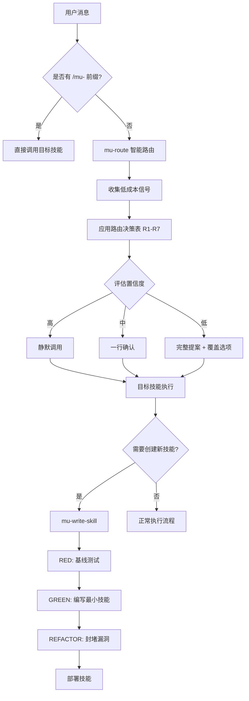
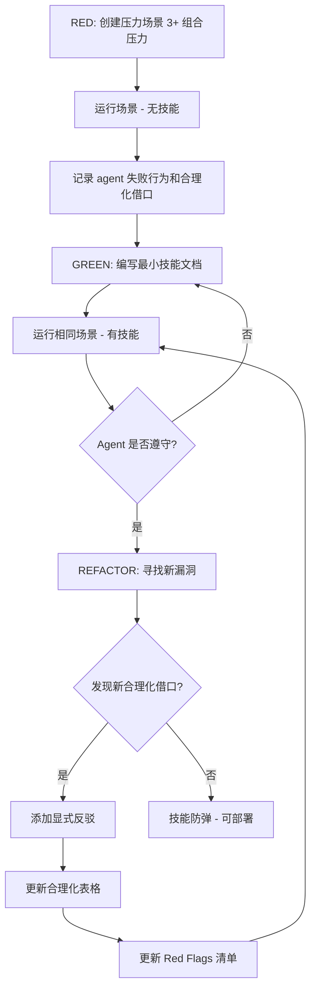
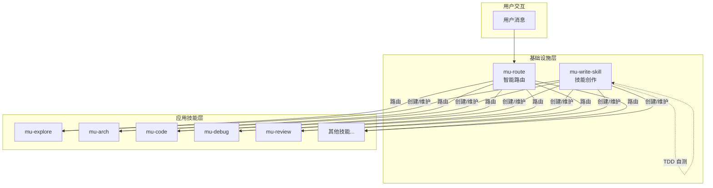

<details>
<summary>Source files referenced</summary>

- `skills/mu-write-skill/SKILL.md`
- `skills/mu-write-skill/anthropic-best-practices.md`
- `skills/mu-write-skill/persuasion-principles.md`
- `skills/mu-write-skill/testing-skills-with-subagents.md`
- `skills/mu-route/SKILL.md`

</details>

# 元技能与基础设施技能

DevMuse 的技能体系建立在两个**元技能 (meta-skills)** 之上：**mu-write-skill** 和 **mu-route**。mu-write-skill 是技能创作工具，将 TDD（测试驱动开发）方法论应用于流程文档的编写，确保每个技能在部署前经过严格的压力测试。mu-route 是智能路由器，负责将用户的自然语言意图匹配到正确的技能，通过置信度分级决定是静默调用、简短确认还是完整提案。

这两个技能构成 DevMuse 的基础设施层：mu-write-skill 保证技能质量，mu-route 保证技能可达。其他所有技能的创建依赖 mu-write-skill 的 TDD 流程，而用户对技能的访问则通过 mu-route 的路由机制实现。

Sources: [SKILL.md (mu-write-skill):1-10](skills/mu-write-skill/SKILL.md), [SKILL.md (mu-route):1-9](skills/mu-route/SKILL.md)

## 系统架构总览



Sources: [SKILL.md (mu-route):39-68](skills/mu-route/SKILL.md), [SKILL.md (mu-write-skill):336-357](skills/mu-write-skill/SKILL.md)

## mu-write-skill：技能创作工具

### 核心理念

mu-write-skill 的核心原则是：**编写技能就是将 TDD 应用于流程文档**。与代码 TDD 完全一致，必须先写失败的测试（基线场景），再写最小实现（技能文档），最后重构（封堵漏洞）。

> "If you didn't watch an agent fail without the skill, you don't know if the skill teaches the right thing."

Sources: [SKILL.md (mu-write-skill):10-18](skills/mu-write-skill/SKILL.md)

### TDD 映射

技能创作的每个阶段都严格对应 TDD 概念：

| TDD 概念 | 技能创作对应 | 具体行为 |
|-----------|-------------|---------|
| Test case | Pressure scenario（压力场景） | 使用 subagent 运行场景 |
| Production code | SKILL.md 文档 | 编写技能文档 |
| RED（失败） | Agent 在无技能时违规 | 记录 agent 的合理化借口 |
| GREEN（通过） | Agent 在有技能时遵守 | 验证合规行为 |
| REFACTOR（重构） | 封堵新发现的漏洞 | 迭代直到防弹 |

Sources: [SKILL.md (mu-write-skill):30-46](skills/mu-write-skill/SKILL.md), [testing-skills-with-subagents.md:31-40](skills/mu-write-skill/testing-skills-with-subagents.md)

### RED-GREEN-REFACTOR 流程



Sources: [SKILL.md (mu-write-skill):336-357](skills/mu-write-skill/SKILL.md), [testing-skills-with-subagents.md:43-88](skills/mu-write-skill/testing-skills-with-subagents.md)

### 压力测试方法论

有效的技能测试需要组合多种压力类型，使 agent **真正想要** 违规：

| 压力类型 | 示例 |
|---------|------|
| Time（时间） | 紧急事件、截止日期、部署窗口关闭 |
| Sunk cost（沉没成本） | 数小时工作、"浪费"的代码 |
| Authority（权威） | 高级工程师说跳过、经理覆盖决策 |
| Economic（经济） | 工作、晋升、公司存亡 |
| Exhaustion（疲劳） | 下班时间、已经很累 |
| Social（社交） | 看起来教条、不灵活 |
| Pragmatic（务实） | "务实而非教条" |

最佳测试组合 3 种以上压力。单一压力下 agent 通常能抵抗，多重压力下才会暴露真正的漏洞。

Sources: [testing-skills-with-subagents.md:128-139](skills/mu-write-skill/testing-skills-with-subagents.md)

### 说服原理在技能设计中的应用

mu-write-skill 借鉴了经过实证验证的说服心理学原理（Cialdini, 2021; Meincke et al., 2025）来增强纪律执行类技能的效果。研究表明，说服技术可将 LLM 合规率从 33% 提升至 72%。

| 原理 | 在技能设计中的应用 | 适用场景 |
|-----|-------------------|---------|
| Authority（权威） | 命令式语言："YOU MUST"、"Never"、"No exceptions" | 纪律执行、安全关键实践 |
| Commitment（承诺） | 强制声明、显式选择、TodoWrite 追踪 | 多步骤流程、问责机制 |
| Scarcity（稀缺性） | 时间限制："Before proceeding"、"Immediately after X" | 即时验证需求 |
| Social Proof（社会认同） | 通用模式："Every time"、"X without Y = failure" | 标准建立、失败预警 |
| Unity（统一性） | 协作语言："our codebase"、"we're colleagues" | 协作工作流 |

**避免使用** Liking（讨好）原理，因为它与诚实反馈文化冲突，容易制造谄媚行为。

Sources: [persuasion-principles.md:1-50](skills/mu-write-skill/persuasion-principles.md), [persuasion-principles.md:127-134](skills/mu-write-skill/persuasion-principles.md)

### 技能结构与 CSO（Claude Search Optimization）

每个技能由 SKILL.md 主文件和可选的支持文件组成。YAML frontmatter 仅支持 `name` 和 `description` 两个字段，总计不超过 1024 字符。

| 结构元素 | 要求 |
|---------|------|
| `name` | 仅字母、数字、连字符 |
| `description` | 第三人称，以 "Use when..." 开头，描述触发条件而非工作流 |
| SKILL.md body | 低于 500 行为最优 |
| 支持文件 | 仅用于重型参考（100+ 行）或可复用工具 |
| 引用深度 | 从 SKILL.md 出发最多一层 |

Anthropic 官方最佳实践强调 **context window 是公共资源**，应假设 Claude 已经很聪明，只添加它不知道的信息。Progressive disclosure 模式允许按需加载：启动时仅预加载 metadata，SKILL.md 在相关时读取，支持文件按需加载。

Sources: [SKILL.md (mu-write-skill):93-103](skills/mu-write-skill/SKILL.md), [anthropic-best-practices.md:9-29](skills/mu-write-skill/anthropic-best-practices.md), [anthropic-best-practices.md:237-267](skills/mu-write-skill/anthropic-best-practices.md)

### Iron Law（铁律）

```
NO SKILL WITHOUT A FAILING TEST FIRST
```

适用于新技能和对现有技能的编辑。没有例外：不适用于"简单添加"、不适用于"仅增加一个章节"、不适用于"文档更新"。先写技能再测试？删除它，从头开始。

Sources: [SKILL.md (mu-write-skill):216-232](skills/mu-write-skill/SKILL.md)

## mu-route：智能路由器

### 核心理念

mu-route 是一个基于置信度的智能路由器，通过模式匹配用户意图和低成本仓库信号，将消息路由到正确的技能。它不是硬性关卡（HARD-GATE），而是一个 **smart router**。

Sources: [SKILL.md (mu-route):7-9](skills/mu-route/SKILL.md)

### 置信度分级机制

| 置信度 | 判断标准 | 行为 |
|-------|---------|------|
| **High** | 单一动词匹配、明确意图、充足上下文 | 静默调用，无提案 |
| **Medium** | 两个可能动作，一个明显占优 | 一行确认："-> Skill, ok?" |
| **Low** | 三个以上可能动作，或两个同样可能 | 完整提案：轴信息 + 覆盖选项 |

不确定时默认 Medium。

Sources: [SKILL.md (mu-route):27-35](skills/mu-route/SKILL.md)

### 路由信号采集

mu-route 使用五个轴进行信号采集，所有操作必须在 5 秒内完成：

| 轴 | 信号来源 | 用途 |
|----|---------|------|
| **Axis-Intent** | 用户消息中的动词解析 | 匹配触发信号表 |
| **Axis-Familiarity** | `git log --author` 近 30 天记录 | 判断用户对目标区域是否熟悉 |
| **Axis-Missing-artifact** | `docs/biz/`, `docs/prd/`, `docs/specs/` 是否存在 | 判断是否缺少规格文档 |
| **Axis-Stakeholder** | CODEOWNERS + git log 多作者检查 | 提示 sign-off gate 需求 |
| **Axis-Plugin** | 非 DevMuse 技能列表扫描 | 检测第三方技能匹配 |

Sources: [SKILL.md (mu-route):74-81](skills/mu-route/SKILL.md)

### 路由决策表

决策表自上而下评估，首个匹配项胜出：

| 规则 | Slash 前缀 | Axis-Intent | 关键条件 | 路由目标 |
|------|-----------|-------------|---------|---------|
| R1 | `/mu-<skill>` | -- | -- | **bypass** 直接调用 |
| R2 | none | understand | -- | **Explore** |
| R3 | none | fix | -- | **Reproduce** |
| R4 | none | reshape | unfamiliar | **Explore** -> Design-tech |
| R5 | none | reshape/create-feature | 无 specs，familiar | **Design-tech** |
| R6 | none | implement | specs 存在 | **Implement** |
| R6.5 | none | Plugin 匹配 | -- | **Delegate to plugin** |
| R7 | none | 无匹配 | -- | **Explore**（安全默认值） |

当多个动词同时触发时，Axis-Intent 按特异性排序：fix > reshape > create-feature > implement > understand。

Sources: [SKILL.md (mu-route):89-119](skills/mu-route/SKILL.md)

### 异常处理

mu-route 所有路径都是**非阻塞**的：

- **多路由并列**：选择 R1-R7 中最先命中的，提案中标注 `"(tied with <other move>)"`
- **无动词匹配**：R7 触发，默认 Explore（理解先于行动）
- **仓库状态异常**（空仓库、shallow clone 等）：跳过路由表，直接询问用户
- **信号计算失败**：不伪造信号，展示错误并询问用户
- **用户回复无法解析**：请求用户用一个词重述

Sources: [SKILL.md (mu-route):153-163](skills/mu-route/SKILL.md)

## 两个元技能的协作关系



mu-write-skill 负责**生产**技能（通过 TDD 流程保证质量），mu-route 负责**分发**技能（通过置信度路由保证可达性）。两者形成一个自举系统：mu-write-skill 本身也通过 TDD 流程创建和维护，mu-route 则是所有非直接调用消息的入口。

Sources: [SKILL.md (mu-route):177-183](skills/mu-route/SKILL.md), [SKILL.md (mu-write-skill):449-458](skills/mu-write-skill/SKILL.md)

## 关键设计原则总结

| 原则 | mu-write-skill | mu-route |
|-----|---------------|----------|
| 核心方法论 | TDD (RED-GREEN-REFACTOR) | 置信度分级路由 |
| 质量保证 | 压力测试 + 合理化表格 | 非阻塞 + 安全默认值 |
| 用户自由度 | Iron Law 无例外 | Slash 前缀 bypass |
| 迭代策略 | 捕获 agent 借口 -> 封堵漏洞 | R1-R7 优先级匹配 |
| 性能约束 | SKILL.md < 500 行 | 信号采集 < 5 秒 |
| 心理学基础 | Cialdini 说服原理 | 置信度适配摩擦力 |

Sources: [SKILL.md (mu-write-skill):10-18](skills/mu-write-skill/SKILL.md), [SKILL.md (mu-route):169-175](skills/mu-route/SKILL.md), [persuasion-principles.md:6-8](skills/mu-write-skill/persuasion-principles.md), [anthropic-best-practices.md:146-153](skills/mu-write-skill/anthropic-best-practices.md)
