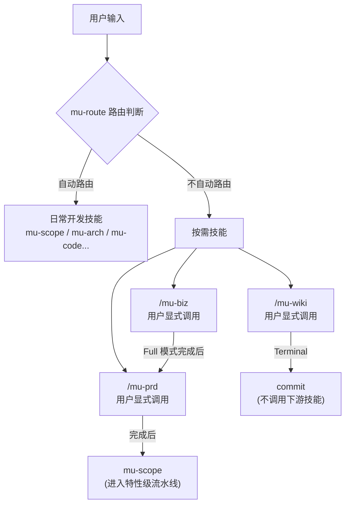
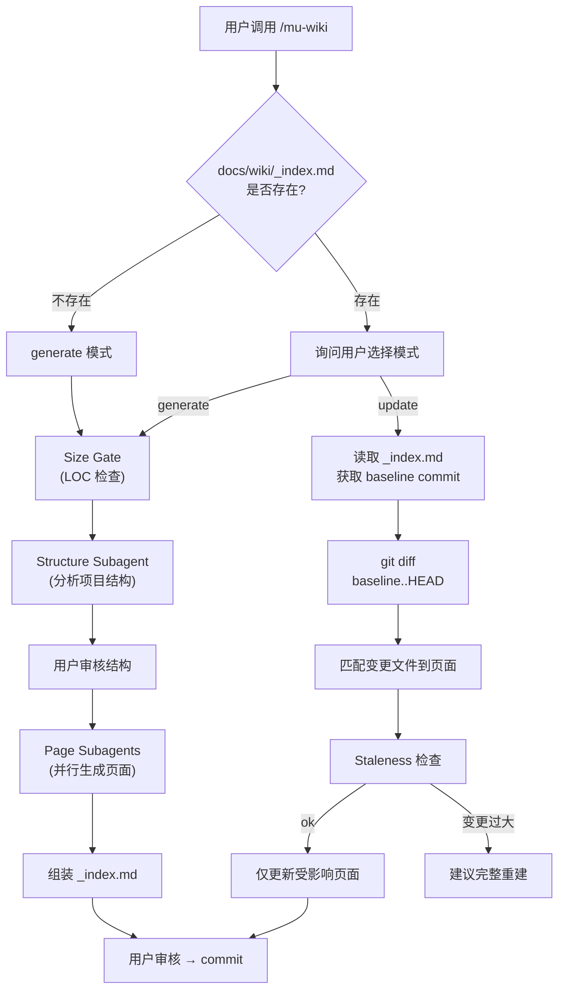
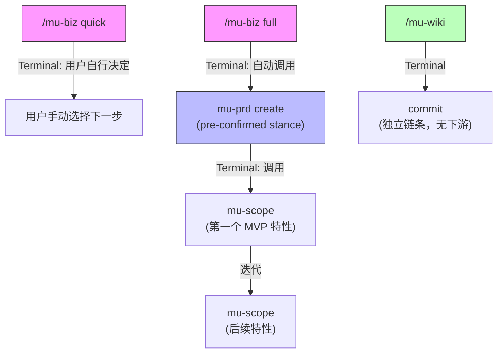

Referenced source files (3 files)

- `skills/mu-biz/SKILL.md`
- `skills/mu-prd/SKILL.md`
- `skills/mu-wiki/SKILL.md`

# 按需技能

DevMuse 中有三个产品级技能——mu-biz（业务分析）、mu-prd（产品需求）和 mu-wiki（架构文档）——被设计为**按需调用**（on-demand）的技能。它们不会被 mu-route 自动路由，必须由用户通过 `/slash` 命令显式触发。这三个技能覆盖了从商业验证、产品定义到架构文档的完整产品级工作流，但它们的运行频率远低于日常开发技能（如 mu-scope、mu-arch、mu-code），因此采用显式调用机制以避免误触发。

这些技能之间存在上下游链式关系：mu-biz 的 Full 模式完成后会自动调用 mu-prd，mu-prd 完成后会调用 mu-scope 进入特性级流水线。mu-wiki 则独立于此链条，专注于持久化架构文档的生成与维护。

## 技能总览

| 技能 | 职责 | 调用方式 | 产物目录 |
|------|------|----------|----------|
| mu-biz | 商业前提验证、产品策略分析（市场、BMC、VPC、Persona、MVP 范围） | `/mu-biz`、`/mu-biz quick`、`/mu-biz full` | `docs/biz/` |
| mu-prd | 用户流程、屏幕设计、功能规格、分级规则、NFR | `/mu-prd`、`/mu-prd lightweight`、`/mu-prd full` | `docs/prd/` |
| mu-wiki | 项目级架构文档生成与增量维护 | `/mu-wiki generate`、`/mu-wiki update` | `docs/wiki/` |

Sources: [SKILL.md (mu-biz):1-3](), [SKILL.md (mu-prd):1-3](), [SKILL.md (mu-wiki):1-3]()

## 调用机制与路由隔离

三个技能均在各自的 Integration 部分明确标注了 **"On-demand only — never auto-routed by mu-route"**。这意味着即使用户输入的自然语言消息包含与业务分析或产品需求相关的关键词，mu-route 也不会自动将其路由到这些技能。

Sources: [SKILL.md (mu-biz):209](), [SKILL.md (mu-prd):224](), [SKILL.md (mu-wiki):385]()

## mu-biz：业务分析

mu-biz 是产品级技能，**每个产品运行一次**，而非每个特性运行一次。其职责涵盖市场分析、商业模式画布、价值主张画布、目标人群画像和 MVP 范围界定。

Sources: [SKILL.md (mu-biz):6-11]()

### 深度模式

mu-biz 提供两种深度模式：

| 模式 | 适用场景 | 内容 |
|------|----------|------|
| **Quick** | 验证某项工作是否值得做；个人项目；现有项目考虑转型 | 4 个核心验证问题（Problem Specificity、Temporal Durability、Narrowest Wedge、Observation Test） |
| **Full** | 新产品、团队项目、面向投资人的分析、重大转型 | Quick 的 4 个问题 + 8 个商业分析章节（竞品分析、BMC、VPC、Persona、品牌命名、北极星指标、MVP 范围、成本收入模型） |

Sources: [SKILL.md (mu-biz):59-67](), [SKILL.md (mu-biz):99-139]()

### Stance Detection

mu-biz 在执行前会通过 Phase 0 进行 Stance Detection，确定进入姿态：

| Stance | 行为 |
|--------|------|
| `create` | 从零开始运行完整流程 |
| `update` | 加载已有 artifact，按子类型（`expand` / `gap-fill` / `sync`）更新 |
| `extract` | 从产品信号（代码、commit、README）逆向合成 |
| `skip` | 仅追加历史记录，跳过分析 |

Sources: [SKILL.md (mu-biz):36-41]()

### Terminal 行为

- **Quick 模式**：用户自行决定下一步（手动进入 mu-scope 或 mu-biz full + mu-prd）
- **Full 模式**：自动调用 `mu-prd create`（pre-confirmed stance，无确认对话框）

Sources: [SKILL.md (mu-biz):119](), [SKILL.md (mu-biz):140]()

## mu-prd：产品需求

mu-prd 同样是产品级技能，**每个产品运行一次**。它读取 mu-biz 的产出物作为输入，输出 PRD 文档供后续 mu-scope 逐特性使用。

Sources: [SKILL.md (mu-prd):8-10]()

### 深度模式

| 模式 | 适用场景 | 章节数 |
|------|----------|--------|
| **Lightweight** | 个人开发、小型项目 | 3 个章节（Core User Flows、Key Per-Feature Specs、Open Questions） |
| **Full** | 团队项目、正式产品、面向投资人 | 9 个章节（Persona Deepening、Information Architecture、Core User Flows、Key Screen Wireframes、Per-Feature Specs、Tiering Rules、NFRs、Success Metrics、Open Questions） |

Sources: [SKILL.md (mu-prd):62-66](), [SKILL.md (mu-prd):112-129]()

### 关键原则

mu-prd 遵循严格的职责边界：

- **用户视角，非技术视角**——描述用户所见所做，而非技术实现
- **延迟技术选择**——技术栈、API 设计、数据库设计属于 mu-arch
- **延迟用例枚举**——每个特性的 happy/edge/error 路径是 mu-scope 的职责

Sources: [SKILL.md (mu-prd):209-216]()

### Terminal 行为

mu-prd 完成后调用 mu-scope 处理第一个 MVP 特性，后续特性逐个迭代通过 mu-scope 处理。

Sources: [SKILL.md (mu-prd):227]()

## mu-wiki：架构文档

mu-wiki 的定位与其他两个技能不同——它不在 mu-biz → mu-prd 的产品定义链条上，而是独立的文档生成与维护工具。它生成持久化、可导航、有源引用的架构文档，区别于 mu-explore（个人心智模型）和 mu-arch（特定变更的设计决策）。

Sources: [SKILL.md (mu-wiki):6-8](), [SKILL.md (mu-wiki):19-24]()

### 运行模式

Sources: [SKILL.md (mu-wiki):29-33](), [SKILL.md (mu-wiki):108-155](), [SKILL.md (mu-wiki):282-319]()

### 核心原则

| 原则 | 说明 |
|------|------|
| Two-phase 架构 | 先确定结构（Phase 1），再生成页面（Phase 2），不可跳过结构审核 |
| 源引用不可妥协 | 每页至少引用 5 个不同源文件，无引用的声明不可验证 |
| Update 优先 | wiki 已存在且变更增量时，优先 update 模式 |
| 失败页面不阻塞 | 单个页面生成失败在 _index.md 中标记，不影响其他页面 |
| Terminal 为 commit | mu-wiki 不调用任何下游技能 |

Sources: [SKILL.md (mu-wiki):350-358]()

## 三个技能的共性模式

通过分析三个 SKILL.md 文件，可以总结出按需技能的共性设计模式：

| 共性 | mu-biz | mu-prd | mu-wiki |
|------|--------|--------|---------|
| **Stance Detection (Phase 0)** | create / update / extract / skip | create / update / extract / skip | generate / update（简化版） |
| **深度模式选择** | quick / full | lightweight / full | 无（由 generate/update 替代） |
| **逐章节审批** | 是（一次一个问题/章节） | 是（一次一个章节） | 是（先审核结构，再生成页面） |
| **Sign-off Gate** | 是（团队项目时） | 是（团队项目时） | 否 |
| **Commit Convention** | `docs(biz): <stance>: ...` | `docs(prd): <stance>: ...` | 标准 commit |
| **产物格式** | Markdown + History 表 | Markdown + History 表 | Markdown + _index.md |

Sources: [SKILL.md (mu-biz):19-33](), [SKILL.md (mu-prd):19-33](), [SKILL.md (mu-wiki):29-33]()

## 链式调用关系

三个按需技能之间的调用关系遵循产品定义的自然顺序：

Sources: [SKILL.md (mu-biz):211-215](), [SKILL.md (mu-prd):224-227](), [SKILL.md (mu-wiki):385-388]()

See also: [mu-route 路由系统](mu-route.md)
