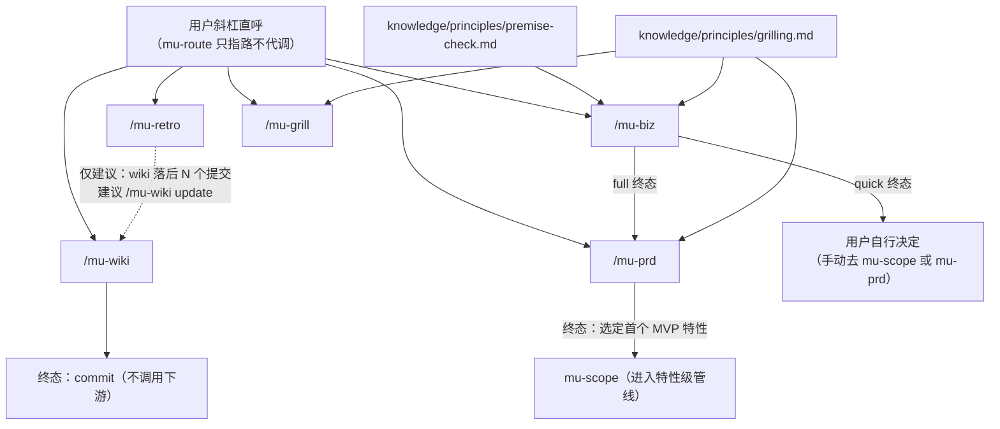

Referenced source files (7 files)

- `skills/mu-biz/SKILL.md`
- `skills/mu-prd/SKILL.md`
- `skills/mu-wiki/SKILL.md`
- `skills/mu-retro/SKILL.md`
- `skills/mu-grill/SKILL.md`
- `knowledge/principles/grilling.md`
- `knowledge/principles/premise-check.md`

# 按需技能：mu-biz / mu-prd / mu-wiki / mu-retro / mu-grill

DevMuse 有五个**按需技能**（on-demand skills）：mu-biz（商业分析）、mu-prd（产品需求）、mu-wiki（架构 wiki）、mu-retro（周期回顾）、mu-grill（方案逼问）。五者的 frontmatter 中均声明 `disable-model-invocation: true`——模型不能自主加载它们，只能由用户以斜杠命令直呼（如 `/mu-biz quick`、`/mu-wiki update`、`/mu-retro 14d`）。mu-route 对它们只指路、不代调：mu-biz 与 mu-wiki 的 Integration 部分都明确写着 "On-demand only — never auto-routed by mu-route"。Sources: [skills/mu-biz/SKILL.md:1-5](), [skills/mu-prd/SKILL.md:1-5](), [skills/mu-wiki/SKILL.md:1-5](), [skills/mu-retro/SKILL.md:1-5](), [skills/mu-grill/SKILL.md:1-5](), [skills/mu-biz/SKILL.md:210](), [skills/mu-wiki/SKILL.md:386]()

之所以采用"仅斜杠直呼"，核心是**上下文加载经济学**：这些技能的运行频率远低于特性级管线——mu-biz 和 mu-prd 是"每产品一次、而非每特性一次"的产品级技能，mu-retro 按周期（默认 7 天）运行，mu-wiki 在里程碑后运行。把低频技能排除在模型自动调用之外，日常开发会话就不必为它们支付技能体的上下文加载成本，也避免了关键词误触发（例如聊到"市场"就误入 8 个章节的商业分析全流程）。用户明确需要时，斜杠一击即达。Sources: [skills/mu-biz/SKILL.md:9-11](), [skills/mu-prd/SKILL.md:9-11](), [skills/mu-retro/SKILL.md:9-11]()

## 总览

| 技能 | 角色 | 模式 | 产物 | 终态 |
|------|------|------|------|------|
| mu-biz | 商业前提验证与产品策略（市场、BMC、VPC、Persona、MVP 范围） | `quick`（4 个逼问）/ `full`（quick + 8 个商业章节） | `docs/biz/YYYY-MM-DD-<name>[-quick].md` | quick → 用户自行决定；full → 调用 `mu-prd create` |
| mu-prd | 产品需求（用户流程、界面、逐特性规格、分层规则、NFR、指标） | `lightweight`（3 章节）/ `full`（9 章节） | `docs/prd/YYYY-MM-DD-<product>.md` | 调用 mu-scope 处理第一个 MVP 特性 |
| mu-wiki | 项目级架构 wiki（Mermaid 图、表格、强制源码引用） | `generate`（全量）/ `update`（基于 git diff 增量） | `docs/wiki/_index.md` + 各页面 | commit，不调用任何下游技能 |
| mu-retro | 周期回顾（git 量化指标 + 质性反思 + 写入记忆） | 时间窗参数（默认 `7d`） | `docs/retro/YYYY-MM-DD-retro.md` + Claude Code 记忆 | 独立收尾，不链接其他技能 |
| mu-grill | 对计划/设计/想法的高压逼问，直到所有返工级分叉收敛 | 无模式；目标由用户指定 | 退出总结（可写入既有 scope/spec/PRD 工件） | 总结决策、假设与被搁置的分叉 |

Sources: [skills/mu-biz/SKILL.md:60-68](), [skills/mu-biz/SKILL.md:117-141](), [skills/mu-prd/SKILL.md:61-67](), [skills/mu-prd/SKILL.md:135-141](), [skills/mu-wiki/SKILL.md:27-34](), [skills/mu-wiki/SKILL.md:384-390](), [skills/mu-retro/SKILL.md:85-98](), [skills/mu-grill/SKILL.md:9-15]()

五个技能之间的调用与依赖关系：

Sources: [skills/mu-biz/SKILL.md:120](), [skills/mu-biz/SKILL.md:141](), [skills/mu-prd/SKILL.md:139-141](), [skills/mu-retro/SKILL.md:80](), [skills/mu-wiki/SKILL.md:359](), [knowledge/principles/grilling.md:3](), [knowledge/principles/premise-check.md:3]()

## mu-biz：商业分析

### 是什么

mu-biz 验证商业前提或定义产品策略——市场、商业模式、Persona、MVP 范围。它独立于特性级主管线，是"每产品一次"的产品级技能。带 HARD-GATE：在用户批准 biz 工件之前，禁止调用 mu-prd 或任何特性级技能；HARD-GATE 在 Phase 0 之前评估，`skip` 立场也无法绕过。Sources: [skills/mu-biz/SKILL.md:9-17]()

### Stance × Depth Mode：两个正交概念

mu-biz 有两个互不干扰的维度：**立场**（Phase 0 检测，`create`/`update`/`extract`/`skip`）与**深度模式**（`quick`/`full`）。斜杠参数按 token 干净拆分——Phase 0 只解析立场 token，深度选择只解析深度 token，例如 `/mu-biz create quick` 同时强制两者。立场检测高置信度时静默继续，模糊时呈现推荐并询问；斜杠携带的立场提示视为预确认、不弹对话框。Sources: [skills/mu-biz/SKILL.md:19-56]()

### Quick 与 Full 模式

- **Quick 模式**——用于"这事值不值得做"的验证、solo 项目、既有项目考虑转向。加载 `premise-check.md`，逐个提出 4 个逼问（Q1 问题特异性、Q2 时间耐久性、Q3 最窄楔子、Q4 观察测试），按证据强度评定"已验证 / 弱验证 / 未验证"。终态是用户自行决定下一步。Sources: [skills/mu-biz/SKILL.md:98-120](), [knowledge/principles/premise-check.md:7-27]()
- **Full 模式**——用于全新产品、团队项目、面向投资人的分析、重大转向。先跑 quick 的 4 问作为前提验证，再逐节产出 8 个商业章节（竞品分析、Business Model Canvas、Value Proposition Canvas、目标 Persona、品牌命名、North Star 指标、MVP 特性范围与分层、成本/收入模型），每节需用户批准。终态调用 `mu-prd create`（预确认立场，下游不再弹对话框）。Sources: [skills/mu-biz/SKILL.md:124-141]()

模式选择是显式的——full 的工作量约为 quick 的 8 倍，因此不明确时先问用户、默认 quick。输出使用投资人/联合创始人能看懂的商业语言，不做技术设计（那是 mu-arch 的事）、不写特性规格（那是 mu-prd 的事）。Sources: [skills/mu-biz/SKILL.md:193-202]()

## mu-prd：产品需求

### 是什么

mu-prd 定义用户可见的产品需求——Persona 深化、信息架构、核心用户流程、关键界面线框、逐特性规格、分层规则、NFR、成功指标与埋点。同样是"每产品一次"的产品级技能：读取 biz 工件作为输入，产出的 PRD 成为逐特性 mu-scope 的输入。HARD-GATE：PRD 必须覆盖 biz 工件中的全部 MVP 特性并获用户批准，才能进入 mu-scope。Sources: [skills/mu-prd/SKILL.md:9-17]()

### 为什么要有明确的上下游边界

mu-prd 的关键原则划出三条边界，防止职责渗漏：

| 边界 | 归属 | 依据 |
|------|------|------|
| 商业策略（Persona 基线、MVP 清单、分层规则、North Star） | 上游 mu-biz —— PRD 引用而不重推导 | Sources: [skills/mu-prd/SKILL.md:98-106](), [skills/mu-prd/SKILL.md:214]() |
| 技术选型（技术栈、API schema、DB 设计） | 下游 mu-arch | Sources: [skills/mu-prd/SKILL.md:215]() |
| 用例枚举（happy/edge/error 路径） | 下游 mu-scope —— PRD 陈述产品规则，mu-scope 枚举穿过规则的具体场景 | Sources: [skills/mu-prd/SKILL.md:216]() |

### 章节化流程

Full 模式 9 个章节、Lightweight 模式 3 个章节（核心流程、关键规格、开放问题），一次一节、逐节批准；每节的开放问题按 grilling 纪律推进——一条消息一个问题并附推荐，事实自查，每个分叉在该节批准前收敛。界面/布局问题可启用 Visual Companion（浏览器线框），拒绝则退回 mermaid/ASCII。若不存在 biz 工件，就地向用户询问商业上下文并在 PRD 头部标注 "no biz artifact referenced"。终态：用户挑选第一个 MVP 特性，调用 mu-scope，其余特性逐个迭代。Sources: [skills/mu-prd/SKILL.md:108-141](), [skills/mu-prd/SKILL.md:110]()

## mu-wiki：架构 Wiki

### 是什么、不是什么

mu-wiki 生成并维护**项目级架构 wiki**——带 Mermaid 图、表格与强制源码引用的结构化 markdown 页面，输出在 `docs/wiki/`。它的反模式是"我在聊天里描述一下架构就行"：聊天描述下个会话就丢了，无引用的页面比没有文档腐烂得更快。它不是 mu-explore 的个人心智模型、不是 mu-arch 的变更决策 ADR、不是 README、也不是自动 API 文档——wiki 记录"现状是什么"，解释 WHY 和 HOW。Sources: [skills/mu-wiki/SKILL.md:7-25]()

### 两阶段架构与两种模式

"两阶段就是架构本身"：Phase 1 由 Structure 子代理提出章节/页面/相关文件的 JSON 结构，**用户必须先审结构**（这是杠杆最高的检查点，跳过意味着页面生成后返工）；Phase 2 才并行派发 Page 子代理逐页生成，单页失败在 `_index.md` 标记 `status: failed`、不阻塞其他页面。Sources: [skills/mu-wiki/SKILL.md:109-155](), [skills/mu-wiki/SKILL.md:351-358]()

| 模式 | 触发 | 机制 | 保护 |
|------|------|------|------|
| `generate` | 无 wiki 或用户要求全量重建 | 尺寸门（<50k LOC 全量扫描；50k–200k 仅顶层；>200k 限顶层模块）→ 结构审阅 → 并行生成 | wiki 已存在时先问"覆盖还是 update" |
| `update` | wiki 已存在，需与近期变更同步 | 读 `_index.md` 基线 commit → `git diff baseline..HEAD` → 匹配受影响页面 → 仅重生成这些页面 | 陈旧检查：>60% 页面受影响或 >50 文件变更时建议全量重建；源文件已删除时降级为全量重建 |

Sources: [skills/mu-wiki/SKILL.md:27-34](), [skills/mu-wiki/SKILL.md:115-125](), [skills/mu-wiki/SKILL.md:285-321]()

### 引用纪律

引用是不可协商的：每页至少引用 5 个不同源文件，"没有引用的 wiki 就是幻觉文档"。mu-wiki 是终态技能——commit 即结束，不调用任何下游；它可被 mu-scope（风险 ≥ medium 且无 wiki）或 mu-arch（架构变更且 wiki 存在）**建议**，但仍由用户直呼。Sources: [skills/mu-wiki/SKILL.md:354](), [skills/mu-wiki/SKILL.md:366](), [skills/mu-wiki/SKILL.md:384-388]()

## mu-retro：周期回顾

mu-retro 为一个时间窗（默认 7 天，可 `/mu-retro 14d`）收集量化 git 指标与质性反思，并把非显然的发现写入 Claude Code 记忆。流程是**数据先行、反思在后**：并行收集 git log/shortlog/文件变更热度/测试文件数/wiki 新鲜度，生成指标表与逐作者拆解，再逐个提出三个反思问题（"这个周期什么做得最好？""什么最出乎意料？""下个周期你会改什么？"），最后写工件到 `docs/retro/` 并提交。零提交窗口优雅降级——跳过指标表直接进入反思。Sources: [skills/mu-retro/SKILL.md:7-11](), [skills/mu-retro/SKILL.md:39-85](), [skills/mu-retro/SKILL.md:92-97]()

两条设计约束值得注意：

- **记忆是有选择的**——只写跨会话仍有价值的非显然发现（如"模块 X 是变更热点"），不倾倒指标；写入前先查既有记忆，相似则更新而非新建。Sources: [skills/mu-retro/SKILL.md:87-91](), [skills/mu-retro/SKILL.md:96]()
- **独立、不链接**——mu-retro 从不调用其他技能。wiki 新鲜度检查发现落后时只**建议**"retro 后运行 `/mu-wiki update`"，无 wiki 时静默跳过。Sources: [skills/mu-retro/SKILL.md:80](), [skills/mu-retro/SKILL.md:98]()

## mu-grill：方案逼问与共享 grilling 原语

### 技能本体

mu-grill 是 grilling 纪律的独立入口：对用户指向的目标（讨论中的计划、点名的文件、一份 diff；不明确就先问是哪个）进行不留情面的访谈，直到达成共享理解。开局从**最高的分叉**入手——猜错会作废最多下游工作的那个决策——再按依赖顺序走完决策树。退出时总结：已做的决策（及决策人）、记录在案的假设、用户搁置的分叉；若存在相关工件（scope、spec、PRD），主动提出把总结写进去。Sources: [skills/mu-grill/SKILL.md:7-15]()

### 共享的 grilling 原语

mu-grill 的技能体只有寥寥数行，因为纪律本身被抽取为共享原语 `knowledge/principles/grilling.md`——mu-scope（用例引导）、mu-arch（澄清问题）、mu-prd（章节访谈）、mu-biz（full 模式章节）在各自的提问步骤引用同一份纪律，"无论哪个技能在问，每次运行都是同一套过程"。该原语改编自 mattpocock/skills 的 grilling。Sources: [knowledge/principles/grilling.md:1-7]()

纪律的四条规则：

| 规则 | 内容 |
|------|------|
| 按依赖顺序走决策树 | 一个回答打开子分支时，先走到底再回到兄弟问题 |
| 一条消息一个问题 | 多问齐发令人无所适从；有具体选项就给 A/B/C，附一行理由的推荐并把推荐项放首位 |
| 事实归你，决策归用户 | 凡是代码库、文档或一条命令能查到的——先查再问，问一个 grep 就能答的问题是浪费用户回合；凡是偏好、优先级、取舍——交给用户。用户说"你定"时，做出决定并在工件中记为显式假设 |
| 收敛每一个分叉 | **分叉**是猜错就强制返工的决策点，每个分叉必须以用户回答或用户可见的假设收尾。没有问题数预算：在分叉全部解决时停，而不是问题"感觉够了"时停；用户问累了，可提议把剩余分叉转为书面假设——由用户决定，绝不自动封顶 |

Sources: [knowledge/principles/grilling.md:9-12]()

**退出准则**：当每个剩余未知要么 (a) 读代码/文档即可回答，要么 (b) 已记录为用户见过的显式假设——且每个分叉都带有用户回答或用户批准的假设——grilling 才算完成。在用户确认共享理解之前，不得执行、不得越过分叉继续设计、不得定稿工件；在管线技能中，工件批准即是该确认。Sources: [knowledge/principles/grilling.md:14-16]()

## 交叉引用

See also: [核心管线](core-pipeline.md) · [领域语言与质量](domain-language-and-quality.md) · [文档维护契约](docs-maintenance-contract.md)
