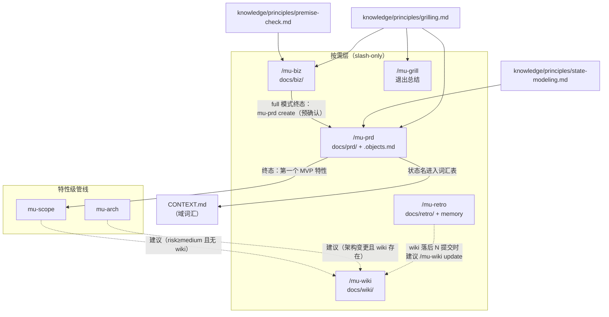

Referenced source files (8 files)

- `skills/mu-biz/SKILL.md`
- `skills/mu-prd/SKILL.md`
- `skills/mu-wiki/SKILL.md`
- `skills/mu-retro/SKILL.md`
- `skills/mu-grill/SKILL.md`
- `knowledge/principles/grilling.md`
- `knowledge/principles/premise-check.md`
- `knowledge/principles/state-modeling.md`

# 按需技能：mu-biz / mu-prd / mu-wiki / mu-retro / mu-grill

DevMuse 有五个**按需技能**（on-demand skills）：mu-biz（商业分析）、mu-prd（产品需求）、mu-wiki（架构 wiki）、mu-retro（周期回顾）、mu-grill（穷追访谈）。五者的 frontmatter 均声明 `disable-model-invocation: true`——模型不能自主加载它们，只能由用户以斜杠命令直呼（如 `/mu-biz quick`、`/mu-wiki update`、`/mu-retro 14d`）。路由对它们只指路、不代调：mu-biz 与 mu-wiki 的 Integration 部分都明确写着 "On-demand only — never auto-routed (bootstrap points to the slash command instead)"。Sources: [skills/mu-biz/SKILL.md:1-5](), [skills/mu-prd/SKILL.md:1-5](), [skills/mu-wiki/SKILL.md:1-5](), [skills/mu-retro/SKILL.md:1-5](), [skills/mu-grill/SKILL.md:1-5](), [skills/mu-biz/SKILL.md:210](), [skills/mu-wiki/SKILL.md:386]()

之所以"仅斜杠直呼"，根源在**运行节奏与特性级管线不同**：mu-biz 与 mu-prd 是"每产品一次、而非每特性一次"（once per product, not per feature）的产品级技能，明确声明"独立于特性级主管线"；mu-retro 按时间窗运行（默认 7 天）且"独立于主管线"；mu-wiki 以 commit 为终态、不调用任何下游技能；mu-grill 则是随时可召的对话纪律。把这些低频/正交技能排除在自动路由之外，日常特性开发就不会被误触发进入产品级全流程。本页逐一解释五个技能的深度模式、产物与集成点，并重点覆盖 mu-prd 新增的条件式 **Product Object Model** 工具。Sources: [skills/mu-biz/SKILL.md:11](), [skills/mu-prd/SKILL.md:11](), [skills/mu-retro/SKILL.md:11](), [skills/mu-wiki/SKILL.md:359](), [skills/mu-prd/SKILL.md:138-146]()

## 总览

| 技能 | 角色 | 模式 | 产物 | 终态 |
|------|------|------|------|------|
| mu-biz | 商业前提验证与产品策略（市场、BMC、VPC、persona、MVP 范围） | `quick`（4 个逼问）/ `full`（quick + 8 个商业章节） | `docs/biz/YYYY-MM-DD-<name>[-quick].md` | quick → 用户自行决定；full → 调用 `mu-prd create` |
| mu-prd | 用户可见的产品需求（流程、界面、逐特性规格、分层规则、NFR、指标） | `lightweight`（3 章节）/ `full`（9 章节） | `docs/prd/YYYY-MM-DD-<product>.md`（+ 条件式 `.objects.md`） | 调用 mu-scope 处理第一个 MVP 特性 |
| mu-wiki | 项目级架构 wiki（Mermaid 图、表格、强制源码引用） | `generate`（全量）/ `update`（基于 git diff 增量） | `docs/wiki/_index.md` + 各页面 | commit，不调用任何下游技能 |
| mu-retro | 周期回顾（git 量化指标 + 质性反思 + 写入记忆） | 时间窗参数（默认 `7d`） | `docs/retro/YYYY-MM-DD-retro.md` + Claude Code 记忆 | 独立收尾，不链接其他技能 |
| mu-grill | 对计划/设计/想法的穷追访谈，直到所有返工级分叉收敛 | 无模式；目标由用户指定 | 退出总结（可写入既有 scope/spec/PRD 工件） | 总结决策、假设与被搁置的分叉 |

Sources: [skills/mu-biz/SKILL.md:60-68](), [skills/mu-biz/SKILL.md:117-141](), [skills/mu-prd/SKILL.md:63-69](), [skills/mu-prd/SKILL.md:242-247](), [skills/mu-wiki/SKILL.md:27-34](), [skills/mu-wiki/SKILL.md:384-390](), [skills/mu-retro/SKILL.md:37-91](), [skills/mu-grill/SKILL.md:9-15]()

## 产品级链条与集成点

五个技能并非孤岛。mu-biz 与 mu-prd 构成特性级管线上游的**产品级链条**（full 模式下自动衔接），mu-wiki 与 mu-retro 是维护型正交技能（只接受来自其他技能的"建议"，不被调用），mu-grill 是各技能提问步骤共用纪律 grilling.md 的独立入口。

```mermaid
graph TD
    subgraph OnDemand["按需层（slash-only）"]
        BIZ["/mu-biz<br/>docs/biz/"]
        PRD["/mu-prd<br/>docs/prd/ + .objects.md"]
        WIKI["/mu-wiki<br/>docs/wiki/"]
        RETRO["/mu-retro<br/>docs/retro/ + memory"]
        GRILL["/mu-grill<br/>退出总结"]
    end
    subgraph Pipeline["特性级管线"]
        SCOPE["mu-scope"]
        ARCH["mu-arch"]
    end
    PC["knowledge/principles/premise-check.md"]
    SM["knowledge/principles/state-modeling.md"]
    GR["knowledge/principles/grilling.md"]
    CTX["CONTEXT.md<br/>（域词汇）"]

    PC --> BIZ
    BIZ -->|"full 模式终态：<br/>mu-prd create（预确认）"| PRD
    SM --> PRD
    PRD -->|"终态：第一个 MVP 特性"| SCOPE
    PRD -->|"状态名进入词汇表"| CTX
    SCOPE -.->|"建议（risk≥medium 且无 wiki）"| WIKI
    ARCH -.->|"建议（架构变更且 wiki 存在）"| WIKI
    RETRO -.->|"wiki 落后 N 提交时<br/>建议 /mu-wiki update"| WIKI
    GR --> GRILL
    GR --> BIZ
    GR --> PRD
```

虚线是"建议"而非调用——mu-retro 的原则明确写着 "Standalone, no chaining — does NOT invoke other skills"；mu-wiki 的 Integration 也只把 mu-scope / mu-arch 列为"suggestion from"。实线只有一条自动衔接：mu-biz full 模式终态调用 `mu-prd create`，并按 spec §2.5 传递预确认 stance，使 mu-prd 的 Phase 0 不再弹确认对话。Sources: [skills/mu-retro/SKILL.md:80](), [skills/mu-retro/SKILL.md:98](), [skills/mu-wiki/SKILL.md:386](), [skills/mu-biz/SKILL.md:141](), [skills/mu-prd/SKILL.md:33](), [skills/mu-prd/SKILL.md:244]()

## mu-biz：商业分析

**范围界定**：产品级商业策略——市场、商业模式、persona、MVP 范围。产品需求归 mu-prd，技术架构归 mu-arch；技能内的 Key Principles 重申了这条边界（"No technical design — that's mu-arch's job"，"No feature specs — that's mu-prd's job"）。一条 HARD-GATE 守住下游：**用户批准 biz 工件之前，不得调用 mu-prd 或任何特性级技能**，且 HARD-GATE 在 Phase 0 之前评估，`skip` stance 也不能绕过。Sources: [skills/mu-biz/SKILL.md:9-17](), [skills/mu-biz/SKILL.md:201-202]()

### Stance 与深度模式：两个正交概念

mu-biz 有两个独立概念，由斜杠参数各自解析、互不干扰：

- **Stance**（Phase 0）：按 stance-detection 算法检测既有 biz 工件状态，得出 `create` / `update`（子类型 `expand` / `gap-fill` / `sync`）/ `extract` / `skip`。高置信度静默执行；歧义时给出推荐并询问；斜杠提示（`/mu-biz create`）视为预确认。mu-biz 的检测有一个明示的弱点：**biz 的过期是人的判断而非文件信号**——watched source 只有根 `README*`，只能抓到"README 说法已大不相同"的粗粒度情况，用户知道 pivot 已发生时需手动 override 为 `update(sync)`。
- **Depth Mode**：`quick` 或 `full`，按用户信号检测（"is this worth doing?" → quick；"startup" / "business plan" → full；不明确则询问、默认 quick）。

Sources: [skills/mu-biz/SKILL.md:19-58](), [skills/mu-biz/SKILL.md:60-68]()

### Quick 模式：4 个 forcing questions

Quick 模式加载 `knowledge/principles/premise-check.md`，先区分语境（greenfield 问"该不该做"，existing 问"这个改动/pivot 值不值得折腾"），再逐条问 4 个逼问（一次一问）：

| # | 问题 | 红旗信号 |
|---|------|---------|
| Q1 Problem Specificity | 到底谁有这个问题？他们今天怎么绕过去？ | 空泛的"用户想要……"，说不出具体的人和 workaround |
| Q2 Temporal Durability | 三年后世界变了，这东西更必需还是更不必需？ | 依赖一个可能反转的趋势 |
| Q3 Narrowest Wedge | 验证这事重要的最小可构建物是什么？ | "得先有完整平台" |
| Q4 Observation Test | 你看过别人不经帮助地使用类似方案吗？ | "演示都是表演" |

评估规则量化：3+ 题有强证据 → "Premise validated"；2+ 题含糊 → "弱验证，考虑收窄"；3 轮后仍无有效回答 → "未验证——按用户要求继续"。premise-check 同时服务 mu-scope 的 Quick Probe（轻量版 3 题、跳过 Q4），mu-biz quick 用全 4 题。Sources: [skills/mu-biz/SKILL.md:98-120](), [knowledge/principles/premise-check.md:7-27]()

### Full 模式：quick + 8 个商业章节

Full 模式先跑一遍 quick（4 题同时充当全量分析的前提验证），再逐章产出 8 个商业章节，每章用户批准后才进入下一章：竞争分析、Business Model Canvas（9 blocks）、Value Proposition Canvas、目标 persona、品牌命名（可选）、North Star Metric + 漏斗、MVP 特性范围与分层、成本/收入模型。输出要求"投资人/联合创始人可读"的商业语言。终态调用 `mu-prd create`（预确认，greenfield 产品通常下一步就是 PRD）。Sources: [skills/mu-biz/SKILL.md:124-141](), [skills/mu-biz/SKILL.md:200]()

## mu-prd：产品需求

**范围界定**：用户可见的产品需求——persona、流程、wireframe、逐特性规格、分层规则、NFR、指标。它读取 biz 工件作为输入（persona 与 MVP 范围从那里来、不重推导），输出的 PRD 成为逐特性 mu-scope 的输入。HARD-GATE：PRD 未获批准前不得调用 mu-scope，且 PRD 必须覆盖 biz 工件的全部 MVP 特性。与 mu-biz 同构地拥有 Phase 0 stance（watched source 是 `src/pages/`、`src/screens/`、`src/views/`、`app/`，均缺失时回退顶层 `src/`）与深度模式（`lightweight` 3 章节 / `full` 9 章节）两个正交概念。Sources: [skills/mu-prd/SKILL.md:9-15](), [skills/mu-prd/SKILL.md:19-34](), [skills/mu-prd/SKILL.md:63-67](), [skills/mu-prd/SKILL.md:105-136](), [skills/mu-prd/SKILL.md:232]()

**Stakes 校准长度**：深度不明确时只问一个探针——"Stakes — hobby / internal tool / public launch?"。hobby ≈ 一两页，internal ≈ 几页，launch ≈ 特性需要多长就多长。**深度模式决定章节集合，stakes 校准每个章节的分量**——这是防止 solo 项目被 9 章全量 PRD 压垮、又防止公开发布产品只拿到一页纸的双向阀门。Sources: [skills/mu-prd/SKILL.md:67-69]()

### Product Object Model（条件式工具）

这是 mu-prd 新增的核心工具，由 `knowledge/principles/state-modeling.md` 支撑。

**触发条件（trigger-gated）**：任一 MVP 特性涉及审批、预订、下单/支付、订阅、发布、多角色交接、配额或限时有效性——即存在"允许的动作取决于生命周期位置"的业务对象。**无触发则静默跳过，零仪式**——CRUD 型产品不为此付任何成本。Sources: [skills/mu-prd/SKILL.md:140]()

**建模方法**来自 state-modeling.md 的三层结构：

1. **Lifecycle sentence 是分叉探测器**：一句话穷尽对象行为——"**谁**在**什么前置条件**下对**对象**执行**什么动作**；对象从**哪个状态**迁移到**哪个状态**；**失败、重复提交、并发、超时**时用户看到什么"。填不上的空格就是一个 fork，按 grilling 纪律带推荐地交给用户——"This sentence is the fork *detector*; grilling is the fork *converger*"。Sources: [knowledge/principles/state-modeling.md:5-11]()
2. **先分类再建模**：只有 business state 进状态模型。attribute（房型、渠道）归特性规格字段，computed（is-overdue）只记公式、永不落库为状态，page state（loading/empty）归 wireframe 章节，sub-object state（订单里的支付状态）建自己的机器——"一机一对象"。最常见的建模 bug 就是把多个对象的生命周期压进一个状态字段（团购要分别建团的机器和每个参团订单的机器，再标注耦合迁移）。Sources: [knowledge/principles/state-modeling.md:13-25]()
3. **每对象五件套**：closed state list（出现 "etc." / "等" 即模型未完成）、transition table（state × event × actor → next state，期限与窗口带显式的含/不含边界语义与时钟）、invariants（每条注明违规尝试的下场：rejected / queued / overridden）、terminal states（terminal 意为无出口——复活一个 cancelled booking 是新 booking，除非模型显式加复活迁移）、guarantees（经得起重试与竞态的用户可见承诺，如"双击开团永不建两个团"；guarantee 是产品规则，*如何*守住它——幂等键、锁——是 mu-arch 的事）。批准前跑 5 项 self-check（无入口/无出口状态、暗地里想改的 terminal、多状态可触发事件的逐状态结果、无 actor 的迁移、无边界语义的期限）。Sources: [knowledge/principles/state-modeling.md:27-43]()

**在 PRD 中的落位与产物**：

| 维度 | Full 模式 | Lightweight 模式 |
|------|-----------|-----------------|
| 构建时机 | Information Architecture 之后、Core User Flows 之前（feature map 点出对象名；流程走机器、规格按名引用状态） | 无 IA 章节，表格直接置于核心流程之前 |
| 工件形态 | 伴生文件 `docs/prd/YYYY-MM-DD-<product>.objects.md`，PRD header 的 `> **Object model:**` 行链接它，与 PRD 同 commit | 每对象一张 states+transitions 表内嵌 PRD 正文 |

**词汇即域语言**：批准的状态名经 domain-glossary 资格测试后写入仓库根 `CONTEXT.md`（不存在则创建；含定义 + `_Avoid_` 同义词），与 PRD 同 commit——下游技能**逐字**使用这些名字。state-modeling.md 的 Layer Boundaries 明确三层分工：PRD 出状态词汇/合法迁移/不变量/guarantee，mu-scope 为每条迁移至少枚举一个 UC，mu-arch 实现机器（幂等键、事务、补偿、定时器）并逐字继承状态名。`update` stance 下每台被触及的状态机是一个批准单元：重跑 self-check，terminal state 变更按 fork 与用户确认。Sources: [skills/mu-prd/SKILL.md:142-146](), [skills/mu-prd/SKILL.md:171](), [knowledge/principles/state-modeling.md:49-53](), [skills/mu-prd/SKILL.md:41]()

另有一条方法论约束：**Steady State First**——先设计稳态机器再设计 onboarding，onboarding 是机器的 t=0 遍历而非独立流程；反模式症状是"onboarding wizard 的步骤复制了 IA 里已有的特性"。Sources: [knowledge/principles/state-modeling.md:45-47]()

### 章节推进与终态

9 章（full）或 3 章（lightweight）一次一章、逐章批准，每章的开放点按 grilling 纪律推进。Per-feature specs 有明确的范围栅栏："Defer use case enumeration"——PRD 陈述产品规则（含对象模型的状态 guarantee），mu-scope 才枚举具体场景；"Single-home every rule"——每条规则只在一个章节陈述、他处引用。终态：用户挑选第一个 MVP 特性，调用 mu-scope，其余特性逐个迭代。Sources: [skills/mu-prd/SKILL.md:115-136](), [skills/mu-prd/SKILL.md:125](), [skills/mu-prd/SKILL.md:234-235](), [skills/mu-prd/SKILL.md:156-158]()

## mu-wiki：架构 wiki

mu-wiki 生成并维护**项目级架构 wiki**——带 Mermaid 图、表格与强制源码引用的结构化页面，输出在 `docs/wiki/`。技能开篇就与近邻划清边界：不是 mu-explore（个人心智模型定向工件），不是 mu-arch（针对某次变更的 ADR——wiki 记录"是什么"而非"应该是什么"），不是 README（入口 vs 内部深度），也不是自动 API 文档（解释 WHY 和 HOW，不只是 WHAT）。反模式一栏点名"在聊天里描述架构"——聊天描述下个会话就丢了。Sources: [skills/mu-wiki/SKILL.md:7-25]()

### 两阶段架构

"Two-phase is the architecture"是首条 Key Principle：Phase 1 由 `Explore` 类型的 Structure subagent 产出 JSON 结构（sections、pages、每页至少 3 个 relevant_files 且必须真实存在于文件树），**用户审结构后**才进入 Phase 2——逐页并行分发 Page subagent。结构评审是杠杆最高的检查点："Adjusting pages after generation is expensive"。页面失败不阻塞他页，在 `_index.md` 标 `status: failed`。generate 前有 size gate：<50k LOC 全量扫描，50k–200k 只给顶层目录，>200k 限定顶层模块并告知用户可后续深潜。Sources: [skills/mu-wiki/SKILL.md:109-155](), [skills/mu-wiki/SKILL.md:351-358]()

### Update 模式与引用纪律

update 模式从 `_index.md` 读 baseline commit，`git diff --name-only <baseline>..HEAD` 匹配受影响页面，只重生成这些页。防御性降级齐全：受影响页 >60% 或变更文件 >50 → 警告建议全量重建；relevant_files 已删除/改名 → 降级 full regenerate；`_index.md` 缺失或不可解析 → 建议 `/mu-wiki generate`。每页强制引用至少 5 个不同源文件——"Citations ARE the value. A wiki without citations is a hallucination document"。终态是 commit，不调用任何下游技能。Sources: [skills/mu-wiki/SKILL.md:285-321](), [skills/mu-wiki/SKILL.md:361-382](), [skills/mu-wiki/SKILL.md:354](), [skills/mu-wiki/SKILL.md:359]()

## mu-retro：周期回顾

mu-retro 的次序是"**Data first, then reflection**"：先并行采集 git 数据（commits、作者摘要、文件变更频率 top、测试文件数、wiki 新鲜度），生成指标表与按作者拆分表，再进入质性反思（一次一问："这段时间什么最顺？""什么最意外？""下个周期想改什么？"）。零 commit 时优雅降级——跳过指标表直接进反思。产物两份：`docs/retro/YYYY-MM-DD-retro.md` 工件，以及**筛选后**写入 Claude Code memory（project 类型）的条目——"Memory is selective"，只写跨会话仍有价值的非显然发现（如"模块 X 是变更热点"），写前先查既有记忆、能更新则不新建。Sources: [skills/mu-retro/SKILL.md:37-91](), [skills/mu-retro/SKILL.md:92-98]()

与 mu-wiki 的集成点是**建议式**的：若 `docs/wiki/_index.md` 存在且其最后更新后已有新 commit，报告落后量（"wiki 落后 N 个提交"）并推荐回顾结束后跑 `/mu-wiki update`——"Suggestion only — mu-retro never invokes other skills"。Sources: [skills/mu-retro/SKILL.md:80]()

## mu-grill 与 grilling 纪律

mu-grill 是五者中最薄的技能——因为它的实体在 `knowledge/principles/grilling.md`。技能本体只有三步：确定目标（当前讨论的计划、用户点名的文件、一个 diff；歧义则问）；**从最高的 fork 开问**——错猜会作废最多下游工作的那个决策——再按依赖序走完决策树；退出时总结"谁做了哪些决策、记录了哪些假设、用户搁置了哪些 fork"，若存在相关工件（scope/spec/PRD）则提议把总结写进去。Sources: [skills/mu-grill/SKILL.md:9-15]()

grilling.md 是被 mu-scope（用例引出）、mu-arch（澄清问题）、mu-prd（章节访谈）、mu-biz（full 模式章节）在各自提问步骤共享的**同一套访谈纪律**——"the same process every run, whichever skill is asking"，mu-grill 只是它的独立入口。四条纪律：按依赖序走决策树（答案打开子分支就先下钻）；一次一问、附带 A/B/C 选项与置顶的推荐；**事实归你、决策归用户**（codebase 里 grep 得到的自己查，偏好/优先级/权衡交给用户；用户说"你定"就做出决定并在工件里记为显式假设）；收敛每个 fork——没有问题数预算，"stop when the forks are resolved, not when the questions feel like enough"，用户问烦了就提议把余下 fork 转成书面假设，由用户拍板而非自动封顶。退出判据：每个剩余未知要么可由读码/读文档回答、要么已是用户见过的显式假设，且每个 fork 都带用户答案或用户批准的假设。Sources: [knowledge/principles/grilling.md:1-16]()

## 共性设计模式

| 模式 | mu-biz | mu-prd | mu-wiki | mu-retro | mu-grill |
|------|--------|--------|---------|----------|----------|
| `disable-model-invocation: true` | ✅ | ✅ | ✅ | ✅ | ✅ |
| Phase 0 stance detection | ✅（create/update/extract/skip） | ✅（同左） | —（generate/update 模式选择） | — | — |
| 深度/模式二分 | quick / full | lightweight / full | generate / update | 时间窗参数 | — |
| 逐节批准 | ✅（full 8 章节） | ✅（含状态机为独立批准单元） | ✅（结构评审 + 页面评审） | —（对话式反思） | —（逐 fork 收敛） |
| grilling 纪律 | ✅ | ✅ | — | — | 本体 |
| 终态链接下游 | full → mu-prd | → mu-scope | 终止于 commit | 终止于 memory | 终止于总结 |

Sources: [skills/mu-biz/SKILL.md:1-5](), [skills/mu-prd/SKILL.md:41](), [skills/mu-wiki/SKILL.md:27-34](), [skills/mu-retro/SKILL.md:11](), [skills/mu-grill/SKILL.md:1-5](), [knowledge/principles/grilling.md:3]()

## 交叉引用

See also:

- [核心管线](core-pipeline.md) — mu-prd 终态所衔接的 mu-scope 及后续特性级技能
- [域语言与质量](domain-language-and-quality.md) — Product Object Model 状态名进入 `CONTEXT.md` 的词汇资格机制
- [工作流与路由](workflow-and-routing.md) — bootstrap 为何对按需技能只指路不代调
