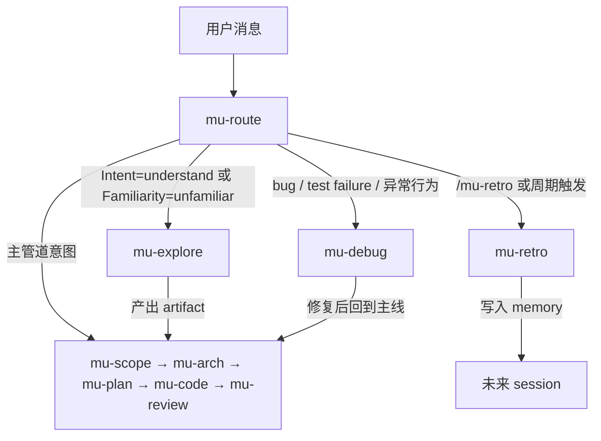
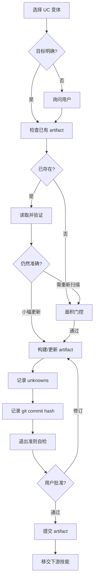
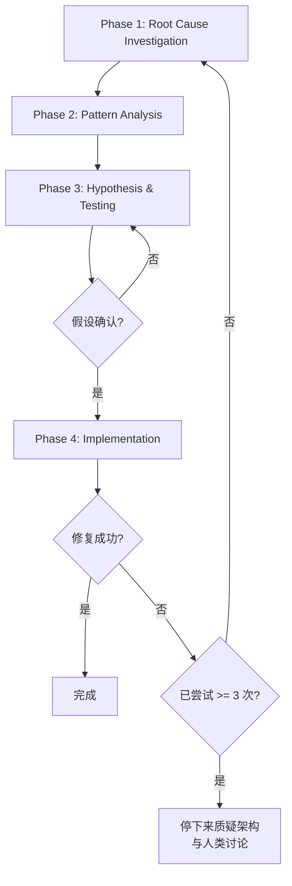
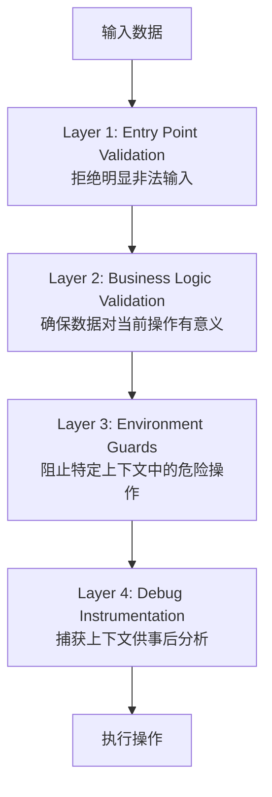
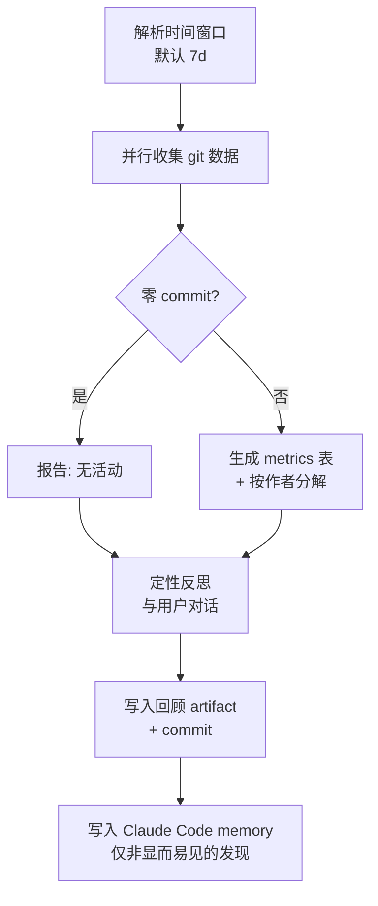

<details>
<summary>引用的源文件</summary>

- `skills/mu-explore/SKILL.md`
- `skills/mu-debug/SKILL.md`
- `skills/mu-debug/root-cause-tracing.md`
- `skills/mu-debug/condition-based-waiting.md`
- `skills/mu-debug/defense-in-depth.md`
- `skills/mu-debug/find-polluter.sh`
- `skills/mu-retro/SKILL.md`

</details>

# 正交技能

DevMuse 的核心管道（scope → arch → plan → code → review）覆盖了从需求到交付的主线流程，但开发过程中还存在大量"非线性"场景：理解陌生代码、排查 bug、阶段性回顾。**正交技能**（Orthogonal Skills）专门处理这些场景，它们由 `mu-route` 根据意图和熟悉度自动路由，独立于主管道运行，但产出可被主管道消费。

目前共有三个正交技能：`mu-explore`（代码理解）、`mu-debug`（根因分析）和 `mu-retro`（回顾总结）。它们各自拥有独立的触发条件、流程和产出物，彼此之间没有顺序依赖，因此称为"正交"。

## 技能总览

| 技能 | 触发场景 | 核心原则 | 产出物 |
|------|---------|---------|--------|
| `mu-explore` | 理解陌生代码（onboarding、takeover、pre-change 等） | 持久化优先——chat 摘要等于丢失 | `docs/explore/` 下的 living artifact |
| `mu-debug` | 任何 bug、测试失败、异常行为 | 先找 root cause，再谈修复 | 修复代码 + 防御层 |
| `mu-retro` | 周期性回顾（默认 7 天） | 数据先行，反思跟进 | `docs/retro/` 下的回顾文档 + Claude Code memory |

Sources: [mu-explore/SKILL.md:1-4](), [mu-debug/SKILL.md:1-4](), [mu-retro/SKILL.md:1-4]()

## 路由与主管道的关系



正交技能的产出可流入主管道：`mu-explore` 的 artifact 为 `mu-scope`、`mu-arch`、`mu-debug` 提供上下文；`mu-debug` 修复后可回到 `mu-code`；`mu-retro` 的 memory 影响未来所有 session。

Sources: [mu-explore/SKILL.md:163-168](), [mu-debug/SKILL.md:313-315]()

## mu-explore：代码理解

### 核心机制

`mu-explore` 的存在意义是**防止心智模型丢失**。它的 Hard Gate 规则要求：在 `docs/explore/` 写入持久化 artifact 并获得用户确认之前，不得移交给下游技能。chat-only 摘要是该技能最常见的失败模式。

Sources: [mu-explore/SKILL.md:10-12](), [mu-explore/SKILL.md:14-23]()

### Use Case 变体

| 变体 | 适用场景 | 聚焦点 | 深度 |
|------|---------|--------|------|
| **onboarding** | 刚 clone 的仓库 | 顶层结构、核心思路 | 全仓库，浅层 |
| **takeover** | 接手遗弃项目 | 部落知识、dead code、权属不清 | 全仓库，深层 |
| **dependency-eval** | 评估是否引入依赖 | Public API、质量信号 | 外部视角，浅层 |
| **pre-change** | 修改陌生区域前 | 目标区域 + blast radius | 区域级，上限 50 文件 |
| **pre-debug** | 陌生区域的 bug | bug 邻近代码 + 数据流 | 区域级，症状驱动 |

Sources: [mu-explore/SKILL.md:34-43]()

### 面积门控

为防止对大型仓库进行无效扫描，`mu-explore` 设有 LOC 门控：

| 面积 | 处理方式 |
|------|---------|
| < 50k LOC | 完整扫描 |
| 50k - 200k LOC | 仅顶层组件，不深入 |
| > 200k LOC | 拒绝，要求用户缩小范围 |

Sources: [mu-explore/SKILL.md:131-137]()

### 流程概览



Sources: [mu-explore/SKILL.md:48-93]()

## mu-debug：系统性调试

### Iron Law

```
NO FIXES WITHOUT ROOT CAUSE INVESTIGATION FIRST
```

在完成 Phase 1 之前不得提出修复方案。如果连续 3 次修复失败，必须停下来质疑架构本身，与人类讨论后再继续。

Sources: [mu-debug/SKILL.md:17-20](), [mu-debug/SKILL.md:223-238]()

### 四阶段流程



| 阶段 | 关键活动 | 成功标准 |
|------|---------|---------|
| Phase 1: Root Cause | 读错误信息、复现、检查变更、收集证据 | 理解 WHAT 和 WHY |
| Phase 2: Pattern | 找到正常工作的示例、对比差异 | 识别差异点 |
| Phase 3: Hypothesis | 提出单一假设、最小化测试 | 假设确认或换新假设 |
| Phase 4: Implementation | 创建失败测试、修复、验证 | bug 已解决，测试通过 |

Sources: [mu-debug/SKILL.md:48-71](), [mu-debug/SKILL.md:286-293]()

### 辅助技术

`mu-debug` 包含三个辅助技术文档和一个工具脚本：

| 技术 | 用途 | 核心思路 |
|------|------|---------|
| Root Cause Tracing | 沿调用链反向追溯到原始触发点 | 永远不要只修症状出现的地方 |
| Defense-in-Depth | 修复后在每一层添加验证 | 让 bug 在结构上不可能发生 |
| Condition-Based Waiting | 替换任意 timeout 为条件轮询 | 等待你关心的条件，而非猜测耗时 |
| `find-polluter.sh` | 二分法找出污染测试环境的测试 | 逐个运行测试，定位首个 polluter |

Sources: [mu-debug/root-cause-tracing.md:1-6](), [mu-debug/defense-in-depth.md:1-8](), [mu-debug/condition-based-waiting.md:1-8](), [mu-debug/find-polluter.sh:1-5]()

### Root Cause Tracing 示例

追溯过程遵循"向上追一层"的循环，直到找到数据的源头：

1. **观察症状**：`git init` 在源码目录执行
2. **找到直接原因**：`cwd` 参数为空字符串
3. **向上追溯**：`WorktreeManager` ← `Session.create()` ← 测试代码
4. **找到源头**：`setupCoreTest()` 返回 `{ tempDir: '' }`，测试在 `beforeEach` 之前就访问了 `tempDir`
5. **在源头修复** + 添加四层 defense-in-depth 验证

Sources: [mu-debug/root-cause-tracing.md:109-129](), [mu-debug/defense-in-depth.md:97-119]()

### Defense-in-Depth 四层模型



单层验证是"我们修了这个 bug"，四层验证是"我们让这个 bug 在结构上不可能发生"。

Sources: [mu-debug/defense-in-depth.md:10-14](), [mu-debug/defense-in-depth.md:20-84]()

### Condition-Based Waiting

| 场景 | 模式 |
|------|------|
| 等待事件 | `waitFor(() => events.find(e => e.type === 'DONE'))` |
| 等待状态 | `waitFor(() => machine.state === 'ready')` |
| 等待计数 | `waitFor(() => items.length >= 5)` |
| 等待文件 | `waitFor(() => fs.existsSync(path))` |
| 复合条件 | `waitFor(() => obj.ready && obj.value > 10)` |

实际效果：修复了 3 个文件中 15 个 flaky 测试，通过率从 60% 提升到 100%，执行时间缩短 40%。

Sources: [mu-debug/condition-based-waiting.md:36-56](), [mu-debug/condition-based-waiting.md:109-115]()

### find-polluter.sh

当不确定哪个测试污染了环境时，使用该二分脚本：

```bash
./find-polluter.sh '.git' 'src/**/*.test.ts'
```

脚本逐个运行测试文件，在每次运行后检查指定的文件/目录是否出现，首次检测到污染即停止并报告 polluter。

Sources: [mu-debug/find-polluter.sh:1-60]()

## mu-retro：回顾总结

### 定位

`mu-retro` 是完全独立的技能，不链接其他技能，也不被其他技能调用。通过 `/mu-retro` 或 `/mu-retro 14d` 手动触发，默认回顾窗口为 7 天。

Sources: [mu-retro/SKILL.md:9-11]()

### 流程



### 收集的指标

| Metric | 说明 |
|--------|------|
| Commits | 窗口内提交数 |
| Contributors | 贡献者数 |
| Lines changed | 增删行数 |
| Test files | 测试文件总数 |
| Hottest files | 变更频率最高的 3 个文件 |

Sources: [mu-retro/SKILL.md:62-69]()

### 核心原则

- **数据先行**：先展示数字，再征求意见
- **逐个反思**：每次只问一个反思问题，不要信息过载
- **Memory 写入要精选**：只写入非显而易见的、跨 session 有价值的发现
- **优雅处理边界情况**：零 commit、shallow clone、monorepo

Sources: [mu-retro/SKILL.md:87-94]()

## 常见反模式

三个正交技能都定义了需要警惕的反模式：

| 技能 | 反模式 | 后果 |
|------|--------|------|
| `mu-explore` | 只在 chat 中总结，不写文件 | 下次 session 从零开始 |
| `mu-explore` | 跳过 Unknowns 列表 | 虚假的完整性，未来 session 无法利用 |
| `mu-debug` | 没有 root cause 就开始修复 | 修了症状，引入新 bug |
| `mu-debug` | 一次改多个变量 | 无法隔离哪个修复起了作用 |
| `mu-debug` | 失败 3 次后继续尝试 | 可能是架构问题，而非 bug |
| `mu-retro` | 把所有 metrics 都写入 memory | memory 应精选非显而易见的发现 |

Sources: [mu-explore/SKILL.md:153-161](), [mu-debug/SKILL.md:272-283](), [mu-retro/SKILL.md:91]()
