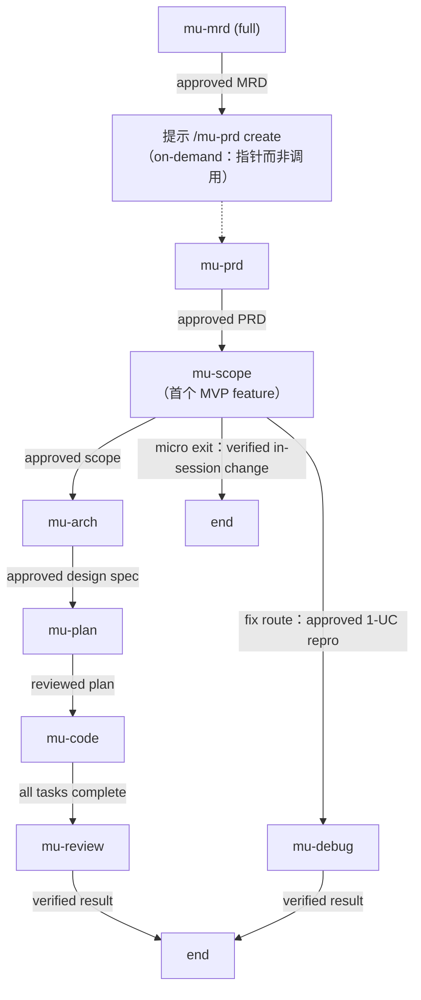
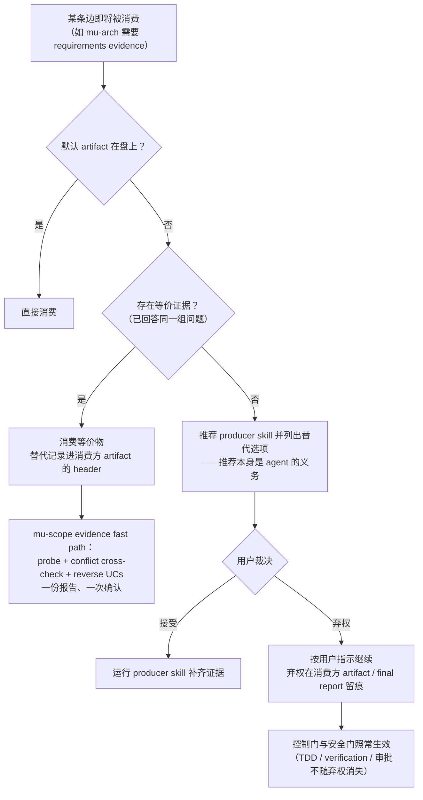

Referenced source files (13 files)

- `rules/bootstrap.md`
- `CONTEXT.md`
- `README.md`
- `knowledge/principles/sign-off-gate.md`
- `knowledge/principles/stance-detection.md`
- `skills/mu-scope/SKILL.md`
- `skills/mu-arch/SKILL.md`
- `skills/mu-plan/SKILL.md`
- `skills/mu-code/SKILL.md`
- `skills/mu-prd/SKILL.md`
- `hooks/hooks.json`
- `.claude-plugin/plugin.json`
- `docs/specs/2026-07-17-fold-routing-into-bootstrap-design.md`（routing-fold 历史设计记录，dated snapshot）

# 管线图：跨技能交接、门禁与证据机制

**Pipeline Graph（管线图）** 是 DevMuse 2.0（"guidance over enforcement"）的核心机制：`rules/bootstrap.md` 中 `### Pipeline Graph` 小节是**跨技能交接的唯一声明处**——技能结束时只宣告自己的 artifact，由这张图命名下一步；交接知识不再散落在各技能体内。域语言把它固定为专有名词："The single declaration of cross-skill handoffs, in `rules/bootstrap.md`: skills announce completion, the graph names the successor; edges consume evidence, not file paths"，并明令弃用旧称 terminal chain / hardwired terminal。当前插件版本即 2.0.0。Sources: [rules/bootstrap.md:94-98](), [CONTEXT.md:27-29](), [.claude-plugin/plugin.json:4]()

这张图带来两条正交的设计原则，也是本页的主线：其一，**边消费证据而非文件路径**——命名的 artifact 只是默认形态，能回答同一组问题的等价物即可满足边；其二，**控制门（用户对 artifact 的审批）与安全门（TDD、verification-before-completion、git safety）永不可替代**——证据替代只松动"文件形态"，从不松动"审批与纪律"。缺证据时的路径是"建议 → 用户裁决 → 弃权留痕"，这是 **Guidance over control** 哲学在管线层的直接落地。Sources: [rules/bootstrap.md:111-124](), [CONTEXT.md:75-77]()

## Pipeline Graph：交接的唯一真相源

图的开场白只有一句，但定义了整个协作模型："Cross-skill handoffs live here, not in skills: a skill finishes by announcing its artifact, and this graph names the next move."（跨技能交接住在这里而不在技能里：技能以宣告 artifact 收尾，由本图命名下一步。）配套地，各技能体内原先硬连线的 "ONLY skill you invoke next" 式 terminal 全部改为统一的 Done 语句加一个指回 Pipeline Graph 的指针：mu-scope 的交接步骤是 "announce the artifact; the Pipeline Graph (bootstrap) names the next move"，mu-arch 的 Done 是 "The Pipeline Graph (bootstrap) names the next move — mu-plan"，mu-plan 的交接与 Integration 同样写 "per the Pipeline Graph (bootstrap)"，mu-prd 的 terminal state 亦然。技能保持原子，图保持权威。Sources: [rules/bootstrap.md:96-98](), [skills/mu-scope/SKILL.md:31](), [skills/mu-scope/SKILL.md:233-235](), [skills/mu-arch/SKILL.md:122](), [skills/mu-plan/SKILL.md:176-183](), [skills/mu-prd/SKILL.md:243]()

### 边表

图共九条边，每条边由三元组构成：From（宣告完成的技能）、Consumes（该边消费的证据）、Next（下一步）。Sources: [rules/bootstrap.md:99-109]()

| From | Consumes（证据） | Next |
|---|---|---|
| mu-mrd（full） | approved MRD | 提示 `/mu-prd create` |
| mu-prd | approved PRD | mu-scope，首个 MVP feature |
| mu-scope | approved scope | mu-arch |
| mu-scope（fix route） | approved 1-UC repro | mu-debug |
| mu-scope（micro exit） | verified in-session change | end |
| mu-arch | approved design spec | mu-plan |
| mu-plan | reviewed plan | mu-code |
| mu-code | all tasks complete | mu-review |
| mu-review / mu-debug | verified result | end |

注意 mu-mrd → mu-prd 这条边是虚线：mu-prd 属 on-demand 技能，永不自动路由，因此图在此产出的是一个指向 `/mu-prd create` 的**提示（prompt）**而非直接调用——与 bootstrap 路由层"on-demand 意图得到指针、不是调用"的行为一致。核心管线段（mu-scope → mu-arch → mu-plan → mu-code → mu-review）则自动路由，每一站的 artifact 是下一站的输入。Sources: [rules/bootstrap.md:82-92](), [rules/bootstrap.md:100-109](), [CONTEXT.md:11-13](), [CONTEXT.md:19-21](), [README.md:37-66]()

## 边消费证据，而非文件路径

2.0 之前的门禁按**文件路径**判定（`docs/scope/*.md` 在不在盘上）；2.0 改为按**证据**判定："The named artifact is the default form; an equivalent that already answers the same questions satisfies the edge — record the substitution in the consuming artifact's header."（命名 artifact 只是默认形态；已能回答同一组问题的等价物即满足该边——替代须记录在消费方 artifact 的 header 中。）bootstrap 点名了两个最常见的等价替代。Sources: [rules/bootstrap.md:111-117]()

| 默认 artifact | 等价替代 | 消费方的行为 |
|---|---|---|
| scope artifact（`docs/scope/*.md`） | 详细的 PRD feature 章节 + object model | mu-scope 走 **evidence fast path**：probe、conflict cross-check、reverse UCs——不重新访谈 |
| `docs/plans/*.md` 实施计划 | 对话中递交的 inline plan | mu-code 直接执行；若只有 design spec 而无任何 plan，则走 waived-plan path（见下） |

Sources: [rules/bootstrap.md:113-117](), [skills/mu-code/SKILL.md:12]()

### 消费方如何落实：mu-arch、mu-scope、mu-code

**mu-arch** 的输入证据块直接引用本图："design needs requirements evidence before any approach talk — an approved scope artifact (default), or an equivalent that already enumerates the feature's cases"。拿到等价物时，它在 spec 的 Requirements Reference 中记录替代来源（模板明确允许 `docs/prd/…§<feature> + .objects.md, per the Pipeline Graph's evidence rule`），并先运行 mu-scope 的 evidence fast path 再设计。Sources: [skills/mu-arch/SKILL.md:18](), [skills/mu-arch/SKILL.md:256-263]()

**mu-scope** 的 evidence fast path 是"不重复劳动"的收敛形态：证据已枚举 cases 时不重新访谈，只补上 scope 独有的三件事——Quick Probe（已运行）、对证据规则的 conflict cross-check、reverse UCs——合成一份报告、一次确认、一个引用源头的 thin artifact。基线对比：折叠前同场景要 3-6 轮转录式访谈。Sources: [skills/mu-scope/SKILL.md:159](), [skills/mu-scope/SKILL.md:16]()

**mu-code** 的对应物是 waived-plan path："A design spec alone is not a plan: recommend mu-plan; if the user directs proceeding anyway, take the waived-plan path"——从已批准证据推导任务列表、请用户点头，然后完全按 Inline Mode 走：isolation 决策、逐任务 TDD、verification、最终 mu-review 链，**并在 final report 中标注 plan 缺失**。注意被弃权的只是 plan 文件这个形态；TDD 与 verification 这些安全门一步不少。Sources: [skills/mu-code/SKILL.md:12]()

### 缺证据：建议 → 用户裁决 → 弃权留痕

等价物也没有时，图规定的路径是三段式："Missing evidence → recommend the producer skill, offer the alternatives, the user decides — the recommendation itself is the agent's obligation; only the user can decline it, and a declined recommendation is flagged in the consuming artifact or final report."（缺证据 → 推荐生产方技能并列出替代选项，由用户裁决——**给出推荐是 agent 的义务，弃权只能由用户做出**，且被拒绝的推荐要在消费方 artifact 或 final report 中留痕。）mu-arch 的落地写法是 "the user decides, and an override is flagged in the spec"。Sources: [rules/bootstrap.md:117-121](), [skills/mu-arch/SKILL.md:18]()

Sources: [rules/bootstrap.md:111-124](), [skills/mu-code/SKILL.md:12]()

## 门禁分层：可替代的边 vs 永不可替代的门

图的收束句划定了证据替代的边界："Control gates (user approval of an artifact) and safety gates (TDD, verification-before-completion, git safety) are never substitutable."（控制门——用户对 artifact 的审批——与安全门——TDD、完成前验证、git 安全——永不可替代。）换言之，2.0 松动的是**顺序门**（sequence gate，"某文件必须先在盘上"），把它改造成受引导的输入证据块；控制与安全两类门保持刚性。域语言的裁定也配套生效：**"gate" 一词永不裸用**，必须带限定词。Sources: [rules/bootstrap.md:122-124](), [CONTEXT.md:94]()

| 门 | 是什么 | 现状与可否绕过 |
|---|---|---|
| 控制门（control gate） | 用户对 deliverable 的审批，下游依赖其成立——"no downstream handoff before the artifact is approved" | **永不可替代**。等价证据只替代 artifact 的形态，不替代审批本身 |
| 安全门（safety gate） | TDD、verification-before-completion、git safety | **永不可替代**。waived-plan path 等弃权路径同样全程保留 |
| HARD-GATE | 嵌在技能体内的结构性前置条件（如 mu-scope："UC set 未获用户批准前不得调用 mu-arch 或任何实现技能"）——控制门在技能文本中的形态 | 在 stance detection **之前**评估；`skip` stance 与 sign-off 都不能绕过它 |
| Sign-off gate | 协作层的 stakeholder 审批协议（见下节） | 始终可用 "skip sign-off" 跳过——**明确不是 HARD-GATE** |
| Pipeline gate（已退役） | 2.0 前的 pre-tool-use hook：scope + design spec 不在盘上即 deny Edit/Write | 2.0.0 中随 `pipeline-gate.sh` 一并移除；现行 `hooks.json` 的 PreToolUse 只注册 destructive-guard。CONTEXT.md 的该词条仍在，读作历史概念 |

Sources: [rules/bootstrap.md:122-124](), [CONTEXT.md:35-45](), [knowledge/principles/sign-off-gate.md:83-85](), [skills/mu-scope/SKILL.md:12-16](), [skills/mu-arch/SKILL.md:14-16](), [hooks/hooks.json:15-26]()

mu-scope 把这条边界压缩成一句话放在 HARD-GATE 正下方："Sequence substitutions (the evidence fast path, user-held overrides) are defined in the Pipeline Graph — **the UC approval itself is never waivable by the agent**."——顺序可替代、由图定义；审批不可替代、握在用户手里。stance 层同理：`skip` stance 能跳过 artifact 工作乃至 sign-off gate，"but never a HARD-GATE"；stance 的强制覆盖（forced-stance overrides）全部非阻塞，但都发生在门禁之内。Sources: [skills/mu-scope/SKILL.md:16](), [knowledge/principles/stance-detection.md:150-155](), [knowledge/principles/stance-detection.md:96-109](), [CONTEXT.md:88]()

## Sign-off gate：交接之上的协作层

Pipeline Graph 管"下一步是什么"，sign-off gate 管"交接前团队是否同意"——它是 creative skill（mu-mrd / mu-prd / mu-arch）出口处的**协作层**，仅当 stakeholder-scope 判定为 team-touching（工件影响他人拥有的代码）时触发。三个触发条件必须同时成立：技能自身的 exit criterion 已满足（artifact 已获用户批准）、既有 HARD-GATE 已满足（sign-off 永不绕过门禁）、检测判定 team-touching。README 的一句话摘要："Non-blocking — user can always override."。Sources: [knowledge/principles/sign-off-gate.md:1-19](), [CONTEXT.md:23-25](), [CONTEXT.md:43-49](), [README.md:78]()

| 检测信号（任一即触发） | 判据 |
|---|---|
| S1 CODEOWNERS 存在 | `test -f .github/CODEOWNERS \|\| test -f CODEOWNERS` |
| S2 多作者近史 | 90 天内 watched dirs 的去重作者数 ≥3 |
| S3 用户显式声明 | 会话中说过 "team project" / "shared code" / "need RFC" / "team-touching" |

Sources: [knowledge/principles/sign-off-gate.md:21-34]()

协议本身是"宣告 → 等待 → 留痕 → 继续"四拍：出口前宣告一句（触发信号 + 从 CODEOWNERS/git 作者推断的 stakeholders），等待用户回复；"signed off" 与 "skip sign-off" 都在 artifact 的 History 段落追加一行记录，然后**按 Pipeline Graph 的既有 terminal 继续交接**（worked example 中 mu-arch 于 sign-off 后照常 hand off 到 mu-plan）。它与 HARD-GATE 的分界被原文写死："HARD-GATEs are control gates… Sign-off is **collaborative** ('stakeholders agree before proceeding'). It runs later and can be explicitly skipped by the user."——它在管线图的门禁分层中占据唯一可由用户一句话跳过的一层。与 stance 正交：create / update / extract 在 team-touching 时都触发，唯 `skip` stance 连 artifact 工作都没有，故连带跳过。Sources: [knowledge/principles/sign-off-gate.md:36-53](), [knowledge/principles/sign-off-gate.md:74-85](), [knowledge/principles/sign-off-gate.md:87-103]()

## 历史背景：为什么图落在 bootstrap（routing-fold 记录）

Pipeline Graph 落户 `rules/bootstrap.md` 而非任何技能文件，其地基是 2026-07-17 的 routing 折叠——本页引用的 `docs/specs/2026-07-17-fold-routing-into-bootstrap-design.md` 即那次折叠的**历史设计记录（dated snapshot，永不回溯编辑）**。该记录确立的原则直接为十天后的 Pipeline Graph 铺路：路由（以及一切"选下一步"的决策）必须在任何技能加载之前就可运行，属于 rules 层的 always-on 决策指南；ADR-1 拒绝了 disclosed 引用文件方案，因为它重新引入被消除的加载往返。跨技能交接同为"技能边界之外的决策"，故 2.0.0（2026-07-27）把 Pipeline Graph 内联进同一个 always-on 文件，与路由表比邻——技能保持原子，bootstrap 成为路由与交接的双重唯一真相源。Sources: [docs/specs/2026-07-17-fold-routing-into-bootstrap-design.md:1-8](), [docs/specs/2026-07-17-fold-routing-into-bootstrap-design.md:26-40](), [docs/specs/2026-07-17-fold-routing-into-bootstrap-design.md:88-92](), [rules/bootstrap.md:94-124]()

---

See also: [核心管线：Scope → Arch → Plan → Code → Review](core-pipeline.md) · [DevMuse 四层架构](four-layer-architecture.md) · [域语言与技能质量机制](domain-language-and-quality.md)
