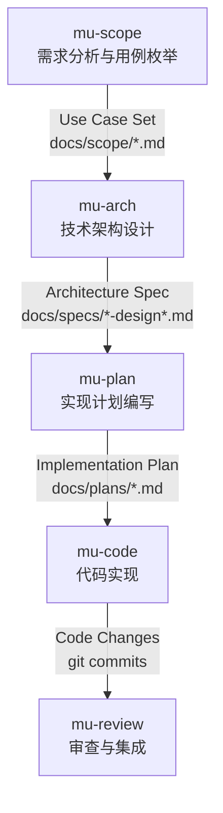
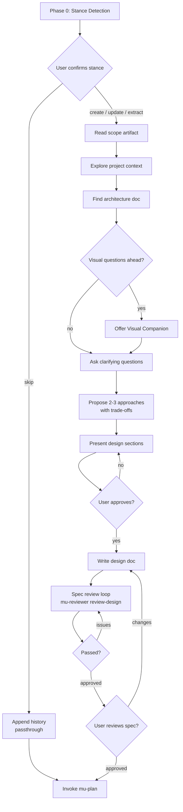
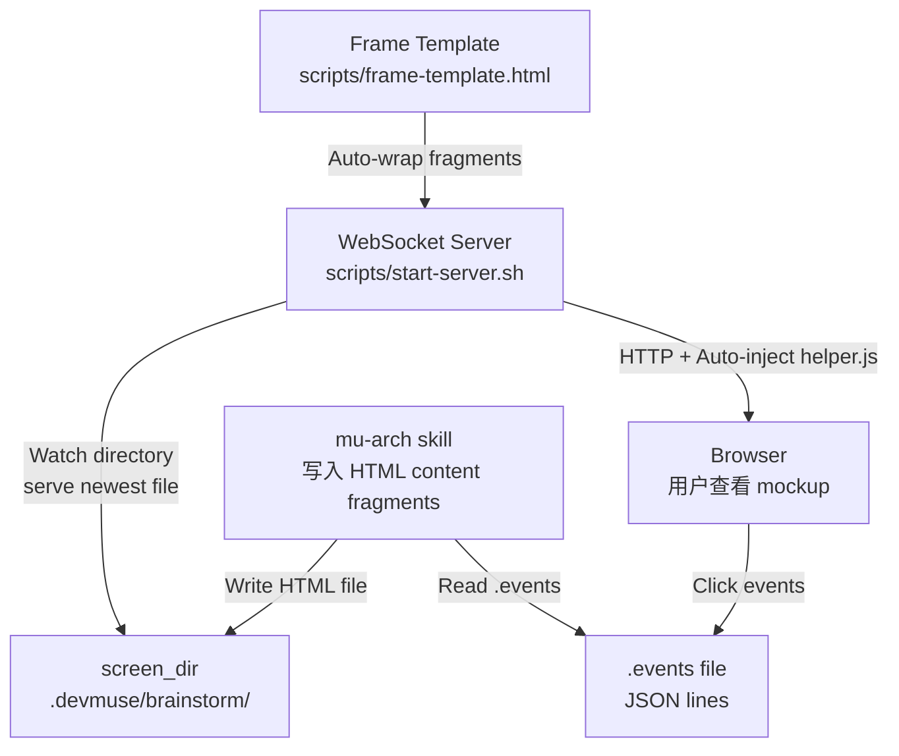
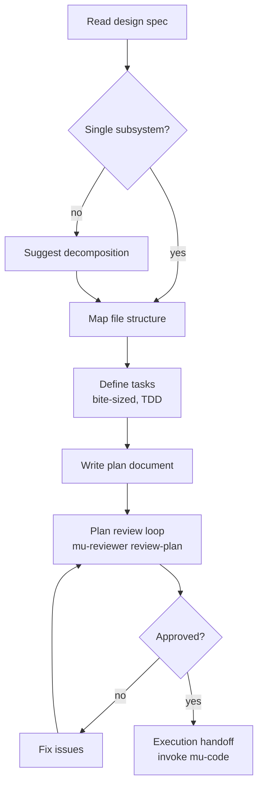
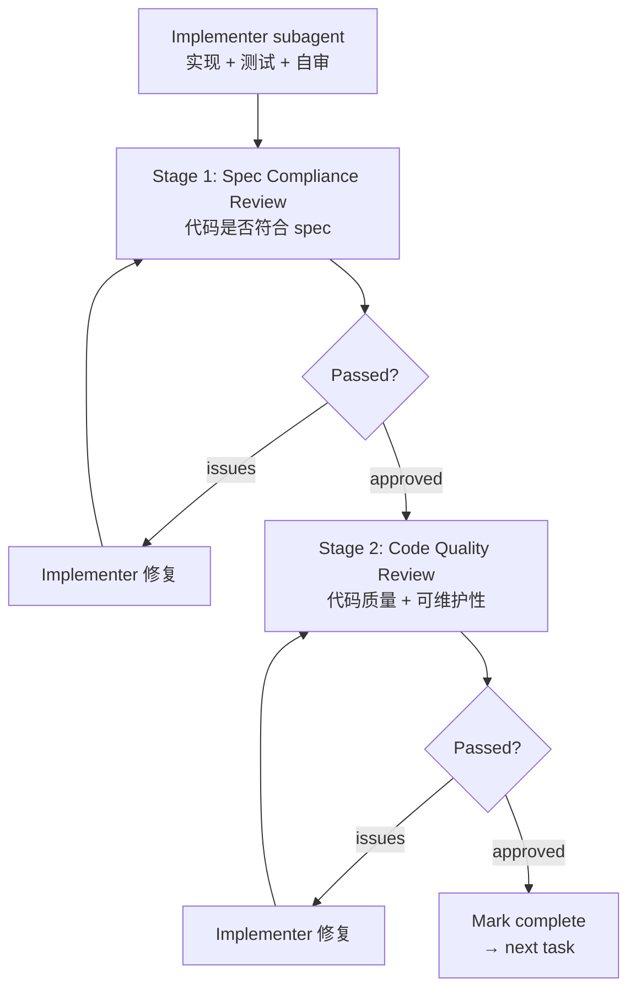
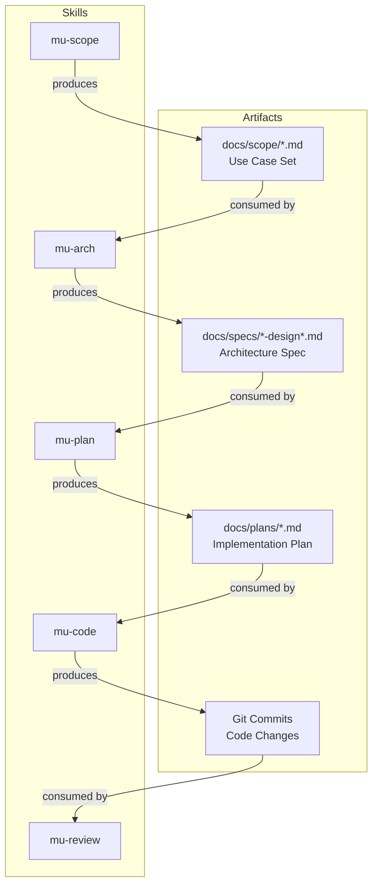

<details>
<summary>参考源文件</summary>

- `skills/mu-scope/SKILL.md`
- `skills/mu-arch/SKILL.md`
- `skills/mu-arch/visual-companion.md`
- `skills/mu-plan/SKILL.md`
- `skills/mu-code/SKILL.md`
- `skills/mu-review/SKILL.md`

</details>

# 核心管道技能

DevMuse 的核心开发管道由五个技能组成，覆盖从需求分析到代码集成的完整开发生命周期。每个技能负责开发流程中的一个特定阶段，通过严格的 hard gate 机制确保上游产物就绪后才进入下一阶段。管道遵循 "scope → design → plan → code → review" 的线性流转，每个技能的终止状态（terminal state）即为调用下一个技能。

管道的核心设计理念是：任何任务——无论看起来多简单——都必须经过完整的流程。每个阶段都有明确的输入产物和输出产物，通过 artifact 文件（而非会话上下文）在技能之间传递信息，保证可追溯性和一致性。

## 管道总览



Sources: [mu-scope/SKILL.md:215-219](), [mu-arch/SKILL.md:256-263](), [mu-plan/SKILL.md:176-180](), [mu-code/SKILL.md:1039-1044](), [mu-review/SKILL.md:692-699]()

## mu-scope：需求分析与用例枚举

mu-scope 是管道的入口技能，负责在任何设计工作开始前对任务进行全面的范围界定。其核心产出是 **Use Case Set**，保存在 `docs/scope/YYYY-MM-DD-<name>.md`。

### 流程阶段

| 阶段 | 内容 | 关键动作 |
|------|------|----------|
| Quick Probe | 扫描代码库评估影响范围 | 定位文件、分析 fan-out、检查测试覆盖、历史信号、接口风险 |
| Depth Decision | 根据探测结果确定深度 | 低风险建议快速 scope，中高风险建议完整枚举 |
| Use Case Elicitation | 逐类别枚举用例 | Happy paths → Edge cases → Error cases → Reverse cases |
| Conflict Detection | 交叉检查所有用例 | 发现矛盾、重叠条件、regression gap |
| Output | 输出 scope artifact | 保存文件并等待用户确认 |

mu-scope 的一个关键特性是 **Guard Semantic Analysis**：当变更涉及替换现有条件/过滤器/守卫时，必须枚举该条件阻止的所有场景（而非仅关注变更动机），计算 regression gap，并要求用户对每个 gap 项目做出明确处置。

Sources: [mu-scope/SKILL.md:74-131](), [mu-scope/SKILL.md:100-117]()

### 用例格式

```
- UC-<N>: [Given <precondition>] When <action> Then <expected result>
```

所有冲突必须在产出前解决，不允许 PENDING 状态的冲突项进入最终 artifact。

Sources: [mu-scope/SKILL.md:160-191]()

## mu-arch：技术架构设计

mu-arch 将批准的需求转化为完整的技术设计。它要求 scope artifact 作为输入（hard gate），专注于技术架构（components、interfaces、data flow、error handling），不涉及产品需求。

### Stance Detection

mu-arch 在执行设计前会先检测现有 artifact 的状态，确定进入姿态：

| Stance | 行为 |
|--------|------|
| `create` | 执行完整设计流程（步骤 1-11） |
| `update` | 加载现有设计 → 按子类型（expand / gap-fill / sync）更新 |
| `extract` | 从现有代码提取架构文档 |
| `skip` | 附加 pass-through 记录，直接进入 mu-plan |

Sources: [mu-arch/SKILL.md:24-49]()

### 设计流程



设计文档保存至 `docs/specs/YYYY-MM-DD-<topic>-design.md`，并包含 Requirements Reference 字段建立与 scope 的可追溯链接。

Sources: [mu-arch/SKILL.md:57-117](), [mu-arch/SKILL.md:189-198]()

### Visual Companion 子系统

mu-arch 内置了一个基于浏览器的 visual companion，用于在设计阶段展示 mockup、架构图和视觉选项。这是一个工具而非模式——接受后并不意味着所有问题都通过浏览器处理。

**架构：**



| 组件 | 说明 |
|------|------|
| WebSocket Server | 监控目录变化，将最新 HTML 文件推送到浏览器；支持 `--project-dir` 持久化、`--host` 绑定、30 分钟无活动自动退出 |
| Content Fragments | 默认写入 HTML 片段（非完整文档），服务器自动注入 frame template（header、CSS theme、selection indicator） |
| Browser Events | 用户点击记录为 JSON lines 写入 `.events` 文件，新屏幕推送时自动清空 |
| CSS Classes | 提供 `.options`、`.cards`、`.mockup`、`.split`、`.pros-cons` 等预置样式 |

**使用判断原则：** 每个问题独立决定是否使用浏览器。测试标准是"用户看到它是否比读到它理解得更好？"UI mockup、架构图、布局对比使用浏览器；需求问题、技术决策、权衡列表使用终端。

Sources: [visual-companion.md:1-30](), [visual-companion.md:36-47](), [visual-companion.md:79-112](), [visual-companion.md:113-141]()

## mu-plan：实现计划编写

mu-plan 将架构设计转化为可执行的实现计划。计划以"假设工程师对代码库零上下文"为前提编写，每个步骤都包含精确的文件路径、完整代码和预期输出。

### 任务结构



每个 task 包含：

| 元素 | 说明 |
|------|------|
| `Covers` | 对应的 UC-ID（与 scope 的可追溯性） |
| `Files` | 精确路径——Create / Modify / Test |
| Steps | Bite-sized（2-5 分钟），严格 TDD：write test → verify fail → implement → verify pass → commit |

计划保存至 `docs/plans/YYYY-MM-DD-<feature-name>.md`，完成后提供 subagent-driven 和 inline 两种执行模式供用户选择。

Sources: [mu-plan/SKILL.md:10-20](), [mu-plan/SKILL.md:66-75](), [mu-plan/SKILL.md:94-135](), [mu-plan/SKILL.md:162-180]()

## mu-code：代码实现

mu-code 按任务逐一执行实现计划，支持三种执行模式，内置 worktree 隔离、TDD 纪律和双阶段 review gate。

### 执行模式

| 模式 | 适用场景 | 特点 |
|------|----------|------|
| **Subagent-Driven**（推荐） | Subagent 可用时 | 每 task 一个 fresh subagent + 双阶段 review |
| **Inline** | 无 subagent 或并行会话 | 直接在当前会话执行 |
| **Parallel Dispatch** | 多个独立故障/任务 | 多 agent 并发处理不同问题域 |

Sources: [mu-code/SKILL.md:214-232]()

### Worktree 隔离

mu-code 使用 git worktree 创建隔离工作区。目录选择优先级：`.worktrees/`（已存在） > `worktrees/`（已存在） > CLAUDE.md 偏好 > 询问用户。创建前必须验证目录已被 gitignore，否则立即修复。

Sources: [mu-code/SKILL.md:49-110]()

### 双阶段 Review Gate

每个 task 完成后执行两阶段审查：



**Stage 1（Spec Compliance）必须在 Stage 2（Code Quality）之前通过。** 所有 task 完成后链接到 mu-review 进行最终综合审查。

Sources: [mu-code/SKILL.md:962-995]()

### TDD 铁律

mu-code 强制执行严格的 TDD 纪律：**没有失败测试就不写生产代码**。违反则删除代码重来，无例外。

| 阶段 | 动作 | 验证 |
|------|------|------|
| RED | 编写一个失败测试 | 必须运行并确认失败原因正确 |
| GREEN | 编写最小代码使测试通过 | 必须运行并确认通过 |
| REFACTOR | 清理代码 | 保持测试绿色 |

Sources: [mu-code/SKILL.md:596-653]()

## mu-review：审查与集成

mu-review 是管道的最后一个技能，负责代码审查、反馈处理、覆盖率验证和工作集成。

### 五步流程

| 步骤 | 内容 | 关键机制 |
|------|------|----------|
| Step 1: Dispatch Review | 派发 mu-reviewer subagent | 含 security check 条件分支（扫描 diff 中的安全关键词） |
| Step 2: Handle Feedback | 处理审查反馈 | 禁止 performative agreement；验证后再实施 |
| Step 3: Coverage Check | 需求覆盖率检查 | 读取 spec → 提取 scope 路径 → dispatch review-coverage |
| Step 4: Verification | 验证完整性 | Iron Law：无新鲜验证证据不得声明完成 |
| Step 5: Finish | 集成与清理 | 提供 4 个选项：merge locally / create PR / keep as-is / discard |

Sources: [mu-review/SKILL.md:10-11](), [mu-review/SKILL.md:31-50](), [mu-review/SKILL.md:349-369](), [mu-review/SKILL.md:376-496](), [mu-review/SKILL.md:499-659]()

### 反馈处理原则

mu-review 对反馈处理有严格的行为规范：

- **禁止** performative agreement（"You're absolutely right!"、"Great point!"）
- 外部反馈视为 suggestion 而非 order，必须先验证再实施
- 不清楚的反馈项必须全部澄清后才能开始实施任何一项
- 推回（pushback）基于技术理由，不基于防御心态

Sources: [mu-review/SKILL.md:147-175](), [mu-review/SKILL.md:256-265]()

## 技能间依赖与产物流转



| 技能 | 输入 | 输出 | Terminal State |
|------|------|------|----------------|
| mu-scope | 用户描述 + 代码库扫描 | `docs/scope/*.md` | invoke mu-arch |
| mu-arch | Scope artifact | `docs/specs/*-design*.md` | invoke mu-plan |
| mu-plan | Design spec | `docs/plans/*.md` | invoke mu-code |
| mu-code | Implementation plan | Git commits | chain to mu-review |
| mu-review | Code changes (SHA range) | Merged/PR'd code | 管道终点 |

Sources: [mu-scope/SKILL.md:215-219](), [mu-arch/SKILL.md:256-263](), [mu-plan/SKILL.md:176-180](), [mu-code/SKILL.md:1039-1044](), [mu-review/SKILL.md:692-699]()
