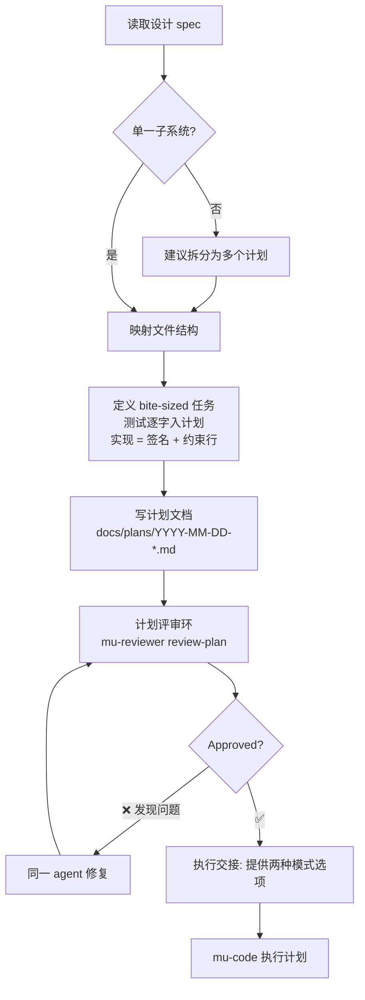
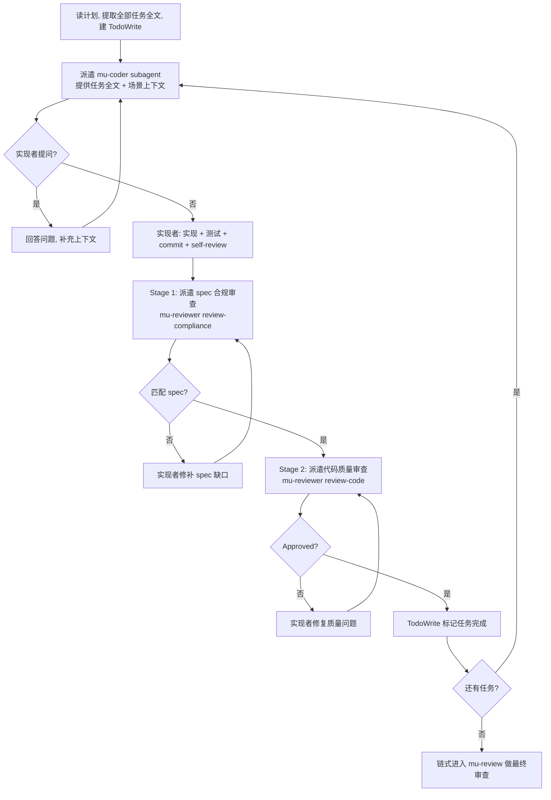

Referenced source files (5 files)

- skills/mu-plan/SKILL.md
- skills/mu-code/SKILL.md
- skills/mu-code/parallel-dispatch.md
- skills/mu-code/testing-anti-patterns.md
- agents/mu-coder.md

# Plan 与 Code：测试即合同的计划与 TDD 实现

DevMuse 流水线的"计划 → 实现"两级由 `mu-plan` 与 `mu-code` 承担。mu-plan 假设执行者对代码库零上下文，把工作拆成 2-5 分钟的 bite-sized 步骤，写出完整的实现计划并保存到 `docs/plans/YYYY-MM-DD-<feature-name>.md`；计划在主 checkout 中撰写，worktree 隔离推迟到 mu-code Step 1 才发生。Sources: [skills/mu-plan/SKILL.md:8-21]()

mu-plan 的核心纪律是**"测试是合同，实现体归执行者"**：测试代码在计划中逐字出现，把行为钉死为可检验的合同；实现步骤只给签名加约束行，绝不给完整代码体。mu-code 接过计划后先做隔离决策（worktree 或原地分支），再在 Subagent 驱动 / 内联双模式之一下逐任务执行，全程受 TDD 铁律约束，任务全部完成后链式进入 mu-review。Sources: [skills/mu-plan/SKILL.md:12](), [skills/mu-code/SKILL.md:8-16](), [skills/mu-code/SKILL.md:20-48]()

## mu-plan：把计划写成合同

### 测试即合同：签名 + 约束行，非完整代码体

计划里两类代码待遇截然不同。测试代码**逐字**写入计划——它以可检验的方式钉住行为；实现步骤只携带一个签名加"承重约束"（load-bearing constraints，即一个新执行者可能做错的决策），从不给完整函数体。理由：抄来的函数体会把 TDD 循环退化成"转录校验和"（transcription checksum），而对照计划中测试的全新推导才是真正的第二意见。仅当代码本身就是决策时（成形的算法、tricky 的正则、schema）才允许完整代码体入计划，且必须说明原因。Sources: [skills/mu-plan/SKILL.md:12](), [skills/mu-plan/SKILL.md:141-147]()

任务结构中的实现步骤模板即体现这一纪律——Step 3 只写 `Signature:` 与 `Constraints:` 列表，约束要具体到"boundary is inclusive: reject at count > limit, not >="这样的粒度，而不是"add validation"这类空话。Sources: [skills/mu-plan/SKILL.md:119-126](), [skills/mu-plan/SKILL.md:143]()

### 任务粒度与文档结构

写任务前先映射文件结构：哪些文件会被创建/修改、各自的单一职责——分解决策在这一步锁定。每个 step 是一个动作（2-5 分钟）：写失败测试 / 跑测试确认失败 / 写最小实现 / 跑测试确认通过 / commit，各算一步。每个计划必须以固定 header 开头（Goal / Architecture / Tech Stack，外加对 agentic worker 的 REQUIRED SUB-SKILL 指引），当 scope 工件存在时每个任务标注 `Covers: UC-xxx`，告诉 coder 测试要追溯哪些用例。Sources: [skills/mu-plan/SKILL.md:56-74](), [skills/mu-plan/SKILL.md:76-92](), [skills/mu-plan/SKILL.md:147]()

若 spec 覆盖多个独立子系统（本应在 mu-arch 阶段拆开），mu-plan 会建议拆成多个计划——每个计划独立产出可运行、可测试的软件。Sources: [skills/mu-plan/SKILL.md:52-54]()

### 计划评审环

计划写完后派遣 **mu-reviewer subagent 的 `review-plan` 模式**，提供精确构造的审查上下文（`PLAN_FILE_PATH` + `SPEC_FILE_PATH`），绝不传会话历史。审查者会先从文档构建锚点列表（UC-ID、任务编号、文件路径），只发出绑定到锚点的 findings——以此防止幻觉出不存在的 UC / 类名 / 路径。发现问题由写计划的同一 agent 修复（保留上下文）后整体重审；循环超过 3 轮上浮给人类；审查者是顾问性的，若认为反馈错误应解释分歧。Sources: [skills/mu-plan/SKILL.md:149-162]()

Sources: [skills/mu-plan/SKILL.md:25-50](), [skills/mu-plan/SKILL.md:164-183]()

计划保存后 mu-plan 给出执行选择：**Subagent-Driven（推荐）**——每任务派遣全新 subagent、任务间评审、快速迭代；或 **Inline Execution**——在本会话批量执行带 checkpoint。随后按 Pipeline Graph 交接给 mu-code，两种模式它都支持。Sources: [skills/mu-plan/SKILL.md:164-176]()

## mu-code：执行计划

### 输入证据与弃权计划路径

执行需要一份计划——`docs/plans/*.md` 文件（默认）或会话中交接的内联计划。**设计 spec 本身不是计划**：此时应推荐 mu-plan；若用户明确指示继续，则走**弃权计划路径（waived-plan path）**：从已批准的证据推导任务列表（spec 章节 → 任务），呈现给用户点头确认，然后完全按内联模式从 Step 1 走起——隔离决策、逐任务 TDD、验证、最终 mu-review 链——并在最终报告中标记计划缺失。Sources: [skills/mu-code/SKILL.md:10-12](), [skills/mu-code/SKILL.md:210-213]()

### Step 1：隔离决策——worktree vs 原地分支

**隔离是按比例的，不是强制的。** worktree 隔离是"多任务、会搅动大量文件"的计划执行的默认选择；小计划（1-2 个任务）或用户偏好主 checkout 时，改为在原地开 feature 分支——遵循 Git Safety Protocol、跑基线测试，跳过 worktree 其余步骤。Sources: [skills/mu-code/SKILL.md:50-56]()

选择 worktree 时的目录优先级：已有目录（`.worktrees` 优先于 `worktrees`）→ CLAUDE.md 中的偏好 → 询问用户（项目内 `.worktrees/` 或全局 `~/.config/devmuse/worktrees/<project>/`）。项目内目录创建前**必须**用 `git check-ignore` 验证已被忽略，未忽略则先补 `.gitignore` 并提交——防止 worktree 内容被意外提交。创建后自动检测项目类型安装依赖（npm/cargo/pip/poetry/go mod），并跑基线测试验证干净起点：失败必须报告并询问，不能带病开工。Sources: [skills/mu-code/SKILL.md:60-115](), [skills/mu-code/SKILL.md:143-184]()

| 情形 | 动作 |
|------|------|
| `.worktrees/` 存在 | 使用它（验证已忽略） |
| 两者都存在 | `.worktrees/` 胜出 |
| 都不存在 | 查 CLAUDE.md → 询问用户 |
| 目录未被忽略 | 加入 `.gitignore` 并提交 |
| 基线测试失败 | 报告失败并询问 |
| 小计划（1-2 任务）/ 用户偏好主 checkout | 原地分支（git safety）+ 基线测试 |

Sources: [skills/mu-code/SKILL.md:186-197]()

### Step 2：执行模式选择与按任务双阶段评审

有计划且任务大体独立、subagent 可用 → **Subagent 驱动模式（推荐）**；无 subagent 或并行会话 → **内联模式**；任务紧耦合 → 手工执行或先 brainstorm。Sources: [skills/mu-code/SKILL.md:199-219]()

Sources: [skills/mu-code/SKILL.md:229-270](), [skills/mu-code/SKILL.md:764-796]()

Subagent 驱动模式的核心公式："每任务一个全新 subagent + 两阶段评审（先 spec 后质量）= 高质量、快迭代"。subagent 拿到的是编排者精确构造的指令与上下文，绝不继承会话历史——这同时保留了编排者自身的上下文用于协调。两阶段评审顺序不可颠倒：spec 合规未批准就启动代码质量审查是错误顺序；任一评审有未关闭问题时不得进入下一任务。派遣前须用 `git rev-parse` 确认 BASE_SHA 与 HEAD_SHA 已设置；审查者返回 "NOT reviewed" 文件列表时，须为剩余文件重新派遣。Sources: [skills/mu-code/SKILL.md:14](), [skills/mu-code/SKILL.md:221-227](), [skills/mu-code/SKILL.md:768-793](), [skills/mu-code/SKILL.md:810-813]()

模型选择只有两档，**禁用 haiku**：孤立函数、清晰 spec、1-2 个文件的机械修改用 sonnet；多文件集成、需要判断力、调试、架构、审查一律 opus，拿不准就 opus。Sources: [skills/mu-code/SKILL.md:272-285]()

实现者的四种状态及处置：

| 状态 | 含义 | 编排者处置 |
|------|------|-----------|
| DONE | 完成 | 进入 spec 合规审查 |
| DONE_WITH_CONCERNS | 完成但有疑虑 | 先读 concerns；正确性/范围问题先解决再审查，观察类记录后继续 |
| NEEDS_CONTEXT | 缺少必要信息 | 补上下文后重新派遣 |
| BLOCKED | 无法完成 | 补上下文 / 换更强模型 / 拆小任务 / 计划本身有错则上浮给人类 |

绝不忽略升级信号，也绝不让同一模型原样重试——实现者说卡住了，就必须有所改变。Sources: [skills/mu-code/SKILL.md:287-303](), [agents/mu-coder.md:78-86]()

### 内联模式

加载计划、批判性审读（有疑虑先向人类伙伴提出）、建 TodoWrite 后直接逐任务执行。每个任务：标记 in_progress → 严格按步骤执行 → 跑指定验证 → **对照任务文本自检**（每项要求都在、没有多余添加）→ 标记完成。两阶段评审门是 Subagent 驱动模式的机制——内联模式的真正审查只发生一次，在最终 mu-review 链；逐任务自检是下限，不是那次审查的替代品。遇到 blocker、计划关键缺口、指令看不懂、验证反复失败时**立即停止执行**，问清楚而不是猜。绝不在未经用户明确同意的情况下在 main/master 上开工；任何分支操作前先按 Git Safety Protocol 核实当前状态。Sources: [skills/mu-code/SKILL.md:381-435]()

### 并行派遣与披露文件

第三种派遣方式：3 个以上互相独立的失败/任务（不同测试文件、不同子系统）时，每个独立问题域派一个代理并发工作。触发测试、prompt 结构与验证步骤记录在**披露文件** `skills/mu-code/parallel-dispatch.md` 中——并行派遣前必须先读它。Sources: [skills/mu-code/SKILL.md:437-439]()

披露文件的判定链：多个失败 → 是否独立（相关则单代理统一调查）→ 能否并行（共享状态则顺序派遣）→ 并行派遣。每个代理拿到聚焦的问题域、自包含上下文、明确约束（如 "Do NOT change production code"）和指定的输出格式；代理返回后要审阅各摘要、检查冲突、跑完整测试套件并抽查——代理可能犯系统性错误。失败相互关联、需要全局状态、探索性调试、共享状态四种情形禁用。Sources: [skills/mu-code/parallel-dispatch.md:11-40](), [skills/mu-code/parallel-dispatch.md:79-105](), [skills/mu-code/parallel-dispatch.md:121-134]()

## TDD 铁律与测试纪律

mu-code 全程受 TDD 约束：先写测试、看它失败、写最小代码让它通过。核心原则："没看着测试失败，就不知道它测的对不对"；违反规则的字面就是违反规则的精神。铁律：**NO PRODUCTION CODE WITHOUT A FAILING TEST FIRST**——测试之前写的代码一律删除重来，不留"参考"、不"边写测试边改造"、不看它；例外只存在于人类伙伴明确许可的枚举类别（一次性原型、生成代码、配置文件）。Sources: [skills/mu-code/SKILL.md:452-489]()

Red-Green-Refactor 循环中两个验证点**强制且不可跳过**：Verify RED 要确认测试因功能缺失而失败（不是报错、不是 typo）；Verify GREEN 要确认目标测试通过、其他测试仍绿、输出干净无警告。测试立即通过说明在测既有行为，要修的是测试。计划带 `Covers: UC-xxx` 时，coder 用 `// Covers: UC-xxx` 注释建立测试到用例的追溯，供 review-coverage 模式验证全部用例已实现。常见合理化说辞（"太简单不用测""事后补测等效""已经手工测过""删掉 X 小时的工作太浪费"）在技能中逐条驳斥；出现任何 TDD red flag 的结论都是同一句：删代码，用 TDD 重来。Sources: [skills/mu-code/SKILL.md:491-513](), [skills/mu-code/SKILL.md:557-627](), [skills/mu-code/SKILL.md:650-688]()

测试反模式是配套的按需参考（写/改测试、加 mock 时加载），三条铁律：**绝不测 mock 行为、绝不给生产类加 test-only 方法、绝不在不理解依赖的情况下 mock**。此外还有不完整 mock（只 mock 自己知道的字段，下游依赖被省略字段时静默失败——必须镜像真实 API 的完整结构）与"测试是事后补充"两种反模式；每种反模式都配 gate function。严格 TDD 本身就能预防这些：如果你在测 mock 行为，说明你没先看着测试对真实代码失败。Sources: [skills/mu-code/testing-anti-patterns.md:1-19](), [skills/mu-code/testing-anti-patterns.md:177-226](), [skills/mu-code/testing-anti-patterns.md:263-271]()

## mu-coder：被派遣的实现代理

Subagent 驱动模式派遣的实现者是 `agents/mu-coder.md` 定义的 opus 级代理（工具：Read/Edit/Write/Bash/Grep/Glob）。职责链：读任务描述（不清楚**现在就问**）→ 严格按 spec 实现（任务要求时遵循 TDD）→ 验证 → self-review → commit 并报告。文件组织上跟随计划定义的结构；文件超出计划意图时停下报 DONE_WITH_CONCERNS，不擅自拆分；不重构任务之外的东西。Sources: [agents/mu-coder.md:1-28]()

升级纪律："说这对我太难了"永远是允许的——**坏工作比没有工作更糟**。任务需要多方案架构决策、对方法正确性没把握、计划未预期的重构、读了一个又一个文件仍无进展时，停下并以 BLOCKED 或 NEEDS_CONTEXT 报告，具体说明卡在哪、试过什么、需要什么帮助。报告前的 self-review 检查完整性、质量、纪律（YAGNI）、测试（测行为而非 mock 行为）四项，发现问题当场修好再报告；绝不默默交付自己没把握的工作。Sources: [agents/mu-coder.md:51-73](), [agents/mu-coder.md:86]()

## See also

- [core-pipeline](./core-pipeline.md) — mu-plan 与 mu-code 在四级流水线中的位置与交接规则
- [review-verify](./review-verify.md) — mu-code 完成后链入的最终审查、验证门禁与集成
- [agents-dispatch](./agents-dispatch.md) — mu-coder / mu-reviewer 等代理的派遣映射与上下文构造
