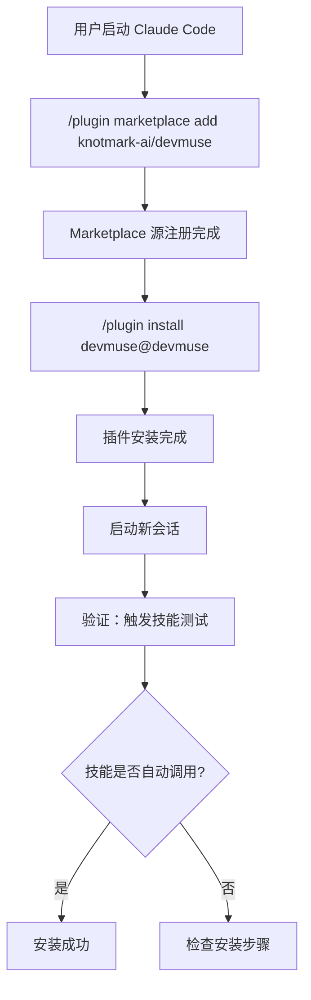
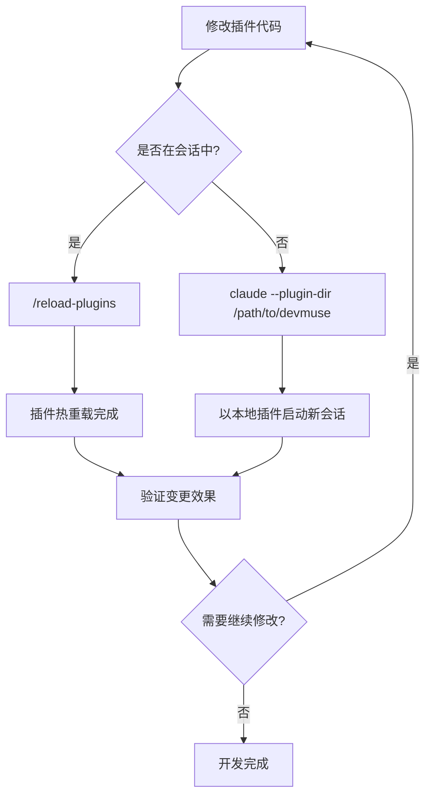
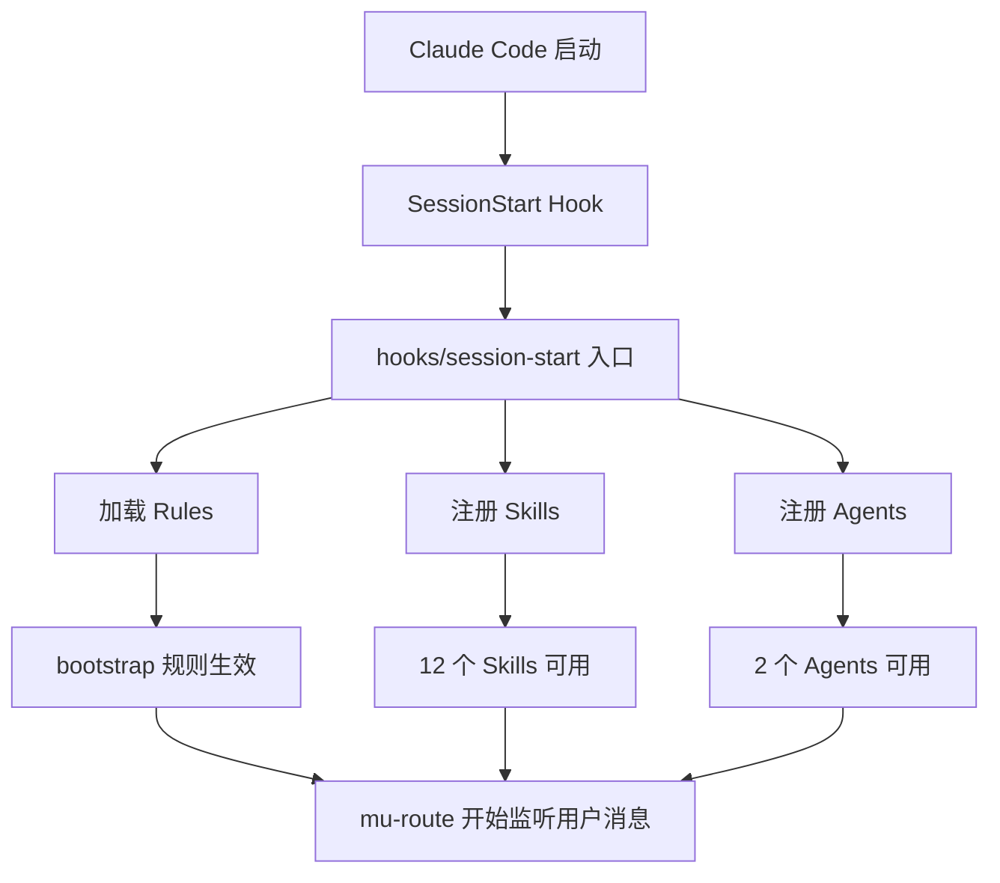

<details>
<summary>Source files referenced</summary>

- `README.md`
- `README_CN.md`
- `.claude-plugin/plugin.json`
- `.claude-plugin/marketplace.json`
- `package.json`

</details>

# 插件安装与本地开发

DevMuse 是一个 Claude Code 插件，提供完整的软件开发工作流。它通过 Claude Code 的插件系统进行分发，支持 marketplace 注册安装和本地目录加载两种方式。插件当前版本为 `0.2.0`，由 KnotMark AI 维护，采用 MIT 许可证。

本文档涵盖插件的安装流程、本地开发工作流、更新机制，以及插件的配置结构说明。

## 插件元数据

DevMuse 的插件配置分布在三个文件中，各自承担不同职责：

| 文件 | 用途 | 关键字段 |
|------|------|----------|
| `.claude-plugin/plugin.json` | 插件定义（名称、版本、组件注册） | `name`, `version`, `agents`, `skills` |
| `.claude-plugin/marketplace.json` | Marketplace 注册信息 | `owner`, `plugins[]`, `category` |
| `package.json` | Node.js 包元数据与入口 | `name`, `version`, `main` |

Sources: [plugin.json:1-17](), [marketplace.json:1-21](), [package.json:1-6]()

### 组件注册

插件通过 `plugin.json` 声明其包含的组件：

| 组件类型 | 注册方式 | 值 |
|----------|----------|-----|
| Agents | 逐个文件列举 | `./agents/mu-reviewer.md`, `./agents/mu-coder.md` |
| Skills | 整个目录 | `./skills/` |

Sources: [plugin.json:12-16]()

### Marketplace 配置

`marketplace.json` 遵循 Anthropic 的 marketplace schema，定义了插件在 marketplace 中的展示信息：

| 字段 | 值 |
|------|-----|
| Schema | `https://anthropic.com/claude-code/marketplace.schema.json` |
| Owner | KnotMark AI |
| Category | `workflow` |
| Homepage | `https://github.com/knotmark-ai/devmuse` |

Sources: [marketplace.json:2-20]()

## 安装流程

### 通过 Marketplace 安装

安装分为两步：先注册 marketplace 源，再从中安装插件。

```bash
# Step 1: 注册 marketplace
/plugin marketplace add knotmark-ai/devmuse

# Step 2: 安装插件
/plugin install devmuse@devmuse
```



### 验证安装

安装完成后，启动一个新会话并发送应触发技能的请求来验证。例如：

- "帮我规划这个功能" -- 应触发 mu-scope
- "让我们调试这个问题" -- 应触发 mu-debug

Agent 应自动调用相关技能。如果没有触发，需检查安装步骤是否正确完成。

Sources: [README.md:19-31](), [README_CN.md:19-31]()

## 本地开发

本地开发允许直接从文件系统加载插件，无需通过 marketplace 安装。这对于插件开发和调试非常有用。

### 启动方式

使用 `--plugin-dir` 参数指定本地插件目录：

```bash
claude --plugin-dir /path/to/devmuse
```

### 热重载

修改插件代码后，无需重启 Claude Code 会话。在会话中直接执行：

```
/reload-plugins
```

即可重新加载插件的所有变更。

### Shell Alias

为方便日常本地开发，可配置 shell alias：

```bash
alias claude-dev='claude --plugin-dir /path/to/devmuse'
```



Sources: [README.md:143-161](), [README_CN.md:143-161]()

## 更新机制

通过 marketplace 安装的插件可使用内置命令更新：

```bash
/plugin update devmuse
```

更新时，插件包含的所有 skills、agents、rules 和 knowledge 会同步更新。无需手动处理各个组件。

Sources: [README.md:163-169](), [README_CN.md:163-169]()

## 插件架构与入口

`package.json` 中的 `main` 字段指定了插件的入口为 `hooks/session-start`，这意味着插件在 Claude Code 会话启动时通过 SessionStart hook 加载。插件采用 ES module 格式（`"type": "module"`）。



插件的四层架构在安装后即刻生效：

| 层级 | 目录 | 加载时机 |
|------|------|----------|
| Rules | `rules/` | SessionStart hook 加载，始终生效 |
| Skills | `skills/` | 注册后按需调用（`/mu-xxx`） |
| Agents | `agents/` | 被 skills 派遣时激活 |
| Knowledge | `knowledge/` | 按需注入 |

Sources: [package.json:1-6](), [README_CN.md:79-87](), [plugin.json:12-16]()
