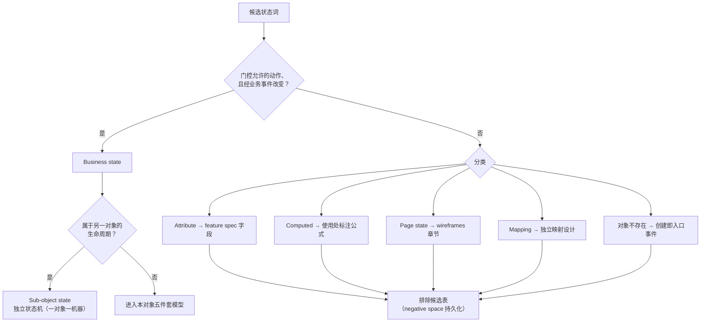
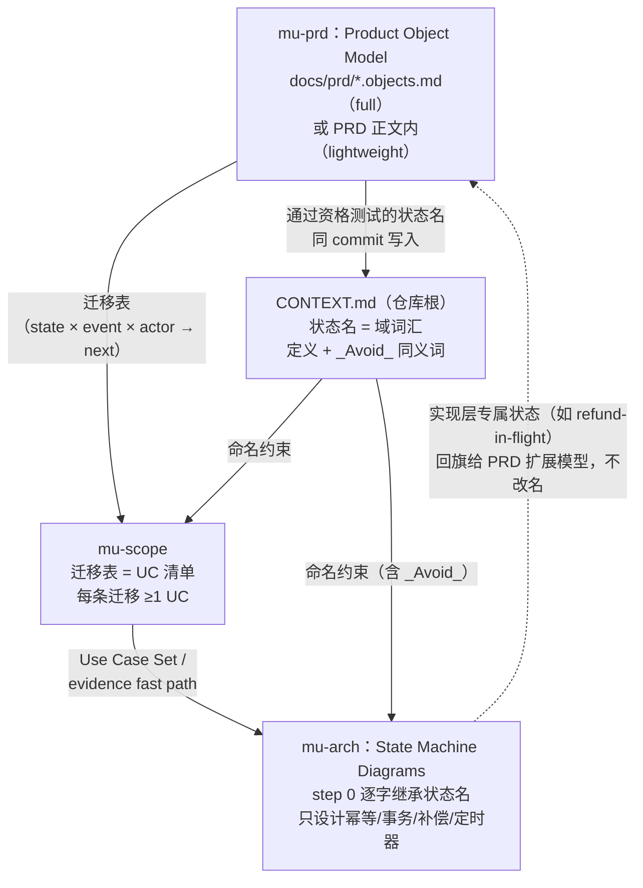

Referenced source files (5 files)

- `knowledge/principles/state-modeling.md`
- `skills/mu-prd/SKILL.md`
- `skills/mu-scope/SKILL.md`
- `skills/mu-arch/SKILL.md`
- `CONTEXT.md`

# 产品对象模型与状态生命周期

**Product Object Model**（产品对象模型）是 mu-prd 的条件式设计工具：当任一 MVP 特性涉及审批、预订、下单/支付、订阅、发布、多角色交接、配额或限时有效性——即存在"允许的动作取决于生命周期位置"的业务对象——时触发建模；无触发则静默跳过，零仪式。方法论本体收敛在原则文件 `knowledge/principles/state-modeling.md`，蒸馏自一份团队 PRD 标准（对象—状态—迁移—不变量循环）与 aflaj PRD 复盘。Sources: [skills/mu-prd/SKILL.md:134-138](), [knowledge/principles/state-modeling.md:1-3]()

该原则同时被两端引用：mu-prd 在产品层建模（状态词汇、合法迁移、不变量、保证——用户能观察和依赖的东西），mu-arch 在技术层继承同一套状态词汇做实现设计（幂等键、事务、补偿态、定时器）。中间由 mu-scope 把迁移表展开为具体用例路径。本页覆盖建模方法的全部构件——生命周期句式、业务态判别、五件套模型、负空间、六问自检、稳态优先——以及状态词汇如何经 `CONTEXT.md` 贯通三层。Sources: [knowledge/principles/state-modeling.md:60-64](), [skills/mu-arch/SKILL.md:201-211]()

## 触发、放置与产物

| 维度 | 规则 |
|------|------|
| 触发条件 | 任一 MVP 特性涉及 approval / booking / ordering-payment / subscription / publishing / multi-role handoff / quotas / time-bounded validity；否则静默跳过 |
| 放置位置 | full 模式：Information Architecture 之后、Core User Flows 之前（feature map 命名对象，flows 走机器，feature specs 按名引用状态）；lightweight 模式无 IA 章节，表格直接置于 core flows 之前 |
| 产物形态 | full 模式：伴生文件 `docs/prd/YYYY-MM-DD-<product>.objects.md`，从 PRD header 链接并同 commit；lightweight 模式：模型内嵌 PRD 正文 |
| 词汇入口 | 批准的状态名即域语言——通过 domain-glossary 资格测试者在同一 commit 写入仓库根 `CONTEXT.md`（定义 + `_Avoid_` 同义词），下游技能逐字使用 |

Sources: [skills/mu-prd/SKILL.md:136](), [skills/mu-prd/SKILL.md:140-142](), [skills/mu-prd/SKILL.md:167]()

在 `update` stance 下，每台被触及的状态机是一个独立审批单元：对其重跑 state-modeling 自检，且**终态变更一律视为分叉**（fork）向用户确认；`sync` 子类型对齐代码现状时也包含排除候选表与非迁移注记。新状态名遵循与创建时相同的 CONTEXT.md 词汇规则。Sources: [skills/mu-prd/SKILL.md:35]()

## 生命周期句式：分叉检测器

每个业务对象用一句话穷尽其行为，逐空走查直到全部填满：

> **谁**，在**什么前置条件**下，对**该对象**执行**什么动作**；对象从**哪个状态**迁移到**哪个状态**；在**失败、重复提交、并发操作、超时**时用户观察到什么。

任何填不出的空即是一个分叉——带推荐项抛给用户。分工明确：这句话是分叉的**检测器**（detector），grilling.md 是分叉的**收敛器**（converger）。mu-prd 建模时"用生命周期句式驱动每一个未填的空"，并在模型获批前跑自检。Sources: [knowledge/principles/state-modeling.md:5-11](), [skills/mu-prd/SKILL.md:138]()

## 业务态判别：一真五伪 + 两条特殊规则

只有业务态进入状态模型。建模前先分类：

| 类型 | 定义 | 示例 | 归宿 |
|------|------|------|------|
| **Business state** | 门控允许的动作；经业务事件改变 | pending-approval、confirmed、cancelled | 状态模型 |
| Attribute | 描述对象，从不门控其生命周期 | 房型、渠道、优先级 | Feature spec 字段 |
| Computed | 读取时由其他字段派生 | is-overdue、time-remaining | 使用处标注公式；绝不存储为状态 |
| Page state | 只影响屏幕显示 | loading、empty、网络错误 | Wireframes 章节 |
| Sub-object state | 另一个对象的生命周期 | 订单内的支付状态；文章内的修订版本 | 独立状态模型——一对象一机器 |
| Mapping | 对象间关系，读/查询时解析 | anonymous→identified 身份合并 | 独立映射设计——绝不是状态字段 |

Sources: [knowledge/principles/state-modeling.md:15-25]()

两条特殊规则：

- **对象不存在不是状态**——创建是入口事件（entry event），不是从幽灵态 "not-exists" 迁出的迁移。Sources: [knowledge/principles/state-modeling.md:26]()
- **最常见的建模 bug 是多对象生命周期压进一个状态字段**——拼团有"团"的机器和每个参团订单的机器，分开建模，再注明耦合方式（一台机器的哪些迁移触发另一台的迁移）。Sources: [knowledge/principles/state-modeling.md:28]()

Sources: [knowledge/principles/state-modeling.md:15-28](), [knowledge/principles/state-modeling.md:42]()

## 五件套模型（每对象）

每个对象的模型由五个构件组成：

| # | 构件 | 要求 |
|---|------|------|
| 1 | **States** | 闭集列表，每个状态有精确入口条件；状态列表里出现 "etc." 或"等"意味着模型没做完 |
| 2 | **Transitions** | 表格：current state × event（用户动作 / 时钟 / 外部回调）× actor → next state；截止时间与时间窗必须携带显式边界语义——含或不含端点、以哪个时钟计量 |
| 3 | **Invariants** | 在所有状态下恒真的规则（"一个房源时段只有一个存活预订"）；每条注明违规尝试的下场：rejected、queued 或 overridden |
| 4 | **Terminal states** | 显式标记；终态意味着无出口——复活一个已取消的预订是一笔新预订，除非模型显式加入 revival 迁移 |
| 5 | **Guarantees** | 经受重试与竞态的用户可见承诺："双击开团绝不产生两个团"、"末位名额竞争的败者被退款并被告知"；保证是产品规则，*如何*守住（幂等键、锁）是 mu-arch 的活 |

Sources: [knowledge/principles/state-modeling.md:30-36]()

Guarantees 在 PRD 侧有明确的体裁定位：它们是**规则而非用例**——"双击绝不创建两个订单"、"过期预订不可复活"住在对象模型里，触及被建模对象的 feature spec 按名引用其状态；具体场景枚举推迟到 mu-scope。Sources: [skills/mu-prd/SKILL.md:121](), [skills/mu-prd/SKILL.md:230]()

## 负空间：排除候选表与非迁移注记

分类裁定是产出而非草稿——模型的读者无法区分"考虑过并否决"与"从未考虑过"，除非两者都被持久化。五件套之外再加两件：

| # | 构件 | 内容 | 防御目标 |
|---|------|------|---------|
| 6 | **Excluded candidates**（全模型一张表） | 每个被分类排除的候选：类别（computed / attribute / page state / mapping / object-absence）、一行理由、实际归宿 | 防止架构层把派生值物化为存储态（如被 cron 翻转的 `is_hot` 标志）；若实现层日后确需存储态（如异步合并需要 pending 步骤），扩展本模型——状态绝不在实现层 ad hoc 添加 |
| 7 | **Non-transitions**（每机器注记） | 易被误读为状态变化的事件（值层修正、派生可信度变动、状态内允许的编辑）：实际触及什么、状态原地不动 | 防止读者把非迁移事件当迁移 |

Sources: [knowledge/principles/state-modeling.md:38-43]()

mu-prd 的 `sync` 更新会把排除候选表与非迁移注记一并对齐到当前代码行为，负空间与正空间同等维护。Sources: [skills/mu-prd/SKILL.md:35]()

## 六问自检

模型获批前必跑；任何未回答项以带推荐的 A/B 问题形式抛给用户：

| # | 检查项 |
|---|--------|
| 1 | 有没有状态无入口——或无出口却未标记为终态？ |
| 2 | 有没有终态是产品暗地里指望日后修改的？ |
| 3 | 有没有事件可在多个状态下触发——每个状态下的结果是否都有定义？ |
| 4 | 有没有迁移没有 actor（谁或哪个时钟推动它）？ |
| 5 | 有没有截止时间或时间窗缺少含/不含端点语义？ |
| 6 | 有没有异步外部操作（退款、打款、通知、webhook）既无用户可见的失败态、也无显式排除声明？ |

Sources: [knowledge/principles/state-modeling.md:45-54]()

## 稳态优先

先设计稳态机器（steady-state machine），再设计 onboarding：onboarding 是机器在 t=0 的一次遍历，不是独立流程。反模式症状：一个"引导向导"，其步骤复制了 IA 中已有的功能。Sources: [knowledge/principles/state-modeling.md:56-58]()

## 层边界：状态词汇经 CONTEXT.md 贯通三层

模型的层责任划分是单向的：PRD 定词汇与规则，mu-scope 枚举路径，mu-arch 做技术实现——状态名逐字继承，绝不在下游改名。

| 层 | 职责 | 与状态模型的关系 |
|----|------|-----------------|
| PRD（本模型） | 状态词汇、合法迁移、不变量、保证 | 用户能观察和依赖的东西 |
| mu-scope | 枚举穿过这些迁移的具体用例路径 | **迁移表即 UC 清单**：特性触及的每条迁移（含时钟驱动的）至少赚得一个 UC，使用模型的状态名；迁移周边的重试与竞态是 edge case |
| mu-arch | 实现机器——幂等键、事务、补偿态、定时器 | 从 PRD 模型**逐字继承状态名**，只设计技术实现 |

Sources: [knowledge/principles/state-modeling.md:60-64](), [skills/mu-scope/SKILL.md:167](), [skills/mu-arch/SKILL.md:206]()

Sources: [skills/mu-prd/SKILL.md:142](), [skills/mu-scope/SKILL.md:167](), [skills/mu-arch/SKILL.md:206](), [skills/mu-arch/SKILL.md:240-242](), [CONTEXT.md:1-3]()

三条边值得展开：

- **PRD → CONTEXT.md**：批准的状态名是域语言，写入 `CONTEXT.md` 与 PRD 同 commit——该文件是"人和代理在代码、文档、commit、对话中共用"的词汇表，`_Avoid_` 下的同义词被刻意弃用。UC-ID 与状态名一样是贯穿型锚点：Use Case Set 的 UC-ID 传播经设计、计划任务、代码与测试，是 coverage review 的审计对象。Sources: [skills/mu-prd/SKILL.md:142](), [CONTEXT.md:1-3](), [CONTEXT.md:51-53]()
- **PRD → mu-scope**：若存在 PRD 对象模型（`docs/prd/*.objects.md` 或 PRD 正文中的状态表），其迁移表就是 UC 检查清单；同时"详尽的 PRD 特性章节 + 对象模型"可触发 evidence fast path——不重新访谈，只补 Quick Probe、冲突交叉检查与 reverse UC，一次确认出薄工件。Sources: [skills/mu-scope/SKILL.md:159](), [skills/mu-scope/SKILL.md:167]()
- **scope/PRD → mu-arch**：mu-arch 的输入证据可以是 scope 工件，也可以是"详尽 PRD 特性章节 + 对象模型"这一等价物（记入 Requirements Reference 字段）；其 State Machine Diagrams 工具的 step 0 规定：从 PRD 模型的状态与迁移出发，名字逐字继承（它们是 CONTEXT.md 词汇），只设计技术实现——产品层看不见的实现态（如 "refund-in-flight"）扩展模型并回旗给 PRD，而不是重命名产品状态。Sources: [skills/mu-arch/SKILL.md:18](), [skills/mu-arch/SKILL.md:206](), [skills/mu-arch/SKILL.md:256-261]()

## See also

- [市场与产品分析](market-product-analysis.md) — mu-prd 的完整流程与 Product Object Model 的触发上下文
- [核心管线](core-pipeline.md) — mu-scope → mu-arch 的证据消费与 UC 传播
- [域语言](domain-language.md) — CONTEXT.md 的资格测试与 `_Avoid_` 机制
