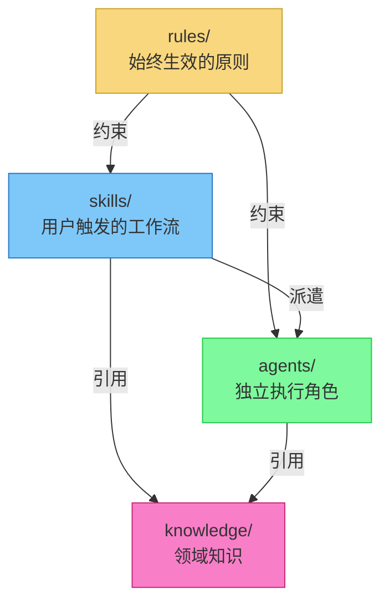
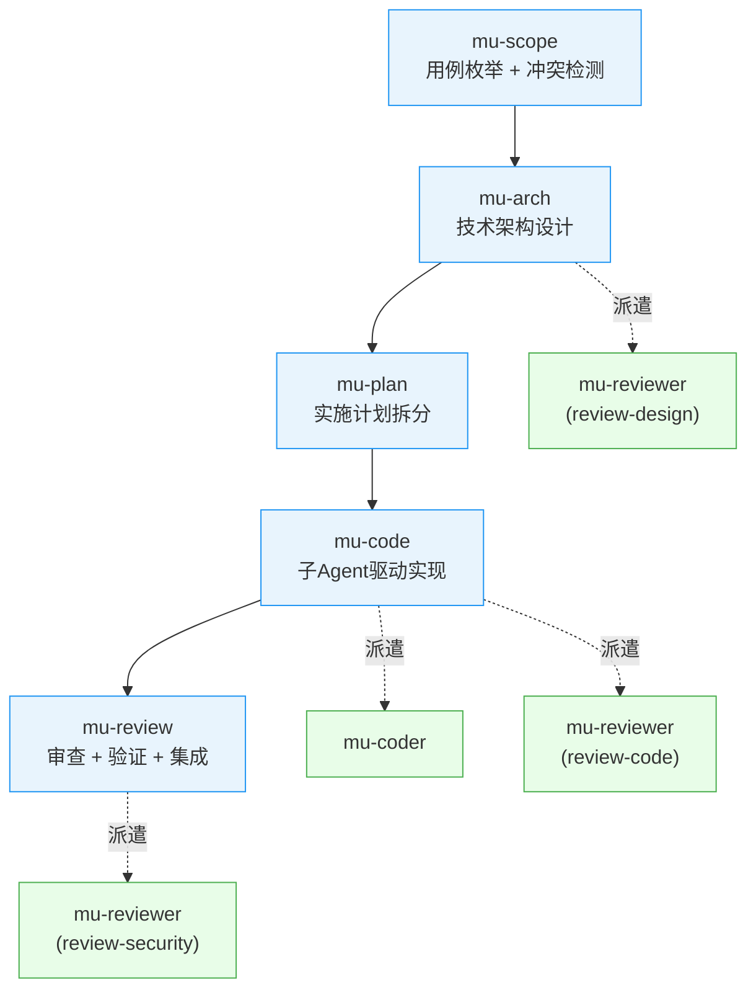

Referenced source files

- `README.md`
- `README_CN.md`
- `docs/architecture.md`
- `package.json`
- `.claude-plugin/plugin.json`

# 项目概述

DevMuse 是一套专为 Claude Code 设计的完整软件开发工作流框架，以 Plugin 形式安装运行。它基于 **rules（规则）、skills（技能）、agents（代理）、knowledge（知识）** 四层架构构建，将软件工程过程自动化为结构化的 Pipeline：从需求界定、架构设计、计划拆分、代码实现到审查集成，全程由 AI 驱动。项目基于 Jesse Vincent 的 [Superpowers](https://github.com/obra/superpowers)，由 KnotMark AI 维护，采用 MIT 许可证。

DevMuse 的核心理念是 **"系统化优于临时方案"**。当用户启动 Claude Code 并描述需求时，框架不会直接生成代码，而是先界定范围（scope）、枚举用例、检测冲突、评估影响，再经过架构设计和计划拆分后才进入实现阶段。整个过程强调 TDD（测试驱动开发）、YAGNI 和 DRY 原则。

Sources: [README.md:1-6](../../README.md), [README_CN.md:5-7](../../README_CN.md), [.claude-plugin/plugin.json:1-5](../../.claude-plugin/plugin.json)

## 四层架构

DevMuse 的架构严格分为四层，每层职责明确、依赖方向单一向下。

| 层级 | 目录 | 核心问题 | 加载方式 |
|------|------|----------|----------|
| Rules | `rules/` | "必须遵守什么？" | SessionStart hook 自动注入 |
| Skills | `skills/` | "要做什么？" | plugin.json 声明，Claude Code 自动发现 |
| Agents | `agents/` | "谁来执行？" | plugin.json 显式列出 |
| Knowledge | `knowledge/` | "怎么做？" | 按需通过 `@` 相对路径引用 |

Sources: [docs/architecture.md:1-11](../architecture.md), [docs/architecture.md:36-65](../architecture.md), [README_CN.md:79-87](../../README_CN.md)

### 层间约束规则

| 调用方 / 被调用方 | Rules | Skills | Agents | Knowledge |
|-------------------|-------|--------|--------|-----------|
| **Rules** | -- | 引导调用 | 不可 | @引用 |
| **Skills** | 受约束 | 链式调用 | 派遣 | @引用 |
| **Agents** | 受约束 | **禁止** | 嵌套派遣 | @引用 |
| **Knowledge** | -- | -- | -- | -- |

关键设计约束：Skills 到 Agents 是单向派遣，Agents 禁止触发 Skills；Knowledge 是纯被动层，只被引用不主动调用任何组件。

Sources: [docs/architecture.md:169-197](../architecture.md)

## 核心 Pipeline

DevMuse 的核心工作流是一条自动路由的五阶段 Pipeline：

Sources: [README.md:38-51](../../README.md), [docs/architecture.md:83-91](../architecture.md)

## 技能清单

DevMuse 共包含 12 个 Skills，按功能分为五类：

| 类别 | 技能 | 职责 | 路由方式 |
|------|------|------|----------|
| Pipeline | **mu-scope** | 用例枚举、冲突检测、代码库影响分析 | 自动路由 |
| Pipeline | **mu-arch** | 确认范围 -> 技术架构设计 | 自动路由 |
| Pipeline | **mu-plan** | 架构 -> 带 UC-ID 追溯的实施计划 | 自动路由 |
| Pipeline | **mu-code** | 子 Agent 或内联实现，强制 TDD | 自动路由 |
| Pipeline | **mu-review** | 审查 + 验证门禁 + 集成 | 自动路由 |
| 正交 | **mu-explore** | 不熟悉代码的系统化理解 | 自动路由 |
| 正交 | **mu-debug** | 系统化根因分析 | 自动路由 |
| 正交 | **mu-retro** | 定期回顾 + git 指标 + 记忆写入 | 自动路由 |
| 按需 | **mu-biz** | 商业分析（前提验证 / 完整分析） | `/mu-biz` |
| 按需 | **mu-prd** | 产品需求（用户流程、线框图、规格） | `/mu-prd` |
| 按需 | **mu-wiki** | 架构 Wiki 生成与维护 | `/mu-wiki` |
| 路由 | **mu-route** | 置信度路由器 | 自动 |

Sources: [README.md:89-104](../../README.md), [README_CN.md:89-105](../../README_CN.md)

## Agents

DevMuse 采用 **2 个通用 Agent + Knowledge 注入** 的设计，而非为每种语言创建独立 Agent。审查逻辑 80% 是通用的，新增语言只需添加一个 Knowledge 文件。

| Agent | 角色 | 模式 |
|-------|------|------|
| **mu-reviewer** | 六模式审查者 | review-design, review-plan, review-code, review-compliance, review-coverage, review-security |
| **mu-coder** | 实现专家 | 根据任务规格构建功能 |

Sources: [docs/architecture.md:122-128](../architecture.md), [.claude-plugin/plugin.json:12-15](../../.claude-plugin/plugin.json)

## Knowledge 体系

| 类别 | 内容 | 引用者 |
|------|------|--------|
| `languages/` | 语言审查标准（TypeScript, Python, Go, Java） | mu-reviewer (review-code) |
| `templates/` | 产物模板（scope 用例集、explore 心智模型） | mu-scope, mu-explore |
| `principles/` | 10 个思维模式（反转思维、前提检查、Chesterton's Fence 等） | mu-arch, mu-scope, mu-biz, mu-prd |
| `reviews/` | 审查清单（5 阶段 OWASP 安全审计、设计审计量表） | mu-reviewer |

Sources: [docs/architecture.md:131-162](../architecture.md), [README.md:130-134](../../README.md)

## Hooks 机制

| Hook | 触发时机 | 职责 |
|------|----------|------|
| **pipeline-gate** | Edit/Write 操作 | 在代码变更前强制要求 scope + design 产物存在；豁免插件自身编辑；失败时放行 |
| **destructive-guard** | Bash 命令 | 在执行破坏性命令前发出警告（`rm -rf`、`git push -f`、`DROP TABLE` 等） |

Sources: [README_CN.md:120-126](../../README_CN.md), [README.md:122-125](../../README.md)

## 典型使用路径

| 场景 | 路径 |
|------|------|
| 已有项目新增特性 | `mu-scope` -> `mu-arch` -> `mu-plan` -> `mu-code` -> `mu-review` |
| 全新产品从零开始 | `/mu-biz` -> `/mu-prd` -> 然后走特性循环 |
| 修复 Bug | `mu-scope`(1 UC) -> `mu-debug` -> `mu-code` |

当 `CODEOWNERS` 文件或多作者 git 历史表明涉及团队协作时，creative skills（mu-biz / mu-prd / mu-arch）会在产物输出时提示获取利益相关者签字（Sign-off gate），但该机制非阻塞，用户可随时跳过。

Sources: [README.md:71-77](../../README.md), [README_CN.md:73-77](../../README_CN.md)

## 项目元信息

| 字段 | 值 |
|------|-----|
| 名称 | devmuse |
| 版本 | 0.2.0 |
| 许可证 | MIT |
| 作者 | KnotMark AI |
| 仓库 | https://github.com/knotmark-ai/devmuse |
| 模块类型 | ESM (`"type": "module"`) |
| 入口 | `hooks/session-start` |
| 关键词 | skills, tdd, debugging, collaboration, best-practices, workflows |

Sources: [package.json:1-6](../../package.json), [.claude-plugin/plugin.json:1-17](../../.claude-plugin/plugin.json)
