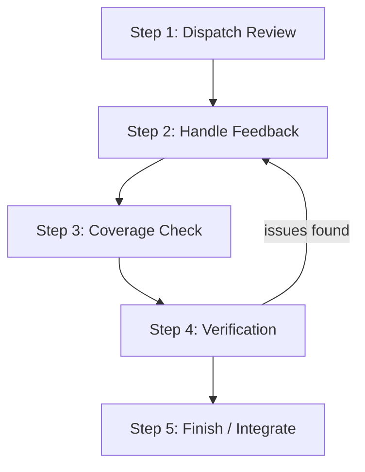
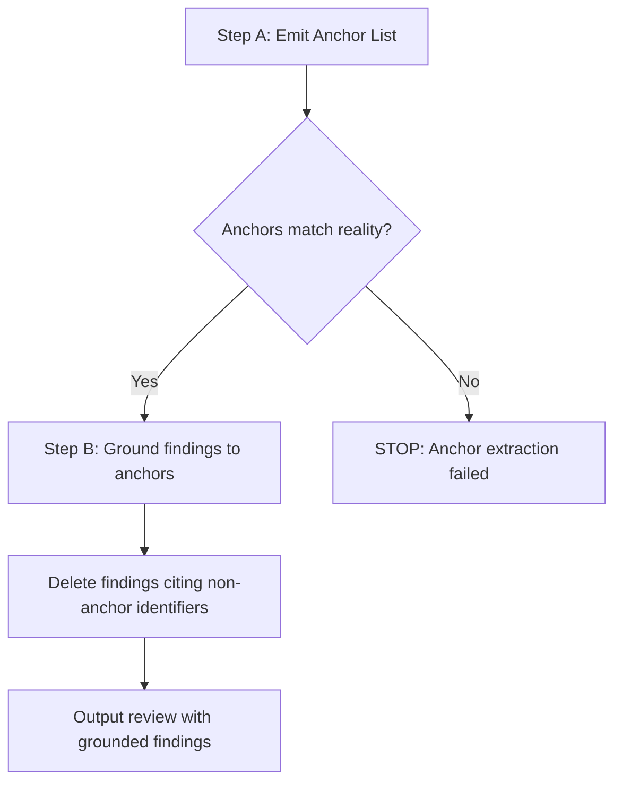
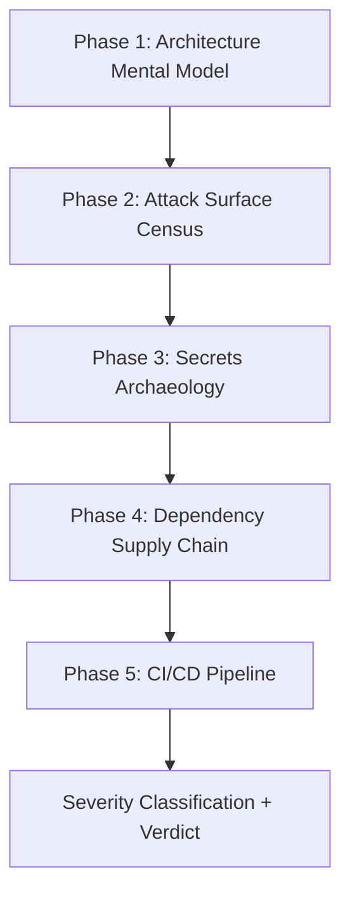

<details>
<summary>Source Files Referenced</summary>

- `agents/mu-reviewer.md`
- `skills/mu-review/SKILL.md`
- `knowledge/reviews/design-audit-rubric.md`
- `knowledge/reviews/security-checklist.md`

</details>

# 审查机制与质量控制

DevMuse 的审查体系围绕 `mu-reviewer` 代理构建，提供六种专用审查模式，覆盖从设计文档到安全漏洞的全生命周期质量检验。审查流程由 `mu-review` skill 编排，通过 subagent 调度实现审查关注点与实现关注点的分离——reviewer 只看到工作产物，不看到实现者的思维过程。

审查体系的核心原则是"证据优先"：每一条发现必须附带 `file:line` 引用，每一个完成声明必须有验证命令的输出作为依据。知识层提供标准化的审查清单（design audit rubric、security checklist），确保审查覆盖面的一致性和可重复性。

## 审查模式总览

mu-reviewer 支持六种审查模式，每种模式有明确的输入要求和输出格式：

| 模式 | 用途 | 必需输入 | 验证方式 |
|------|------|----------|----------|
| `review-design` | 设计文档完整性与一致性 | `SPEC_FILE_PATH` | Read tool 验证文件存在 |
| `review-plan` | 实现计划与 spec 的对齐 | `PLAN_FILE_PATH`, `SPEC_FILE_PATH` | Read tool 验证两个文件 |
| `review-code` | 代码变更的生产就绪性 | `BASE_SHA`, `HEAD_SHA` | `git rev-parse` 验证 SHA |
| `review-compliance` | 实现与规格的逐行比对 | `REQUIREMENTS`, `IMPLEMENTER_REPORT` | 非空检查 |
| `review-coverage` | 用例覆盖率追踪 | `SCOPE_FILE_PATH`, `BASE_SHA`, `HEAD_SHA` | Read + `git rev-parse` |
| `review-security` | 安全漏洞扫描 | (同 review-code 的 diff 范围) | 条件触发 |

Sources: [agents/mu-reviewer.md:17-23]()

如果收到不支持的模式，reviewer 会立即停止并返回错误，不会即兴编造检查清单。如果必需输入缺失或无效，同样立即停止，不会伪造内容继续。

Sources: [agents/mu-reviewer.md:24-32]()

## 审查流程编排

mu-review skill 定义了完整的审查生命周期，包含五个步骤：



### Step 1: Dispatch Review

审查调度遵循"早审查、勤审查"的原则。在派发 `review-code` 之前，会先对 diff 进行安全信号快速扫描：

```bash
git diff $BASE_SHA..$HEAD_SHA | grep -ciE '(auth|password|token|cookie|session|sql|exec|eval|secret|...)'
```

如果匹配数 > 0，则额外派发 `review-security` 模式（安全审查先于代码审查执行）。

Sources: [skills/mu-review/SKILL.md:39-49]()

**强制审查场景：**
- subagent-driven development 中每个 task 完成后
- 完成主要 feature 后
- merge 到 main 之前

Sources: [skills/mu-review/SKILL.md:53-57]()

### Step 2: Handle Feedback

反馈处理遵循严格的技术评估纪律，禁止 performative agreement（如 "You're absolutely right!"）。处理模式为：

| 步骤 | 动作 |
|------|------|
| READ | 完整阅读反馈，不立即反应 |
| UNDERSTAND | 用自己的话复述需求（或提问） |
| VERIFY | 对照代码库现实验证 |
| EVALUATE | 对当前代码库是否技术正确？ |
| RESPOND | 技术确认或有理有据的反驳 |
| IMPLEMENT | 逐项实施，每项单独测试 |

Sources: [skills/mu-review/SKILL.md:152-163]()

### Step 3: Coverage Check

代码质量审查通过后，自动派发 `review-coverage` 模式验证所有 use case 的覆盖情况。覆盖缺口的处理策略：

- 缺少实现（❌）→ 送回 mu-code 实现
- 缺少测试（⚠️）→ 补充测试
- scope 本身缺失 → 通知用户（非代码问题）

Sources: [skills/mu-review/SKILL.md:348-369]()

### Step 4: Verification

验证步骤执行铁律：**没有新鲜的验证证据，不得声称完成。**

Sources: [skills/mu-review/SKILL.md:377-381]()

## Anchor Discipline 机制

Anchor Discipline 是 `review-design`、`review-plan`、`review-coverage` 三种文档审查模式的结构性输出要求，旨在防止 reviewer 将训练数据中的"典型模式"替代实际文档内容。



### Step A: 先输出 Anchor 列表

审查输出的第一部分必须是 `## Anchors Extracted` 块，列出所有将被引用的标识符，包括：
- **UC-IDs**：来自 scope 文件，附文件路径、行号和原文前 10-15 个字
- **Tasks**：来自 plan 文件，附行号和原文
- **Components / Files**：spec 或 plan 中字面提到的组件和文件路径

### Step B: 每条发现必须锚定到 Anchor

每个 `Issues` 条目必须：
1. 引用在 Anchors Extracted 中逐字出现的标识符
2. 从源文档中复制粘贴 1-3 行原文（非转述），附文件路径和行号

### 反模式示例

| 反模式 | 说明 |
|--------|------|
| 编造 UC-ID | 如 "UC-4: 异常恢复"，而 scope 中没有该 ID |
| 编造类名 | 如 "WahaSessionPoolAllocationService"，而 spec 用了不同名称 |
| 编造 task 编号 | 如 "T-6"，而 plan 使用 "Task 6" |
| 转述而非引用 | "The spec says X should do Y" 而非直接引用原文 |

Sources: [agents/mu-reviewer.md:36-82]()

## Design Audit Rubric

`review-design` 模式引用知识层的设计审计评分标准，涵盖四个维度：

| 维度 | 审查要点 |
|------|----------|
| Architecture | Data flow diagram（非平凡流程必须有）、组件边界独立性、failure mode mapping |
| Error Handling | 错误路径是否显式设计（named exceptions）、retry/timeout/circuit-breaker 行为 |
| Performance | N+1 query 模式、unbounded list fetch、caching 策略 |
| Testability | 组件能否隔离测试、外部依赖是否可注入 |

每个维度评分 0-10，低于 7 分的必须说明如何达到 10 分。每个 section 最多 8 个 issue，要求优先级排序而非穷举。

Sources: [knowledge/reviews/design-audit-rubric.md:1-23]()

## Security Review 流程

`review-security` 模式按五个阶段执行，由知识层的 security checklist 驱动：



### Phase 详细内容

| Phase | 关注点 |
|-------|--------|
| Architecture Mental Model | 识别 tech stack、映射数据流（user input → processing → storage → output）、识别 trust boundary |
| Attack Surface Census | 枚举未认证 endpoint、文件上传 handler、webhook receiver、处理外部数据的 background job |
| Secrets Archaeology | 扫描 diff 中的 hardcoded credentials、检查 `.env` 模式、检查 CI config 中的 inline secrets |
| Dependency Supply Chain | 已知漏洞检查（npm/pip/go audit）、abandoned packages（> 2 年未更新）、安装脚本可疑行为 |
| CI/CD Pipeline | unpinned GitHub Actions、`${{ github.event.* }}` script injection、`pull_request_target` 滥用 |

Sources: [knowledge/reviews/security-checklist.md:1-30]()

### Severity 分级

| 级别 | 定义 |
|------|------|
| CRITICAL | 当前即可利用，可能导致数据泄露/损失 |
| HIGH | 需要一定攻击成本，但影响严重 |
| MEDIUM | 需要特定条件，中等影响 |
| LOW | 理论风险，影响轻微 |

CRITICAL 和 HIGH 级别的发现必须在 merge 前修复。

Sources: [knowledge/reviews/security-checklist.md:31-35](), [agents/mu-reviewer.md:337-343]()

## Code Review 检查清单

`review-code` 模式的检查项按优先级分层：

| 优先级 | 类别 | 关键检查项 |
|--------|------|-----------|
| CRITICAL | Security | hardcoded credentials、SQL injection / XSS / path traversal、CSRF / auth |
| HIGH | Code Quality | separation of concerns、error handling、type safety、单一职责 |
| HIGH | Testing | 测试验证真实逻辑（非 mock 行为）、edge case 覆盖 |
| HIGH | Requirements | 所有 plan 需求已实现、实现匹配 spec、无 scope creep |
| MEDIUM | Architecture | 设计决策合理性、scalability、performance |
| MEDIUM | Production Readiness | migration 策略、backward compatibility、breaking changes |

代码审查支持语言特定的额外标准，reviewer 会根据 diff 中的主要语言自动加载对应的知识文件（TypeScript、Python、Go、Java）。

Sources: [agents/mu-reviewer.md:163-233]()

## 执行纪律与覆盖追踪

审查体系强制要求以下执行纪律：

- **不得对未读的文件产出发现** — 必须通过 Read tool 实际读取
- **不得伪造文件路径、行号或代码片段**
- 每条发现必须包含实际读取内容的 `file:line` 引用
- 只报告置信度 > 80% 的问题
- 合并同类问题（"5 个函数缺少错误处理"而非 5 条独立发现）

每次审查输出末尾必须包含覆盖追踪：

```
## Coverage
- Files in scope: [N]
- Files reviewed: [list]
- Files NOT reviewed: [list with reason]
```

如果存在未审查的文件，mu-review skill 会重新派发新的 reviewer 实例处理剩余文件，直到所有文件覆盖完毕，再合并所有轮次的发现。

Sources: [agents/mu-reviewer.md:363-389](), [skills/mu-review/SKILL.md:96-101]()
