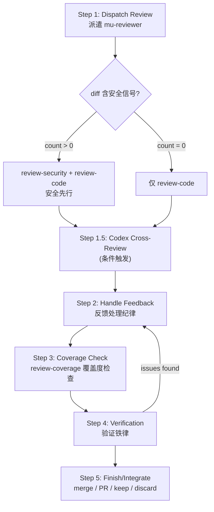
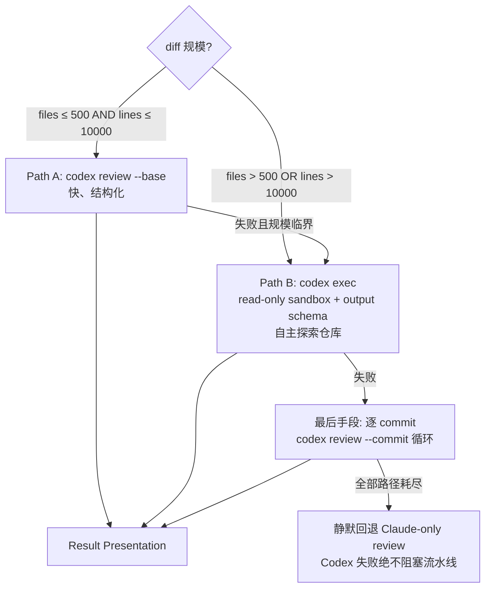

<details>
<summary>Referenced source files (5 files)</summary>

- skills/mu-review/SKILL.md
- agents/mu-reviewer.md
- knowledge/reviews/design-audit-rubric.md
- knowledge/reviews/security-checklist.md
- knowledge/schemas/codex-review-output.json

</details>

# Review：六模式评审、验证与集成

`mu-review` 是 DevMuse 流水线的收尾技能：代码变更完成后，由它统一负责评审派遣、反馈处理、需求覆盖检查、完成验证与最终集成（merge/PR）。它由 `mu-code` 在实现结束后链式调用，也可独立触发用于 ad-hoc 评审；评审工作本身委派给共享代理 `mu-reviewer`。Sources: [skills/mu-review/SKILL.md:1-10](), [skills/mu-review/SKILL.md:961-967]()

`mu-reviewer` 是一个六模式评审专家（review-design / review-plan / review-code / review-compliance / review-coverage / review-security），运行在 opus 模型上，只持有 Read / Grep / Glob / Bash 四个工具，按派遣指令选择模式。整个技能的底色是一条验证铁律：**没有新鲜验证证据，不得声称完成**。Sources: [agents/mu-reviewer.md:1-10](), [skills/mu-review/SKILL.md:648-655]()

## 评审流程总览

mu-review 共五步（含一个条件步骤 1.5），验证门禁发现问题时回流到反馈处理，形成闭环。Sources: [skills/mu-review/SKILL.md:12-33]()



Sources: [skills/mu-review/SKILL.md:14-33](), [skills/mu-review/SKILL.md:43-52]()

## Step 1：评审派遣

派遣 mu-reviewer subagent 在问题级联之前拦截它们。评审者拿到的是**精确构造的评估上下文，绝不是会话历史**——这让评审者聚焦于工作产物而非编排者的思考过程，同时保留主会话上下文。核心原则：Review early, review often。Sources: [skills/mu-review/SKILL.md:35-39]()

强制评审时机：subagent 驱动开发的每个任务之后、完成重大特性之后、merge 到 main 之前；可选时机包括卡住时（换个视角）、重构前（基线检查）、修复复杂 bug 之后。Sources: [skills/mu-review/SKILL.md:53-63]()

派遣前有输入校验闸门：review-code 需 `git rev-parse` 验证 BASE_SHA / HEAD_SHA 有效，review-design 需确认 spec 文件存在，review-coverage 需 scope 文件存在且 SHA 有效；任何输入无效则警告用户、**不派遣**。Sources: [skills/mu-review/SKILL.md:84-90]()

| 反馈严重级 | 处理动作 |
|-----------|---------|
| Critical | 立即修复 |
| Important | 继续前必须修复 |
| Minor | 记录、稍后处理 |
| 评审者错误 | 带技术理由推回（push back） |

Sources: [skills/mu-review/SKILL.md:92-96]()

若评审输出的 "NOT reviewed" 列表非空，则针对剩余文件重新派遣新的 reviewer 实例，循环直至全覆盖，并把多轮发现合并为单一报告。Sources: [skills/mu-review/SKILL.md:98-103]()

### 条件安全检查

派遣 review-code 之前，先对 diff 做一次安全信号快速扫描（grep auth/password/token/sql/eval/secret/jwt/cors 等模式）。命中数 > 0 时追加派遣 **review-security** 模式，且安全评审先于代码质量评审执行；命中数为 0 则只跑 review-code。Sources: [skills/mu-review/SKILL.md:41-52]()

## mu-reviewer：六模式评审代理

### 模式与输入校验

评审开始前必须先校验该模式的全部必需输入；模式不在六种之内时立即停止并返回固定错误文案，**禁止即兴编造检查表**；输入缺失同样停止，禁止伪造内容。Sources: [agents/mu-reviewer.md:12-32]()

| 模式 | 评审对象 | 必需输入 | 校验方式 |
|------|---------|----------|---------|
| review-design | 设计文档 | SPEC_FILE_PATH | Read 确认文件存在 |
| review-plan | 实现计划 | PLAN_FILE_PATH, SPEC_FILE_PATH | Read 确认两个文件存在 |
| review-code | 代码变更 | BASE_SHA, HEAD_SHA | `git rev-parse` 验证 SHA |
| review-compliance | 规格符合性 | REQUIREMENTS, IMPLEMENTER_REPORT | 两段文本非空 |
| review-coverage | 需求覆盖 | SCOPE_FILE_PATH, BASE_SHA, HEAD_SHA | Read + `git rev-parse` |
| review-security | 安全漏洞 | （由 Step 1 条件触发） | 按安全检查表执行 |

Sources: [agents/mu-reviewer.md:16-23](), [agents/mu-reviewer.md:325-330]()

### Anchor Discipline（锚点纪律）

对 review-design / review-plan / review-coverage 三种文档评审模式，这是**结构性输出要求**而非软性指南：输出的第一节必须是 `## Anchors Extracted`，穷举列出后文将引用的每个标识符（UC-ID、Task 编号、组件/文件名），带文件路径、行号和逐字引文。之后每条 finding 必须落到锚点列表中逐字出现的标识符上，并复制粘贴 1-3 行源文原文；引用了锚点列表之外标识符的 finding 属于幻觉，输出前必须删除。Sources: [agents/mu-reviewer.md:34-70]()

反模式包括：发明 UC-ID、发明类名、发明任务编号、用转述替代逐字引用、拿"典型项目通常需要什么"做模式匹配。设立此闸门的原因：评审者的职责是核对文档里**实际存在**的内容，而 Sonnet 级模型倾向于用训练数据中似是而非的模式替换真实内容。Sources: [agents/mu-reviewer.md:72-82]()

### 各模式要点

**review-design** 按七类检查设计文档（完整性、一致性、清晰度、范围、YAGNI、UC 覆盖、架构严谨度），其中架构严谨度挂接审计量表 `design-audit-rubric.md`。量表按设计模板结构组织：C4 定位（每节最多 8 个问题，优先级排序而非穷举）、功能设计（接口契约、数据模型、时序图、状态机）、非功能设计（NFR 触发条件扫描，无关 NFR 直接省略而非列 "N/A"）、ADR、错误处理（命名异常而非 catch-all，retry/timeout/circuit-breaker）、可测试性；每维度 0-10 打分，低于 7 分须说明如何到 10 分。Sources: [agents/mu-reviewer.md:90-101](), [knowledge/reviews/design-audit-rubric.md:1-39]()

**review-code** 先做语言探测并加载对应语言知识文件，再按六层检查表执行：Security（CRITICAL）→ Code Quality / Testing / Requirements（HIGH）→ Architecture / Production Readiness（MEDIUM）；diff 为空时直接停止。输出按 Critical / Important / Minor 分级，每条 issue 必须给出 file:line、问题、影响与修法，最后给出 "Ready to merge?" 裁决。Sources: [agents/mu-reviewer.md:163-257]()

**review-compliance** 的关键戒律是"**不要相信 implementer 的报告**"——一切须读实际代码独立验证：逐行对照需求与实现、找他们声称实现但缺失的部分、找他们没提但多做的部分（缺失需求 / 多余工作 / 理解偏差三类）。Sources: [agents/mu-reviewer.md:259-287]()

**review-security** 挂接 `security-checklist.md`，按五阶段执行：架构心智模型（技术栈、数据流、信任边界）→ 攻击面普查（未认证端点、文件上传、webhook、后台任务、管理界面）→ 密钥考古（硬编码凭证、.env、CI 内联密钥）→ 依赖供应链（已知漏洞、弃维护包、安装脚本）→ CI/CD 管线（未 pin 的 Actions、`${{ github.event.* }}` 脚本注入、pull_request_target）。严重度分 CRITICAL/HIGH（合并前必须修复）与 MEDIUM/LOW（advisory）。Sources: [agents/mu-reviewer.md:325-358](), [knowledge/reviews/security-checklist.md:1-35]()

### 执行纪律与覆盖度追踪

通用执行纪律：绝不为没有用 Read 工具读过的文件产出 finding；绝不伪造文件路径、行号或代码片段；文件不存在/不可读/已删除时如实报告并跳过；每条 finding 必须带实际读过内容的 file:line。每次评审输出末尾必须附 `## Coverage` 段：范围内文件数、已评审列表、未评审列表及原因——这正是 Step 1 中重派剩余文件的依据。校准原则：只报告置信度 > 80% 的问题、按实际严重度分级、合并同类项、不评论未变更代码（CRITICAL 安全问题除外）。Sources: [agents/mu-reviewer.md:361-391]()

## Step 1.5：Codex 交叉评审（条件触发）

可选地调用 OpenAI Codex CLI 获取来自不同模型家族的第二意见。Codex 未安装时此步骤**完全不可见**：`command -v codex` 检测一次并缓存，未找到则静默跳过——不提及 Codex、不建议安装、不在任何输出中引用此步骤。Sources: [skills/mu-review/SKILL.md:148-161]()

两条触发路径：Path A 是用户显式要求（"let codex review this"），直接进入调用；Path B 是系统建议——四个高危信号（派遣过 review-security / diff 超 300 行 / 跨 ≥ 2 个顶层模块 / Claude 评审低置信或 ≥ 3 个 PENDING）任一命中即向用户建议，用户拒绝后本会话不再建议。Sources: [skills/mu-review/SKILL.md:163-182]()

### 规模路由

`codex review --base` 会在发送前于内部构建完整 diff，超大范围会超时失败，因此按 diff 规模路由调用方式。Sources: [skills/mu-review/SKILL.md:184-207]()



Sources: [skills/mu-review/SKILL.md:192-207](), [skills/mu-review/SKILL.md:257-269](), [skills/mu-review/SKILL.md:340-358]()

Path A 使用 `codex review --base "${BASE_SHA}"`，绝不通过 stdin 灌入 `git diff`（大 diff 超 token 限制导致挂起）；`--base` 与位置参数 `[PROMPT]` 互斥，CLI 会直接拒绝组合。Path B 用 `codex exec` 配合只读沙箱与 `--output-schema`，由 agent 自主枚举变更文件并优先审阅高信号区域（auth 边界、公共 API、错误处理、持久层），输出受 JSON Schema 约束以保证可解析。Sources: [skills/mu-review/SKILL.md:271-301](), [skills/mu-review/SKILL.md:209-251]()

### 结构化输出与错误处理

仓库在 `knowledge/schemas/codex-review-output.json` 存有 Codex 评审的结构化输出 schema：必填 `summary`、`issues`（每条含 severity∈{critical, important, minor}、file、description、suggestion）、`assessment`（block / needs-work / ready-to-proceed）、`confidence`（high / medium / low）。Sources: [knowledge/schemas/codex-review-output.json:1-46]()

错误处理的核心教训是：**exit code 0 不足以证明成功**——codex exec 在耗尽上游重试（如 5xx）后仍返回 0，必须校验输出产物（文件非空且是通过 schema 校验的合法 JSON）。auth 失败、503 上游不可用、超时等所有失败最终都静默回退到 Claude-only review（UC-R2：Codex 失败绝不阻塞评审流水线）。Sources: [skills/mu-review/SKILL.md:314-358]()

结果呈现分两种：Codex-primary 模式（用户显式请求时直接呈现 Codex 报告）与 Dual report 模式（Claude 与 Codex 双报告并排对比，按"文件路径 + 描述文本"精确匹配去重为 Claude-only / Codex-only / Shared 三组；裁决矛盾时提示用户裁定，即 UC-7）。Sources: [skills/mu-review/SKILL.md:360-413]()

## Step 2：反馈处理纪律

代码评审要求技术评估，不是情绪表演。核心原则：先验证再实现、先问再假设、技术正确性高于社交舒适。响应模式为六步：READ（完整读完不急于反应）→ UNDERSTAND（用自己的话复述或提问）→ VERIFY（对照代码库现实核查）→ EVALUATE（对**这个**代码库是否技术上成立）→ RESPOND（技术性确认或有理有据的推回）→ IMPLEMENT（一次一项、逐项测试）。Sources: [skills/mu-review/SKILL.md:415-432]()

禁止的响应包括 "You're absolutely right!"（显式违反 CLAUDE.md）、"Great point!" 等表演性认同，以及未验证就说 "Let me implement that now"；正确的确认是陈述修复事实（"Fixed. [变更简述]"）或直接用代码说话，**任何**感谢表达都被禁止。多项反馈中有任何一项不清楚时，全部停下先澄清——各项之间可能相关，部分理解等于错误实现。Sources: [skills/mu-review/SKILL.md:434-463](), [skills/mu-review/SKILL.md:538-555]()

| 反馈来源 | 处理姿态 |
|---------|---------|
| Human partner | 受信任——理解后实现；范围不清仍要问；跳过客套直接行动 |
| External reviewer | 保持怀疑——五项前置检查（对本库正确？破坏现有功能？现状有原因？跨平台？评审者懂全貌？） |
| 与 partner 既有决策冲突 | 停下，先与 partner 讨论 |
| 无法验证的建议 | 明说局限，请求方向 |

Sources: [skills/mu-review/SKILL.md:466-493]()

对 "implement properly" 类建议先做 YAGNI 检查：grep 实际用量，无人调用就提议删除。推回的正当理由包括破坏既有功能、评审者缺上下文、违反 YAGNI、对本技术栈不正确、遗留兼容原因、与架构决策冲突；推回方式是技术论证而非防御。多项实现顺序：先澄清 → 阻塞问题 → 简单修复 → 复杂修复，逐项测试防回归。GitHub 内联评论要回复在 comment thread 里，而不是顶层 PR 评论。Sources: [skills/mu-review/SKILL.md:495-536](), [skills/mu-review/SKILL.md:571-573]()

## Step 3：需求覆盖检查

代码质量评审通过后，验证 scope 中的全部用例已被覆盖：从 Design Spec 的 `Requirements Reference` 提取 scope 文件路径，以 review-coverage 模式派遣 mu-reviewer（传 SCOPE_FILE_PATH 与 git 区间）；无 Requirements Reference 的遗留 spec 则跳过并记录警告。只要 scope 工件存在，此步**永不跳过**——报告可以只有 2 行也可以有 20 行，但一定运行。Sources: [skills/mu-review/SKILL.md:616-638]()

mu-reviewer 侧的执行方法：提取 scope 中全部 UC-ID → 在 diff 范围的测试文件中扫描 `// Covers: UC-xxx` 注释 → 从测试沿 import/调用链追踪到其实际触达的生产代码（生产代码不带 UC 注解）→ 交叉比对生成覆盖矩阵。测试只打 mock、未触达真实生产代码路径的 UC 标记 `⚠️ Test only`；功能明显覆盖但无显式 UC-ID 引用的标 `⚠️ Likely covered` 而非 `❌ Missing`。Sources: [agents/mu-reviewer.md:289-323]()

| 缺口类型 | 处理 |
|---------|------|
| 实现缺失（❌） | 送回 mu-code 补实现 |
| 测试缺失（⚠️） | 为未覆盖用例补测试 |
| scope 本身缺失 | 告知用户（非代码问题，scope 不完整） |

Sources: [skills/mu-review/SKILL.md:629-636]()

## Step 4：验证铁律

未经验证就声称工作完成，是不诚实，不是效率。铁律只有一句：

```
NO COMPLETION CLAIMS WITHOUT FRESH VERIFICATION EVIDENCE
```

如果没有在**本条消息中**运行验证命令，就不能声称它通过。违反此规则的字面即是违反其精神。Sources: [skills/mu-review/SKILL.md:640-655]()

门禁函数五步：IDENTIFY（什么命令能证明该断言）→ RUN（完整、新鲜地执行）→ READ（读全输出、查 exit code、数失败）→ VERIFY（输出是否支持断言，否则如实报告实际状态）→ 然后才 CLAIM。跳过任何一步等于说谎。Sources: [skills/mu-review/SKILL.md:657-670]()

| 断言 | 需要的证据 | 不算证据 |
|------|-----------|---------|
| Tests pass | 测试命令输出：0 failures | 上次的运行、"should pass" |
| Build succeeds | build 命令 exit 0 | linter 通过、日志看着不错 |
| Bug fixed | 复测原始症状：通过 | 改了代码、假定已修 |
| Regression test works | red-green 循环验证（写→过→撤修复→必须红→还原→过） | 测试跑过一次 |
| Agent completed | VCS diff 显示实际变更 | agent 自报 "success" |
| Requirements met | 逐行 checklist 核对 | 测试通过 |

Sources: [skills/mu-review/SKILL.md:672-682](), [skills/mu-review/SKILL.md:715-738]()

红旗信号：出现 "should" / "probably" / "seems to"；验证前先表达满意（"Great!" "Done!"）；未验证就要 commit/push/PR；轻信 agent 成功报告；部分验证；"就这一次"。所有借口都有对应的现实反驳——"I'm confident" 不等于证据，"Linter passed" 不等于编译通过，"I'm tired" 不构成豁免。规则覆盖精确措辞、转述、同义词与任何暗示成功的表达。Sources: [skills/mu-review/SKILL.md:684-706](), [skills/mu-review/SKILL.md:749-765]()

## Step 5：终态（merge/PR）

呈现选项之前先验证测试：测试失败则展示失败并停止，**不进入选项**；测试通过后确定 base branch（`git merge-base HEAD main`，或询问用户），然后精确呈现四个选项，不加解释。Sources: [skills/mu-review/SKILL.md:767-819]()

| 选项 | Merge | Push | 保留 worktree | 清理分支 |
|------|-------|------|--------------|---------|
| 1. 本地 merge 回 base | ✓ | - | -（清理） | ✓ |
| 2. Push + 创建 PR | - | ✓ | ✓ | - |
| 3. 保留分支现状 | - | - | ✓ | - |
| 4. 丢弃本次工作 | - | - | -（清理） | ✓（强制） |

Sources: [skills/mu-review/SKILL.md:907-914]()

关键约束：选项 1 merge 后要**在合并结果上**再跑一次测试才删分支；选项 2 用 `gh pr create` 生成含 Summary 与 Test Plan 的 PR；选项 4 必须先列出将永久删除的分支、提交与 worktree，等待用户逐字输入 "discard" 确认。worktree 只在选项 1 和 4 清理，选项 2、3 保留。常见错误：跳过测试验证就 merge、开放式提问代替四选项、自动清理还需要的 worktree、无确认删除工作、未经明确要求 force-push。Sources: [skills/mu-review/SKILL.md:821-932](), [skills/mu-review/SKILL.md:916-932](), [skills/mu-review/SKILL.md:955-959]()

## See also

- [plan-implement](plan-implement.md) — mu-plan / mu-code 如何产出计划并逐任务实现，实现完成后链式进入本页的 mu-review
- [agents-dispatch](agents-dispatch.md) — mu-reviewer 在代理体系中的位置与各技能的派遣映射
- [pipeline-graph](pipeline-graph.md) — Review 作为流水线终段在整体流程图中的衔接
