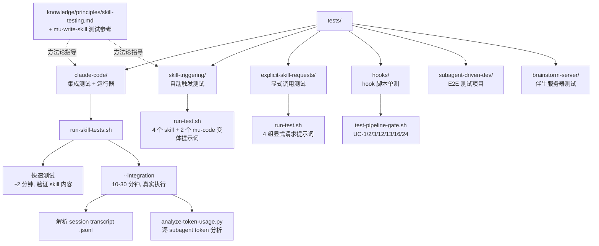

Referenced source files (8 files)

- `docs/testing.md`
- `tests/claude-code/README.md`
- `tests/claude-code/run-skill-tests.sh`
- `tests/skill-triggering/run-all.sh`
- `tests/explicit-skill-requests/run-all.sh`
- `tests/hooks/test-pipeline-gate.sh`
- `knowledge/principles/skill-testing.md`
- `skills/mu-write-skill/testing-skills-with-subagents.md`

# 测试基础设施

DevMuse 的 skill 涉及 subagent 调度、workflow 编排和复杂的 agent 交互，这类行为无法用传统单元测试覆盖——因此测试方式是在 headless 模式下运行真实的 Claude Code session，然后解析 session transcript（`.jsonl` 文件）来验证行为，而不是只看用户可见输出。Sources: [docs/testing.md:1-3](), [docs/testing.md:101-108]()

`tests/` 目录按被测对象分组：`claude-code/`（集成测试与测试运行器）、`skill-triggering/`（自动触发）、`explicit-skill-requests/`（显式调用）、`hooks/`（hook 脚本单测）、`subagent-driven-dev/`（E2E 测试项目）、`brainstorm-server/`（可视化伴生服务器）。与之配套的是一套 skill 测试方法论：把 TDD 的 RED-GREEN-REFACTOR 循环应用到"过程文档"上，用压力场景暴露 agent 的合理化借口。Sources: [docs/testing.md:5-17](), [skills/mu-write-skill/testing-skills-with-subagents.md:7-13]()

## 测试体系总览

Sources: [docs/testing.md:5-17](), [tests/claude-code/run-skill-tests.sh:74-87](), [tests/hooks/test-pipeline-gate.sh:1-3]()

## 测试组 × 目标 × 运行器

| 测试组 | 验证目标 | 运行器 / 入口 |
|---|---|---|
| `tests/claude-code/` | skill 正确加载、`mu-code`（subagent-driven 模式）端到端工作流 | `run-skill-tests.sh`（`--integration` 开启慢测试） |
| `tests/skill-triggering/` | 自然语言提示词能自动触发正确的 skill | `run-all.sh` → `run-test.sh` |
| `tests/explicit-skill-requests/` | 用户点名请求某 skill 时会被正确调用 | `run-all.sh` → `run-test.sh` |
| `tests/hooks/` | `pipeline-gate.sh`、`destructive-guard.sh` hook 的 deny/allow 决策 | `test-pipeline-gate.sh`、`test-destructive-guard.sh` |
| `tests/subagent-driven-dev/` | E2E 测试项目（`go-fractals`、`svelte-todo`） | `run-test.sh` |
| `tests/brainstorm-server/` | 可视化伴生服务器（server、WS 协议、窗口生命周期） | `server.test.js`、`ws-protocol.test.js`、`windows-lifecycle.test.sh` |

Sources: [docs/testing.md:5-17](), [tests/claude-code/run-skill-tests.sh:74-87](), [tests/skill-triggering/run-all.sh:10-21](), [tests/explicit-skill-requests/run-all.sh:18-59](), [tests/hooks/test-pipeline-gate.sh:1-9]()

## claude-code：集成测试与运行器

### 验证内容

该组测试通过 `claude -p`（headless 模式）调用 Claude Code CLI，验证 skill 被正确加载且 Claude 按 skill 要求行事。前置要求：`claude` CLI 在 PATH 中、本地 devmuse plugin 已安装，且必须从 **devmuse plugin 目录**运行（skill 只从那里加载），并在 `~/.claude/settings.json` 中启用本地开发 marketplace（`"devmuse@devmuse-dev": true`）。Sources: [tests/claude-code/README.md:5-12](), [docs/testing.md:30-34]()

测试分两层：

- **快速测试**（默认运行，约 2 分钟）：`test-subagent-driven-development.sh` 验证 skill *内容与要求*——skill 可加载、工作流顺序（spec 合规审查先于代码质量审查）、自审要求、plan 读取效率、审查循环等均有文档化。Sources: [tests/claude-code/README.md:83-93](), [tests/claude-code/README.md:152-158]()
- **集成测试**（`--integration`，10-30 分钟）：`test-subagent-driven-development-integration.sh` 创建真实 Node.js 测试项目和含 2 个任务的实施计划，实际执行 subagent-driven 工作流，验证：plan 只在开始读一次（而非每任务读一次）、subagent prompt 含完整任务文本、subagent 上报前自审、spec 合规审查先于代码质量、审查者独立读代码、产出可工作的实现、测试通过、git 提交符合工作流。Sources: [tests/claude-code/README.md:95-117](), [docs/testing.md:36-61]()

### 运行方式与验证机制

集成测试的验证不依赖用户可见输出，而是解析 session transcript（`.jsonl`）：确认 Skill tool 被调用、subagent 通过 Task tool 派发、TodoWrite 用于跟踪、实现文件已创建、测试通过、git 提交正确；最后输出逐 subagent 的 token 用量分解（`analyze-token-usage.py`）以观测成本。Sources: [docs/testing.md:49-72]()

`run-skill-tests.sh` 是统一运行器：默认单测试超时 300 秒（可用 `--timeout` 调整），`--test` 指定单个测试，`--verbose` 显示完整输出，`--integration` 把慢测试加入队列；超时（exit code 124）与普通失败分别报告，最终按 passed/failed/skipped 汇总并以退出码 0/1 表示成败（可直接接入 CI）。若未跑集成测试，汇总时会明确提示。Sources: [tests/claude-code/run-skill-tests.sh:26-64](), [tests/claude-code/run-skill-tests.sh:118-187](), [tests/claude-code/README.md:142-150]()

编写新测试的最佳实践：用 `trap` 清理临时目录、解析 `.jsonl` 而非用户输出、使用 `--permission-mode bypassPermissions` 与 `--add-dir`、从 plugin 目录运行、包含 token 分析、验证真实产物（文件、测试、提交）。共享工具在 `test-helpers.sh` 中（`run_claude`、`assert_contains`、`assert_order`、`create_test_project` 等）。Sources: [docs/testing.md:101-108](), [tests/claude-code/README.md:43-51]()

## skill-triggering：自动触发测试

验证目标：给出一段**未点名 skill** 的自然语言提示词，对应 skill 应被自动触发。当前覆盖 4 个 skill——`mu-debug`、`mu-code`、`mu-plan`、`mu-review`，每个 skill 有对应的 `prompts/<skill>.txt` 提示词文件；此外还有 2 个额外提示词变体（`mu-code-execute`、`mu-code-subagent`），验证不同措辞的提示词都能触发同一个 `mu-code`。Sources: [tests/skill-triggering/run-all.sh:10-21](), [tests/skill-triggering/run-all.sh:53-77]()

运行方式：`run-all.sh` 逐项调用 `run-test.sh <skill> <prompt-file> 3`，每项日志写入 `/tmp/skill-test-*.log`，最后汇总 pass/fail 并在有失败时以退出码 1 结束。Sources: [tests/skill-triggering/run-all.sh:30-51](), [tests/skill-triggering/run-all.sh:79-91]()

## explicit-skill-requests：显式调用测试

验证目标：用户**明确点名**要用某个 skill 时（各种措辞），该 skill 会被调用。`run-all.sh` 固定跑 4 组用例：

| 用例 | 提示词文件 | 期望调用的 skill |
|---|---|---|
| 1 | `subagent-driven-development-please.txt` | `subagent-driven-development` |
| 2 | `use-systematic-debugging.txt` | `systematic-debugging` |
| 3 | `please-use-brainstorming.txt` | `brainstorming` |
| 4 | `mid-conversation-execute-plan.txt`（会话中途要求执行计划） | `subagent-driven-development` |

同样以 pass/fail 汇总、失败即退出码 1。目录下还有多轮对话、haiku 模型等扩展运行器（`run-multiturn-test.sh`、`run-haiku-test.sh` 等）。Sources: [tests/explicit-skill-requests/run-all.sh:18-70]()

## hooks：pipeline-gate 单元测试

这是最"传统"的一组测试：纯 bash 单测，不需要跑 Claude session。`test-pipeline-gate.sh` 测试 `hooks/pre-tool-use/pipeline-gate.sh`，覆盖用例 UC-1、UC-2、UC-3、UC-12、UC-13、UC-16、UC-24。测试方法是在临时项目目录中 `cd` 进去（让 hook 的 `docs/scope/`、`docs/specs/` 相对路径检查生效），设置 `CLAUDE_PLUGIN_ROOT` 后向 hook 的 stdin 灌入 JSON，断言其输出。Sources: [tests/hooks/test-pipeline-gate.sh:1-31]()

| 用例 | 场景 | 期望行为 |
|---|---|---|
| UC-1 | 无 `docs/scope/` 目录 | deny，输出提及 scope |
| UC-2 | 有 scope、无 design | deny，输出提及 design |
| UC-3 | scope 与 design 都存在 | allow（空输出） |
| UC-13 | 目标文件在 plugin 目录内 | 无视 scope 状态直接 allow |
| UC-12 | scope 文件为空 | 仍 allow（只做存在性检查） |
| UC-16 | 多个 scope 文件 | 任一满足即 allow |
| UC-24 | 输入为畸形 JSON | fail-open（空输出，放行） |

Sources: [tests/hooks/test-pipeline-gate.sh:33-180]()

同目录另有 `test-destructive-guard.sh` 测试破坏性操作守卫 hook。Sources: [tests/hooks/test-pipeline-gate.sh:1-9]()

## subagent-driven-dev 与 brainstorm-server

- **`tests/subagent-driven-dev/`**：E2E 测试项目集，包含 `go-fractals`、`svelte-todo` 两个真实小项目和一个 `run-test.sh`，作为 subagent-driven 开发流程的端到端演练素材。Sources: [docs/testing.md:16]()
- **`tests/brainstorm-server/`**：可视化伴生服务器（visual companion server）的测试，包含 `server.test.js`、`ws-protocol.test.js`（Node 测试）和 `windows-lifecycle.test.sh`（窗口生命周期 shell 测试）。Sources: [docs/testing.md:13]()

## Skill 测试方法论

### RED-GREEN-REFACTOR：TDD 应用于过程文档

"测试 skill 就是把 TDD 应用到过程文档上"：先在**没有** skill 的情况下跑场景（RED——看 agent 失败），针对这些失败编写 skill（GREEN——看 agent 合规），再封堵漏洞（REFACTOR——保持合规）。核心原则：如果你没有亲眼看到 agent 在没有 skill 时失败，你就不知道这个 skill 防的是不是正确的失败。Sources: [skills/mu-write-skill/testing-skills-with-subagents.md:7-11]()

| TDD 阶段 | Skill 测试对应动作 |
|---|---|
| RED | 无 skill 跑场景，观察 agent 失败 |
| Verify RED | 逐字记录失败与合理化借口 |
| GREEN | 编写 skill，针对具体的基线失败 |
| Verify GREEN | 带 skill 做压力测试，验证合规 |
| REFACTOR | 发现新借口，补充反制条目 |
| Stay GREEN | 重测，确保仍然合规 |

Sources: [skills/mu-write-skill/testing-skills-with-subagents.md:30-41]()

### 按 skill 类型选择测试策略

不同类型的 skill 需要不同的测试方式（mu-write-skill 在测试阶段引用此原则）：

| Skill 类型 | 示例 | 测试方式 | 成功标准 |
|---|---|---|---|
| 纪律约束型（discipline-enforcing） | TDD、mu-review | 学术性提问 + 压力场景 + 多重压力叠加，识别借口并加显式反制 | 最大压力下仍遵守规则 |
| 技巧型（technique） | condition-based-waiting、root-cause-tracing | 应用场景、变体场景、信息缺失测试 | 能把技巧正确用到新场景 |
| 模式型（pattern） | reducing-complexity | 识别场景、应用场景、反例（何时不适用） | 正确判断何时/如何应用 |
| 参考型（reference） | API 文档、命令参考 | 检索场景、应用场景、覆盖缺口测试 | 找到并正确应用参考信息 |

Sources: [knowledge/principles/skill-testing.md:5-50]()

### 压力场景（针对纪律约束型 skill）

通过分层施压暴露合理化借口：时间压力（"只剩 10 分钟，这次能跳过测试吗"）、沉没成本（"已经写了 300 行没测试的代码"）、权威（"team lead 说这个 PR 手动测试就行"）、疲劳（多轮对话后规则是否仍成立）、找例外（"这只是个一次性原型吧"）、精神 vs 字面（"我遵守的是 TDD 的精神，只是不拘泥字面"）。先单独测每种压力，再叠加 2-3 种做最大强度测试——任何能得逞的借口都是 skill 里要封堵的漏洞。Sources: [knowledge/principles/skill-testing.md:52-65]()

### 元测试：封堵漏洞

基线测试后，若 agent 找到 skill 未覆盖的合理化借口：向 skill 的 rationalization 表加显式条目 → 用同一场景重测 → 重复直到在被测压力下无懈可击。目标不是完美覆盖，而是封掉 agent **实际找到的**那些具体漏洞。Sources: [knowledge/principles/skill-testing.md:67-75]()

---

See also: [实现与审查](implementation-and-review.md) · [文档维护契约](docs-maintenance-contract.md)
