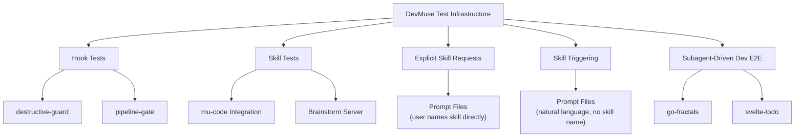
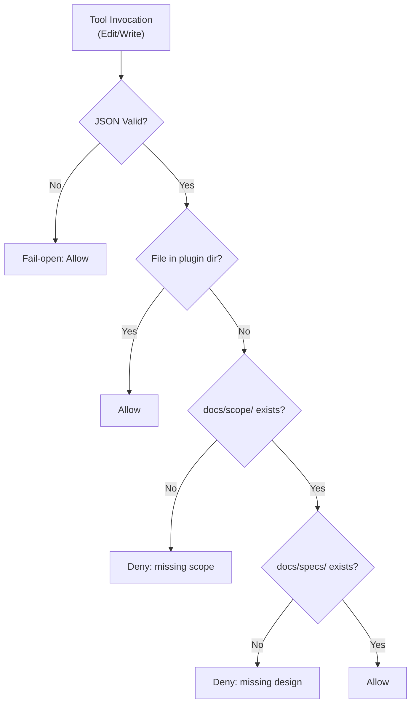
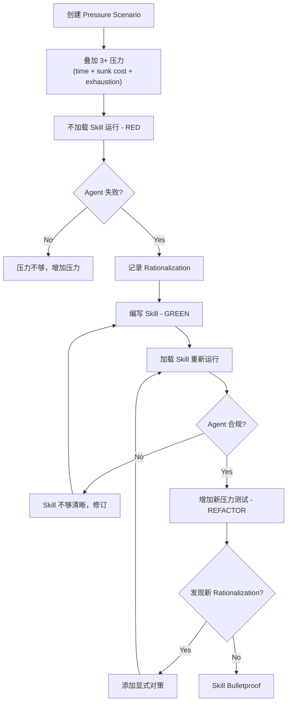

<details>
<summary>Source Files Referenced</summary>

- `docs/testing.md`
- `knowledge/principles/skill-testing.md`
- `skills/mu-code/testing-anti-patterns.md`
- `skills/mu-write-skill/testing-skills-with-subagents.md`
- `tests/hooks/test-destructive-guard.sh`
- `tests/hooks/test-pipeline-gate.sh`
- `tests/claude-code/test-helpers.sh`
- `tests/claude-code/run-skill-tests.sh`
- `tests/explicit-skill-requests/run-test.sh`
- `tests/skill-triggering/run-test.sh`
- `tests/subagent-driven-dev/run-test.sh`

</details>

# 测试基础设施

DevMuse 的测试体系围绕一个核心理念构建：**evidence over claims**（用证据说话，而非口头声明）。由于 DevMuse 的 skill 涉及 subagent 调度、workflow 编排和复杂的 agent 交互，传统的 unit test 无法覆盖其行为边界。因此，DevMuse 采用了一套从 shell hook 测试到端到端 subagent 集成测试的多层测试体系，所有测试均通过运行真实的 Claude Code session 并解析 session transcript（`.jsonl`）来验证行为。

测试哲学与 TDD 深度绑定：不仅代码开发遵循 RED-GREEN-REFACTOR 循环，skill 文档的编写和验证也严格遵循同样的循环。"如果你没有看到 agent 在没有 skill 的情况下失败，你就不知道这个 skill 是否在防止正确的失败。" Sources: [testing-skills-with-subagents.md:9-10]()

## 测试体系总览



## 五类测试套件

| 测试套件 | 目录 | 测试目标 | 运行方式 |
|----------|------|---------|---------|
| Hook Tests | `tests/hooks/` | Pre-tool-use hook 的输入输出正确性 | 纯 shell，秒级完成 |
| Skill Tests (claude-code) | `tests/claude-code/` | mu-code skill 的 subagent 调度、review 顺序、TDD 流程 | Headless Claude Code，10-30 分钟 |
| Explicit Skill Requests | `tests/explicit-skill-requests/` | 用户直接命名 skill 时能否正确触发 | Headless Claude Code，~5 分钟 |
| Skill Triggering | `tests/skill-triggering/` | 自然语言 prompt 能否自动匹配正确 skill | Headless Claude Code，~5 分钟 |
| Subagent-Driven Dev E2E | `tests/subagent-driven-dev/` | 端到端完整项目构建（scaffold + plan + execute） | Headless Claude Code，30+ 分钟 |

Sources: [testing.md:7-17]()

## Hook Tests

Hook tests 是最轻量的测试类型，直接通过 shell 脚本验证 pre-tool-use hook 的行为。测试模式统一：构造 JSON 输入，调用 hook 脚本，断言输出。

### destructive-guard 测试

验证破坏性命令（`rm -rf`、`git push --force`、`DROP TABLE`）被拦截，同时安全模式（`rm -rf node_modules`、`rm -rf dist`）被放行。覆盖 use case：UC-4（破坏性命令拦截）、UC-15（安全模式放行）、UC-24（malformed JSON fail-open）。

Sources: [test-destructive-guard.sh:1-3]()

### pipeline-gate 测试

验证 pipeline gate 的 scope/design 前置检查：无 scope 目录时拒绝编辑、有 scope 无 design 时拒绝编辑、两者都有时放行。覆盖 use case：UC-1、UC-2、UC-3、UC-12、UC-13、UC-16、UC-24。



Sources: [test-pipeline-gate.sh:1-3]()

## Skill Integration Tests

位于 `tests/claude-code/`，是最核心的测试类型。通过 headless 模式运行真实 Claude Code session，然后解析 `.jsonl` transcript 验证行为。

### 测试验证点

| 验证项 | 检查方法 |
|-------|---------|
| Skill tool 被调用 | `grep '"name":"Skill"'` in `.jsonl` |
| Subagent 被派发 | `grep` for Task tool invocation |
| TodoWrite 用于追踪 | `grep '"name":"TodoWrite"'` |
| 实现文件已创建 | 检查文件系统 |
| 测试通过 | 运行项目测试命令 |
| Git commit 记录正确 workflow | 检查 git log |

### test-helpers.sh 工具库

提供共享的测试工具函数：`run_claude`（headless 执行）、`assert_contains`/`assert_not_contains`（输出断言）、`assert_count`（计数断言）、`assert_order`（顺序断言）、`create_test_project`/`cleanup_test_project`（临时项目管理）、`create_test_plan`（生成标准测试计划）。

Sources: [test-helpers.sh:1-200]()

### 运行要求

- 必须从 **devmuse plugin 目录** 运行（skill 只从该目录加载）
- `claude` CLI 可用
- Local dev marketplace 已启用：`"devmuse@devmuse-dev": true` in `~/.claude/settings.json`
- Integration test 耗时 10-30 分钟（涉及多个 subagent 的真实执行）

Sources: [testing.md:29-35]()

## Explicit Skill Requests 测试

测试用户 **直接命名** skill 时的触发行为。使用预定义的 prompt 文件（如 `subagent-driven-development-please.txt`、`use-systematic-debugging.txt`），通过 `--output-format stream-json` 捕获完整执行日志。

关键验证逻辑：不仅检查 skill 是否被触发，还检查是否存在 **premature action**（在加载 skill 之前就开始执行工作），这是一个已知的失败模式。

```bash
# Detect premature tool invocations before Skill tool
FIRST_SKILL_LINE=$(grep -n '"name":"Skill"' "$LOG_FILE" | head -1 | cut -d: -f1)
head -n "$FIRST_SKILL_LINE" "$LOG_FILE" | grep '"type":"tool_use"' | grep -v '"name":"Skill"'
```

Sources: [explicit-skill-requests/run-test.sh:99-121]()

## Skill Triggering 测试

与 Explicit Skill Requests 类似，但使用 **自然语言 prompt**（不提及 skill 名称）。测试 agent 能否从语义中推断出正确的 skill。Prompt 示例包括：`dispatching-parallel-agents.txt`、`executing-plans.txt`、`systematic-debugging.txt` 等。

两类测试的核心差异：

| 维度 | Explicit Skill Requests | Skill Triggering |
|------|------------------------|-----------------|
| Prompt 风格 | 直接提及 skill 名称 | 自然语言描述任务 |
| 测试目标 | Skill 注册和加载机制 | 路由和语义匹配 |
| Premature action 检查 | 有 | 无 |

Sources: [skill-triggering/run-test.sh:1-7]()

## Subagent-Driven Dev E2E 测试

最重量级的测试类型。每个测试包含完整的项目定义：`design.md`（设计文档）、`plan.md`（实现计划）、`scaffold.sh`（项目脚手架脚本）。测试流程：scaffold 项目 -> 执行 plan -> 验证输出。

当前包含两个测试项目：
- **go-fractals**：Go 语言 fractal 生成器，验证命令 `go test ./...`
- **svelte-todo**：Svelte TODO 应用，验证命令 `npm test && npx playwright test`

测试支持 token usage 追踪，通过 `jq` 从 stream-json 输出中提取 usage 统计。

Sources: [subagent-driven-dev/run-test.sh:56-107]()

## 测试哲学

### TDD 贯穿一切

DevMuse 将 TDD 从代码开发延伸到 skill 文档编写。核心映射关系：

| TDD Phase | Skill Testing 对应 | 操作 |
|-----------|-------------------|------|
| **RED** | Baseline test | 不加载 skill，运行场景，观察 agent 失败 |
| **Verify RED** | 捕获 rationalization | 逐字记录 agent 的借口和理由 |
| **GREEN** | 编写 skill | 针对具体 baseline 失败编写 skill |
| **Verify GREEN** | Pressure test | 加载 skill 后重新运行，验证合规 |
| **REFACTOR** | 堵住漏洞 | 发现新的 rationalization，添加对策 |
| **Stay GREEN** | 再次验证 | 确保 refactor 后仍然合规 |

Sources: [testing-skills-with-subagents.md:35-39]()

### Testing Anti-Patterns（铁律）

三条不可违反的测试铁律：

1. **NEVER test mock behavior** -- 测试真实行为，而非 mock 是否存在
2. **NEVER add test-only methods to production classes** -- 测试专用逻辑放在 test utilities 中
3. **NEVER mock without understanding dependencies** -- 先理解依赖链，再决定 mock 层级

Sources: [testing-anti-patterns.md:15-18]()

### Skill 分类测试策略

不同类型的 skill 需要不同的测试方法：

| Skill 类型 | 示例 | 测试方法 | 成功标准 |
|-----------|------|---------|---------|
| Discipline-Enforcing | TDD, mu-review | Pressure scenarios（多重压力叠加） | Agent 在最大压力下仍遵守规则 |
| Technique | defensive-programming | Application + edge case scenarios | Agent 在新场景中正确应用技术 |
| Pattern | reducing-complexity | Recognition + counter-example scenarios | Agent 正确判断何时应用/不应用 |
| Reference | API docs | Retrieval + gap testing | Agent 找到并正确使用参考信息 |

对于 Discipline-Enforcing 类型的 skill，测试需要叠加多种压力：time pressure、sunk cost、authority、exhaustion、exception-seeking。最佳测试组合 3 种以上压力。

Sources: [skill-testing.md:6-65]()

### Pressure Testing 流程



Sources: [testing-skills-with-subagents.md:91-158]()

## 编写新测试的最佳实践

- 始终清理临时目录（使用 `trap` 确保 cleanup）
- 解析 `.jsonl` transcript，而非用户可见输出
- 使用 `--permission-mode bypassPermissions` 和 `--add-dir`
- 从 plugin 目录运行（skill 只从该目录加载）
- 包含 token analysis 以追踪成本
- 验证实际产物：文件创建、测试通过、commit 记录

Sources: [testing.md:100-109]()
