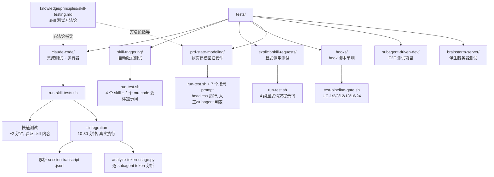
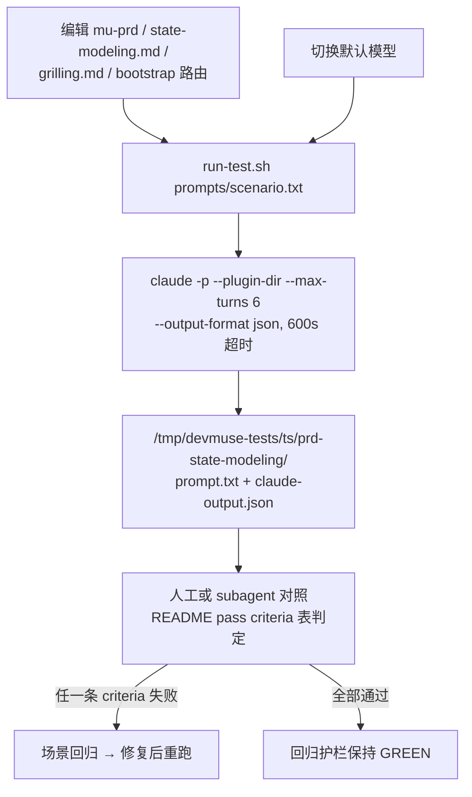

Referenced source files (9 files)

- `docs/testing.md`
- `tests/claude-code/README.md`
- `tests/claude-code/run-skill-tests.sh`
- `tests/skill-triggering/run-all.sh`
- `tests/explicit-skill-requests/run-all.sh`
- `tests/hooks/test-pipeline-gate.sh`
- `knowledge/principles/skill-testing.md`
- `tests/prd-state-modeling/README.md`
- `tests/prd-state-modeling/run-test.sh`

# 测试基础设施

DevMuse 的 skill 涉及 subagent 调度、workflow 编排和复杂的 agent 交互，这类行为无法用传统单元测试覆盖——因此主体测试方式是在 headless 模式下运行真实的 Claude Code session（`claude -p`），然后解析 session transcript（`.jsonl` 文件）或结构化输出来验证行为，而不是只看用户可见输出。Sources: [docs/testing.md:1-3](), [docs/testing.md:96-99](), [tests/claude-code/README.md:5-7]()

`tests/` 目录按被测对象分组：`claude-code/`（集成测试与统一运行器）、`skill-triggering/`（自动触发）、`explicit-skill-requests/`（显式调用）、`hooks/`（hook 脚本单测）、`subagent-driven-dev/`（E2E 测试项目）、`brainstorm-server/`（可视化伴生服务器），以及 1.3.0 起新增的 `prd-state-modeling/`（状态建模回归套件，持久化了当时门控发布的 RED/GREEN 场景）。方法论侧由 `knowledge/principles/skill-testing.md` 提供：按 skill 类型选择测试策略，用压力场景暴露 agent 的合理化借口。Sources: [docs/testing.md:5-17](), [tests/prd-state-modeling/README.md:1-5](), [knowledge/principles/skill-testing.md:1-4]()

## 测试体系总览

```mermaid
graph TD
    ROOT["tests/"] --> CC["claude-code/<br/>集成测试 + 运行器"]
    ROOT --> ST["skill-triggering/<br/>自动触发测试"]
    ROOT --> ESR["explicit-skill-requests/<br/>显式调用测试"]
    ROOT --> HK["hooks/<br/>hook 脚本单测"]
    ROOT --> PRD["prd-state-modeling/<br/>状态建模回归套件"]
    ROOT --> SDD["subagent-driven-dev/<br/>E2E 测试项目"]
    ROOT --> BS["brainstorm-server/<br/>伴生服务器测试"]

    CC --> RUNNER["run-skill-tests.sh"]
    RUNNER --> FAST["快速测试<br/>~2 分钟, 验证 skill 内容"]
    RUNNER --> INTEG["--integration<br/>10-30 分钟, 真实执行"]
    INTEG --> JSONL["解析 session transcript .jsonl"]
    INTEG --> TOKEN["analyze-token-usage.py<br/>逐 subagent token 分析"]

    ST --> RT1["run-test.sh<br/>4 个 skill + 2 个 mu-code 变体提示词"]
    ESR --> RT2["run-test.sh<br/>4 组显式请求提示词"]
    HK --> PG["test-pipeline-gate.sh<br/>UC-1/2/3/12/13/16/24"]
    PRD --> RT3["run-test.sh + 7 个场景 prompt<br/>headless 运行, 人工/subagent 判定"]

    METH["knowledge/principles/skill-testing.md<br/>skill 测试方法论"] -.->|方法论指导| CC
    METH -.->|方法论指导| PRD
```

Sources: [docs/testing.md:5-17](), [tests/claude-code/run-skill-tests.sh:74-87](), [tests/prd-state-modeling/README.md:7-15](), [tests/hooks/test-pipeline-gate.sh:1-9]()

## 测试组 × 目标 × 运行器

| 测试组 | 验证目标 | 运行器 / 入口 |
|---|---|---|
| `tests/claude-code/` | skill 正确加载、`mu-code`（subagent-driven 模式）端到端工作流 | `run-skill-tests.sh`（`--integration` 开启慢测试） |
| `tests/skill-triggering/` | 自然语言提示词能自动触发正确的 skill | `run-all.sh` → `run-test.sh` |
| `tests/explicit-skill-requests/` | 用户点名请求某 skill 时会被正确调用 | `run-all.sh` → `run-test.sh` |
| `tests/hooks/` | `pipeline-gate.sh` hook 的 deny/allow 决策 | `test-pipeline-gate.sh` |
| `tests/prd-state-modeling/` | mu-prd 状态建模行为不回归（1.3.0 门控场景的可重跑版本） | `run-test.sh prompts/<scenario>.txt` + README 判定表 |
| `tests/subagent-driven-dev/` | E2E 测试项目素材 | 见目录 |
| `tests/brainstorm-server/` | 可视化伴生服务器 | 见目录 |

Sources: [docs/testing.md:5-17](), [tests/claude-code/run-skill-tests.sh:74-87](), [tests/skill-triggering/run-all.sh:10-21](), [tests/explicit-skill-requests/run-all.sh:18-59](), [tests/hooks/test-pipeline-gate.sh:1-9](), [tests/prd-state-modeling/README.md:7-15]()

## claude-code：headless 集成测试与统一运行器

### 验证内容

该组测试通过 `claude -p`（headless 模式）调用 Claude Code CLI，验证 skill 被正确加载且 Claude 按 skill 要求行事。前置要求：`claude` CLI 在 PATH 中、本地 devmuse plugin 已安装，且必须从 **devmuse plugin 目录**运行（skill 只从那里加载），并在 `~/.claude/settings.json` 中启用本地开发 marketplace（`"devmuse@devmuse-dev": true`）。Sources: [tests/claude-code/README.md:5-12](), [docs/testing.md:30-34]()

测试分两层：

- **快速测试**（默认运行，约 2 分钟）：`test-subagent-driven-development.sh` 验证 skill *内容与要求*——skill 可加载、工作流顺序（spec 合规审查先于代码质量审查）、自审要求、plan 读取效率、审查循环等均有文档化。这一层验证的是 skill 的*指令*，不做完整执行。Sources: [tests/claude-code/README.md:83-93](), [tests/claude-code/README.md:152-158]()
- **集成测试**（`--integration`，10-30 分钟）：`test-subagent-driven-development-integration.sh` 创建真实 Node.js 测试项目和含 2 个任务的实施计划，实际执行 subagent-driven 工作流，验证：plan 只在开始读一次（而非每任务读一次）、subagent prompt 含完整任务文本、subagent 上报前自审、spec 合规审查先于代码质量、审查者独立读代码、产出可工作的实现、测试通过、git 提交符合工作流。Sources: [tests/claude-code/README.md:95-117](), [docs/testing.md:36-48]()

### 运行方式与验证机制

集成测试的验证不依赖用户可见输出，而是解析 session transcript（`.jsonl`）：确认 Skill tool 被调用、subagent 通过 Task tool 派发、TodoWrite 用于跟踪、实现文件已创建、测试通过、git 提交正确；最后用 `analyze-token-usage.py` 输出逐 subagent 的 token 用量分解以观测成本。Sources: [docs/testing.md:49-72]()

`run-skill-tests.sh` 是统一运行器：默认单测试超时 300 秒（可用 `--timeout` 调整），`--test` 指定单个测试，`--verbose` 显示完整输出，`--integration` 把慢测试加入队列；超时（exit code 124）与普通失败分别报告，最终按 passed/failed/skipped 汇总并以退出码 0/1 表示成败（可直接接入 CI）。若未跑集成测试，汇总时会明确提示。Sources: [tests/claude-code/run-skill-tests.sh:26-64](), [tests/claude-code/run-skill-tests.sh:118-187](), [tests/claude-code/README.md:142-150]()

编写新测试的最佳实践：用 `trap` 清理临时目录、解析 `.jsonl` 而非用户输出、使用 `--permission-mode bypassPermissions` 与 `--add-dir`、从 plugin 目录运行、包含 token 分析、验证真实产物（文件、测试、提交）。共享工具在 `test-helpers.sh` 中（`run_claude`、`assert_contains`、`assert_order`、`create_test_project` 等）。Sources: [docs/testing.md:101-108](), [tests/claude-code/README.md:43-51]()

## skill-triggering：自动触发测试

验证目标：给出一段**未点名 skill** 的自然语言提示词，对应 skill 应被自动触发。当前覆盖 4 个 skill——`mu-debug`、`mu-code`、`mu-plan`、`mu-review`，每个 skill 有对应的 `prompts/<skill>.txt` 提示词文件；此外还有 2 个额外提示词变体（`mu-code-execute`、`mu-code-subagent`），验证不同措辞的提示词都能触发同一个 `mu-code`。Sources: [tests/skill-triggering/run-all.sh:10-21](), [tests/skill-triggering/run-all.sh:53-77]()

运行方式：`run-all.sh` 逐项调用 `run-test.sh <skill> <prompt-file> 3`，每项日志写入 `/tmp/skill-test-*.log`，最后汇总 pass/fail 并在有失败时以退出码 1 结束。Sources: [tests/skill-triggering/run-all.sh:30-51](), [tests/skill-triggering/run-all.sh:79-91]()

## explicit-skill-requests：显式调用测试

验证目标：用户**明确点名**要用某个 skill 时（各种措辞），该 skill 会被调用。`run-all.sh` 固定跑 4 组用例：

| 用例 | 提示词文件 | 期望调用的 skill |
|---|---|---|
| 1 | `subagent-driven-development-please.txt` | `subagent-driven-development` |
| 2 | `use-systematic-debugging.txt` | `systematic-debugging` |
| 3 | `please-use-brainstorming.txt` | `brainstorming` |
| 4 | `mid-conversation-execute-plan.txt`（会话中途要求执行计划） | `subagent-driven-development` |

同样以 pass/fail 汇总、失败即退出码 1。Sources: [tests/explicit-skill-requests/run-all.sh:18-70]()

## hooks：pipeline-gate 单元测试

这是最"传统"的一组测试：纯 bash 单测，不需要跑 Claude session。`test-pipeline-gate.sh` 测试 `hooks/pre-tool-use/pipeline-gate.sh`，覆盖用例 UC-1、UC-2、UC-3、UC-12、UC-13、UC-16、UC-24。测试方法是在临时项目目录中 `cd` 进去（让 hook 的 `docs/scope/`、`docs/specs/` 相对路径检查生效），设置 `CLAUDE_PLUGIN_ROOT` 后向 hook 的 stdin 灌入 JSON，断言其输出。Sources: [tests/hooks/test-pipeline-gate.sh:1-31]()

| 用例 | 场景 | 期望行为 |
|---|---|---|
| UC-1 | 无 `docs/scope/` 目录 | deny，输出提及 scope |
| UC-2 | 有 scope、无 design | deny，输出提及 design |
| UC-3 | scope 与 design 都存在 | allow（空输出） |
| UC-13 | 目标文件在 plugin 目录内 | 无视 scope 状态直接 allow |
| UC-12 | scope 文件为空 | 仍 allow（只做存在性检查） |
| UC-16 | 多个 scope 文件 | 任一满足即 allow |
| UC-24 | 输入为畸形 JSON | fail-open（空输出，放行） |

Sources: [tests/hooks/test-pipeline-gate.sh:33-180]()

## prd-state-modeling：状态建模回归套件（1.3.0 新增）

### 定位与由来

这是 1.3.0 状态建模发布（mu-prd 的 Product Object Model、`state-modeling.md` 原则、bootstrap 去强制化）的**门控场景**的可重跑版本：原始 RED/GREEN 循环的基线与完整运行记录在 `1146c85`、`7431039`、`feace46` 三个提交的 commit message 中（2026-07-26），套件把这些场景持久化下来作为回归护栏。触发重跑的时机：编辑了 mu-prd、`state-modeling.md`、`grilling.md` 或 bootstrap 路由规则之后，以及切换默认模型之后。Sources: [tests/prd-state-modeling/README.md:1-3](), [tests/prd-state-modeling/README.md:29-31]()

### 运行与判定机制

每个场景是一个 prompt 文件，指示 agent 对着固定的产品 brief 模拟 skill 执行，并以结构化 self-report 收尾；判定依据是 self-report + 产物，对照 README 中的 pass criteria 表——任何一条 pass criteria 失败即视为该场景回归。判定可以人工做，也可以把 transcript 连同判定表交给 subagent。Sources: [tests/prd-state-modeling/README.md:5-6](), [tests/prd-state-modeling/README.md:14-15]()

`run-test.sh` 的执行方式与其他套件一致地走 headless 路线：从 plugin 根目录运行（让 prompt 中的相对 skill 路径可解析），以 `claude -p` 携带 `--plugin-dir`、`--dangerously-skip-permissions`、`--max-turns`（默认 6）、`--output-format json` 执行，600 秒超时；prompt 副本与 JSON transcript 落在 `/tmp/devmuse-tests/<ts>/prd-state-modeling/<scenario>/` 下供判定。Sources: [tests/prd-state-modeling/run-test.sh:8-38]()

```mermaid
graph TD
    EDIT["编辑 mu-prd / state-modeling.md /<br/>grilling.md / bootstrap 路由"] --> RUN["run-test.sh prompts/scenario.txt"]
    MODEL["切换默认模型"] --> RUN
    RUN --> HEADLESS["claude -p --plugin-dir --max-turns 6<br/>--output-format json, 600s 超时"]
    HEADLESS --> OUT["/tmp/devmuse-tests/ts/prd-state-modeling/<br/>prompt.txt + claude-output.json"]
    OUT --> JUDGE["人工或 subagent 对照<br/>README pass criteria 表判定"]
    JUDGE -->|"任一条 criteria 失败"| REG["场景回归 → 修复后重跑"]
    JUDGE -->|"全部通过"| GREEN["回归护栏保持 GREEN"]
```

Sources: [tests/prd-state-modeling/README.md:3-15](), [tests/prd-state-modeling/run-test.sh:31-41]()

### 7 个场景与判定标准

| Prompt | 模拟场景 | 关键 pass criteria（摘要） |
|---|---|---|
| `full-stateful-booking.txt` | full 模式创建，会议室预订（审批 + 签到 + no-show） | 对象模型触发（引用触发文本）；封闭状态列表无"等/etc."；每个 transition 有 actor + 边界语义（inclusive/exclusive、命名时钟）；pending 占用时段作为 invariant/fork 浮出；终态不复活；重复提交保证在场 |
| `vague-groupbuy-dialogue.txt` | full 模式 §-interview，用户给出模糊的拼团回答 | 六个生命周期缺口全覆盖（团状态穷举、参与者订单独立状态机、边界瞬间竞态、重复提交、退款失败态、确认后级联）；覆盖可追溯到 skill/principle 文本而非领域运气 |
| `stateless-cli-no-trigger.txt` | lightweight 模式创建，无状态 CLI 工具 | 对象模型**不**触发（引用触发文本的判断过程）；零状态机/伴生文件；输出仅限 3 个 lightweight 章节 |
| `variation-subscription.txt` | full 模式，SaaS 订阅（principle 示例中没有的领域） | 识别 ≥3 个状态机（subscription、charge、seat candidate）；抓到 grace-period 隐藏状态与取消时机 fork；catch 可追溯到领域无关探测器（lifecycle 填空句、分类表、self-check） |
| `lightweight-stateful.txt` | lightweight 创建，有状态产品，repo 无 CONTEXT.md | in-body 状态表置于核心流程之前；经领域词汇资格测试创建 CONTEXT.md；header 用 "in-body"；无伴生文件 |
| `update-stance-companion.txt` | 对带 `.objects.md` 的 PRD 执行 `/mu-prd update`，混合补缺 + 同步改动 | 伴生文件已加载（引用分支文本）；状态改动进对象模型、正文引用名称；终态变更作为用户 fork 浮出；同步覆盖对象模型漂移；每台被触及的状态机重跑 self-check；History 每变更一行、前缀取最高优先级子类型 |
| `bootstrap-routing-probes.txt` | 对 `rules/bootstrap.md` 的五个路由探针 | (1) bug→mu-scope 静默路由；(2) 理解代码→mu-explore 静默路由；(3) 闲聊→不路由；(4) "太简单直接改"→仍路由（引用 Red Flags + WHAT-not-HOW）；(5) 产品流程问题→指向 /mu-prd 但不调用 |

Sources: [tests/prd-state-modeling/README.md:17-27]()

与其他套件相比，这个套件的特点是：断言的不是"某 skill 被调用"这类二元事实，而是 skill 产物的**语义质量**（状态列表是否封闭、边界语义是否命名、fork 是否浮出），且要求 catch 能追溯到 skill 文本——防止"agent 恰好懂这个领域"造成的假 GREEN。Sources: [tests/prd-state-modeling/README.md:5-6](), [tests/prd-state-modeling/README.md:21-23]()

## Skill 测试方法论

`knowledge/principles/skill-testing.md` 是 mu-write-skill 在测试阶段引用的方法论：不同类型的 skill 需要不同的测试方式。Sources: [knowledge/principles/skill-testing.md:1-4]()

| Skill 类型 | 示例 | 测试方式 | 成功标准 |
|---|---|---|---|
| 纪律约束型（discipline-enforcing） | TDD、mu-review | 学术性提问 + 压力场景 + 多重压力叠加，识别借口并加显式反制 | 最大压力下仍遵守规则 |
| 技巧型（technique） | condition-based-waiting、root-cause-tracing | 应用场景、变体场景、信息缺失测试 | 能把技巧正确用到新场景 |
| 模式型（pattern） | reducing-complexity | 识别场景、应用场景、反例（何时不适用） | 正确判断何时/如何应用 |
| 参考型（reference） | API 文档、命令参考 | 检索场景、应用场景、覆盖缺口测试 | 找到并正确应用参考信息 |

Sources: [knowledge/principles/skill-testing.md:5-50]()

### 压力场景（针对纪律约束型 skill）

通过分层施压暴露合理化借口：时间压力（"只剩 10 分钟，这次能跳过测试吗"）、沉没成本（"已经写了 300 行没测试的代码"）、权威（"team lead 说这个 PR 手动测试就行"）、疲劳（多轮对话后规则是否仍成立）、找例外（"这只是个一次性原型吧"）、精神 vs 字面（"我遵守的是 TDD 的精神，只是不拘泥字面"）。先单独测每种压力，再叠加 2-3 种做最大强度测试——任何能得逞的借口都是 skill 里要封堵的漏洞。Sources: [knowledge/principles/skill-testing.md:52-65]()

### 元测试：封堵漏洞

基线测试后，若 agent 找到 skill 未覆盖的合理化借口：向 skill 的 rationalization 表加显式条目 → 用同一场景重测 → 重复直到在被测压力下无懈可击。目标不是完美覆盖，而是封掉 agent **实际找到的**那些具体漏洞。prd-state-modeling 套件正是这一思路的持久化产物：把一轮 RED/GREEN 中实际暴露过的失败固化为可重跑的回归场景。Sources: [knowledge/principles/skill-testing.md:67-75](), [tests/prd-state-modeling/README.md:1-3]()

---

See also: [实现与审查](implementation-and-review.md) · [按需技能](on-demand-skills.md)
