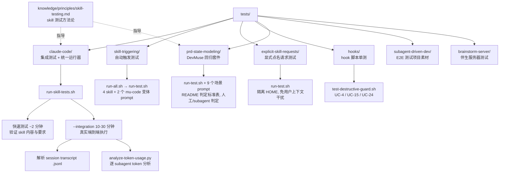
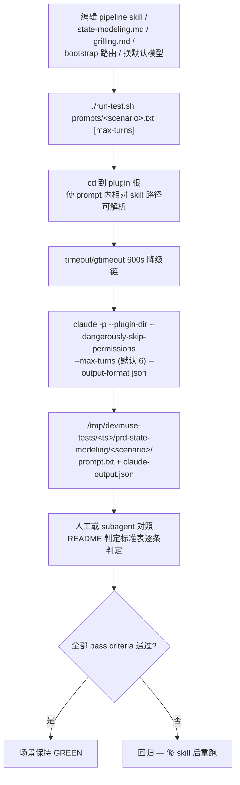

Referenced source files (10 files)

- `docs/testing.md`
- `tests/claude-code/README.md`
- `tests/claude-code/run-skill-tests.sh`
- `tests/skill-triggering/run-all.sh`
- `tests/skill-triggering/run-test.sh`
- `tests/explicit-skill-requests/run-test.sh`
- `tests/hooks/test-destructive-guard.sh`
- `tests/prd-state-modeling/README.md`
- `tests/prd-state-modeling/run-test.sh`
- `knowledge/principles/skill-testing.md`

# 测试基础设施与回归套件

DevMuse 的 skill 涉及 subagent 调度、workflow 编排和多轮 agent 交互，传统单元测试无法覆盖这类行为。因此主体测试方式是在 headless 模式下运行真实的 Claude Code session（`claude -p`），再解析 session transcript（`.jsonl`）或结构化 JSON 输出来判定行为——验证的是 agent 实际做了什么，而不是它说了什么。Sources: [docs/testing.md:1-3](), [tests/claude-code/README.md:5-7](), [docs/testing.md:96-99]()

体系分四层：`tests/claude-code/` 的集成测试与统一运行器、`tests/skill-triggering/` 与 `tests/explicit-skill-requests/` 的触发测试、`tests/hooks/` 的 hook 脚本单测，以及 `tests/prd-state-modeling/` 回归套件——后者把门控 1.3.0 状态建模改动与 2.0 guidance-over-enforcement 改动的场景固化为可重跑的 prompt + 判定标准表。方法论侧由 `knowledge/principles/skill-testing.md` 支撑：按 skill 类型选测试策略，用压力场景暴露并封堵 agent 的合理化借口。Sources: [docs/testing.md:5-17](), [tests/prd-state-modeling/README.md:1-5](), [knowledge/principles/skill-testing.md:1-3]()

## 测试体系总览

Sources: [docs/testing.md:5-17](), [tests/claude-code/run-skill-tests.sh:74-87](), [tests/skill-triggering/run-all.sh:10-21](), [tests/hooks/test-destructive-guard.sh:1-4](), [tests/prd-state-modeling/README.md:7-15]()

### 测试组 × 验证目标 × 入口

| 测试组 | 验证目标 | 入口 |
|---|---|---|
| `tests/claude-code/` | skill 正确加载；`mu-code`（subagent-driven 模式）端到端工作流 | `run-skill-tests.sh`（`--integration` 开启慢测试） |
| `tests/skill-triggering/` | 自然语言 prompt（不点名 skill）能自动触发正确的 skill | `run-all.sh` → `run-test.sh` |
| `tests/explicit-skill-requests/` | 用户直接点名 skill 时被正确调用（不带 plugin namespace 前缀） | `run-test.sh`（隔离 HOME） |
| `tests/hooks/` | `hooks/pre-tool-use/destructive-guard.sh` 的决策，覆盖 UC-4/UC-15/UC-24 | `test-destructive-guard.sh` |
| `tests/prd-state-modeling/` | 1.3.0 状态建模 + 2.0 guidance 门控场景不回归 | `run-test.sh prompts/<scenario>.txt` + README 判定表 |
| `tests/subagent-driven-dev/` | E2E 测试项目素材 | 见目录 |

Sources: [docs/testing.md:5-17](), [tests/skill-triggering/run-test.sh:1-6](), [tests/explicit-skill-requests/run-test.sh:1-8](), [tests/hooks/test-destructive-guard.sh:1-9](), [tests/prd-state-modeling/README.md:1-3]()

## Headless 集成测试（tests/claude-code/）

### 快速测试与集成测试的分层

统一运行器 `run-skill-tests.sh` 默认只跑快速测试（`test-subagent-driven-development.sh`，约 2 分钟，验证 skill 的加载与内容要求：workflow 顺序、self-review 要求、review loop 等是否写进了 skill）；`--integration` 才追加集成测试（`test-subagent-driven-development-integration.sh`，10-30 分钟，创建真实 Node.js 测试项目 + 双任务实施计划，让 `mu-code` 真跑一遍）。快速测试验证的是 skill *指令*，集成测试验证工作流真的端到端可用。Sources: [tests/claude-code/run-skill-tests.sh:74-87](), [tests/claude-code/README.md:81-117](), [tests/claude-code/README.md:152-158]()

运行器逐个执行测试脚本并用 `timeout`（默认 300 秒，`--timeout` 可调，CI 建议显式设置）包裹；退出码 124 单独报告为 timeout 失败，非 verbose 模式只在失败时展示输出，最终以 passed/failed/skipped 汇总并用退出码表达整体结果。Sources: [tests/claude-code/run-skill-tests.sh:26-29](), [tests/claude-code/run-skill-tests.sh:118-160](), [tests/claude-code/README.md:142-150]()

### transcript 判定与 token 分析

集成测试的判定不看用户可见输出，而是从 `~/.claude/projects` 找到最新 `.jsonl` session transcript，验证 Skill tool 被调用、Task tool 派发了 subagent、TodoWrite 跟踪、实现文件生成、测试通过、git commit 符合工作流——再用 `analyze-token-usage.py` 做逐 subagent 的 token 开销分析。Sources: [docs/testing.md:49-61](), [docs/testing.md:62-72](), [docs/testing.md:96-99]()

写新测试的固定模式：`create_test_project` 建临时项目并 `trap` 清理，从 plugin 根目录（skill 只从那里加载）以 `timeout 1800 claude -p "$PROMPT" --allowed-tools=all --add-dir "$TEST_PROJECT" --permission-mode bypassPermissions` 运行，然后 `grep` transcript 断言。共享断言库 `test-helpers.sh` 提供 `run_claude`、`assert_contains` / `assert_not_contains` / `assert_count` / `assert_order` 等原语。Sources: [docs/testing.md:74-99](), [docs/testing.md:101-108](), [tests/claude-code/README.md:43-51]()

## 触发测试与 hook 测试

`skill-triggering/run-all.sh` 对 `mu-debug`、`mu-code`、`mu-plan`、`mu-review` 各跑一个自然语言 prompt（max-turns 3），另有两个变体 prompt（`mu-code-execute`、`mu-code-subagent`）验证不同措辞仍触发 `mu-code`；`explicit-skill-requests/` 则测用户点名 skill 的场景，其 `run-test.sh` 用隔离 HOME 避免用户全局上下文干扰判定。`hooks/test-destructive-guard.sh` 是纯 bash 单测：把 JSON 用 heredoc 灌进 `hooks/pre-tool-use/destructive-guard.sh`，断言其 allow/deny 输出，无需启动 Claude session。Sources: [tests/skill-triggering/run-all.sh:10-51](), [tests/skill-triggering/run-all.sh:53-77](), [tests/explicit-skill-requests/run-test.sh:1-10](), [tests/hooks/test-destructive-guard.sh:1-30]()

### 可移植 timeout 模式

macOS 不自带 GNU `timeout`，各 runner 采用同一降级模式：优先 `timeout`，其次 coreutils 的 `gtimeout`，都没有则空串跳过——脚本在三种环境下都能跑，只是最后一种失去超时保护。该模式在 `prd-state-modeling/run-test.sh`、`skill-triggering/run-test.sh`、`explicit-skill-requests/run-test.sh` 中逐字复用。Sources: [tests/prd-state-modeling/run-test.sh:34-37](), [tests/skill-triggering/run-test.sh:10-11](), [tests/explicit-skill-requests/run-test.sh:12-14]()

## DevMuse 回归套件（tests/prd-state-modeling/）

这是门控 1.3.0 state-modeling 改动与 2.0 guidance-over-enforcement 改动的场景的可重跑版本。触发时机明确：编辑 pipeline skill、`state-modeling.md`、`grilling.md` 或 bootstrap 路由规则之后，以及切换默认模型之后。每个 prompt 让 agent 对固定 product brief 模拟 skill 执行并以结构化 self-report 收尾；判定依据 self-report + artifact 对照下方标准表，任一 pass criteria 失败即回归。Sources: [tests/prd-state-modeling/README.md:1-5](), [tests/prd-state-modeling/README.md:17-28]()

Sources: [tests/prd-state-modeling/run-test.sh:6-26](), [tests/prd-state-modeling/run-test.sh:31-47](), [tests/prd-state-modeling/README.md:5-15]()

### 场景与判定标准表

套件共 9 个场景 prompt：状态建模四场景、lightweight/update 两条路径、路由五探针（一个 prompt 内含 5 个探针）、v2.0 新增的证据替代与引导地板两场景。

| Prompt | 模拟 | 关键 pass criteria（摘要） |
|---|---|---|
| `full-stateful-booking.txt` | full 模式创建，会议室预订（审批 + 签到 + no-show） | object model 触发（引用 trigger 文本）；封闭状态列表无"等/etc."；每个 transition 有 actor + 边界语义（inclusive/exclusive、命名时钟）；pending 占用槽位以 invariant/fork 呈现；终态不复活；重复提交保证在场 |
| `vague-groupbuy-dialogue.txt` | full 模式逐节访谈，用户给模糊团购答案 | 六个生命周期缺口全覆盖（团状态穷举、参与者订单独立状态机、边界瞬间竞态、重复提交、退款失败态、确认后级联）；覆盖须追溯到 skill/principle 文本而非领域运气 |
| `stateless-cli-no-trigger.txt` | lightweight 创建，无状态 CLI 工具 | object model 不触发（引用被评估的 trigger 文本）；零状态机/伴生文件；输出限于 lightweight 三节 |
| `variation-subscription.txt` | full 模式，SaaS 订阅（principle 示例中不存在的领域） | ≥3 个状态机（subscription、charge、seat 候选）；抓到 grace-period 隐藏态与 cancel 时机 fork；捕获追溯到领域无关的检测器 |
| `lightweight-stateful.txt` | lightweight 创建，有状态产品，仓库无 CONTEXT.md | 正文内状态表置于核心流程前；经 domain-glossary 资格测试创建 CONTEXT.md；header 用 "in-body"；无伴生文件 |
| `update-stance-companion.txt` | 对带 `.objects.md` 的 PRD 执行 `/mu-prd update`，补缺 + 同步双重变更 | 加载伴生文件（引用分支文本）；状态编辑进 object model、正文引用名称；终态变更作为用户 fork 呈现；每台被触及状态机重跑 self-check；History 每变更一行 |
| `bootstrap-routing-probes.txt` | 对 `rules/bootstrap.md` 的五个路由探针 | (1) bug→mu-scope 静默；(2) understand→mu-explore 静默；(3) 闲聊→不路由；(4) "太简单直接改"→仍路由（引用 Red Flags + WHAT-not-HOW）；(5) 产品流程询问→指向 /mu-prd 而不调用 |
| `evidence-substitution.txt` | 已有详细 PRD、无 scope，用户直接要设计 | PRD 被接受为需求证据；scope 坍缩为证据快路径（约 1 报告 + 1 确认，不重新访谈）；完全 override 尊重执行并打 flag |
| `guidance-floor.txt` | 零 artifact、模糊需求、"别问那么多直接开写"施压 | 在任何 override 前先给出建议；由用户（而非 agent）豁免流程；TDD/验证/审批 gate 永不让步 |

Sources: [tests/prd-state-modeling/README.md:17-28]()

原始 RED/GREEN 循环的 baseline 与完整运行记录汇总在 commit `1146c85`、`7431039`、`feace46` 的 commit message 中（2026-07-26）。Sources: [tests/prd-state-modeling/README.md:30-32]()

## 技能测试方法论（knowledge/principles/skill-testing.md）

`mu-write-skill` 的测试阶段引用此 principle：不同 skill 类型需要不同测试方式。

| Skill 类型 | 示例 | 测试方式 | 成功标准 |
|---|---|---|---|
| Discipline-enforcing（规则/要求） | TDD、mu-review | 学术问题 + 压力场景 + 多重压力叠加，识别合理化借口并加显式反制 | 最大压力下仍守规则 |
| Technique（how-to） | condition-based-waiting、root-cause-tracing | 应用场景 + 变体场景 + 缺失信息测试 | 能对新场景正确应用技巧 |
| Pattern（心智模型） | reducing-complexity | 识别场景 + 应用场景 + 反例 | 正确判断何时（不）适用 |
| Reference（文档/API） | API 文档、命令参考 | 检索场景 + 应用场景 + 缺口测试 | 找到并正确应用信息 |

Sources: [knowledge/principles/skill-testing.md:5-50]()

对 discipline 类 skill，用分层压力暴露漏洞：时间压力、沉没成本、权威背书、疲劳、找例外（"这只是个原型吧？"）、精神-vs-条文（"我遵循的是 TDD 的精神"）——先单独测每种，再叠加 2-3 种。任何能得逞的合理化 = skill 中要封堵的漏洞。meta-testing 循环是：给 skill 的 rationalization 表加显式条目 → 同场景重测 → 重复至该压力下无洞可钻；目标不是完美覆盖，而是封死 agent 实际找到的那些漏洞。上文回归套件的 `guidance-floor.txt` 正是这一方法在 mu-prd 上的落地实例。Sources: [knowledge/principles/skill-testing.md:52-65](), [knowledge/principles/skill-testing.md:67-75](), [tests/prd-state-modeling/README.md:28]()

## See also

- [plan-implement](./plan-implement.md) — 集成测试所验证的 mu-code subagent-driven 工作流本体
- [product-object-model](./product-object-model.md) — 回归套件所守护的 mu-prd 状态建模 / object model 行为
